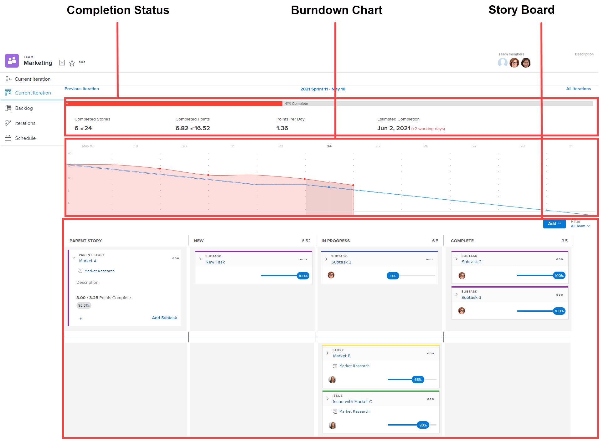

# Vue d’ensemble des itérations

Les itérations Agile consistent en trois zones : le statut d’achèvement, l’avancement et le StoryBoard.

Pour plus d’informations sur le graphique d’avancement et le statut d’achèvement, voir la section [[!UICONTROL Avancement]](../../../agile/use-scrum-in-an-agile-team/burndown/burndown.md).

Pour plus d’informations sur le Storyboard, voir la section [[!UICONTROL Panorama] Scrum](../../../agile/use-scrum-in-an-agile-team/scrum-board/scrum-board.md).
