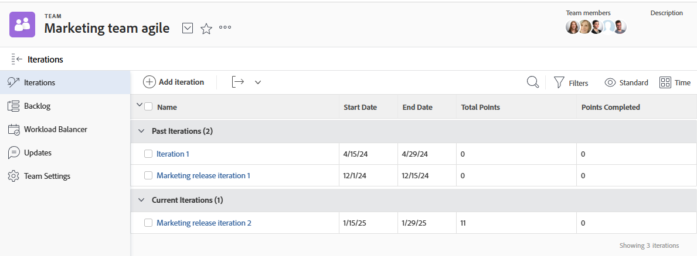

# Afficher une itération

Vous pouvez afficher toutes les itérations d’une équipe donnée ou une itération spécifique. Les itérations affichent des données sur les histoires, les problèmes et les documents contenus dans l’itération.

## Conditions d’accès

+++ Développez pour afficher les exigences d’accès aux fonctionnalités de cet article.

<table style="table-layout:auto"> 
 <col> 
 </col> 
 <col> 
 </col> 
 <tbody> 
  <tr> 
   <td role="rowheader">Package Adobe Workfront</td> 
   <td> 
Tous
 </td> 
  </tr> 
  <tr> 
   <td role="rowheader">Licence Adobe Workfront</td> 
   <td> 
Léger ou supérieur
 
   
Révision ou supérieur
 </td> 
  </tr>
 </tbody> 
</table>

Pour plus d’informations, voir [Conditions d’accès requises dans la documentation Workfront](/help/quicksilver/administration-and-setup/add-users/access-levels-and-object-permissions/access-level-requirements-in-documentation.md).

+++

## Afficher les itérations affectées à une équipe donnée

{{step1-to-team}}

1. (Facultatif) Cliquez sur l’icône **[!UICONTROL Changer d’équipe]** , puis sélectionnez une nouvelle équipe Scrum dans le menu déroulant ou recherchez une équipe dans la barre de recherche.

1. Dans le panneau de gauche, sélectionnez **[!UICONTROL Itérations]** pour sélectionner une itération spécifique, ou sélectionnez **[!UICONTROL Itération actuelle]**.

   

   >[!NOTE]
   >
   >L’**[!UICONTROL itération actuelle]** s’affiche uniquement dans le panneau de gauche lorsqu’elle est affectée au modèle de mise en page et qu’il y a au moins une tâche ou un problème sur l’itération. Pour plus d’informations, voir [Personnaliser le panneau de gauche à l’aide d’un modèle de mise en page](/help/quicksilver/administration-and-setup/customize-workfront/use-layout-templates/customize-left-panel.md).

1. (Facultatif) Cliquez sur le nom de l’itération spécifique que vous souhaitez afficher.
Les histoires de l’itération s’affichent.

   ![[!UICONTROL Histoires dans l’itération]](assets/iteration-stories-list.png)
