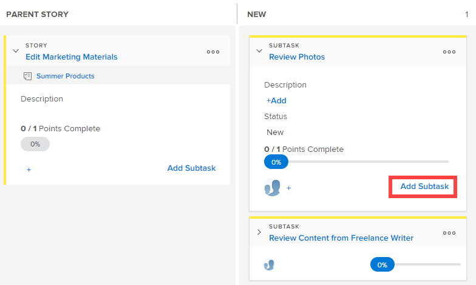

# Ajoutez une sous-tâche à une histoire existante sur le panorama [!UICONTROL Scrum].

Lors de la création de sous-tâches pour des histoires existantes, tenez compte des points suivants :

**Lorsque le paramètre [!UICONTROL Mode d’achèvement] du projet est défini sur [!UICONTROL Manuel] :**

* Déplacer une histoire parent avec des sous-tâches vers [!UICONTROL Terminé] met à jour l’histoire parent à 100 % et fait passer le [!UICONTROL Statut] sur [!UICONTROL Terminé]. Les sous-tâches ne sont pas mises à jour.
* La mise à jour du [!UICONTROL Pourcentage terminé] se fait à partir de l’onglet [!UICONTROL Histoires] ou de la page [!UICONTROL Détails] de l’objet.

**Lorsque le paramètre [!UICONTROL Mode d’achèvement] du projet est défini sur [!UICONTROL Automatique]** :

* Déplacer une histoire parent avec des sous-tâches vers [!UICONTROL Terminé] met à jour l’histoire parent à 100 % et fait passer le [!UICONTROL Statut] sur [!UICONTROL Terminé]. Les sous-tâches sont également mises à jour à 100 % et le [!UICONTROL Statut] devient [!UICONTROL Terminé].
* Pour mettre à jour le [!UICONTROL Pourcentage d’achèvement] de l’histoire, vous devez mettre à jour le [!UICONTROL Pourcentage d’achèvement] de toutes les sous-tâches. Le [!UICONTROL Pourcentage d’achèvement] de l’article est calculé en fonction du [!UICONTROL Pourcentage d’achèvement] de toutes les sous-tâches.

## Conditions d’accès

+++ Développez pour afficher les exigences d’accès aux fonctionnalités de cet article.

Vous devez disposer des accès suivants pour effectuer les étapes de cet article :

<table style="table-layout:auto"> 
 <tbody> 
  <tr> 
   <td role="rowheader">[!DNL Adobe Workfront] plan</td> 
   <td> 
Tous
 </td> 
  </tr> 
  <tr> 
   <td role="rowheader">[!DNL Adobe Workfront] licence</td> 
   <td> 
Nouvelle : [!UICONTROL Standard]
 
   ou
   
Actuelle : [!UICONTROL Work] ou niveau supérieur
 </td> 
  </tr>
   <tr> 
   <td role="rowheader">Autorisations d’objet</td> 
   <td>Accès [!UICONTROL Contribute] ou [!UICONTROL Manage] à la tâche sur laquelle se trouve la sous-tâche </td> 
  </tr>
 </tbody> 
</table>

Pour plus de détails sur les informations contenues dans ce tableau, consultez [Conditions d’accès préalables dans la documentation Workfront](/help/quicksilver/administration-and-setup/add-users/access-levels-and-object-permissions/access-level-requirements-in-documentation.md).

+++

## Ajouter une sous-tâche à une histoire existante sur le panorama Scrum

{{step1-to-team}}

1. (Facultatif) Cliquez sur l’icône **[!UICONTROL Changer d’équipe]** , puis sélectionnez une nouvelle équipe Scrum dans le menu déroulant ou recherchez une équipe dans la barre de recherche.

1. Accédez à l’itération ou au projet Agile contenant l’histoire dans laquelle vous souhaitez ajouter une sous-tâche. Pour plus d’informations sur la navigation vers une itération, consultez la section [Afficher une itération](../../../agile/use-scrum-in-an-agile-team/iterations/view-iteration.md).
1. Accédez à la mosaïque de l’histoire dans le storyboard où vous souhaitez ajouter une sous-tâche.
1. Cliquez sur **[!UICONTROL Ajouter une sous-tâche]** sur la carte principale de l’histoire pour créer une sous-tâche à l’histoire.

   

   Ou

   Cliquez sur **[!UICONTROL Ajouter une sous-tâche]** sur une mosaïque de sous-tâche pour créer une sous-tâche à la sous-tâche.

   [!DNL Workfront] prend en charge un nombre infini de niveaux de sous-tâches, mais seuls deux niveaux (sous-tâches de sous-tâches) sont affichés sur le storyboard agile.

   

   Lors de l’ajout d’une sous-tâche à une histoire qui n’a pas de couloir, la tâche parent est promue dans la colonne [!UICONTROL Histoire parent] et la sous-tâche se déplace à l’intérieur du couloir.

1. Indiquez les informations suivantes :

   <table style="table-layout:auto">
    <col>
    <col>
    <tbody>
     <tr>
      <td role="rowheader"><strong>[!UICONTROL Subtask Name]</strong></td>
      <td> Spécifiez un nom pour la sous-tâche.</td>
     </tr>
     <tr>
      <td role="rowheader"><strong>[!UICONTROL Description]</strong></td>
      <td>Spécifiez une description pour la sous-tâche.</td>
     </tr>
     <tr>
      <td role="rowheader"><strong>[!UICONTROL Estimate]</strong></td>
      <td>Indiquez l’estimation de la sous-tâche. 
Gardez à l’esprit les points suivants lors de la création d’estimations :

       <ul>
        <li>Si votre équipe Agile est configurée pour estimer les histoires en points, alors par défaut 1 point équivaut à 8 heures. Les estimations sont ajoutées sous la forme d’[!UICONTROL Planned Hours] sur l’histoire.</li>
        <li>Les estimations combinées pour toutes les sous-tâches déterminent l’estimation de l’histoire parent. Pour plus d’informations, voir <a href="../../../agile/use-scrum-in-an-agile-team/scrum-board/update-status-of-stories-and-subtasks.md" class="MCXref xref">Mettre à jour le statut des histoires et des sous-tâches sur le panorama Scrum</a>.</li>
        <li>Lorsque vous créez une sous-tâche, le champ [!UICONTROL Estimate] est déjà défini. Si vous réinitialisez l’estimation sur la sous-tâche, vous réinitialisez également l’estimation sur l’histoire parent (car l’histoire parent est la somme de toutes ses sous-tâches).</li>
       </ul> </td>
     </tr>
     <tr>
      <td role="rowheader"><strong>[!UICONTROL Planned Hours]</strong></td>
      <td> (Disponible uniquement dans les projets) Indiquez le nombre d’heures prévues de la tâche.</td>
     </tr>
     <tr>
      <td role="rowheader"><strong>[!UICONTROL Assignment]</strong></td>
      <td>Commencez à saisir le nom de l’équipe à laquelle vous souhaitez attribuer la sous-tâche, puis cliquez dessus lorsqu’elle apparaît dans la liste déroulante.</td>
     </tr>
    </tbody>
   </table>

1. Cliquez sur **[!UICONTROL Créer]**.
