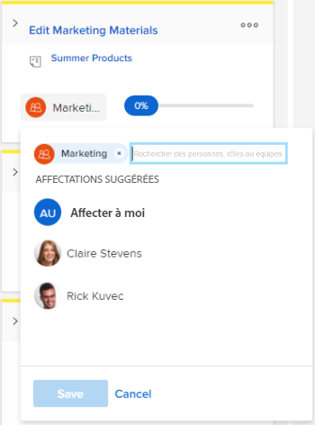

# Affecter des utilisateurs et utilisatrices à une histoire sur le panorama [!UICONTROL Scrum]

## Conditions d’accès

+++ Développez pour afficher les exigences d’accès aux fonctionnalités de cet article.

Vous devez disposer des accès suivants pour effectuer les étapes de cet article :

<table style="table-layout:auto"> 
 <tbody> 
  <tr> 
   <td role="rowheader">[!DNL Adobe Workfront] plan</td> 
   <td> 
Tous
 </td> 
  </tr> 
  <tr> 
   <td role="rowheader">[!DNL Adobe Workfront] licence</td> 
   <td> 
Nouvelle : [!UICONTROL Standard]
 
   ou
   
Actuelle : [!UICONTROL Work] ou niveau supérieur
 </td> 
  </tr>
 </tbody> 
</table>

Pour plus de détails sur les informations contenues dans ce tableau, consultez [Conditions d’accès préalables dans la documentation Workfront](/help/quicksilver/administration-and-setup/add-users/access-levels-and-object-permissions/access-level-requirements-in-documentation.md).

+++

## Affecter des utilisateurs et utilisatrices à une histoire sur le panorama [!UICONTROL Scrum]

{{step1-to-team}}

1. (Facultatif) Cliquez sur l’icône **[!UICONTROL Changer d’équipe]** , puis sélectionnez une nouvelle équipe [!UICONTROL Scrum] dans le menu déroulant ou recherchez une équipe dans la barre de recherche.

1. Accédez à l’itération ou au projet Agile qui contient le storyboard auquel vous souhaitez affecter des utilisateurs. Pour plus d’informations sur la navigation vers une itération, voir [Afficher une itération](../../../agile/use-scrum-in-an-agile-team/iterations/view-iteration.md).
1. Accédez à la mosaïque de l’histoire dans le storyboard où vous souhaitez ajouter un utilisateur ou une utilisatrice.
1. Cliquez sur l’avatar de l’équipe sur la miniature de l’histoire (ou sur l’avatar d’une personne déjà affectée), commencez à saisir le nom de la personne à affecter à l’histoire, puis cliquez sur le nom lorsqu’il apparaît. Vous pouvez également choisir une personne suggérée.

   >[!TIP]
   >
   >Vous pouvez également affecter une fonction à une histoire. Vous pouvez uniquement affecter des utilisateurs et utilisatrices actifs et des rôles actifs.

   
