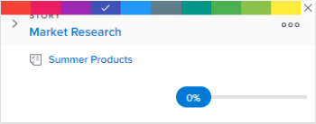

# Classer les histoires par couleur sur le panorama [!UICONTROL Scrum]

## Modifier l’association de couleurs par défaut des histoires

L’association des couleurs par défaut des histoires varie selon que le panorama de l’histoire se trouve sur une itération ou sur un projet :

* **[!UICONTROL Itération]** : lors d’une itération, les mosaïques du panorama d’histoires sont codées par couleur en fonction du projet auquel l’histoire est associée. (Une couleur est arbitrairement attribuée à chaque projet sur le storyboard.) Vous pouvez modifier ce comportement par défaut pour chaque équipe Agile. Les couleurs des histoires agiles sur une itération peuvent être liées au projet (par défaut), à la priorité de l’histoire, au propriétaire ou à la forme libre. Pour plus d’informations, consultez [Configuration de l’utilisation des indicateurs de couleurs pour les articles sur le storyboard agile](../../../agile/get-started-with-agile-in-workfront/configure-scrum.md#configur4) dans l’article [Configuration de Scrum](../../../agile/get-started-with-agile-in-workfront/configure-scrum.md).

* **[!UICONTROL Projet]** : sur un projet, toutes les sous-tâches correspondent à la couleur de la tâche parent, de sorte que les couleurs de toutes les histoires d’un couloir donné sont les mêmes. Les couleurs sont affectées de manière aléatoire aux tâches au moment de leur création si la tâche ne comporte aucune sous-tâche ou n’a pas de tâche parent. Vous pouvez modifier ce comportement par défaut en changeant la vue Agile. Les couleurs des histoires agiles d’un projet peuvent être liées à l’histoire parent (par défaut), à la priorité de l’histoire, au propriétaire ou à la forme libre. Pour plus d’informations, voir la section [Créer ou personnaliser une vue [!UICONTROL Agile]](../../../reports-and-dashboards/reports/reporting-elements/views-overview.md#customizing-an-agile-view) dans [Vue d’ensemble des vues dans  [!DNL Adobe Workfront]](../../../reports-and-dashboards/reports/reporting-elements/views-overview.md).

## Conditions d’accès

+++ Développez pour afficher les exigences d’accès aux fonctionnalités de cet article.

Vous devez disposer des accès suivants pour effectuer les étapes de cet article :

<table style="table-layout:auto"> 
 <tbody> 
  <tr> 
   <td role="rowheader">[!DNL Adobe Workfront] plan</td> 
   <td> 
Tous
 </td> 
  </tr> 
  <tr> 
   <td role="rowheader">[!DNL Adobe Workfront] licence</td> 
   <td> 
Nouvelle : [!UICONTROL Standard]
 
   ou
   
Actuelle : [!UICONTROL Work] ou niveau supérieur
 </td> 
  </tr>
 </tbody> 
</table>

Pour plus de détails sur les informations contenues dans ce tableau, consultez [Conditions d’accès préalables dans la documentation Workfront](/help/quicksilver/administration-and-setup/add-users/access-levels-and-object-permissions/access-level-requirements-in-documentation.md).

+++

## Changer la couleur des histoires lors de l’utilisation d’un formulaire libre

Si les paramètres de l’équipe Agile ont été configurés de sorte que l’option [!UICONTROL  Associer la couleur de la carte à ] soit définie sur [!UICONTROL Structure libre], les utilisateurs peuvent modifier manuellement la couleur de mosaïques d’histoires individuelles. Cela peut se révéler utile pour communiquer d’autres types d’informations importantes pour l’équipe ou l’organisation :

{{step1-to-team}}

1. (Facultatif) Cliquez sur l’icône **[!UICONTROL Changer d’équipe]** , puis sélectionnez une nouvelle équipe Scrum dans le menu déroulant ou recherchez une équipe dans la barre de recherche.

1. Dans le panneau de gauche, sélectionnez **[!UICONTROL Itérations]** pour sélectionner une itération spécifique, ou choisissez **[!UICONTROL Itération actuelle]**.
1. Pointez sur la bannière de couleur en haut de la mosaïque d’histoires.

   

1. Cliquez sur **[!UICONTROL Changer de couleur]**, puis sélectionnez la couleur de votre choix.

   
