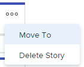

# Gérer les articles et les problèmes sur le panorama [!UICONTROL Scrum]

Vous pouvez déplacer un article ou un problème du panorama [!UICONTROL Scrum] vers une autre itération ou vers le journal, ou le supprimer du panorama [!UICONTROL Scrum]. Lorsque vous supprimez un article ou un problème, il est déplacé dans la Corbeille pendant 30 jours et ne peut être récupéré que par l’administrateur système.

## Conditions d’accès

Vous devez disposer des accès suivants pour effectuer les étapes de cet article :

<table style="table-layout:auto"> 
 <col> 
 <col> 
 <tbody> 
  <tr> 
   <td role="rowheader"><strong>[!DNL Adobe Workfront] forfait*</strong></td> 
   <td> 
N’importe quelle
 </td> 
  </tr> 
  <tr> 
   <td role="rowheader"><strong>[!DNL Adobe Workfront] licence*</strong></td> 
   <td> 
[!UICONTROL Work] ou version ultérieure
 </td> 
  </tr> 
  <tr> 
   <td role="rowheader"><strong>Configurations des niveau d’accès*</strong></td> 
   <td> 
[!UICONTROL Worker] ou version ultérieure
 
Remarque : Si vous n’avez toujours pas accès à , demandez à votre administrateur [!DNL Workfront] s’il définit des restrictions supplémentaires à votre niveau d’accès. Pour plus d’informations sur la manière dont un administrateur ou une administratrice [!DNL Workfront] peut modifier votre niveau d’accès, voir <a href="../../../administration-and-setup/add-users/configure-and-grant-access/create-modify-access-levels.md" class="MCXref xref">Créer ou modifier des niveaux d’accès personnalisés</a>.
 </td> 
  </tr> 
  <tr> 
   <td role="rowheader"><strong>Autorisations d’objet</strong></td> 
   <td> 
[!UICONTROL Gérer] Accès à la tâche ou au problème
 
Pour plus d’informations sur la demande d’accès supplémentaire, voir <a href="../../../workfront-basics/grant-and-request-access-to-objects/request-access.md" class="MCXref xref">Demander l’accès aux objets</a>.
 </td> 
  </tr> 
 </tbody> 
</table>

&#42;Pour connaître le plan, le type de licence ou l’accès dont vous disposez, contactez votre administrateur ou administratrice [!DNL Workfront].

## Déplacer un article ou un problème à partir du panorama [!UICONTROL Scrum]

1. Cliquez sur l’icône **[!UICONTROL Menu principal]**  dans le coin supérieur droit de [!DNL Adobe Workfront], puis cliquez sur **[!UICONTROL Equipes]**.
1. Cliquez sur l’icône **[!UICONTROL Changer d’équipe]** , puis sélectionnez une équipe Scrum dans le menu déroulant ou recherchez une équipe dans la barre de recherche.
1. Dans le panneau de gauche, sélectionnez **[!UICONTROL Itérations]** pour choisir une itération spécifique ou **[!UICONTROL Itération actuelle]**.
1. Cliquez sur l’icône **[!UICONTROL Plus]** sur l’article ou le problème, puis sélectionnez **[!UICONTROL Déplacer vers]**.

   

1. Dans le message de confirmation, choisissez l&#39;une des options suivantes :

   <table style="table-layout:auto">
    <tr>
        <td><strong>[!UICONTROL Autre itération]</strong></td>
        <td>Sélectionnez cette option pour déplacer l’élément vers une autre itération, puis choisissez l’itération vers laquelle l’article ou le problème va se déplacer. Si aucune itération n’est définie, vous ne pouvez pas déplacer l’élément.</td>
    </tr>
    <tr>
        <td><strong>[!UICONTROL Backlog]</strong></td>
        <td>Sélectionnez cette option pour déplacer l’article ou le problème dans le journal de l’équipe.</td>
    </tr>
   </table>

   >[!NOTE]
   >
   >L’élément de travail [!UICONTROL Date de début planifiée] et [!UICONTROL Date d’achèvement planifiée] sont affectés par un paramètre sur la page [!UICONTROL Modifier l’équipe]. Pour plus d’informations, reportez-vous à la section [[!UICONTROL Configuration] de la manière dont les dates sont appliquées lors de l’ajout d’éléments de travail à une itération](../../../agile/get-started-with-agile-in-workfront/configure-scrum.md#configur5) dans l’article [Configurer le scrum](../../../agile/get-started-with-agile-in-workfront/configure-scrum.md).

1. Cliquez sur **[!UICONTROL Déplacer]**.

## Supprimer un article ou un problème du panorama [!UICONTROL Scrum]

1. Cliquez sur l’icône **[!UICONTROL Menu principal]**  dans le coin supérieur droit de [!DNL Adobe Workfront], puis cliquez sur **[!UICONTROL Equipes]**.
1. Cliquez sur l’icône **[!UICONTROL Changer d’équipe]** , puis sélectionnez une équipe Scrum dans le menu déroulant ou recherchez une équipe dans la barre de recherche.
1. Dans le panneau de gauche, sélectionnez **[!UICONTROL Itérations]** pour choisir une itération spécifique ou **[!UICONTROL Itération actuelle]**.
1. Cliquez sur l’icône **[!UICONTROL Plus]** sur l’article ou le problème, puis sélectionnez **[!UICONTROL Supprimer l’article]** ou **[!UICONTROL Supprimer le problème]**.

   

1. Sur le message de confirmation, cliquez sur **[!UICONTROL Oui, supprimez-le]**.
