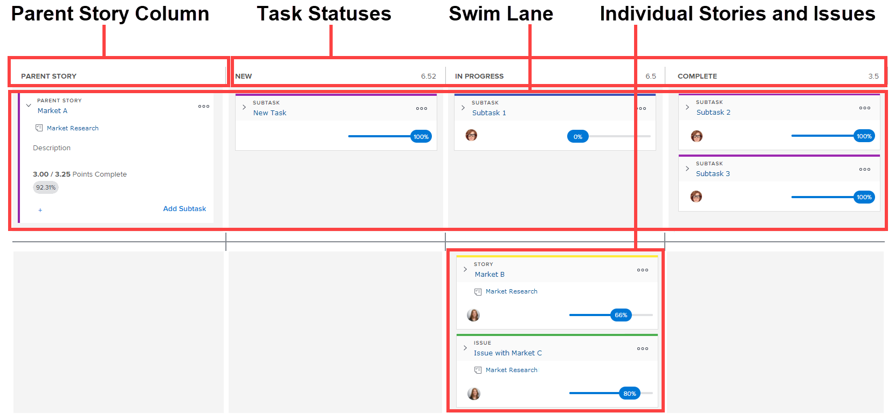

# Vue d’ensemble du panorama [!UICONTROL Scrum]

<!-- Audited: 5/2025 -->

Le storyboard Agile [!UICONTROL Scrum] s’affiche avec le statut d’achèvement et le graphique d’avancement. Ces composants Agile sont disponibles dans les situations suivantes dans [!UICONTROL Adobe Workfront] :

* Lors des itérations Agile. Pour plus d’informations sur l’utilisation du storyboard Agile, du graphique d’avancement et du statut d’achèvement dans un environnement purement Agile (avec des listes d’attente et une itération), consultez la section [Travailler dans un environnement Agile](../../../agile/work-in-an-agile-environment/work-in-an-agile-environment.md).
* Lorsque vous affichez un projet dans une vue Agile. Pour plus d’informations sur la façon dont vous pouvez exploiter le storyboard Agile, le graphique d’avancement et le statut d’achèvement dans un projet existant, consultez la section [Gérer un projet dans une vue Agile](../../../manage-work/projects/manage-projects/manage-projects-in-agile-view.md).

## Disposition et fonctions d’un storyboard

Le storyboard se compose des éléments suivants :

* **Colonne de l’histoire parente** : contrairement aux autres colonnes du storyboard, la colonne [!UICONTROL Histoire parente] n’est pas un statut de tâche, mais existe pour héberger toutes les histoires contenant des sous-tâches dans l’itération ou le projet. Cette colonne est uniquement réservée aux histoires parent comportant au moins une sous-tâche représentée sur le storyboard. Les histoires parent elles-mêmes ne passent pas d’un statut à l’autre dans le storyboard.

  Cette colonne est visible sur le storyboard durant une itération uniquement si une ou plusieurs histoires intègrent au moins une sous-tâche qui répond aux exigences suivantes :

   * Affecté à la même équipe Agile que la tâche parent.
   * Appartient à l’itération.

     Cette colonne est affichée dans un projet chaque fois qu’une tâche contient une ou plusieurs sous-tâches.

     

* **Statuts des tâches** : indiquez la progression d’une histoire tout au long de l’itération ou du projet en fonction de la colonne de statut dans laquelle se trouve l’histoire.

  Les statuts des tâches peuvent être personnalisés pour le projet en modifiant la vue agile.

* **Piste de navigation** : lorsqu’une histoire parent et ses sous-tâches apparaissent sur le storyboard, une piste de navigation est créée spécifiquement pour l’histoire et ses sous-tâches. Cette méthode permet de distinguer visuellement et de suivre plus aisément la progression des sous-tâches à travers le contenu global du storyboard.

  Au cours d’une itération, les couloirs (swim lanes) sur le storyboard apparaissent seulement si une histoire contient au moins une sous-tâche qui satisfait aux exigences suivantes :

   * Affecté à la même équipe Agile que la tâche parent.
   * Appartient à l’itération.

  Dans un projet, les couloirs apparaissent chaque fois qu’une tâche comporte au moins une sous-tâche ou une tâche parent.

* **Histoires individuelles** : les histoires et les événements individuels s’affichent sous les couloirs de navigation du storyboard. Il est ainsi facile de distinguer visuellement les histoires qui font partie d’un couloir.

## Relation entre les sous-tâches et les histoires

Si une histoire contient des sous-tâches, vous ne pouvez mettre à jour aucune information sur l&#39;histoire parent elle-même (comme les points/heures ou le pourcentage d&#39;achèvement). De plus, vous ne pouvez pas déplacer l’histoire sur le storyboard pour mettre à jour son statut. Au contraire, tout changement que vous apportez aux sous-tâches de l’histoire est reflété dans l’histoire. Les points ou les heures de l’histoire combinés pour toutes les sous-tâches déterminent les points ou les heures de l’histoire parent.

Par exemple, si une histoire ne comporte qu’une seule sous-tâche évaluée à 4 points, l’histoire elle-même comporte également 4 points. Si vous remplacez la valeur du point de sous-tâche sur 3, la valeur du point de l’histoire parent est aussi remplacée par 3. Si vous créez une autre sous-tâche sur la même histoire et que vous définissez la valeur du point de cette sous-tâche sur 4, la valeur du point de l’histoire est remplacée par 7 afin de refléter la valeur de point combinée pour les deux sous-tâches.

Cette même logique s’applique aux sous-tâches de deuxième niveau (sous-tâches de sous-tâches). Si une sous-tâche comporte une ou plusieurs sous-tâches de deuxième niveau, elle est calculée en fonction des sous-tâches de deuxième niveau.

## Relation entre le storyboard et la liste d’attente

La liste d’attente des itérations affiche uniquement les histoires ou les sous-tâches pour lesquelles vous pouvez définir une estimation. Si une histoire parent a des sous-tâches qui sont affichées sur le storyboard (parce qu’elles sont affectées à la même équipe Agile et appartiennent à l’itération), la tâche parent n’est pas affichée dans la liste d’attente. Dans ce cas, seules les sous-tâches sont affichées dans la liste d’attente, tandis que les sous-tâches et l’histoire parent sont affichées sur le storyboard.

Supposons, par exemple, que l’histoire A contienne la sous-tâche 1 et la sous-tâche 2 (et que les deux sous-tâches soient affectées à la même équipe Agile). Dans ce cas, l’histoire A s’affiche dans un couloir sur le storyboard avec les sous-tâches 1 et 2. Toutefois, seules les sous-tâches 1 et 2 sont affichées dans la liste d’attente.

Cette même logique s’applique aux sous-tâches de deuxième niveau (sous-tâches de sous-tâches). Si une sous-tâche a une ou plusieurs sous-tâches de second niveau affectées à la même équipe Agile appartenant à l’itération, seule la sous-tâche de second niveau est affichée dans la liste d’attente.

Pour plus d’informations sur la liste d’attente, voir [ Gérer la liste d’attente Agile ](../../../agile/work-in-an-agile-environment/manage-the-agile-backlog.md).
