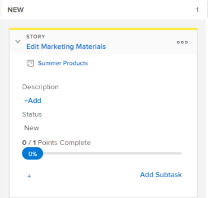

# Afficher et modifier les informations d’une histoire dans un panorama [!UICONTROL Scrum]

## Comprendre quelles informations peuvent être affichées et modifiées.

Lors de l’affichage d’une mosaïque d’histoire sur le storyboard, les informations du tableau suivant sont disponibles. Vous pouvez modifier la plupart des informations en ligne, directement à partir de la mosaïque de l’histoire.

<table style="table-layout:auto"> 
 <col> 
 <col> 
 <col> 
 <thead> 
  <tr> 
   <th><strong>Informations</strong> </th> 
   <th><strong>Visibles</strong> </th> 
   <th><strong>Modifiables en ligne</strong> </th> 
  </tr> 
 </thead> 
 <tbody> 
  <tr> 
   <td>Nom de l’histoire avec un lien direct vers la tâche ou le problème</td> 
   <td>✓</td> 
   <td> </td> 
  </tr> 
  <tr> 
   <td> 
Nom du projet avec un lien direct vers le projet Ce lien s’affiche uniquement sur les articles (tâches parents, et non les sous-tâches) lors de l’utilisation de la vue Agile sur une itération ; il ne s’affiche pas lors de l’utilisation d’une vue Agile sur un projet.
 </td> 
   <td>✓</td> 
   <td> </td> 
  </tr> 
  <tr> 
   <td> 
Nombre de points ou d’heures terminés sur cette histoire et nombre de points ou d’heures affectés à cette histoire  Ces nombres sont utilisés pour calculer et afficher le [!UICONTROL Percent Complete] pour chaque histoire.
 </td> 
   <td>✓</td> 
   <td>✓</td> 
  </tr> 
  <tr> 
   <td> 
[!UICONTROL Percent Complete] pour chaque histoire et problème. Le [!UICONTROL Percent Complete] pour l’itération est calculé d’après le [!UICONTROL Percent Complete] pour chaque histoire.
 
Lors de la mise à jour du [!UICONTROL Percent Complete] pour une histoire ou un problème, vous pouvez choisir un nombre compris entre 0 et 100.
 </td> 
   <td>✓</td> 
   <td>✓</td> 
  </tr> 
  <tr> 
   <td> 
À qui l’histoire est affectée.
 </td> 
   <td>✓</td> 
   <td>✓</td> 
  </tr> 
  <tr> 
   <td> 
Couleur ou catégorie de la mosaïque
 </td> 
   <td>✓</td> 
   <td>✓</td> 
  </tr> 
  <tr> 
   <td> 
Tous les champs supplémentaires (y compris les champs personnalisés) qui ont pu être ajoutés à la vue Agile en modifiant la vue Agile, comme décrit dans la section « Création et personnalisation d’une vue [!UICONTROL Agile] » dans <a href="../../../reports-and-dashboards/reports/reporting-elements/views-overview.md" class="MCXref xref">Présentation des vues dans [!UICONTROL Adobe Workfront]</a>.
 </td> 
   <td>✓</td> 
   <td>✓</td> 
  </tr> 
 </tbody> 
</table>

## Conditions d’accès

+++ Développez pour afficher les exigences d’accès aux fonctionnalités de cet article.

Vous devez disposer des accès suivants pour effectuer les étapes de cet article :

<table style="table-layout:auto"> 
 <tbody> 
  <tr> 
   <td role="rowheader">[!DNL Adobe Workfront] plan</td> 
   <td> 
Tous
 </td> 
  </tr> 
  <tr> 
   <td role="rowheader">[!DNL Adobe Workfront] licence</td> 
   <td> 
Nouvelle : [!UICONTROL Standard]
 
   ou
   
Actuelle : [!UICONTROL Work] ou niveau supérieur
 </td> 
  </tr>
   <tr> 
   <td role="rowheader">Autorisations d’objet</td> 
   <td>Accès de [!UICONTROL Contribute] ou de [!UICONTROL Manage] à la tâche ou à l'événement</td> 
  </tr>
 </tbody> 
</table>

Pour plus de détails sur les informations contenues dans ce tableau, consultez [Conditions d’accès préalables dans la documentation Workfront](/help/quicksilver/administration-and-setup/add-users/access-levels-and-object-permissions/access-level-requirements-in-documentation.md).

+++

## Afficher et modifier les informations sur une mosaïque d’histoire

{{step1-to-team}}

1. (Facultatif) Cliquez sur l’icône **[!UICONTROL Changer d’équipe]** , puis sélectionnez une nouvelle équipe Scrum dans le menu déroulant ou recherchez une équipe dans la barre de recherche.

1. Dans le panneau de gauche, sélectionnez **[!UICONTROL Itérations]** pour sélectionner une itération spécifique, ou choisissez **[!UICONTROL Itération actuelle]**.

1. Accédez au storyboard [!UICONTROL Scrum] Agile.
1. Développez la tuile de l’[!UICONTROL histoire] pour afficher tous les champs associés à l’histoire.

   

1. (Facultatif) Pour modifier un champ, cliquez dessus, puis effectuez les modifications nécessaires.

   Vous devez disposer des droits [!UICONTROL Modifier] de la tâche ou du problème pour modifier la tuile de l’histoire.

>[!NOTE]
>
>Pour modifier le [!UICONTROL pourcentage d’achèvement], vous devez saisir un nombre compris entre 0 et 100. Le champ n’est pas un curseur que vous pouvez déplacer.
