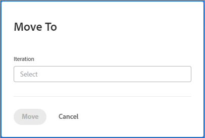

# Gérer la liste d’attente Agile

Les tâches suivantes peuvent être affectées à une équipe Agile et ajoutées à la liste d&#39;attente de cette équipe en tant qu&#39;histoires, selon la méthodologie Agile utilisée par l&#39;équipe :

* **[!UICONTROL Équipes Scrum Agile] :** les tâches et les événements peuvent être affectés à l’équipe Agile et ajoutés à la liste d’attente.
* **[!UICONTROL Équipes Agile Kanban] :** les tâches peuvent être affectées à l’équipe Agile et ajoutées à la liste d’attente. Les utilisateurs peuvent afficher la liste d’attente directement à partir du storyboard agile, comme décrit dans [[!UICONTROL Ajouter la liste d’attente] au tableau kanban](../../agile/use-kanban-in-an-agile-team/view-the-backlog-on-the-kanban-board.md). L’équipe utilise cette liste d’attente pour établir des priorités et gérer sa file d’attente de travail.

Les tâches ou les problèmes peuvent être affectés à l’équipe (et ensuite ajoutés à la liste d’attente de l’équipe) à partir de n’importe quel emplacement d’[!DNL Adobe Workfront]. Du travail peut, par exemple, être affecté à une seule équipe dans le cadre de plusieurs projets.

>[!NOTE]
>
>Si vous ajoutez plusieurs équipes à un élément de liste d’attente, la tâche ou le problème ne s’affiche que dans la liste d’attente de l’équipe principale. L’équipe principale est celle qui reçoit l’affectation en premier lieu.

## Conditions d’accès

+++ Développez pour afficher les exigences d’accès aux fonctionnalités de cet article.

<table style="table-layout:auto"> 
 <col> 
 </col> 
 <col> 
 </col> 
 <tbody> 
  <tr> 
   <td role="rowheader">Package Adobe Workfront</td> 
   <td> 
Tous
 </td> 
  </tr> 
  <tr> 
   <td role="rowheader">Licence Adobe Workfront</td> 
   <td> 
Standard
 
   
Travail ou supérieur
 </td> 
  </tr>
  <tr> 
   <td role="rowheader">Autorisations d’objet</td> 
   <td>Gérer l’accès au projet sur lequel porte l’histoire </td> 
  </tr> 
 </tbody> 
</table>

Pour plus de détails sur les informations contenues dans ce tableau, consultez la section [Conditions d’accès dans la documentation Workfront](/help/quicksilver/administration-and-setup/add-users/access-levels-and-object-permissions/access-level-requirements-in-documentation.md).

+++

## Créer et gérer des histoires dans la liste d’attente

* [Réorganiser les histoires](#reorder-stories)
* [[!UICONTROL Ventiler] les histoires](#break-down-stories)
* [Modifier les histoires](#edit-stories)

### Réorganiser les histoires {#reorder-stories}

Vous pouvez réorganiser les histoires dans la liste d’attente en utilisant la méthode du glisser-déposer.

1. Accédez à la liste d’attente Agile dans laquelle vous souhaitez réorganiser les histoires.
1. Dans le menu déroulant **[!UICONTROL Vue]**, sélectionnez la vue **[!UICONTROL Liste d’attente]** ou une vue personnalisée qui contient la colonne **[!UICONTROL Ordre]**.

   >[!NOTE]
   >
   >Si une équipe Agile est affectée à une tâche ou à un événement et que le statut du projet n&#39;est pas égal à Actuel, elles ne s&#39;affichent pas dans la liste d&#39;attente. Cela affecte cependant le chiffre dans la liste d’attente dans la colonne « Ordre ».

1. Sélectionnez une ou plusieurs histoires, puis faites glisser les histoires dans l’ordre dans lequel vous souhaitez qu’elles apparaissent dans la liste d’attente.
   

### Ventiler les histoires {#break-down-stories}

Puisque les histoires de la liste d’attente varient en taille, les utilisateurs et les utilisatrices peuvent les ventiler afin qu’elles soient exploitables dans une itération. En créant des sous-tâches sur la tâche qu’elle représente, la ventilation d’une histoire remplace la tâche originale dans la liste d’attente. Une tâche parent ou ses sous-tâches peuvent être affectées à une équipe Agile, mais les deux tâches ne peuvent pas être affectées à une équipe simultanément.

>[!NOTE]
>
>Tenez compte des limites suivantes lorsque vous ventilez des histoires :
>
>* Seules les histoires qui représentent des tâches peuvent être ventilées. Les histoires qui représentent des problèmes ne peuvent pas être ventilées.
>* Les histoires associées à un projet ne peuvent être ventilées.

Pour ventiler une histoire :

1. Allez dans la liste d’attente qui contient l’histoire que vous voulez ventiler.
1. Sélectionnez l’histoire à répartir, puis cliquez sur **[!UICONTROL Répartir l’histoire]**.
La boîte de dialogue [!UICONTROL Répartition de l’histoire] s’affiche.
   

1. Spécifiez un nom et une estimation pour l’histoire, et indiquez si l’histoire est prête.
1. Cliquez sur **[!UICONTROL Ajouter une histoire]** pour créer une autre histoire à partir de l’histoire originale.
1. Cliquer sur **[!UICONTROL Enregistrer]**.

### Modifier les histoires {#edit-stories}

Vous pouvez modifier les histoires directement à partir des onglets [!UICONTROL Histoires] ou [!UICONTROL Problèmes] dans la liste d’attente comme vous le feriez lorsque vous modifiez en masse les tâches ou les problèmes d’un projet, tel que décrit dans [Modifier les tâches en masse](../../manage-work/tasks/manage-tasks/edit-tasks.md#edit-tasks-in-bulk) dans les sections [Modifier les tâches](../../manage-work/tasks/manage-tasks/edit-tasks.md), et [Modifier les problèmes](../../manage-work/issues/manage-issues/edit-issues.md).

## Créer des histoires dans la liste d’attente {#create-new-stories-on-the-backlog}

Vous pouvez créer de nouvelles histoires sur la liste d&#39;attente en créant l&#39;histoire directement à partir de la liste d&#39;attente, ou en affectant une tâche ou un événement existant à une équipe Agile.

* [Créer une histoire à partir de la liste d’attente](#create-a-story-from-the-backlog)
* [Affecter une tâche ou un événement à une équipe Agile](#assign-a-task-or-issue-to-an-agile-team)

### Créer une histoire à partir de la liste d’attente {#create-a-story-from-the-backlog}

Lorsque vous créez une histoire à partir de la liste d’attente, elle est créée en tant que tâche ou problème dans un projet.

Pour créer une histoire à partir de la liste d’attente :

1. Cliquez sur l’icône **[!UICONTROL Menu principal]**  dans le coin supérieur droit d’Adobe Workfront, ou (si disponible), cliquez sur l’icône **[!UICONTROL Menu principal]**  dans le coin supérieur gauche, puis cliquez sur **[!UICONTROL Équipes]**.

1. (Facultatif) Cliquez sur l’icône **[!UICONTROL Changer d’équipe]** , puis sélectionnez une nouvelle équipe Scrum dans le menu déroulant ou recherchez une équipe dans la barre de recherche et sélectionnez-la lorsqu’elle apparaît.

1. Sélectionnez **[!UICONTROL Liste d’attente]** dans le panneau de gauche.
1. Effectuez l’une ou l’autre des opérations suivantes, selon que vous souhaitez créer une tâche ou un problème :

   * **Pour créer une tâche :** cliquez sur **[!UICONTROL Histoires]**.

   * **Pour créer un problème :** cliquez sur **[!UICONTROL Probèmes]**.

1. Cliquez sur **[!UICONTROL Nouvelle histoire]** ou **[!UICONTROL Nouveau problème]**.

1. Indiquez les informations suivantes :

   <table style="table-layout:auto">
    <col>
    <col>
    <tbody>
     <tr>
      <td role="rowheader"><strong>[!UICONTROL Story Name]</strong></td>
      <td> Tapez un nom pour l’histoire.</td>
     </tr>
     <tr>
      <td role="rowheader"><strong>[!UICONTROL Description]</strong></td>
      <td>(Facultatif) Saisissez une description de l’histoire.</td>
     </tr>
     <tr>
      <td role="rowheader"><strong>[!UICONTROL Ready]</strong></td>
      <td> Sélectionnez si l’histoire est prête à être ajoutée à une itération. Ce paramètre est uniquement informatif. Les histoires peuvent être ajoutées à une itération quel que soit le statut de ce paramètre.</td>
     </tr>
     <tr>
      <td role="rowheader"><strong>[!UICONTROL Estimate]</strong></td>
      <td>Indiquez une estimation horaire ou par points pour l’histoire. Les estimations ont une incidence sur le graphique d’avancement. Le graphique d’avancement d’une itération n’est précis que si chaque histoire contient une estimation exacte.(Si vous fournissez une estimation par points, vous devez déjà avoir indiqué dans les paramètres de l’équipe le nombre d’heures que chaque point représente).</td>
     </tr>
     <tr>
      <td role="rowheader"><strong>[!UICONTROL Parent Project]</strong></td>
      <td>Commencez à taper le nom du projet dans lequel cette histoire sera créée, puis cliquez sur le nom lorsqu’il apparaît dans la liste déroulante. Le statut du projet doit être défini sur [!UICONTROL Current]. Si le statut du projet n’est pas [!UICONTROL Current], il n’est pas affiché dans le menu déroulant.</td>
     </tr>
     <tr>
      <td role="rowheader"><strong>[!UICONTROL Parent Task]</strong></td>
      <td>(Facultatif) Commencez à taper le nom de la tâche parent à laquelle cette histoire est subordonnée, puis cliquez sur le nom lorsqu’il apparaît dans la liste déroulante.</td>
     </tr>
     <tr>
      <td role="rowheader"><strong>[!UICONTROL Custom Forms]</strong></td>
      <td> (Facultatif) Sélectionnez les formulaires personnalisés que vous souhaitez ajouter à cette histoire.</td>
     </tr>
    </tbody>
   </table>

1. Cliquez sur **[!UICONTROL Enregistrer l’histoire]**.

### Affecter une tâche ou un événement à une équipe Agile {#assign-a-task-or-issue-to-an-agile-team}

Vous pouvez affecter une tâche ou un événement à une équipe Agile. Une fois attribuée, la tâche ou le problème apparaît comme une nouvelle histoire dans la liste d’attente de l’équipe.

Pour affecter une tâche ou un événement à une équipe Agile :

1. Accédez au projet contenant la tâche que vous souhaitez affecter.
1. Sélectionnez la tâche ou le problème dans la liste.
1. Cliquez sur **[!UICONTROL Modifier]**.
1. Cliquez sur **[!UICONTROL Affectations]**.
1. (Facultatif) Supprimez les personnes cessionnaires existantes.
1. Cliquez sur **[!UICONTROL Ajouter une personne cessionnaire]**.
1. Commencez à saisir le nom de l’équipe Agile qui doit être affectée à la tâche ou à l’événement, puis cliquez sur le nom de l’équipe lorsqu’il apparaît dans la liste déroulante.
1. Cliquez sur **[!UICONTROL Enregistrer les modifications]**.
La tâche ou le problème est maintenant disponible dans la liste d’attente de l’équipe.

## Déplacer les histoires vers ou depuis la liste d&#39;attente

* [Déplacer des histoires de la liste d’attente vers une itération ou un panorama](#move-stories-from-the-backlog-to-an-iteration-or--board)
* [Déplacer des histoires existantes vers la liste d’attente](#move-existing-stories-to-the-backlog)
* [Exporter les histoires de la liste d’attente](#export-stories-from-the-backlog)

### Déplacer des histoires de la liste d’attente vers une itération ou un panorama

1. Accédez à la liste d’attente de l’équipe Agile.
1. Sélectionnez les histoires à déplacer vers une itération ou un tableau kanban, puis cliquez sur **[!UICONTROL Plus]** > **[!UICONTROL Déplacer vers]**.
Si vous déplacez l’histoire vers un tableau [!UICONTROL Kanban], le tableau [!UICONTROL Déplacer l’histoire vers le tableau Kanban] s’affiche.
Si vous déplacez l’histoire vers une itération, la boîte de dialogue [!UICONTROL Déplacer l’histoire vers une itération] est affichée.
   

1. Utilisez l’une des méthodes suivantes :

   * **Pour les équipes Scrum :** dans le champ **[!UICONTROL Sélectionner l’itération]**, choisissez l’itération dans laquelle vous souhaitez déplacer les histoires.

   * **Pour les équipes Kanban :** dans le champ **[!UICONTROL Sélectionner le tableau Kanban]**, choisissez le tableau [!UICONTROL Kanban] de votre équipe. (Les équipes Kanban ne peuvent avoir qu’un seul tableau [!UICONTROL Kanban].)

1. Cliquez sur **[!UICONTROL Déplacer l’histoire]**.

### Déplacer les histoires existantes vers la liste d’attente {#move-existing-stories-to-the-backlog}

Si vous décidez que votre équipe n’est pas encore prête à travailler sur une histoire, vous pouvez déplacer l’histoire dans la liste d’attente.

Pour plus d’informations, voir [Déplacer une histoire agile](../../agile/work-in-an-agile-environment/move-an-agile-story.md).

### Exporter les histoires de la liste d’attente {#export-stories-from-the-backlog}

Vous pouvez exporter une ou plusieurs histoires (y compris des tâches et des problèmes) directement à partir de la liste d’attente.

Les histoires de la liste d’attente s’exportent de la même manière que d’autres données dans [!DNL Workfront], comme décrit dans [Exporter des données](../../reports-and-dashboards/reports/creating-and-managing-reports/export-data.md).
