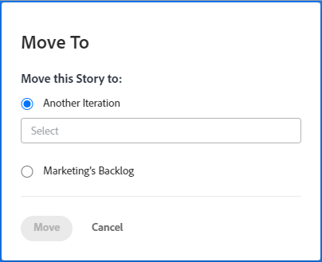

# Déplacer une histoire Agile

Vous pouvez déplacer une histoire agile vers une autre itération (pour les équipes de Scrum) ou vers la liste d’attente (pour les équipes de Kanban et de Scrum).

## Conditions d’accès

+++ Développez pour afficher les exigences d’accès aux fonctionnalités de cet article.

<table style="table-layout:auto"> 
 <col> 
 </col> 
 <col> 
 </col> 
 <tbody> 
  <tr> 
   <td role="rowheader">Package Adobe Workfront</td> 
   <td> 
Tous
 </td> 
  </tr> 
  <tr> 
   <td role="rowheader">Licence Adobe Workfront</td> 
   <td> 
Standard
 
   
Travail ou supérieur
 </td> 
  </tr>
  <tr> 
   <td role="rowheader">Autorisations d’objet</td> 
   <td>Gérer l’accès à l’histoire</td> 
  </tr> 
 </tbody> 
</table>

Pour plus d’informations, voir [Conditions d’accès requises dans la documentation Workfront](/help/quicksilver/administration-and-setup/add-users/access-levels-and-object-permissions/access-level-requirements-in-documentation.md).

+++

## Déplacer une histoire d’une itération ou d’un panorama Kanban vers la liste d’attente

1. Accédez à l’itération ou au panorama Kanban qui contient l’histoire que vous souhaitez déplacer vers la liste d’attente.
1. Cliquez sur l’en-tête d’itération en haut de la page.
1. Sur l’onglet **[!UICONTROL Histoires]**, sélectionnez les histoires à déplacer.
1. Cliquez sur **[!UICONTROL Plus]** > **[!UICONTROL Déplacer vers]**. La boîte de dialogue **[!UICONTROL Déplacer vers]** s’affiche.

   

1. Sélectionnez **liste d&#39;attente de team_name**. Dans l’exemple ci-dessus, le nom de l’équipe est **Marketing**.

1. Cliquez sur **[!UICONTROL Déplacer]**.

## Déplacer une histoire vers une autre itération

Vous pouvez déplacer une histoire vers une autre itération pour votre équipe Scrum si vous êtes un administrateur système ou un membre de l’équipe auquel l’itération est associée.

>[!NOTE]
>
> L’option **[!UICONTROL Déplacer vers]** n’est pas disponible pour les histoires parents sur une itération. Vous pouvez déplacer des sous-tâches uniquement vers une autre itération.

1. Accédez à l’itération contenant l’histoire que vous souhaitez déplacer.
1. Cliquez sur l’en-tête d’itération en haut de la page.
1. Sur l’onglet **[!UICONTROL Histoires]**, sélectionnez les histoires à déplacer.
1. Cliquez sur **[!UICONTROL Plus]** > **[!UICONTROL Déplacer vers]**. La boîte de dialogue **[!UICONTROL Déplacer vers]** s’affiche.

   

1. Sélectionnez **[!UICONTROL Autre itération]**.
1. Dans le menu déroulant qui s’affiche, sélectionnez l’itération dans laquelle vous souhaitez déplacer l’histoire.

   >[!NOTE]
   >
   >Les [!UICONTROL Date de début prévue] et [!UICONTROL Date d’achèvement prévue] de l’élément de travail sont affectées par un paramètre de la page [!UICONTROL Modifier l’équipe]. Pour plus d’informations, voir la section [[!UICONTROL Configurer] comment les dates sont appliquées lors de l’ajout d’éléments de travail à une itération](../../agile/get-started-with-agile-in-workfront/configure-scrum.md#configure-how-dates-are-applied-when-adding-work-items-to-an-iteration) dans l’article [Configurer Scrum](../../agile/get-started-with-agile-in-workfront/configure-scrum.md).

1. Cliquez sur **[!UICONTROL Déplacer]**.
