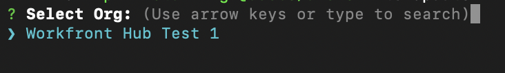

# Création d’applications personnalisées pour Workfront avec Adobe App Builder

Les extensions d’interface utilisateur de Workfront, optimisées par Adobe App Builder, permettent aux clients et aux partenaires de créer des expériences utilisateur personnalisées. Ces outils améliorent l’efficacité, offrent des expériences connectées transparentes, améliorent considérablement la satisfaction des utilisateurs et aident les entreprises à réaliser leur vision unique.

Par exemple, sans les extensions de l’interface utilisateur de Workfront, un gestionnaire de projet peut avoir besoin de basculer entre Workfront et un système de suivi temporel distinct pour consigner les heures. Avec les extensions de l’interface utilisateur, le suivi du temps peut être intégré directement à l’expérience Workfront, ce qui simplifie le workflow et permet de gagner du temps. Vous pouvez également ajouter des composants personnalisés pour améliorer la convivialité, automatiser les tâches répétitives et améliorer la gestion de contenu grâce à des fonctionnalités telles que le balisage des métadonnées et les aperçus de contenu. Adobe App Builder offre également l’évolutivité et une gestion des identités (IMS) robuste, assurant ainsi une personnalisation sécurisée et efficace à n’importe quelle échelle.

Les extensions de l’interface utilisateur de Workfront offrent plusieurs avantages clés :

* Personnalisation précise : les interfaces logicielles standard ne répondent souvent pas à tous les besoins de l’entreprise. Les extensions d’interface utilisateur permettent aux développeurs de modifier et d’étendre l’interface utilisateur par défaut pour répondre à des besoins professionnels spécifiques.
* Intégration du système : les extensions d’interface utilisateur facilitent l’intégration d’autres systèmes, assurant des workflows transparents et la cohérence des données.
* Évolutivité : au fur et à mesure que les entreprises se développent, les extensions d’interface utilisateur peuvent être développées pour ajouter de nouvelles fonctionnalités sans avoir besoin d’une révision complète du système.
* Temps de développement réduit : les points d’extension et les outils préconfigurés réduisent considérablement le temps et les efforts nécessaires à l’implémentation de fonctionnalités personnalisées.
* Meilleure adoption par les utilisateurs : une expérience utilisateur optimisée peut considérablement stimuler l’adoption des logiciels. Les éléments d’interface utilisateur personnalisés conçus pour répondre aux préférences des utilisateurs peuvent améliorer les taux d’adoption et la satisfaction globale.
* Grâce aux extensions d’interface utilisateur de Workfront, les entreprises peuvent créer des expériences utilisateur personnalisées qui favorisent l’efficacité, l’intégration et la satisfaction des utilisateurs.

Une fois l’application créée dans Adobe App Builder, un administrateur ou une administratrice Workfront peut l’ajouter au menu principal de Workfront et au panneau de navigation de gauche à l’aide de modèles de disposition. Un utilisateur disposant du modèle de mise en page qui clique sur l’application voit l’application incorporée dans Workfront au lieu de devoir l’ouvrir séparément.

Cet article décrit comment accéder à App Builder et utiliser un modèle pour créer une application.

Pour plus d’informations sur l’ajout d’une application personnalisée aux modèles de mise en page, voir [Personnaliser le menu principal à l’aide d’un modèle de mise en page](/help/quicksilver/administration-and-setup/customize-workfront/use-layout-templates/customize-main-menu.md) et [Personnaliser le panneau de gauche à l’aide d’un modèle de mise en page](/help/quicksilver/administration-and-setup/customize-workfront/use-layout-templates/customize-left-panel.md).

## Conditions préalables

Vous devez disposer des éléments suivants :

* Un compte Workfront compatible IMS
* Une machine de développement avec le nœud v18 et npm
* Licence App Builder

## Accès à Adobe App Builder

Pour créer des extensions d’interface utilisateur, vous devez avoir accès à Adobe App Builder dans Adobe Developer Console.

Des instructions supplémentaires sont disponibles sur le site [Adobe Developer](https://developer.adobe.com/uix/docs/guides/get-access/).

### Ajout de développeurs au Adobe Admin Console

>[!IMPORTANT]
>
>Assurez-vous d’avoir sélectionné la bonne organisation IMS pour toutes les étapes suivantes. Si vous appartenez à plusieurs organisations, il est possible de sélectionner la mauvaise. Assurez-vous que vous agissez sous la bonne organisation, qui est généralement répertoriée dans le coin supérieur droit.

1. Accédez à Production : https://adminconsole.adobe.com/ .
1. Dans la section **Utilisateurs**, cliquez sur **Développeurs** > **Ajouter des développeurs**.

   

   >[!NOTE]
   >
   >Si vous ne voyez pas d’option permettant de gérer les développeurs, cela signifie que vous ne disposez pas d’un produit permettant aux développeurs d’y accéder.

1. Ajoutez l’e-mail de l’utilisateur. Elle doit rechercher des utilisateurs existants qui ont déjà été ajoutés à partir d’Admin Console.
1. Ajoutez les produits nécessaires au profil de développeur et cliquez sur **Enregistrer**.

   

### Obtenir l’accès à App Builder

Les entreprises doivent collaborer avec leurs gestionnaires de compte pour acheter App Builder.

Si AppBuilder est correctement configuré, vous devriez voir Créer un projet à partir d’un modèle dans le cadre de la création d’un projet.

## Création d’un projet dans le Adobe Developer Console

Vous devez utiliser Adobe Developer Console pour créer votre extension d’interface utilisateur.

Des instructions supplémentaires sont disponibles sur le site [Adobe Developer](https://developer.adobe.com/uix/docs/guides/creating-project-in-dev-console/).

1. Connectez-vous au Adobe Developer Console à l’aide de votre Adobe ID.
1. Choisissez votre compte et votre profil ou organisation.
1. Cliquez sur **Créer un projet à partir d’un modèle** dans la zone Démarrage rapide, ou cliquez sur **Créer un projet > Projet à partir d’un modèle**.

   >[!IMPORTANT]
   >
   >Si vous ne voyez pas l’option de création d’un projet à partir d’un modèle, cela signifie que vous êtes mal configuré(e) dans Admin Console et que vous n’avez pas accès au catalogue App Builder. Cette option s’affiche uniquement lorsque vous avez accès à AppBuilder.

   

1. Sélectionnez **App Builder**.
1. Saisissez un **Titre du projet** et **Nom de l’application**. Les deux comportent des valeurs par défaut, mais il est plus facile d’identifier le projet souhaité ultérieurement si vous personnalisez la valeur.
1. Laissez **Inclure le runtime** sélectionné.
1. Cliquer sur **Enregistrer**.

## Utilisation de l’interface de ligne de commande Adobe Developer (aio)

Adobe fournit une interface de ligne de commande open source que vous pouvez utiliser pour créer l’application App Builder.

Des instructions supplémentaires sont disponibles sur GitHub et sur le site d’Adobe Developer :

* https://github.com/adobe/aio-cli
* https://developer.adobe.com/app-builder/docs/getting_started/first_app/

1. Pour installer l’outil (assurez-vous d’être sur le nœud v18), exécutez : `npm install -g @adobe/aio-cli`.
1. Lancez votre terminal et connectez-vous à l’AIO avec la commande : `aio login`. Si vous rencontrez des problèmes lors de la connexion à l’organisation IMS appropriée, `aio login -f` à forcer une invite de connexion. Utilisez `aio where` pour voir quelle organisation vous êtes connecté à l’organisation IMS appropriée. pour plus d’informations, utilisez `aio config`.
1. Commencez à configurer votre application en exécutant : `aio app init example-app` à remplacer « example-app » par le nom de votre application. Si vous n’êtes pas sûr des noms d’application, vous pouvez voir une liste de noms d’application avec la commande `aio console project list`.
1. Sélectionnez votre organisation et votre projet dans les options fournies.

   
   

1. Parcourez tous les modèles disponibles et choisissez le **@adobe/workfront-ui-ext-tpl** pour votre projet.

   

1. Sélectionnez et saisissez le nom du projet que vous avez créé dans le Adobe Developer Console.

   

1. Répondez aux invites de l&#39;application :

   * Nommez l’extension.
   * Fournissez un résumé descriptif des fonctionnalités de l’extension.
   * Sélectionnez un numéro de version initial pour commencer.
   * Le modèle crée le code d’un bouton de navigation principal si vous sélectionnez Ajouter un bouton personnalisé à l’élément de menu principal lorsque vous êtes invité à indiquer « Que souhaitez-vous faire ensuite ? ».

   

1. Confirmez l’achèvement en sélectionnant J’ai terminé. La génération du code à partir du modèle est en cours.

   

1. Patientez jusqu’à ce qu’un message indiquant que l’initialisation de l’application est terminée s’affiche. Vous pouvez ensuite ouvrir le projet dans un IDE (Visual Studio Code est recommandé) et accéder au dossier src.

   Pour plus d’informations sur les dossiers et fichiers de votre projet, consultez le [site du développeur Adobe](https://developer.adobe.com/app-builder/docs/get_started/app_builder_get_started/first-app#anatomy-of-an-app-builder-application).

Pour plus d’informations sur les dossiers et fichiers de votre projet, consultez le [site d’Adobe Developer](https://developer.adobe.com/app-builder/docs/get_started/app_builder_get_started/first-app#anatomy-of-an-app-builder-application).

## Création des extensions dans VSCode

La configuration du fichier App.js est requise pour activer la navigation via le menu principal de Workfront ou la navigation secondaire (panneau de gauche).

La configuration du fichier ExtensionRegistration.js est requise pour afficher les extensions dans les modèles de disposition Workfront.

Les exemples suivants vous montrent comment ajouter des applications personnalisées au menu principal de Workfront et au panneau de gauche d’un objet à l’aide des extensions d’interface utilisateur.

### Configuration d’ExtensionRegistration.js

Pour autoriser les applications personnalisées dans le menu principal de Workfront :

1. Accédez à ExtensionRegistration.js.

   Dans la fonction ExtensionRegistration, vous devriez voir le code suivant. Ce code a été créé pour vous par le modèle. Ce code peut être ajouté pour créer des éléments de menu supplémentaires. Veillez à remplacer les identifiants et les URL.

   ```
   mainMenu: { 
   
           getItems() { 
   
               return [ 
   
               { 
   
                   id: 'main-menu-label', 
   
                   url: '/index.html#/main-menu-label', 
   
                   label: 'Main menu label', 
   
                   icon: icon1, 
   
               }, 
   
               ]; 
   
           }, 
   
           } 
   ```

1. Ajoutez le fragment de code suivant :

    de fragment de code

   Cet exemple montre un élément du menu principal. Vous devez mettre à jour l’identifiant, le libellé, l’icône et l’URL vers les noms corrects pour votre application. Lors de l’ajout de plusieurs éléments, assurez-vous que l’identifiant est unique.

1. Enregistrez votre travail.

### Autoriser les applications personnalisées dans la navigation du panneau de gauche de Workfront

Pour autoriser les applications personnalisées dans le volet de navigation de gauche de Workfront, procédez comme suit :

1. Accédez à ExtensionRegistration.js.
1. Dans la fonction ExtensionRegistration, ajoutez le fragment de code suivant :

   ```
   secondaryNav: {
   
   TASK: {  
   
       getItems() {       return [         {           id: "TASK", 
   
   label: "My TASK",           icon: metricsIcon,           url: "/myTask",  
   
           },  
   
       ];  
   
       },  
   
   },  
   
   },  
   ```

   

   * Cet exemple montre un élément de navigation du panneau de gauche appelé Ma tâche. Vous devez mettre à jour l’identifiant, le libellé, l’icône et l’URL vers les noms corrects pour votre application.
   * Cet exemple montre un élément de navigation du panneau de gauche pour le type d&#39;objet Projet. Vous devez créer ces éléments séparément pour chaque objet pour lequel ils sont pris en charge dans Workfront. Les objets suivants sont disponibles : projet, tâche, problème, portefeuille et programme.

1. Enregistrez votre travail.

### Incorporation d’une application à l’aide d’un formulaire personnalisé Workfront

Le point d’extension du widget de formulaires est une fonctionnalité d’extension de l’interface utilisateur d’Adobe Workfront qui vous permet de créer des widgets personnalisés pouvant être incorporés dans les formulaires personnalisés de Workfront. Contrairement aux autres points d’extension qui ajoutent des éléments de navigation ou des options de menu, les widgets permettent d’afficher du contenu personnalisé dans des panneaux dédiés, dans des champs de formulaire personnalisés.

Les widgets sont des composants modulaires de l’interface utilisateur qui peuvent être ajoutés aux formulaires personnalisés de Workfront en tant que champs de formulaire. Ils permettent d’afficher des fonctionnalités personnalisées, des visualisations de données ou du contenu externe directement dans des interfaces de formulaire personnalisées, ce qui permet aux utilisateurs et aux utilisatrices d’interagir avec une logique personnalisée lors du remplissage de formulaires.

#### Configuration d’une extension de widget

Comme les points d’extension de l’interface utilisateur pour le menu principal et la navigation secondaire, le point d’extension « widgets » est configuré dans l’objet de méthodes du composant `ExtensionRegistration`, généralement dans le champ `ExtensionRegistration.js` . Cela signifie que l’utilisation du widget Forms nécessite uniquement l’ajout d’un élément « widget » dans `extesionregistration` avec un itinéraire valide dans votre app.js :

```
javascript 


Apply to ExtensionReg... 

widgets: { 

  getItems() { 

    return [ 

      { 

        id: "test2", 

        url: "/index.html#/widgets1", 

        label: "Test Widget with dimensions", 

        dimensions: { 

          height: 450, 

          width: 300, 

          maxHeight: 600, 

          maxWidth: 400, 

        }, 

      }, 

      { 

        id: "test", 

        url: "/index.html#/widgets1", 

        label: "Test Widget without dimensions", 

      }, 

    ]; 

  }, 

}, 
```

#### Propriétés de configuration du widget

**Propriétés requises**

* id (chaîne) : identifiant unique du widget. Doit être unique pour tous les widgets de votre extension.

* url (chaîne) : chemin URL vers le contenu du widget. Cela devrait pointer vers un itinéraire dans votre extension qui effectue le rendu du composant de widget.

* label (chaîne) : nom d’affichage du widget qui apparaît dans l’interface de sélection des champs du formulaire personnalisé.

**Propriétés facultatives**

* dimensions (objet) : spécifie les dimensions d’affichage du widget. Toutes les propriétés sont facultatives et il s’agit des seules dimensions possibles :

* hauteur (nombre) : hauteur du widget en pixels

* largeur (nombre) : largeur du widget en pixels

* maxHeight (nombre) : hauteur maximale du widget en pixels

* maxWidth (nombre) : largeur maximale du widget en pixels

**Propriétés Dimension**

L’objet dimensions vous permet de contrôler les contraintes de taille et de disposition de votre widget :

* hauteur et largeur : définissez la taille initiale/préférée du widget

* maxHeight et maxWidth : définissez des limites supérieures pour empêcher le widget de devenir trop grand.

* Comportement réactif : les widgets peuvent être réactifs dans ces contraintes

* Intégration de formulaire : les dimensions permettent de s’assurer que le widget s’adapte bien aux dispositions des champs de formulaire

#### Exemples de configurations Dimension

```
// Fixed size widget 

dimensions: { 

  height: 300, 

  width: 250, 

} 

// Flexible height with width constraint 

dimensions: { 

  width: 300, 

  maxHeight: 500, 

} 

// Height constraint only 

dimensions: { 

  height: 400, 

  maxWidth: 350, 

} 

// No dimensions - uses default sizing 

{} 
```

#### Données contextuelles

Les widgets ont accès au même contexte partagé que les autres points d’extension, notamment :

* Authentification : informations d’authentification incluant le jeton IMS.

* objCode : code de type d’objet (TÂCHE, PROJET, ÉVÉNEMENT, etc.)

* objID : identifiant de l’objet

* nom d’hôte : nom d’hôte de l’instance Workfront

* protocol : protocole de connexion

* utilisateur : informations sur l’utilisateur actuel

* isLoginAs : indique si l’utilisateur est connecté en tant qu’autre utilisateur

* isInBulkEditing : si le formulaire est actuellement en mode de modification en bloc. Si tel est le cas, le contexte inclut plusieurs valeurs pour l’ID d’objet.

#### Ajout d’un widget à un formulaire personnalisé Workfront

Une application peut être incorporée dans un formulaire personnalisé Workfront à l’aide du type de champ « Extensions de l’interface utilisateur ». Une fois que vous avez ajouté le champ, sélectionné un widget de formulaires, la liste des widgets est basée sur les applications actives dans votre organisation IMS ou l’application localement active, le cas `extensionoverride=TRUE`.


### Configuration d’App.js

1. Accédez à App.js.

1. Le modèle fournit un itinéraire pour une option de menu principal. Un itinéraire définit le mappage entre les chemins d’URL et les composants rendus pour ces chemins. Pour ajouter un itinéraire, utilisez le fragment de code suivant, veillez à remplacer le chemin et l’élément exacts par les vôtres.

   ```
       <Route 
   
               exact path="custom-application" 
   
               element={<Customapplication />} 
   
           /> 
   ```

   
1. Enregistrez votre travail.

Pour plus d’informations sur le développement et l’exécution de l’application, consultez le [site du développeur Adobe](https://developer.adobe.com/app-builder/docs/get_started/app_builder_get_started/first-app#develop-the-application).


## Contexte partagé

Le contexte partagé est utilisé pour partager des données de Workfront vers une extension d’interface utilisateur. Les données disponibles via le contexte partagé comprennent les données utilisateur et le contexte de l’application.


### l’utilisateur ou de l’utilisatrice

Les extensions d’interface utilisateur de Workfront partagent des données utilisateur. L’objet utilisateur disponible via le contexte partagé comprend un ID utilisateur Workfront et l’adresse électronique de l’utilisateur.

`user = (conn?.sharedContext?.get("user")); // {ID: '1', email: 'test@aaa.com'} userID = user.ID userEmail = user.email`

### Contexte applicatif

Lors de l’ajout d’une application personnalisée à l’aide d’un point d’extension de navigation Secondaire, il est courant que l’application personnalisée utilise des données contextuelles comme un identifiant de projet ou de document. Pour ces données, le contexte partagé comprend un code objet et un ID objet.

Voici un exemple d&#39;obtention du contexte applicatif pour les documents :

`context = conn?.sharedContext; // Using the connection created above, grab the document details from the host tunnel. // conn?.host?.document?.getDocumentDetails().then(setDocDetails);`

## Tester l’application dans Workfront

Lors du développement de votre application App Builder pour Workfront, vous devrez peut-être tester votre application dans Workfront sans la publier.

Dans votre application App Builder, vous pouvez lancer des `aio app run` de développement local. Vous obtenez ainsi une URL, généralement de type `https://localhost:9080`. Vous pouvez également exécuter `aio app deploy` pour obtenir un domaine Adobe statique. Veillez à noter ces URL pour une utilisation ultérieure.

Ensuite, accédez à la page spécifique sur laquelle vous souhaitez développer dans votre navigateur. Ouvrez les outils de développement et accédez au stockage local pour workfront.com ou workfront.adobe.com. Ici, vous devez ajouter une entrée. Utilisez `extensionOverride` comme clé et l’URL App Builder mentionnée précédemment comme valeur.

Si la configuration a été correctement effectuée, les boutons de votre application App Builder s’affichent lorsque vous rechargez la page du modèle de mise en page dans Workfront. Ajoutez les boutons d’application au menu principal et au panneau de gauche d’un objet et vérifiez qu’ils s’affichent correctement dans ces zones.

Des instructions supplémentaires sont disponibles sur le site d’Adobe Developer, à l’aide d’un exemple d’AEM : https://developer.adobe.com/uix/docs/guides/preview-extension-locally/ .

### Désactivez l’indicateur pour autoriser les tests locaux sur Chrome version 142 et ultérieures.

La version 142 de Chrome introduit des restrictions d’accès au réseau local. Ces restrictions peuvent interférer avec les environnements de test locaux.

Pour résoudre le problème, vous devez désactiver la vérification d’accès au réseau local en désactivant l’indicateur correspondant dans les paramètres de Chrome : `chrome://flags/#local-network-access-check`.

Pour désactiver l’indicateur

1. Ouvrez Chrome et saisissez `chrome://flags` dans la barre d’adresse, puis appuyez sur **Entrée**.
1. Dans la barre de recherche supérieure, tapez **Vérifications d’accès au réseau local**.
1. Cliquez sur le menu déroulant en regard de l’indicateur **Contrôles d’accès réseau local** et sélectionnez Désactivé.
1. Cliquez sur le bouton **Relancer** qui s’affiche en bas de l’écran pour appliquer les modifications.

## Publier les demandes et approuver l&#39;envoi

Pour publier la demande et l&#39;approuver, suivez les instructions sur le site [Adobe Developer](https://developer.adobe.com/uix/docs/guides/publication/).
