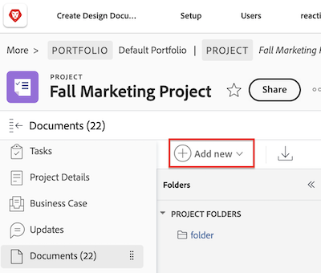

# Ajouter des documents à Adobe Workfront à partir de votre système de fichiers

Vous pouvez ajouter des documents à des projets, des tâches ou des problèmes dans les zones suivantes d’Adobe Workfront :

* La zone Documents globale
* La zone Documents pour un objet Workfront
* Une carte connectée sur un panorama Workfront

Vous pouvez également charger de nouvelles versions de documents et ajouter des liens vers des documents provenant de fournisseurs de cloud tiers, tels que Google Drive, Dropbox et Microsoft OneDrive. Pour plus d’informations sur l’ajout de nouvelles versions de documents, voir [Charger une nouvelle version d’un document](../../documents/managing-documents/upload-new-document-version.md). Pour plus d’informations sur l’ajout de documents provenant de fournisseurs de cloud tiers, voir [Lier des documents à partir d’applications externes](../../documents/adding-documents-to-workfront/link-documents-from-external-apps.md).

Il n’y a aucune restriction sur les types et les tailles de fichiers que vous pouvez charger sur Workfront. Toutefois, pour une opération réussie, le chargement doit être effectué en moins de cinq minutes et vous devez disposer d’un espace de stockage adéquat.

Pour plus d’informations sur le chargement de nouvelles versions d’un document dans Workfront, voir [Charger une nouvelle version d’un document](../../documents/managing-documents/upload-new-document-version.md).

## Conditions d’accès

+++ Développez pour afficher les exigences d’accès aux fonctionnalités de cet article.

<table style="table-layout:auto"> 
 <col> 
 <col> 
 <tbody> 
  <tr> 
   <td role="rowheader">Package Adobe Workfront</td> 
   <td> 
 Tous
 </td> 
  </tr> 
  <tr> 
   <td role="rowheader">Licences Adobe Workfront*</td> 
   <td> 
   
Contributeur ou version ultérieure
 
   
Requête ou supérieure
 </td> 
  </tr> 
  <tr> 
   <td role="rowheader">Configurations des niveaux d’accès</td> 
   <td> 
Modifier l’accès aux documents
 </td> 
  </tr> 
 </tbody> 
</table>

Pour plus d’informations, voir [Conditions d’accès requises dans la documentation Workfront](/help/quicksilver/administration-and-setup/add-users/access-levels-and-object-permissions/access-level-requirements-in-documentation.md).

+++

## Ajouter des documents à Workfront

Vous pouvez ajouter de nouveaux documents à Workfront à partir du système de fichiers de votre poste de travail. Vous pouvez également lier des documents provenant d’applications tierces telles que Google Drive et SharePoint.

>[!IMPORTANT]
>
>* Vous pouvez charger jusqu’à 150 documents à la fois.
>* La taille du fichier n’est pas limitée.
>* Les téléchargements de documents sont limités à 4 Go.

Pour ajouter un document

1. Accédez au projet, à la tâche ou au problème auquel vous souhaitez ajouter un document.
1. Cliquez sur l’onglet **Documents**, puis sur le menu déroulant **Ajouter**.

   

1. Selon le type de document que vous souhaitez ajouter, effectuez l’une des opérations suivantes :

   <table style="table-layout:auto"> 
    <col> 
    <col> 
    <tbody> 
     <tr> 
      <td role="rowheader">Charger des documents à partir de votre système de fichiers sur votre poste de travail</td> 
      <td> 
       <ol> 
        <li value="1">Dans le menu déroulant <strong>Ajouter</strong>, sélectionnez <strong>Document.</strong></li> 
        <li value="2"> 
Recherchez et sélectionnez le document que vous souhaitez ajouter dans le système de fichiers de votre poste de travail. 
 
Vous pouvez sélectionner plusieurs documents en appuyant sur la touche Maj lorsque vous sélectionnez des fichiers supplémentaires.
 </li> 
        <li value="3">Cliquez sur <strong>Ouvrir</strong>.</li> 
       </ol> 
       
<b>NOTE</b> : vous pouvez également faire glisser et déposer des fichiers directement depuis votre gestionnaire de fichiers dans la liste des documents.</td> 
     </tr> 
     <tr> 
      <td role="rowheader">Charger des documents à partir d’une application tierce telle que Google Drive ou SharePoint</td> 
      <td> 
       <ol> 
        <li value="1"> 
Dans le menu déroulant <strong>Ajouter</strong>, sélectionnez <strong>Depuis &lt;name_of_third-party_application&gt;</strong>.
 
Par exemple, pour charger un document de Google Drive, cliquez sur <strong>Depuis Google Drive</strong>.
 </li> 
        <li value="2"> 
Suivez les instructions pour sélectionner le document dans l’application tierce. 
 
Pour plus d’informations sur les documents liés, voir <a href="../../documents/adding-documents-to-workfront/link-documents-from-external-apps.md" class="MCXref xref">Lier des documents à partir d’applications externes</a>.
 </li> 
       </ol> </td> 
     </tr> 
     <tr> 
      <td role="rowheader">Demander un document à un autre utilisateur ou une autre utilisatrice Workfront</td> 
      <td> 
       <ol> 
        <li value="1">Dans le menu déroulant <strong>Ajouter</strong>, sélectionnez <strong>Demander un document</strong>.</li> 
        <li value="2">Dans la zone <strong>À qui faites-vous la demande</strong>, tapez le nom de l’utilisateur ou de l’utilisatrice à qui vous demandez le document.</li> 
        <li value="3">Dans la zone <strong>Expliquez votre demande</strong>, tapez le nom du document.</li> 
        <li value="4"> 
Cliquez sur <strong>Envoyer la demande</strong>.
 
Votre demande s’affiche dans votre onglet Documents.
 
Pour plus d’informations sur la demande de documents, voir <a href="../../documents/adding-documents-to-workfront/request-a-document.md" class="MCXref xref">Demander un document</a>.
 </li> 
       </ol> </td> 
     </tr> 
    </tbody> 
   </table>

## Sécurité des documents

Le site Workfront empêche les virus et autres contenus malveillants de pénétrer sur le site par le biais de documents de la manière suivante :

* [Détection des fichiers corrompus par Workfront](#how-workfront-detects-corrupted-files)
* [Restrictions sur les noms de fichiers](#file-name-restrictions)

### Détection des fichiers corrompus par Workfront {#how-workfront-detects-corrupted-files}

L’analyse des documents n’est possible pour votre organisation que sur demande.

Si l’analyse des documents est activée, les fichiers de moins de 25 Mo sont analysés lorsqu’ils sont téléchargés. Les fichiers de plus de 25 Mo ne sont pas analysés.

Si Workfront détecte un document corrompu, un message s’affiche indiquant que le fichier est corrompu. Vous recevez également une notification par e-mail lorsque Workfront détecte un contenu potentiellement malveillant et que le fichier doit être supprimé.

Les fichiers corrompus sont supprimés dans les 24 heures suivant leur détection, sauf si vous les supprimez manuellement. Si vous supprimez un fichier corrompu, Workfront suit cette action comme une mise à jour. Si vous autorisez Workfront à le supprimer, aucune mise à jour n’est enregistrée.

### Restrictions sur les noms de fichiers {#file-name-restrictions}

Certains caractères ne peuvent pas figurer dans le nom des fichiers téléchargés vers Workfront. Si le nom d’un fichier contient l’un des caractères suivants, ces caractères sont supprimés du nom du fichier lorsque celui-ci est téléchargé : `! # % * \ | ' " / ? < > { } [ ]`.
