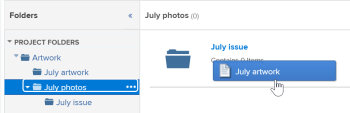

# Lier des documents à partir d’applications externes

<!-- Audited: 01/2024 -->

Vous pouvez lier des documents et des dossiers à Adobe Workfront à partir des sources suivantes :

<table style="table-layout:auto"> 
 <col> 
 <col> 
 <tbody> 
  <tr> 
   <td role="rowheader">Fournisseurs de document en ligne tiers existants</td> 
   <td>Notamment ce qui suit : 
    <ul> 
     <li>Box</li> 
     <li>Dropbox</li> 
     <li>Dropbox Business</li> 
     <li>WebDAM</li> 
     <li>Microsoft OneDrive</li> 
     <li>Microsoft SharePoint</li> 
     <li>Google Drive</li> 
     <li>Quip</li>
    </ul></td> 
  </tr> 
  <tr> 
   <td role="rowheader">Workfront Proof </td> 
   <td>Vous pouvez rendre les épreuves créées à l’origine dans Workfront Proof disponibles dans Workfront. Pour les licences actuelles, une formule Pro Workfront ou supérieure est nécessaire pour utiliser cette fonctionnalité. Pour les nouvelles licences, toutes les formules incluent cette fonctionnalité. Pour plus d’informations sur les différentes formules disponibles, voir <a href="https://business.adobe.com/products/workfront/pricing.html">Formules Workfront</a>.</td> 
  </tr> 
  <tr data-mc-conditions="QuicksilverOrClassic.Quicksilver"> 
   <td role="rowheader">Experience Manager Assets Essentials </td> 
   <td>Vous pouvez lier des documents à Workfront depuis Experience Manager Assets Essentials. Pour plus d’informations, voir <a href="../../documents/adobe-workfront-for-experience-manager-assets-essentials/workfront-for-aem-asset-essentials.md" class="MCXref xref">Adobe Workfront pour Experience Manager Assets Essentials</a>.</td> 
  </tr> 
  <tr> 
   <td role="rowheader">Workfront DAM </td> 
   <td>Nécessite un achat supplémentaire. </td> 
  </tr> 
  <tr> 
   <td role="rowheader">Autres fournisseurs de documents (par le biais d’intégrations de documents personnalisées)</td> 
   <td> 
Pour les licences actuelles, une formule Pro Workfront ou supérieure est nécessaire pour utiliser cette fonctionnalité. Pour les nouvelles licences, toutes les formules incluent cette fonctionnalité. Pour plus d’informations sur les différentes formules disponibles, voir <a href="https://business.adobe.com/products/workfront/pricing.html">Formules Workfront</a>.
 </td>
  </tr> 
 </tbody> 
</table>

Avant de lier des documents ou des dossiers, votre administrateur ou administratrice Workfront doit activer cette fonctionnalité pour chaque fournisseur de documents ou pour une intégration de documents personnalisée, comme décrit dans [Configurer les intégrations de documents](../../administration-and-setup/configure-integrations/configure-document-integrations.md).

Vous pouvez relire et approuver les documents liés à un fournisseur de services cloud externe de la même manière que vous le faites pour les documents chargés directement sur Workfront.

## Conditions d’accès

+++ Développez pour afficher les exigences d’accès aux fonctionnalités de cet article.

Vous devez disposer des accès suivants pour effectuer les étapes décrites dans cet article :

<table style="table-layout:auto"> 
 <col> 
 <col> 
 <tbody> 
  <tr> 
   <td role="rowheader">Formule Adobe Workfront</td>
   <td> 
 Tous
 </td>
  </tr> 
  <tr> 
   <td role="rowheader">Licence Adobe Workfront</td>
   <td>
Nouvelle : contributeur ou supérieure

    
ou

    
Actuelle : demande ou niveau supérieur
 </td>
  </tr> 
  <tr> 
   <td role="rowheader">Configurations des niveaux d’accès</td> 
   <td> 
Modifier l’accès aux documents
 </td> 
  </tr> 
 </tbody> 
</table>

Pour plus d’informations sur ce tableau, voir [Conditions d’accès requises dans la documentation Workfront](/help/quicksilver/administration-and-setup/add-users/access-levels-and-object-permissions/access-level-requirements-in-documentation.md).

+++

## Stockage de documents

Les documents liés à Workfront à partir d’une application externe sont stockés chez le fournisseur de services cloud externe, et non dans Workfront.

Les exceptions suivantes s’appliquent :

* Lorsqu’elles sont fournies par le service documentaire, les miniatures et les images de prévisualisation peuvent être stockées sur les serveurs de Workfront.
* Lorsque vous utilisez la relecture dans Workfront, le document est copié et ajouté aux serveurs de relecture.

## Lier un document provenant d’une application externe à Workfront

Vous pouvez lier des documents existants à un fournisseur de services cloud externe. Cela inclut tous les documents partagés.

### Conditions préalables {#prerequisites}

Avant de lier des documents ou des dossiers, votre administrateur ou administratrice Workfront doit activer cette fonctionnalité pour chaque fournisseur de documents ou pour une intégration de documents personnalisée, comme décrit dans [Configurer les intégrations de documents](../../administration-and-setup/configure-integrations/configure-document-integrations.md).

### Lier un document externe à Workfront {#link-an-external-document-to-workfront}

Vous pouvez lier des documents à Workfront à partir d’une application externe telle que Google et Microsoft OneDrive.

>[!IMPORTANT]
>
>Dropbox stocke les documents en fonction du chemin d’accès au fichier. Pour cette raison, si un fichier lié à partir de Dropbox est déplacé, renommé ou supprimé, il devient inaccessible dans Workfront.

1. Accédez à la zone **Documents** de Workfront où vous souhaitez placer le document.
1. Cliquez sur **Ajouter**, puis cliquez sur le fournisseur de documents externe depuis lequel vous souhaitez lier des documents à Workfront.

   Par exemple, pour lier des documents depuis Dropbox, cliquez sur **Depuis Dropbox**.

   Les fournisseurs externes que vous avez déjà autorisés apparaissent en haut de la liste.

1. (Le cas échéant) S’il vous est demandé de vous connecter au service externe, saisissez vos identifiants de connexion au service dans la zone qui s’affiche, puis cliquez sur **Se connecter**.
1. (Le cas échéant) S’il vous est demandé d’autoriser l’application externe, cliquez sur le bouton **Autoriser**.

   Vous ne devez le faire qu’une seule fois.

1. Dans le champ de recherche de la zone **Lier des fichiers et des dossiers externes** qui apparaît, saisissez le nom de l’élément que vous souhaitez rechercher, puis appuyez sur **Entrée** pour afficher tous les résultats de l’application externe, quel que soit le dossier dans lequel ils sont stockés.

   Ou

   Naviguez jusqu’aux documents que vous souhaitez lier et sélectionnez-les.

   Bien que vous puissiez sélectionner plusieurs documents, seuls les documents sélectionnés dans la vue actuelle sont liés. Par exemple, si vous sélectionnez un document, puis allez dans un dossier, le document sélectionné à l’origine n’est pas lié.

1. (Le cas échéant) Si vous êtes client ou cliente de Workfront DAM, cliquez sur l’icône **Miniature** pour afficher les fichiers sous forme de miniatures.

   >[!NOTE]
   >
   >Les clientes et clients de Workfront DAM peuvent voir les miniatures lorsqu’ils lient des documents à partir de Workfront DAM. Les miniatures peuvent également être affichées pour les clientes et clients de Workfront DAM pour d’autres services tels que Dropbox et Box. Cependant, l’affichage des miniatures pour les services autres que Workfront DAM dans Workfront n’est pas pris en charge, et les miniatures ne sont jamais affichées lors de la liaison de documents provenant de SharePoint ou de Google Drive.

1. Cliquez sur **Lier**.

   Dans Workfront, l’icône du fournisseur de services cloud apparaît à côté des documents.

   >[!NOTE]
   >
   >* Si l’URL de téléchargement utilisée pour lier le document dépasse 2 048 caractères, le fichier ne peut pas être lié.
   >* Pour les documents liés à Box, le lien vers le document dans Box ne s’affiche pas tant que la page n’est pas actualisée.

### Ajouter une nouvelle version d’un document lié {#add-a-new-version-of-a-linked-document}

Vous pouvez ajouter une nouvelle version d’un document lié à Workfront à partir d’une application externe.

1. Accédez à la zone **Documents** où le document est lié, puis sélectionnez le document lié.

   >[!IMPORTANT]
   >
   >Le document doit se trouver en dehors d’un dossier lié pour créer une version.

1. Cliquez sur **Ajouter nouveau** > **Version**, puis cliquez sur le fournisseur de documents externe.

   Par exemple, pour lier une nouvelle version d’un document provenant de Dropbox, cliquez sur **Depuis Dropbox**.

   Les fournisseurs externes que vous avez déjà autorisés apparaissent en haut de la liste.

1. (Le cas échéant) S’il vous est demandé de vous connecter au service externe, saisissez vos identifiants de connexion au service dans la zone qui s’affiche, puis cliquez sur **Se connecter**.
1. (Le cas échéant) S’il vous est demandé d’autoriser l’application externe, cliquez sur **Autoriser**.

   Vous ne devez le faire qu’une seule fois.

1. Dans le champ de recherche de la zone **Lier des fichiers et des dossiers externes** qui s’affiche, saisissez le nom de l’élément que vous souhaitez rechercher, puis appuyez sur **Entrée** pour afficher tous les résultats de l’application externe, quel que soit le dossier dans lequel ils sont stockés.

   Ou

   Naviguez jusqu’aux documents que vous souhaitez lier et sélectionnez-les.

   Vous pouvez sélectionner plusieurs documents, mais seuls les documents sélectionnés dans la vue actuelle sont liés. Par exemple, si vous sélectionnez un document, puis allez dans un dossier, le document sélectionné à l’origine n’est pas lié.

1. (Le cas échéant) Si vous êtes client ou cliente de Workfront DAM, cliquez sur l’icône **Miniature** pour afficher les fichiers sous forme de miniatures.

   >[!NOTE]
   >
   >Les clientes et clients de Workfront DAM peuvent voir les miniatures lorsqu’ils lient des documents à partir de Workfront DAM. Les miniatures peuvent également être affichées pour les clientes et clients de Workfront DAM pour d’autres services tels que Dropbox et Box. Cependant, l’affichage des miniatures pour les services autres que Workfront DAM dans Workfront n’est pas pris en charge, et les miniatures ne sont jamais affichées lors de la liaison de documents provenant de SharePoint ou de Google Drive.

1. Cliquez sur **Lier**.

   Dans Workfront, l’icône du fournisseur de services cloud apparaît à côté des documents, indiquant qu’ils sont liés au fournisseur de services cloud externe.

   >[!NOTE]
   >
   >Pour les documents liés à Box, le lien vers le document dans Box ne s’affiche pas tant que la page n’est pas actualisée.

Pour savoir comment ajouter une nouvelle version d’un document que vous avez chargé dans Workfront à partir de votre système de fichiers, voir [Ajouter des documents à Adobe Workfront](../../documents/adding-documents-to-workfront/add-documents-from-file-system.md#add-documents-to-workfront) dans [Ajouter des documents à Adobe Workfront à partir de votre système de fichiers](../../documents/adding-documents-to-workfront/add-documents-from-file-system.md).

### Lier des documents Workfront Proof {#link-workfront-proof-documents}

Vous pouvez lier à Workfront des épreuves qui existaient à l’origine dans Workfront Proof. Lorsque vous liez une épreuve à partir de Workfront Proof, tous les commentaires et autres métadonnées associés à l’épreuve sont disponibles dans Workfront.

Vous ne pouvez lier que les épreuves pour lesquelles vous avez un accès en affichage dans Workfront Proof.

1. Allez dans la zone **Documents** de Workfront où vous souhaitez obtenir le document.
1. Cliquez sur **Ajouter**, puis sur **À partir de Workfront Proof**.

   >[!NOTE]
   >
   >Les options de ce menu peuvent varier en fonction des fournisseurs tiers configurés dans votre environnement.

1. Dans la zone **Lier des épreuves à partir de l’épreuve Workfront** qui apparaît, commencez à saisir le nom de l’épreuve que vous souahitez rendre disponible dans Workfront.

   La liste est filtrée au fur et à mesure de la saisie.

1. Sélectionnez jusqu’à 10 épreuves à lier.

   Tout nom d’épreuve grisé n’est pas disponible pour établir un lien, car l’épreuve est déjà associée à un document dans Workfront.

1. Cliquez sur **Lier**.

   La version la plus récente de l’épreuve est liée à Workfront. Lorsque vous ouvrez l’épreuve, toutes les versions sont disponibles dans la visionneuse de relecture.

### Créer un document Google à partir de Workfront {#create-a-google-document-from-within-workfront}

Vous pouvez créer un document Google dans Workfront. Cette fonctionnalité n’est pas disponible pour d’autres fournisseurs cloud.

1. Allez dans la zone **Documents** de Workfront où vous souhaitez créer le document.
1. Cliquez sur **Ajouter** > **Fichier Google**, puis sélectionnez le type de document Google que vous souhaitez créer.
1. Si la boîte **Ajouter un compte Google Drive** s’affiche, cliquez sur **Autoriser Google Drive**.

   Un document Google est ajouté à l’onglet **Documents**.

   >[!NOTE]
   >
   > Mon Drive et Partagés avec moi affichent deux résultats différents. Si vous ne parvenez pas à localiser un fichier dans Mon Drive, vérifiez dans le dossier Partagés avec moi.

## Charger et lier un document de Workfront à un fournisseur cloud externe

Vous pouvez charger et lier un document Workfront à un fournisseur cloud externe. Le stockage du document est alors transféré de Workfront au fournisseur cloud externe. Lorsque le document est modifié dans l&#39;application externe, il est automatiquement mis à jour dans Workfront.

>[!NOTE]
>
>L’envoi d&#39;une ressource à un fournisseur de documents externe crée une nouvelle version de la ressource.

Les personnes qui n’ont pas accès à Workfront peuvent voir le document dans l’application externe s’ils ont accès à l’application.

1. Sélectionnez un document chargé dans Workfront.
1. Cliquez sur **Plus** >**Envoyer à**, puis sélectionnez le fournisseur cloud dans lequel vous souhaitez stocker le document lié.

   Pour ce faire, vous pouvez également utiliser le menu Plus  sur la page Détails du document.

1. Sélectionnez dans l’application du fournisseur le dossier dans lequel vous souhaitez stocker le document.

   Il peut s’agir de n’importe quel dossier de l’application du fournisseur, y compris un dossier partagé.

1. Cliquer sur **Enregistrer**.

   Le logo du fournisseur externe apparaît à côté du nom du document pour indiquer que le document est maintenant lié à Workfront et stocké par le fournisseur cloud externe.

   

## Lier des dossiers

Lorsque vous liez un dossier entre Workfront et un fournisseur cloud externe, le dossier et tout son contenu sont liés. Si des personnes n’ayant pas accès à Workfront ajoutent, suppriment et modifient des fichiers à partir de l’application de documents externe, leurs modifications sont synchronisées avec Workfront.

### Droits d’accès au dossier {#folder-access-rights}

Lors de la synchronisation du contenu d’un dossier à partir d’une application de documents externe, Workfront utilise les informations d’identification de la personne qui a lié le dossier à l’origine. L’expérience client est la suivante :

* Si les personnes ne disposent pas d’un accès en affichage aux fichiers et dossiers dans l’application externe, mais qu’elles disposent pas d’un accès en affichage au dossier lié via Workfront, elles ne peuvent visualiser que les noms des fichiers et des dossiers dans Workfront, et non leur contenu.
* Lorsqu’une personne accède au contenu d’un dossier lié dans Workfront (tel qu’un sous-dossier dans un dossier lié) qui a été lié à Workfront par une autre personne, le contenu se synchronise à Workfront en utilisant les identifiants de connexion à Workfront de la personne qui a initialement lié le dossier, et non les identifiants de la personne qui accède au contenu.

>[!IMPORTANT]
>
>* Si la personne qui a lié le dossier à l’origine est retirée du système Workfront, les utilisateurs et utilisatrices ne sont plus en mesure d’accéder au contenu du dossier lié via Workfront. Dans ce cas, le dossier doit être lié à nouveau par une personne active de Workfront qui a des droits sur le dossier dans l’application externe.
>* Si la personne qui a lié un dossier n’a plus accès à l’application externe, Workfront ne peut plus accéder au contenu du dossier. Cela peut se produire, par exemple, si la personne qui avait initialement lié le dossier quitte l’entreprise. Pour garantir un maintien de l’accès, une personne ayant accès au dossier doit lier à nouveau le dossier.

### Lier un ou plusieurs dossiers externes {#link-one-or-more-external-folders}

1. Dans Workfront, accédez à la zone où vous souhaitez placer le dossier, puis cliquez sur **Documents**  dans le panneau de gauche .

1. Cliquez sur **Ajouter**, puis cliquez sur le fournisseur de documents externes à partir duquel vous souhaitez lier un dossier à Workfront.
1. (Le cas échéant) Si vous n’avez pas encore autorisé le service externe, indiquez vos identifiants de connexion au fournisseur externe, puis cliquez sur **Se connecter**.

   Les fournisseurs externes que vous avez déjà autorisés apparaissent en haut de la liste.

1. Dans la boîte **Lier des fichiers et des dossiers externes** qui s’affiche, recherchez et sélectionnez les dossiers que vous souhaitez lier.

   Ou

   Saisissez le nom du dossier que vous souhaitez rechercher, puis appuyez sur **Entrée**.

   Vous pouvez sélectionner plusieurs dossiers, mais seuls les dossiers sélectionnés dans la vue actuelle sont liés. Par exemple, si vous sélectionnez un dossier puis accédez à un autre dossier, le dossier sélectionné à l’origine n’est pas lié.

   >[!NOTE]
   >
   >Lorsque vous liez des dossiers à partir de Google Drive, vous ne pouvez lier que des dossiers qui se trouvent dans votre lecteur personnel (Mon Drive) et votre Drive d’équipe. Vous ne pouvez pas lier des dossiers à partir de la zone Partagé(s) avec moi.

1. Cliquez sur **Lier**.

   Dans Workfront, le logo du fournisseur de services cloud s’affiche à côté du dossier, indiquant qu’il est lié au fournisseur de services cloud externe.

1. (Facultatif) Pour renommer le dossier de sorte que son nom dans Workfront soit différent de celui du dossier dans l’application de document externe, sélectionnez le dossier dans la section **Dossiers**, cliquez sur le menu Plus  qui s’affiche en regard du nom du dossier, puis cliquez sur **Renommer**.

   

Cette opération ne renomme pas le dossier dans l’application externe.

### Ajouter des sous-dossiers à un dossier lié  {#add-subfolders-to-a-linked-folder}

Vous pouvez créer un dossier à l’intérieur d’un dossier lié existant. Vous pouvez également faire glisser un autre dossier dans un dossier lié existant.

1. Pour créer un dossier dans un dossier lié existant, accédez au dossier existant, puis créez le dossier comme décrit dans [Créer des dossiers de documents](../../documents/organizing-documents/create-documents-folder.md).

   Ou

   Pour faire glisser un dossier existant dans un dossier lié existant, accédez à la zone Documents où vous souhaitez placer le sous-dossier, puis faites-le glisser dans le dossier lié.

   

   >[!NOTE]
   >
   >Les limitations suivantes s’appliquent lorsque vous faites glisser un dossier Workfront existant dans un dossier lié :
   >
   >* Le dossier que vous faites glisser ne peut pas être déjà lié et ne peut pas contenir de contenu déjà lié.
   >* Le dossier (y compris son contenu) que vous faites glisser ne doit pas dépasser 50 Mo.

## Ajouter un document à un dossier lié

Lorsque vous ajoutez un document à un dossier lié via Workfront, il est automatiquement ajouté en tant que document lié.

1. Sélectionnez le dossier lié dans lequel vous souhaitez placer le document, cliquez sur **Ajouter > Document**, puis recherchez le document et ajoutez-le au dossier.

   Ou

   Dans la zone **Documents** où vous voulez placer le document, faites glisser le document dans un dossier lié.

   Une nouvelle version de votre document est automatiquement créée dans l’application externe et liée à Workfront.

>[!NOTE]
>
> * Les options du document ne sont pas disponibles lorsque le document est en cours de déplacement.
>
> * Après qu’un document a été déplacé vers Experience Manager Assets, il n’est plus visible dans la liste des documents dans Workfront.
>
> * Toute action ou modification effectuée sur un document pendant qu’il est déplacé n’apparaîtra pas sur le document dans Experience Manager Assets et sera donc perdue.

## Supprimer un document ou un dossier lié

Lorsque vous supprimez un document ou un dossier lié de l’application externe, le document ou le dossier reste dans le système Workfront jusqu’à ce que vous le supprimiez dans Workfront.

1. Sélectionnez le document ou le dossier lié, puis cliquez sur **Supprimer**.
1. Dans la boîte de dialogue de confirmation qui s’affiche, cliquez sur **Oui, annuler le lien**.

   Le document n’est plus lié au site Workfront. Il n’est pas affecté dans l’application externe.

## Renommer des documents et des dossiers liés

Lorsque vous renommez un document ou un dossier lié, la modification n’est visible que dans l’application où vous l’avez effectuée. Par exemple, si vous renommez un document lié dans Workfront, le nouveau nom n’est visible que dans Workfront.

Si vous voulez que le nom corresponde dans Workfront et dans l’application externe, vous devez le renommer aux deux emplacements.

>[!IMPORTANT]
>
>Ne renommez pas un document de Workfront qui est lié à Dropbox ; cela rendrait le fichier inaccessible dans Workfront. Au lieu de cela, renommez le fichier dans Dropbox, puis resynchronisez-le.
