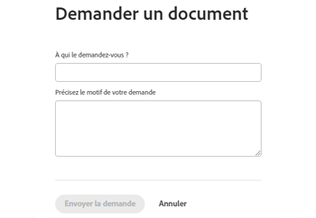

# Demander un document

Vous pouvez demander un document sur n’importe quel objet prenant en charge les documents.

## Conditions d’accès

+++ Développez pour afficher les exigences d’accès aux fonctionnalités de cet article.

<table style="table-layout:auto"> 
 <col> 
 <col> 
 <tbody> 
  <tr> 
   <td role="rowheader">Package Adobe Workfront</td> 
   <td> 
 Tous
 </td> 
  </tr> 
  <tr> 
   <td role="rowheader">Licences Adobe Workfront*</td> 
   <td> 
   
Contributeur ou version ultérieure

   
Requête ou supérieure
 </td> 
  </tr> 
  <tr> 
   <td role="rowheader">Configurations des niveaux d’accès</td> 
   <td> 
Modifier l’accès aux documents
 </td> 
  </tr> 
 </tbody> 
</table>

Pour plus d’informations, voir [Conditions d’accès requises dans la documentation Workfront](/help/quicksilver/administration-and-setup/add-users/access-levels-and-object-permissions/access-level-requirements-in-documentation.md).

+++

## Demander un document

1. Accédez à la la zone où vous souhaitez que le document que vous demandez réside.
1. Cliquez sur l’onglet **Documents**.
1. Cliquez sur le menu déroulant **Ajouter nouveau**.

1. Cliquez sur **Demander un document**.

   La boîte de dialogue Demander un document s’affiche.

   

1. Commencez à saisir le nom de l’utilisateur ou de l’utilisatrice à qui vous demandez le document, puis sélectionnez-le lorsqu’il apparaît dans la liste déroulante. Seuls les utilisateurs et utilisatrices d’Adobe Workfront disposant d’une licence s’affichent en tant qu’options dans la liste déroulante.

   >[!NOTE]
   >
   >Si vous avez la [vue d’ensemble des licences héritées](../../administration-and-setup/add-users/access-levels-and-object-permissions/wf-licenses.md) activée sur votre compte, vous pouvez envoyer une demande à n’importe quelle adresse e-mail. Il existe un paramètre dans [Configurer les préférences de sécurité système](../../administration-and-setup/manage-workfront/security/configure-security-preferences.md) qui détermine si ces utilisateurs et utilisatrices de messagerie externes doivent créer un mot de passe avant d’interagir avec Workfront.

1. Décrivez la raison pour laquelle vous demandez le document.
1. Cliquez sur **Envoyer la demande**.

   Lorsque vous envoyez une demande à un utilisateur ou une utilisatrice, un espace réservé est ajouté à la zone des documents. Vous pouvez faire un rappel à l’utilisateur ou l’utilisatrice ou annuler la demande à partir de cet espace réservé. L’utilisateur ou l’utilisatrice reçoit une notification Workfront et un e-mail à propos de la demande.

   L’utilisateur ou l’utilisatrice reçoit une notification par e-mail si cette préférence est activée, ainsi qu’une notification in-app. Pour plus d’informations sur les notifications par e-mail, voir [Modifier vos propres notifications par e-mail](../../workfront-basics/using-notifications/activate-or-deactivate-your-own-event-notifications.md).

   Vous pouvez cliquer sur le lien figurant dans l’e-mail de notification, puis charger le document. Vous pouvez également cliquer sur la notification in-app. Chaque option vous dirige vers la page du profil utilisateur où vous pouvez charger le document demandé.

1. Une fois que vous avez chargé le document, la personne qui l’a demandé peut accéder au document dans sa zone personnelle **Documents**.

   Vous pouvez accéder à votre zone personnelle **Documents** en cliquant sur l’image de votre profil utilisateur dans le coin supérieur droit d’une page Workfront, puis sur votre nom, et enfin sur l’onglet **Documents**.
