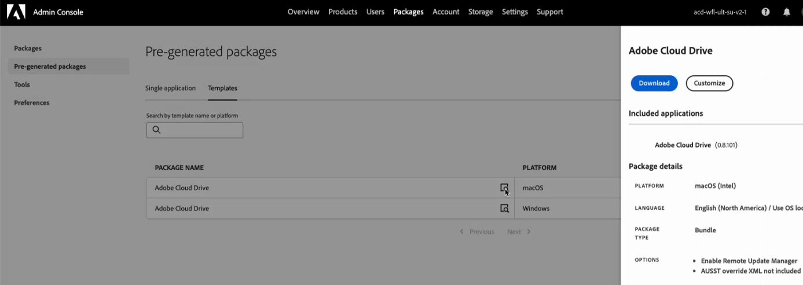

# Configurer et gérer Adobe Cloud Drive pour votre organisation

En tant qu’administrateur, vous pouvez configurer Adobe Cloud Drive pour permettre aux utilisateurs d’accéder directement, depuis le poste de travail, à leurs fichiers de projet dans l’espace de stockage Adobe Cloud, via le Finder sur macOS et l’Explorateur de fichiers sur Windows. Cet article explique comment activer l’accès dans le Adobe Admin Console, déployer l’application sur les appareils des utilisateurs et utilisatrices et gérer l’accès de manière continue.

Adobe Cloud Drive est une application de bureau d’entreprise qui monte les documents Workfront sur le stockage cloud d’Adobe en tant que lecteur virtuel sur les ordinateurs Mac et Windows des utilisateurs. Après l’installation, les utilisateurs voient leurs dossiers de projets Workfront dans le Finder ou l’Explorateur de fichiers et peuvent ouvrir, modifier et enregistrer des fichiers de projet à l’aide de n’importe quelle application de bureau, sans télécharger de fichiers manuellement ou utiliser un navigateur.

Pour utiliser Adobe Cloud Drive, votre organisation doit se trouver dans le package Workflow Ultimate, avec l’espace de stockage dans le cloud Adobe activé.

Pour plus d’informations sur Adobe Cloud Drive, consultez les articles suivants :

* [Présentation d’Adobe Cloud Drive](/help/quicksilver/documents/adobe-cloud-drive/adobe-cloud-drive-overview.md)
* [Installation d’Adobe Cloud Drive](/help/quicksilver/documents/adobe-cloud-drive/install-adobe-cloud-drive.md)
* [Utilisation d’Adobe Cloud Drive](/help/quicksilver/documents/adobe-cloud-drive/use-adobe-cloud-drive.md)

## Conditions d’accès

+++ Développez pour afficher les exigences d’accès aux fonctionnalités de cet article.

<table style="table-layout:auto"> 
 <col> 
 <col> 
 <tbody> 
  <tr> 
   <td role="rowheader">Version d’Adobe Workfront</td> 
   <td>Workflow Ultimate, avec le stockage dans le cloud Adobe activé</td> 
  </tr> 
  <tr> 
   <td role="rowheader">Droits d’administration Adobe</td> 
   <td>Vous devez être administrateur système pour Workfront dans Adobe Admin Console</td> 
  </tr> 
 </tbody> 
</table>

Pour plus d’informations, voir [Conditions d’accès requises dans la documentation Workfront](/help/quicksilver/administration-and-setup/add-users/access-levels-and-object-permissions/access-level-requirements-in-documentation.md).

+++

## Attribuer l’accès à Adobe Cloud Drive dans Adobe Admin Console

Adobe Cloud Drive est inclus dans le package Workflow Ultimate, lorsque l’espace de stockage dans le cloud Adobe est activé. Il n’apparaît pas en tant que produit autonome dans la section **Produits** d’Admin Console. Au lieu de cela, il est géré via la section **Rôles** sous **Utilisateurs**.

Lorsque vous accédez à **Utilisateurs** > **Rôles**, deux rôles sont associés au produit Workfront :

| Rôle | Affecté automatiquement à | Pertinence avec Adobe Cloud Drive |
| --- | --- | --- |
| **Membre** | Tous les utilisateurs de l’organisation | Contient le commutateur de fonctionnalités Adobe Cloud Drive au niveau de l’organisation. Activé par défaut. |
| **utilisateur ACD** | Personne, par défaut | Accorde un accès individuel lorsque le commutateur au niveau de l’organisation est désactivé. |

### Contrôles d’accès

**Contrôle 1 : contrôle des capacités au niveau de l&#39;organisation (dans le rôle Membre)**

Le rôle **Membre** est automatiquement attribué à chaque utilisateur de votre organisation. Ce rôle comprend un commutateur de fonctionnalités **Adobe Cloud Drive**. Lorsque cette option est activée, chaque utilisateur disposant d’une licence Workflow Ultimate peut accéder à Adobe Cloud Drive. Lorsqu’il est désactivé, aucun utilisateur ne peut accéder à Adobe Cloud Drive, quelle que soit sa licence.

Cette option est activée par défaut lorsqu’Adobe active Adobe Cloud Drive pour votre organisation.

**Contrôle 2 : rôle utilisateur ACD**

Le rôle **utilisateur ACD** n’est pertinent que lorsque le bouton au niveau de l’organisation est désactivé. Si vous désactivez le commutateur au niveau de l&#39;organisation pour exécuter un pilote contrôlé, vous pouvez toujours accorder l&#39;accès à des utilisateurs spécifiques en les ajoutant au rôle **utilisateur ACD**. Les utilisateurs et utilisatrices bénéficiant de ce rôle peuvent accéder à Adobe Cloud Drive même lorsque le bouton au niveau de l’organisation est désactivé. Si le commutateur au niveau de l’organisation est activé, le rôle **utilisateur ACD** n’a aucun effet.

**Exigence sous-jacente : licence Workflow Ultimate**

Adobe Cloud Drive n’est disponible que sur le package Workflow Ultimate. Les options de rôle ne sont disponibles dans aucun autre package.

La licence du package Workflow Ultimate peut être de n’importe quel type : Standard, Léger ou Contributeur. Pour plus d’informations sur les licences, voir [&#x200B; Présentation des licences &#x200B;](/help/quicksilver/administration-and-setup/add-users/how-access-levels-work/licenses-overview.md).

Le tableau suivant montre l&#39;interaction de ces contrôles :

| Commutateur au niveau de l’organisation | Utilisateur dans le rôle utilisateur ACD | Licence Workflow Ultimate | Accès au résultat |
| --- | --- | --- | --- |
| Marche | Non requis | Oui | Accordé |
| Arrêt | Oui | Oui | Accordé |
| Arrêt | Non | Oui | Refusé |
| Soit | Soit | Non | Refusé |

<!-- Sarah said to delete the second line. Commenting it out within the table messed up the display for the rest of the table, so keeping the line here until I can delete it. | On | Not required | No | Denied | -->

## Conditions préalables

Vérifiez les points suivants avant de commencer :

* Des licences de workflow Workfront sont attribuées aux utilisateurs pour lesquels vous prévoyez de configurer.
* Vous avez examiné les [exigences réseau](#network-requirements) avec votre équipe informatique.
* Vous avez rédigé un document de communication à envoyer aux utilisateurs pour expliquer ce qu’affiche Adobe Cloud Drive (ressources du projet Workfront uniquement) et comment l’installer.

  >[!NOTE]
  >
  >Un utilisateur dont l’accès est activé mais qui n’a accès à aucun projet Workfront voit un lecteur monté vide après la connexion. Ceci est attendu. L’accès aux projets Workfront est géré séparément dans Workfront. Pour plus d’informations, voir [Partager un projet](/help/quicksilver/workfront-basics/grant-and-request-access-to-objects/share-a-project.md).
  >
  >En outre, les droits Creative Cloud doivent se trouver dans la même organisation IMS que Workfront pour que les projets apparaissent dans le lecteur.

## Configuration de l&#39;accès dans le Adobe Admin Console

L’accès à Adobe Cloud Drive est configuré dans Adobe Admin Console. Sélectionnez l’option correspondant à votre stratégie de déploiement.

### Option A : activer l’accès pour l’ensemble de l’organisation

Lorsqu’Adobe active Adobe Cloud Drive pour votre organisation, le commutateur de fonctionnalités au niveau de l’organisation est activé par défaut et tous les utilisateurs y ont immédiatement accès. Suivez cette procédure pour confirmer que le commutateur est activé avant de déployer l’application.

1. Connectez-vous à [adminconsole.adobe.com](https://adminconsole.adobe.com/).
1. Cliquez sur **Utilisateurs** dans la barre de navigation supérieure.
1. Cliquez sur **Rôles** dans le panneau de gauche.
1. Cliquez sur **Membre** dans la liste des rôles.
1. Dans le panneau **Membre** qui s’ouvre à droite, confirmez que **Adobe Cloud Drive** apparaît sous **Autorisations** et que son bouton est activé.

   

   >[!NOTE]
   >
   >Si Adobe Cloud Drive n’apparaît pas sous les **autorisations** du rôle **Membre**, Adobe Cloud Drive peut ne pas encore être activé pour votre organisation. Contactez l’assistance Adobe pour confirmer.

1. Cliquez sur **Enregistrer** si vous avez apporté des modifications.

### Option B : activer l’accès pour un groupe spécifique d’utilisateurs

Utilisez cette option lorsque vous souhaitez limiter l’accès à un ensemble défini d’utilisateurs, par exemple pendant un pilote avant un déploiement plus large. Cela implique de désactiver le commutateur au niveau de l&#39;organisation, puis d&#39;ajouter vos utilisateurs pilotes au rôle **utilisateur ACD**.

>[!IMPORTANT]
>
>La désactivation du commutateur au niveau de l’organisation supprime immédiatement l’accès à Adobe Cloud Drive pour tous les utilisateurs de votre organisation, y compris les utilisateurs actuellement connectés. Vous devez désactiver la fonctionnalité au niveau de l’organisation et ajouter les utilisateurs pilotes dans la même session.

Pour désactiver la fonctionnalité au niveau de l’organisation :

1. Connectez-vous à [adminconsole.adobe.com](https://adminconsole.adobe.com/).
1. Cliquez sur **Utilisateurs** dans la barre de navigation supérieure, puis sur **Rôles** dans le panneau de gauche.
1. Cliquez sur **Membre** dans la liste des rôles.
1. Dans le panneau **Membre**, localisez **Adobe Cloud Drive** sous **Autorisations** et désactivez-le.
1. Cliquer sur **Enregistrer**.

Pour ajouter des utilisateurs pilotes au rôle utilisateur ACD, procédez comme suit :

1. Dans le panneau de gauche, cliquez sur **Rôles** pour revenir à la liste des rôles.
1. Cliquez sur **utilisateur ACD** dans la liste des rôles.

   

1. Cliquez sur **Ajouter des utilisateurs**.
1. Saisissez l’adresse e-mail de chaque utilisateur pilote.
1. Cliquer sur **Enregistrer**.

   Les utilisateurs ajoutés au rôle **utilisateur ACD** ont accès immédiatement. Les utilisateurs et utilisatrices ne disposant pas de ce rôle restent sans accès jusqu’à ce que vous les ajoutiez au rôle ou réactiviez le bouton au niveau de l’organisation.

   >[!TIP]
   >
   >Pour étendre l’accès au fil du temps, revenez au rôle **utilisateur ACD** et ajoutez des utilisateurs selon les besoins. Lorsque vous êtes prêt pour un déploiement complet, réactivez le bouton (bascule) au niveau de l’organisation dans le rôle **Membre**. Une fois que le commutateur au niveau de l’organisation est activé, le rôle **utilisateur ACD** n’a aucun effet et n’a pas besoin d’être conservé.

## Déploiement de l’application Adobe Cloud Drive

La configuration de l’accès dans le Adobe Admin Console établit les droits. Le déploiement de l’application l’installe sur l’appareil de l’utilisateur. Il s’agit de deux étapes distinctes et nécessaires.

Adobe Cloud Drive est une application autonome. Il n’est pas distribué via l’application de bureau Creative Cloud et n’apparaît pas dans le gestionnaire de packages Creative Cloud. Cependant, le profil utilisateur d’Adobe Cloud Drive est lié aux droits de l’application Creative Cloud. Cela signifie que pour qu’un utilisateur puisse accéder aux projets Workfront sur le lecteur, les applications Creative Cloud doivent avoir le droit d’accéder à la même organisation IMS que Workfront.

Choisissez la méthode de déploiement correspondant aux pratiques de gestion des appareils de votre entreprise.

### Méthode A : déploiement géré par le service informatique via les packages Admin Console

Utilisez cette méthode lorsque votre entreprise utilise des outils de déploiement centralisés tels que Microsoft Intune, SCCM, Jamf Pro ou Apple Remote Desktop. Il s’agit du workflow de déploiement d’entreprise Adobe standard, qui suit le même processus de création de package que celui utilisé pour les autres applications Adobe.

Pour créer le package dans le Adobe Admin Console :

1. Connectez-vous à [adminconsole.adobe.com](https://adminconsole.adobe.com/).
1. Cliquez sur **Packages** dans la barre de navigation supérieure.
1. Cliquez sur **Packages prégénérés** dans le panneau de gauche.
1. Cliquez sur l’onglet **Modèles**.

   Adobe Cloud Drive apparaît deux fois dans la liste des modèles : une fois pour macOS et une fois pour Windows.

   

1. Recherchez la ligne **Adobe Cloud Drive** correspondant à votre plateforme cible, puis cliquez sur l’icône de détails sur cette ligne.

   Un panneau latéral affiche les métadonnées du package.

   

1. Cliquez sur **Personnaliser**.

   L’assistant de personnalisation du package s’ouvre, avec quatre étapes : **Configurer**, **Choisir les applications**, **Options** et **Finaliser**.

1. À l’étape **Configurer**, sélectionnez l’architecture de vos machines cibles, puis confirmez le paramètre de langue et cliquez sur **Suivant**.

   * **macOS :** choisissez **macOS (Intel)** ou **macOS (Apple Silicon)**.
   * **Windows :** choisissez **Windows (64 bits)** ou **Windows (ARM)**.

   

1. À l’étape **Choisir des applications**, vérifiez qu’Adobe Cloud Drive est sélectionné avec la version souhaitée.

   Adobe Cloud Drive est présélectionné avec la dernière version disponible. Pour utiliser une ancienne version, cliquez sur **Autres versions** et sélectionnez **Anciennes versions**.

   

1. Cliquez sur **Suivant**.
1. À l’étape **Options**, cliquez sur **Suivant** sans sélectionner d’options.

   Ces paramètres s’appliquent aux applications de bureau Creative Cloud et ne s’appliquent pas à Adobe Cloud Drive.

   

1. À l’étape **Finaliser**, saisissez un nom pour le package et sélectionnez **Package plat**.
1. Vérifiez le résumé, puis cliquez sur **Créer un package**.

   

   L’assistant se ferme. Votre nouveau package apparaît en haut de la liste des packages avec un statut **Préparation** pendant sa création. Une fois prêt, le statut passe à **À jour** et un lien de téléchargement s’affiche.

   

1. Cliquez sur **Télécharger** et enregistrez le fichier de package à l’emplacement de votre choix.

### Méthode B : Téléchargement direct en libre-service à partir de la distribution logicielle

Utilisez cette méthode pour les petites entreprises, pour les appareils autogérés ou lorsque vous demandez à des utilisateurs individuels d’installer l’application eux-mêmes.

Avant de commencer, vérifiez les points suivants :

* L’accès est activé pour les utilisateurs dans le Adobe Admin Console.
* Les utilisateurs ont été avertis de l’URL de distribution logicielle et des instructions de connexion.
* La connectivité réseau aux points d’entrée requis a été vérifiée. Pour plus d’informations, consultez [Configuration réseau requise](#network-requirements) dans cet article.

Pour auto-installer Adobe Cloud Drive :

1. Vérifiez que l’accès est activé pour l’utilisateur dans Adobe Admin Console.
1. Dirigez l’utilisateur vers [experience.adobe.com/#/downloads](https://experience.adobe.com/#/downloads).

   >[!NOTE]
   >
   >Les utilisateurs doivent disposer d’un accès à Adobe Cloud Drive activé dans Adobe Admin Console pour afficher le programme d’installation d’Adobe Cloud Drive. Les utilisateurs sans accès ne verront pas le programme d’installation répertorié.

1. L’utilisateur se connecte avec son Enterprise ID ou Federated ID. Le programme d’installation d’Adobe Cloud Drive apparaît dans l’onglet **Workfront** de la Distribution logicielle.
1. L’utilisateur télécharge le programme d’installation de sa plateforme et suit les étapes d’installation décrites dans [Installation d’Adobe Cloud Drive](/help/quicksilver/documents/adobe-cloud-drive/install-adobe-cloud-drive.md).

   

Après le déploiement, effectuez cette vérification sur un appareil de test :

1. Lancez Adobe Cloud Drive à partir du dossier **Applications** (macOS) ou du menu **Démarrer** (Windows).
1. Connectez-vous avec un compte utilisateur dont l’accès à Adobe Cloud Drive est activé dans Adobe Admin Console.
1. Vérifiez que les dossiers de projet Workfront apparaissent dans le lecteur monté dans le Finder ou l’Explorateur de fichiers.

   >[!NOTE]
   >
   >Un utilisateur qui se connecte avec succès mais ne voit aucun dossier n’a accès à aucun projet Workfront. Ajoutez l’utilisateur à un projet dans Workfront pour renseigner le lecteur.

1. Accédez à un dossier de projet et créez un petit fichier de test.
1. Ouvrez Workfront dans un navigateur et vérifiez que le fichier de test s’affiche dans le projet correspondant.
1. Supprimez le fichier test après vérification.

## Gérer l’accès continu des utilisateurs et utilisatrices à Adobe Cloud Drive

Une fois que votre entreprise utilise Adobe Cloud Drive, procédez comme suit pour ajouter de nouveaux utilisateurs ou supprimer ceux qui n’ont plus besoin d’y accéder.

### Ajouter un nouvel utilisateur ou une nouvelle utilisatrice

Si le commutateur au niveau de l’organisation est activé, aucune action Adobe Admin Console n’est requise. Demandez à l’utilisateur de télécharger et d’installer Adobe Cloud Drive. Si un utilisateur sous licence ne peut toujours pas accéder à Adobe Cloud Drive, contactez l’assistance Adobe pour confirmer que son compte a été correctement migré.

Si le commutateur au niveau de l’organisation est désactivé :

1. Connectez-vous à [adminconsole.adobe.com](https://adminconsole.adobe.com/).
1. Cliquez sur **Utilisateurs** dans la barre de navigation supérieure, puis sur **Rôles** dans le panneau de gauche.
1. Cliquez sur **utilisateur ACD** dans la liste des rôles.
1. Cliquez sur **Ajouter des utilisateurs**, saisissez l’adresse e-mail de l’utilisateur, puis cliquez sur **Enregistrer**.

### Supprimer un utilisateur

Si le commutateur au niveau de l’organisation est activé, tout utilisateur sous licence a accès à Adobe Cloud Drive. Pour supprimer l’accès d’un utilisateur spécifique sans supprimer sa licence Workfront, désactivez le bouton au niveau de l’organisation et ajoutez tous les autres utilisateurs au rôle **utilisateur ACD**, en excluant l’utilisateur que vous souhaitez bloquer.

Si le commutateur au niveau de l’organisation est désactivé et que l’utilisateur possède le rôle **utilisateur ACD** :

1. Connectez-vous à [adminconsole.adobe.com](https://adminconsole.adobe.com/).
1. Cliquez sur **Utilisateurs** dans la barre de navigation supérieure, puis sur **Rôles** dans le panneau de gauche.
1. Cliquez sur **utilisateur ACD** dans la liste des rôles.
1. Sélectionnez l’utilisateur et cliquez sur **Supprimer**.

L&#39;utilisateur perd immédiatement l&#39;accès au lecteur monté. Les fichiers stockés dans Workfront ne sont pas supprimés. Le cache local de l’utilisateur reste sur son appareil jusqu’à la désinstallation de l’application.

>[!IMPORTANT]
>
>La suppression d’un utilisateur du rôle **utilisateur ACD** ne le supprime pas de Workfront ni d’aucun projet Workfront. Gérez l’accès aux projets Workfront séparément.

## Gérer l’accès aux projets Workfront

Adobe Cloud Drive montre aux utilisateurs les projets Workfront auxquels ils ont accès. L’accès aux projets est géré dans Workfront et non dans Adobe Admin Console. Un utilisateur disposant d’un accès à Adobe Cloud Drive mais qui n’appartient à aucun projet Workfront voit un lecteur monté vide après s’être connecté. Il s’agit d’un comportement attendu.

Pour plus d’informations sur la gestion de l’accès aux projets, voir [Gérer les projets](/help/quicksilver/manage-work/projects/manage-projects/manage-projects-overview.md) et [Partager un projet](/help/quicksilver/workfront-basics/grant-and-request-access-to-objects/share-a-project.md).

## Configuration réseau requise

Adobe Cloud Drive nécessite un accès HTTPS sortant (port 443) à un ensemble de points d’entrée Adobe. Aucune règle de pare-feu entrant n’est requise. Pour obtenir la liste des points d’entrée, voir [Points d’entrée réseau &#x200B;](https://helpx.adobe.com/in/enterprise/kb/network-endpoints.html).

Adobe Cloud Drive lit la configuration du proxy au niveau du système sur macOS et Windows. Les proxys authentifiés sont pris en charge.

## Considérations relatives à la sécurité

### Authentification

Adobe Cloud Drive authentifie les utilisateurs via Adobe IMS (système Identity Management). Les utilisateurs se connectent avec leur Enterprise ID ou Federated ID. Si votre entreprise utilise la connexion unique configurée dans Adobe Admin Console, les utilisateurs s’authentifient via votre fournisseur d’identité et n’ont pas besoin d’informations d’identification Adobe distinctes.

>[!NOTE]
>
>Adobe Cloud Drive ne prend pas en charge les identifiants Adobe personnels (comptes créés individuellement et non gérés) dans les déploiements d’entreprise. Les utilisateurs doivent se connecter à l’aide d’un Enterprise ID ou d’un Federated ID dans l’annuaire de votre entreprise.

### Données en transit et au repos

* Toutes les communications entre Adobe Cloud Drive et les services Adobe utilisent TLS 1.2 ou une version ultérieure.
* Les fichiers stockés dans l’espace de stockage cloud d’Adobe sont chiffrés au repos.
* Les fichiers mis en cache localement utilisent le chiffrement de disque au niveau du système d’exploitation lorsque FileVault (macOS) ou BitLocker (Windows) est activé sur l’appareil.

### Contrôle d’accès aux fichiers

L’accès aux fichiers suit les autorisations de projet Workfront. Les utilisateurs voient et interagissent uniquement avec les projets pour lesquels ils disposent d’autorisations, comme leur niveau d’accès Workfront le permet.

Le dossier racine de chaque projet Workfront est en lecture seule dans la vue Bureau. Les utilisateurs ne peuvent pas renommer, déplacer ou supprimer un dossier racine de projet du Finder ou de l’Explorateur de fichiers. Ils peuvent créer des dossiers, des sous-dossiers et des fichiers à n’importe quelle profondeur dans un dossier de projet, sous réserve de leurs autorisations Workfront.

## Résolution des problèmes courants

Pour connaître les étapes de dépannage de l’utilisateur final, voir [&#x200B; Dépannage d’Adobe Cloud Drive &#x200B;](/help/quicksilver/documents/adobe-cloud-drive/troubleshoot-adobe-cloud-drive.md). Les problèmes répertoriés ci-dessous sont spécifiques aux administrateurs.

### L’utilisateur ne trouve pas le programme d’installation d’Adobe Cloud Drive dans la distribution logicielle.

**Cause :** l’accès à Adobe Cloud Drive n’est pas activé pour l’utilisateur dans Adobe Admin Console.

**Résolution :**

1. Connectez-vous à [adminconsole.adobe.com](https://adminconsole.adobe.com/) et cliquez sur **Utilisateurs**.
1. Recherchez l’utilisateur et cliquez sur son nom.
1. Cliquez sur l’onglet **Rôles** et vérifiez si Adobe Cloud Drive est activé.

**Cause :** toutes les applications Creative Cloud sont configurées dans une organisation IMS différente de Workfront.

**Résolution :** aucune résolution actuellement disponible.

### L&#39;utilisateur a installé l&#39;application et s&#39;est connecté, mais ne voit aucun dossier dans le lecteur

**Cause :** l’utilisateur ne dispose d’aucune autorisation sur les projets Workfront.

**Résolution :**

1. Dans Workfront, vérifiez que l’utilisateur dispose des autorisations pour au moins un projet.
1. Si ce n’est pas le cas, partagez un projet avec l’utilisateur.
1. Demandez à l’utilisateur d’attendre jusqu’à cinq minutes que le dossier du projet s’affiche.
1. Si le dossier n’apparaît toujours pas au bout de cinq minutes, demandez à l’utilisateur de quitter Adobe Cloud Drive et de le relancer.

### Impossible de se connecter à Adobe Cloud Drive

**Cause :** le compte Adobe Admin Console de l’utilisateur est inactif ou son identité n’est pas configurée correctement.

**Résolution :**

1. Dans le Adobe Admin Console, cliquez sur **Utilisateurs** et recherchez l’utilisateur.
1. Vérifiez que le statut du compte de l’utilisateur est **Actif**.
1. Vérifiez que le domaine de l’e-mail de l’utilisateur est un domaine revendiqué dans votre annuaire Admin Console.
1. Si votre organisation utilise la connexion unique, vérifiez que le compte de l’utilisateur est actif dans votre fournisseur d’identité.
1. Demandez à l&#39;utilisateur d&#39;essayer de se reconnecter.

### Les fichiers ne se synchronisent pas après l’enregistrement de l’utilisateur

**Cause :** le fichier n&#39;a pas été enregistré explicitement ou un problème de connectivité réseau est survenu.

**Résolution :**

1. Vérifiez auprès de l’utilisateur qu’il a enregistré le fichier à l’aide de **Fichier** > **Enregistrer** dans l’application. La fermeture d’une application ou l’enregistrement automatique ne déclenche pas la synchronisation.
1. Vérifiez que l’utilisateur dispose d’un accès Internet et peut accéder à `*.adobe.com` et `*.workfront.com`.
1. Demandez à l’utilisateur de vérifier l’icône d’Adobe Cloud Drive dans la barre de menus (macOS) ou dans la barre d’état système (Windows) pour trouver un indicateur d’erreur.
1. En cas d’erreur, demandez à l’utilisateur de quitter Adobe Cloud Drive, de le relancer et d’enregistrer à nouveau le fichier.
1. Si le problème persiste, collectez le journal de l’application :

   * **macOS:** `~/Library/Logs/Adobe/AdobeCloudDrive/`
   * **Windows:** `C:\Users\<username>\AppData\Local\Temp\Adobe\AdobeCloudDrive\`

### Une copie en conflit d’un fichier s’est affichée dans le dossier du projet

**Cause :** deux utilisateurs ont enregistré des modifications dans le même fichier avant la synchronisation de l’une ou l’autre des versions sur le cloud. Adobe Cloud Drive a conservé automatiquement les deux versions.

La copie en conflit utilise le format de dénomination suivant : `filename (Conflicted copy from device_name on date_time).extension`
Par exemple : `project_brief (Conflicted copy from jsmith's MacBook Pro on 2026-06-15-10-45-19).docx`

**Résolution :**

1. Demandez aux deux utilisateurs quelle version fait autorité.
1. Copiez le contenu nécessaire de la copie en conflit dans le fichier principal.
1. Supprimer la copie en conflit après avoir réconcilié les deux versions.

   >[!NOTE]
   >
   >Adobe Cloud Drive n’utilise pas le verrouillage de fichiers. Pour éviter les conflits lorsque plusieurs utilisateurs modifient le même fichier, coordonnez la modification par le biais des workflows d’affectation de tâche ou d’approbation Workfront avant que plusieurs utilisateurs n’accèdent au même fichier à partir du bureau.

### L’utilisateur ne peut pas créer de dossier ou de fichier dans le projet

**Cause A :** l’utilisateur tente de créer un dossier ou un fichier au niveau racine du projet. Les dossiers racine du projet sont actuellement en lecture seule dans Adobe Cloud Drive. Les dossiers de niveau racine représentent des projets Workfront, qui sont créés et gérés dans Workfront.

**Résolution :**

1. Demandez à l’utilisateur d’accéder à n’importe quel sous-dossier existant du projet et d’y créer le fichier ou le dossier.
1. Si l’utilisateur a besoin d’un nouveau dossier de niveau supérieur dans le projet, demandez-lui d’abord de le créer dans Workfront. Il apparaît ensuite dans Adobe Cloud Drive.

**Cause B :** l’utilisateur ne dispose pas des autorisations de modification sur le projet Workfront.

**Résolution :**

1. Dans Workfront, vérifiez les autorisations de l’utilisateur pour le projet (**Affichage**, **Contribution** ou **Gestion**).
1. Mettez à jour les autorisations de l’utilisateur sur **Contribuer** ou **Gérer** s’il doit créer ou modifier des fichiers.
