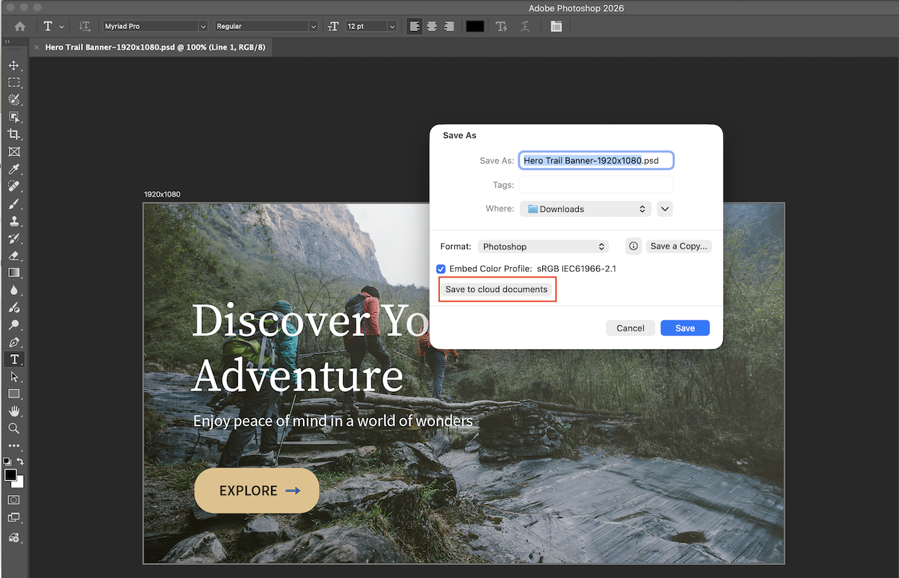
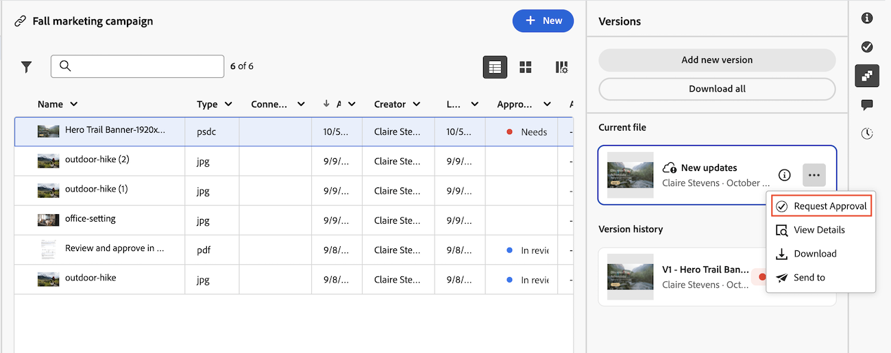

# Utilisation de documents Workfront dans les applications Creative Cloud

Une fois qu’un projet Workfront est disponible dans le panneau Projets Creative Cloud, vous pouvez travailler avec ses documents directement depuis Photoshop, Illustrator ou InDesign.

## Conditions préalables

* Votre organisation doit utiliser une version de Workfront prenant en charge l’espace de stockage dans le cloud Adobe.
* Workfront et Photoshop, Illustrator ou InDesign doivent être autorisés dans la même organisation Adobe Identity Management System (IMS).

## Conditions d’accès

+++ Développez pour afficher les exigences d’accès aux fonctionnalités de cet article.

<table style="table-layout:auto"> 
 <col> 
 <col> 
 <tbody> 
  <tr> 
   <td role="rowheader">Version d’Adobe Workfront</td> 
   <td>Workflow Ultimate, avec le stockage dans le cloud Adobe activé</td> 
  </tr> 
  <tr> 
   <td role="rowheader">Autorisations d’objet</td> 
   <td>
      
Afficher l’accès à un projet pour l’afficher dans le panneau Projets Creative Cloud

      
Modifier l’accès à un projet pour l’ajouter, le modifier ou le supprimer

   </td> 
  </tr> 
 </tbody> 
</table>

Pour plus d’informations, voir [Conditions d’accès requises dans la documentation Workfront](/help/quicksilver/administration-and-setup/add-users/access-levels-and-object-permissions/access-level-requirements-in-documentation.md).

+++

## Accès à un projet Workfront

La structure de dossiers Documents d’un projet Workfront est mise en miroir dans le panneau Projets . Lorsque vous ouvrez un document à partir d’un dossier de projet, que vous le modifiez et que vous l’enregistrez, vos modifications apparaissent dans Workfront.

>[!NOTE]
>
>Les projets de stockage Workfront hérités ne sont pas pris en charge dans les projets de stockage cloud Adobe uniquement du panneau Projets .

Pour accéder à un projet Workfront dans Photoshop, Illustrator ou InDesign :

1. Ouvrez Photoshop, Illustrator ou InDesign.
1. Dans le panneau **Projets** sur le côté gauche de l’application, sélectionnez le projet Workfront à ouvrir.

   

1. Ouvrez un document dans le projet pour le modifier. Une fois vos modifications enregistrées, elles sont automatiquement réenregistrées dans le projet Workfront.

>[!TIP]
>
>Pour modifier un type de fichier que Photoshop, Illustrator ou InDesign ne peut pas ouvrir, tel qu’un document Word ou Excel, utilisez plutôt Adobe Cloud Drive. Pour plus d’informations, consultez [Présentation d’Adobe Cloud Drive](/help/quicksilver/documents/adobe-cloud-drive/adobe-cloud-drive-overview.md).

## Enregistrer un nouveau document dans Workfront à partir d’une application Creative Cloud

Vous pouvez enregistrer un nouveau fichier dans Workfront ou une nouvelle copie d’un fichier existant dans Workfront à partir de Photoshop, Illustrator ou InDesign.

Pour enregistrer un nouveau document dans Workfront :

1. Ouvrez Photoshop, Illustrator ou InDesign et créez un fichier .
1. Si vous enregistrez un nouveau fichier, cliquez sur **Enregistrer** dans le menu supérieur.
Ou
Si vous enregistrez une nouvelle copie d’un fichier existant, cliquez sur **Enregistrer sous** dans le menu supérieur.
1. Dans la boîte de dialogue **Enregistrer sous**, sélectionnez **Enregistrer dans les documents cloud**, puis choisissez le projet Workfront dont vous avez besoin.

   >[!NOTE]
   >
   >Lors de l’enregistrement d’un document déjà dans le projet Workfront, la boîte de dialogue Enregistrer sous ne s’ouvre pas. Vous pouvez sélectionner un projet Workfront, l’enregistrer dans un autre dossier ou choisir un autre projet Workfront.

   

1. Choisissez un dossier de documents, puis cliquez sur **Enregistrer**. Si vous ne choisissez pas de dossier, le document est enregistré dans le dossier racine du projet.

   

## Demander l&#39;approbation d&#39;un document

Vous pouvez ajouter une approbation de document dans Workfront à tout document téléchargé à partir de Photoshop, Illustrator ou InDesign, ou à partir d’Adobe Cloud Drive, de la même manière que pour tout autre document. Pour plus d’informations, voir [Créer un processus d’approbation de document](/help/quicksilver/review-and-approve-work/document-reviews-and-approvals/manage-document-approvals/create-a-document-approval.md).

## Gestion des versions d’un document dans Workfront à partir d’une application Creative Cloud

Lorsque vous enregistrez un document à partir de Photoshop, Illustrator ou InDesign vers Workfront, les modifications que vous enregistrez apparaissent dans le fichier actuel sur l’onglet Versions et sont marquées d’un badge « Nouvelles modifications ».

Vous pouvez demander une approbation sur le fichier actuel plutôt que de charger une nouvelle version du document. Pour plus d&#39;informations, voir [Demander une approbation sur le fichier actuel](#request-approval-on-the-current-file).

### Demander l&#39;approbation sur le fichier actuel

Pour demander une approbation sur le fichier actuel d’un document dans Workfront :

1. Accédez au projet dans Workfront contenant le document sur lequel vous souhaitez demander une approbation.
1. Ouvrez le document et accédez à l’onglet **Versions**.
1. Dans le fichier actuel, cliquez sur le menu **Plus**, puis sur **Demander l&#39;approbation**.
1. Dans la boîte de dialogue **Demander l’approbation**, suivez les étapes de la section [Créer un workflow d’approbation de document](/help/quicksilver/review-and-approve-work/document-reviews-and-approvals/manage-document-approvals/create-a-document-approval.md) pour créer l’approbation.

   

