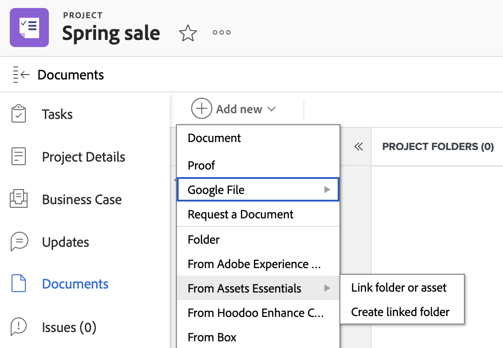

# Créer un dossier lié à Experience Manager Assets ou à Assets Essentials

Vous pouvez créer un dossier lié à Experience Manager Assets ou à Assets Essentials dans Workfront. Comme le dossier est lié, toute ressource ajoutée au dossier s’affichera automatiquement dans Workfront et Experience Manager. Vous n’avez pas à envoyer manuellement la ressource si elle se trouve dans un dossier lié.

Si une ressource est supprimée ou déplacée d’un dossier lié dans Experience Manager Assets ou Assets Essentials, Workfront conserve une copie de la ressource dans la zone Projet > Documents .

>[!NOTE]
>
>Cette fonctionnalité n’est pas disponible dans la zone des nouveaux documents. 
>Si votre entreprise utilise l’espace de stockage Adobe dans le cloud, la nouvelle zone Documents s’affiche lorsque vous accédez aux documents dans Workfront. À partir de là, vous pouvez ajouter des ressources provenant de Experience Manager Assets ou d’Assets Essentials, mais vous ne pourrez pas créer de dossier lié.

## Conditions d’accès

+++ Développez pour afficher les exigences d’accès aux fonctionnalités de cet article.

<table>
  <tr>
   <td><strong>Package </strong>
   </td>
   <td>Tous
   </td>
  </tr>
  <tr>
   <td><strong>Licences </strong>
   </td>
   <td>
   
Standard

   
Plan

   </td>
  </tr>
  <tr>
   <td><strong>Produits supplémentaires</strong>
   </td>
   <td>Vous devez disposer d’Experience Manager Assets as a Cloud Service ou d’Assets Essentials et faire l’objet d’un ajout au produit en tant qu’utilisateur ou utilisatrice.
   </td>
  </tr>
  <tr>
   <td><strong>Autorisations pour Experience Manager</strong>
   </td>
   <td>Vous devez disposer d’un accès en écriture au dossier de destination dans l’intégration d’Experience Manager.
   </td>
  </tr>
  <tr>
   <td><strong>Configurations du niveau d’accès</strong>
   </td>
   <td>Pour configurer une intégration d’Experience Manager, vous devez être un administrateur ou une administratrice de Workfront. Une fois configuré, les utilisateurs disposant d’une licence Standard ou Plan peuvent configurer des dossiers liés sur des projets individuels.
   </td>
  </tr>
</table>

Pour plus d’informations sur ce tableau, voir la section [Conditions d’accès requises dans la documentation Workfront](/help/quicksilver/administration-and-setup/add-users/access-levels-and-object-permissions/access-level-requirements-in-documentation.md).

+++

## Conditions préalables

Avant de commencer

* Votre administrateur ou administratrice Workfront doit configurer une intégration Experience Manager. Pour plus d’informations, consultez la section [Configurer l’intégration d’Experience Manager Assets as a Cloud Service](/help/quicksilver/administration-and-setup/configure-integrations/configure-aacs-integration.md) ou [Configurer l’intégration d’Experience Manager Assets Essentials](/help/quicksilver/documents/adobe-workfront-for-experience-manager-assets-essentials/setup-asset-essentials.md).

## Créer un dossier lié

Le dossier lié est créé à l’emplacement spécifié par l’administration de Workfront lors de la configuration de l’intégration. Chaque intégration ne peut avoir qu’un seul emplacement de dossier pour les dossiers liés.

Le nom du dossier lié est automatiquement créé en fonction du portfolio, du programme, du projet auquel il est associé et ne peut pas être modifié. Si le projet n’est associé à aucun portfolio ou programme, le dossier lié affiche le nom du projet et sa date de création.

>[!NOTE]
>
>Vous ne pouvez pas créer de version de document ou d’épreuve dans un dossier lié.

Pour créer un dossier lié, procédez comme suit :

1. Accédez au projet dans lequel vous souhaitez placer le dossier.
1. Sélectionner **Ajouter nouveau**, puis accédez à l’intégration d’Experience Manager configurée par votre administrateur ou administratrice.

   >[!NOTE]
   >
   >L’administration de Workfront peut choisir le nom de cette intégration. Il se peut donc qu’il ne fasse pas référence de manière explicite à Experience Manager Assets ou Assets Essentials.

1. Sélectionnez **Créer un dossier lié**. Le système crée automatiquement un dossier dans Experience Manager en fonction de l’emplacement spécifié lors de la configuration de l’intégration.
   
