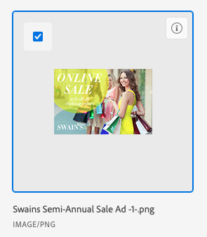

# Lier des ressources et des dossiers à partir d’Experience Manager Assets ou d’Assets Essentials

Vous pouvez lier une ressource ou un dossier provenant d’Experience Manager Assets ou d’Assets Essentials à n’importe quel objet Adobe Workfront prenant en charge les documents. Les ressources envoyées à partir d’Assets Essentials ne sont pas prises en compte dans le stockage global de documents de Workfront. Les documents chargés et envoyés de Workfront à Assets Essentials sont bien pris en compte dans le stockage global.

Les champs de métadonnées sont mappés pour la première fois lorsque vous envoyez une ressource de Workfront vers Experience Manager Assets ou Assets Essentials. Si votre équipe d’administration Workfront a activé la synchronisation des métadonnées d’objet, les champs restent à jour s’ils sont modifiés dans l’une ou l’autre des applications.

## Conditions d’accès

+++ Développez pour afficher les exigences d’accès aux fonctionnalités de cet article.

<table style="table-layout:auto"> 
 <col> 
 <col> 
 <tbody> 
  <tr> 
   <td role="rowheader">Package Adobe Workfront</td> 
   <td> 
 Tous
 </td> 
  </tr> 
  <tr> 
   <td role="rowheader">Licences Adobe Workfront</td> 
   <td> 
   
Contributeur ou version ultérieure
 
   
Requête ou supérieure
 </td> 
  </tr> 
  <tr> 
   <td role="rowheader">Produits supplémentaires</td> 
   <td>Vous devez disposer d’Experience Manager as a Cloud Service ou d’Assets Essentials, et quelqu’un doit vous ajouter au produit en tant qu’utilisateur ou utilisatrice dans l’Admin Console.</td> 
  </tr> 
   <tr> 
    <td role="rowheader">Autorisations Experience Manager</td> 
    <td>Vous devez disposer d’un accès en écriture au dossier.</td> 
   </tr>
  <tr> 
   <td role="rowheader">Configurations des niveaux d’accès</td> 
   <td> 
Accès en modification aux documents
 </td> 
  </tr> 
  <tr> 
   <td role="rowheader">Autorisations d’objet</td> 
   <td> 
Afficher accès ou version ultérieure
 </td> 
  </tr> 
 </tbody> 
</table>

Pour plus d’informations sur le contenu de ce tableau, voir [Conditions d’accès requises dans la documentation Workfront](/help/quicksilver/administration-and-setup/add-users/access-levels-and-object-permissions/access-level-requirements-in-documentation.md).

+++

## Conditions préalables

Avant de commencer

* Votre administrateur ou administratrice Workfront doit configurer une intégration Experience Manager. Pour plus d’informations, voir [Configurer l’intégration Experience Manager Assets as a Cloud Service](/help/quicksilver/administration-and-setup/configure-integrations/configure-aacs-integration.md) ou [Configurer l’intégration Experience Manager Assets Essentials](/help/quicksilver/documents/adobe-workfront-for-experience-manager-assets-essentials/setup-asset-essentials.md).

## Lier une ressource à partir d’Experience Manager Assets ou d’Assets Essentials

Vous pouvez lier une ressource provenant d’Experience Manager Assets ou d’Assets Essentials à Workfront. Une fois la ressource liée, vous pouvez

* [Vérifier une ressource liée pour Experience Manager Assets ou Assets Essentials](../../documents/adobe-workfront-for-experience-manager-assets-essentials/proof-linked-asset-aem.md)
* [Charger une nouvelle version d’un document](../../documents/managing-documents/upload-new-document-version.md)

1. Accédez à la zone **Documents** dans Workfront, dans laquelle vous souhaitez ajouter le document.
1. Sélectionnez **Ajouter**, puis choisissez l’intégration d’Experience Manager que votre administrateur ou administratrice a configurée.

   >[!NOTE]
   >
   >L’équipe d’administration de Workfront peut choisir n’importe quel nom pour cette intégration, qui peut donc ne pas contenir spécifiquement les mentions Assets ou Assets Essentials.

1. Sélectionnez les ressources de votre choix.

   

1. Cliquez sur **Sélectionner**.

## Lier un dossier à partir d’Experience Manager Assets ou d’Assets Essentials

Les autorisations d’affichage de ressources individuelles dans un dossier dépendent des autorisations Experience Manager Assets ou Assets Essentials.

1. Accédez à la zone **Documents** dans Workfront, dans laquelle vous souhaitez placer le dossier.
1. Sélectionnez **Ajouter**, puis choisissez l’intégration d’Experience Manager que votre administrateur ou administratrice a configurée.

   >[!NOTE]
   >
   >L’administrateur ou l’administratrice de Workfront peut choisir n’importe quel nom pour cette intégration. Il peut donc ne pas mentionner spécifiquement Assets ou Assets Essentials.

1. Sélectionnez les dossiers de votre choix.

   

1. Cliquez sur **Sélectionner**.

## Lier une nouvelle version à partir d’Experience Manager Assets ou d’Assets Essentials

Vous pouvez extraire une nouvelle ressource d’Assets Essentials et l’ajouter à une ressource existante en tant que nouvelle version. Si le document est déjà lié et qu’une nouvelle version est ajoutée dans Assets Essentials, la nouvelle version apparaît automatiquement dans Workfront.

Pour lier une nouvelle version depuis Assets Essentials :

1. Accédez à la zone **Documents** dans Workfront, dans laquelle vous souhaitez ajouter le document.
1. Sélectionnez la ressource à remplacer par une nouvelle version. Vous ne pouvez pas créer de version d’une ressource dans un dossier lié.
1. Sélectionnez **Ajouter** > **Version**, puis sélectionnez l’intégration d’Experience Manager que votre administrateur ou administratrice a configurée.

   >[!NOTE]
   >
   >L’administrateur ou l’administratrice de Workfront peut choisir n’importe quel nom pour cette intégration. Il peut donc ne pas mentionner spécifiquement Assets ou Assets Essentials.

1. Sélectionnez la ressource de votre choix.

   

1. Cliquez sur **Sélectionner**.

>[!TIP]
>
>Vous pouvez afficher toutes les versions d’une ressource en accédant à **Détails du document** > **Versions**.
