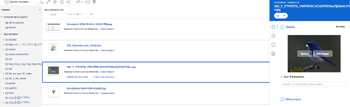

# Afficher ou télécharger une ressource liée à partir d’Experience Manager Assets ou d’Assets Essentials

Vous pouvez afficher ou télécharger dans Adobe Workfront une ressource liée à partir d’Experience Manager Assets ou d’Assets Essentials.

## Conditions d’accès

+++ Développez pour afficher les exigences d’accès aux fonctionnalités de cet article.

<table style="table-layout:auto"> 
 <col> 
 <col> 
 <tbody> 
  <tr> 
   <td role="rowheader">Package Adobe Workfront</td> 
   <td> 
 Tous
 </td> 
  </tr> 
  <tr> 
   <td role="rowheader">Licences Adobe Workfront</td> 
   <td>
   
Contributeur ou version ultérieure

   
Requête ou supérieure
 </td> 
  </tr> 
  <tr> 
   <td role="rowheader">Produits supplémentaires</td> 
   <td>Vous devez disposer d’Experience Manager as a Cloud Service ou d’Assets Essentials, et quelqu’un doit vous ajouter au produit en tant qu’utilisateur ou utilisatrice dans l’Admin Console.</td> 
  </tr> 
  <tr> 
   <td role="rowheader">Configurations des niveaux d’accès</td> 
   <td> 
Accès en modification aux documents
  </td> 
  </tr> 
  <tr> 
   <td role="rowheader">Autorisations d’objet</td> 
   <td> 
Afficher accès ou version ultérieure
 </td> 
  </tr> 
 </tbody> 
</table>

Pour plus d’informations sur le contenu de ce tableau, voir [Conditions d’accès requises dans la documentation Workfront](/help/quicksilver/administration-and-setup/add-users/access-levels-and-object-permissions/access-level-requirements-in-documentation.md).

+++

## Conditions préalables

Avant de commencer

* Votre administrateur ou administratrice Workfront doit configurer une intégration Experience Manager. Pour plus d’informations, voir [Configurer l’intégration Experience Manager Assets as a Cloud Service](/help/quicksilver/administration-and-setup/configure-integrations/configure-aacs-integration.md) ou [Configurer l’intégration Experience Manager Assets Essentials](/help/quicksilver/documents/adobe-workfront-for-experience-manager-assets-essentials/setup-asset-essentials.md).

## Afficher ou télécharger une ressource liée

1. Recherchez le document que vous souhaitez afficher ou télécharger.
1. Dans la liste des documents, sélectionnez le document.
1. Dans le résumé du document à droite, pointez sur la miniature en haut de l’écran et choisissez **Aperçu** ou **Télécharger**.

   
