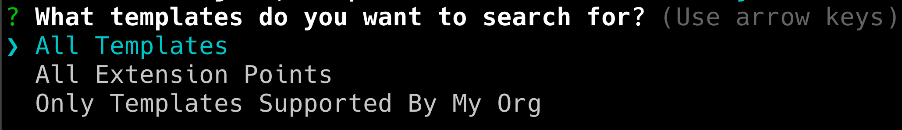
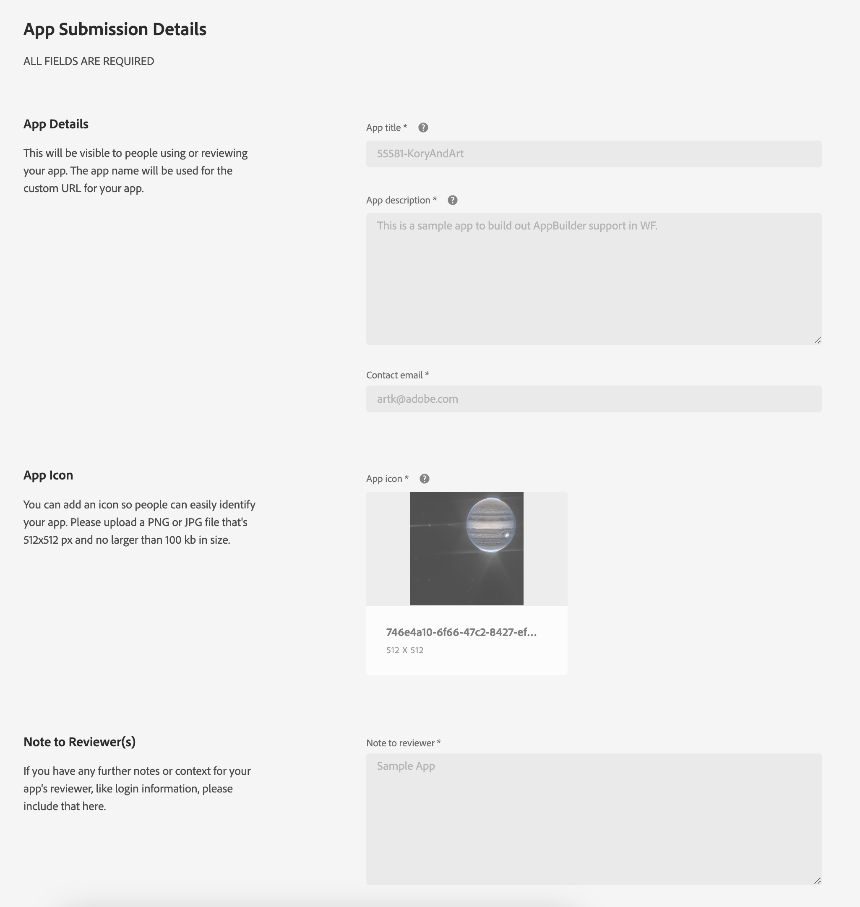

# AppBuilder dans les détails du document Workfront

Vous pouvez installer AppBuilder dans Détails du document.

## Conditions préalables

Vous devez disposer des éléments suivants :

* un compte Workfront activé par IMS ;
* Une machine de développement avec le noeud v18 et npm

## Ajout de développeurs à la console d’administration

>[!IMPORTANT]
>
>Assurez-vous d’avoir sélectionné l’organisation IMS appropriée pour toutes les étapes suivantes. Si vous appartenez à plusieurs organisations, il est possible de sélectionner la mauvaise. Assurez-vous que vous agissez sous la bonne organisation, qui est généralement répertoriée dans le coin supérieur droit.


1. Accédez à l’une des options suivantes :

* Stage : [https://stage.adminconsole.adobe.com/](https://stage.adminconsole.adobe.com/)
* Prod : [https://adminconsole.adobe.com/](https://adminconsole.adobe.com/)

1. Dans la section Utilisateurs , cliquez sur **Développeurs** > **Ajouter des développeurs**.

   

   >[!NOTE]
   >
   >Si vous ne voyez pas d’option pour gérer les développeurs, vous ne disposez pas d’un produit qui autorise l’accès des développeurs. Workfront ne fournit pas l’accès développeur, mais AEM le fait. Si vous ne voyez pas cela, nous devrons trouver comment inclure Workfront dans la liste des applications qui permet aux développeurs.

1. Ajoutez l’adresse électronique de l’utilisateur. Il doit rechercher les utilisateurs existants qui ont déjà été ajoutés depuis la console d’administration.

1. Ajoutez les produits nécessaires au profil du développeur, puis cliquez sur **Enregistrer**.


## Accès à AppBuilder

Les entreprises doivent collaborer avec leurs gestionnaires de compte pour acheter AppBuilder. Le processus exact pour cela n&#39;est pas compris parce que nous n&#39;avions pas besoin de le faire pour le bureau de vote.

Si vous souhaitez tester l’intégration d’AppBuilder, vous pouvez demander un essai gratuit pour votre organisation IMS ici :
[https://developer.adobe.com/app-builder/trial/#](https://developer.adobe.com/app-builder/trial/#)

J&#39;ai l&#39;impression que même s&#39;il s&#39;agit d&#39;un essai gratuit de 30 jours, ils ne vont pas désactiver le test après ce moment.

Si AppBuilder est correctement configuré, &quot;Créer un projet à partir d’un modèle&quot; doit s’afficher dans le cadre de la création d’un projet (qui est traitée dans la section suivante).

## Créer un projet dans la console de développement

1. Cliquez sur **Créer un projet à partir d’un modèle**.

   >[!IMPORTANT]
   >
   >Si cette option ne s’affiche pas, vous êtes mal configuré dans la console d’administration et n’avez pas accès au catalogue du créateur d’applications. Cette option s’affiche uniquement lorsque vous avez accès à AppBuilder.

   

1. Sélectionner **App Builder**.

1. Saisissez un **Titre du projet** et **Nom de l’application**. Toutes deux comportent des valeurs par défaut, mais il sera plus facile d’identifier le projet que vous souhaiterez ultérieurement si vous personnalisez la valeur.

   >[!NOTE]
   >
   >Il existe une option pour ajouter des espaces de travail supplémentaires à cette étape. Il nous a été suggéré de créer un espace de travail pour chaque développeur. Cela permet de séparer les secrets et les déploiements les uns des autres au fur et à mesure que les appareils fonctionnent. Vous devez nommer l’espace de travail par le nom du développeur qui l’utilise. L’interface de ligne de commande AIO contient des options pour changer l’espace de travail, que nous aborderons ultérieurement.


1. Laisser **Inclure l’exécution** sélectionné. Je ne sais pas pourquoi, vraiment, mais ne le change pas !

1. Cliquer sur **Enregistrer**.

## Interface de ligne de commande d’Adobe IO (aio)

Adobe fournit une interface de ligne de commande Open Source qui peut être utilisée pour créer des applications App Builder. La documentation se trouve ici : [https://github.com/adobe/aio-cli](https://github.com/adobe/aio-cli) ainsi que les instructions du créateur d’applications Adobe [https://developer.adobe.com/app-builder/docs/getting_started/first_app/](https://developer.adobe.com/app-builder/docs/getting_started/first_app/).

1. Installation
   1. Pour installer l’outil (assurez-vous d’abord que vous vous trouvez sur le noeud v18), exécutez : `npm install -g @adobe/aio-cli `.

1. Authentification dans le terminal
   1. Lancez votre terminal et connectez-vous à AIO à l’aide de la commande : `aio login`.

1. Initialisation de l’application
   1. Commencez à configurer votre application en exécutant : `aio app init example-app`.

1. Sélection de configuration
   1. Passez à la sélection de votre organisation et de votre projet parmi les options fournies.\
      
      

1. Sélection et configuration de modèles
   1. Parcourez tous les modèles disponibles et sélectionnez l’option **@adobe/aem-cf-editor-ui-ext-tpl** modèle pour votre projet.
      
      

1. Définition de votre extension
   1. Nommez votre extension.
   1. Fournissez un résumé descriptif des fonctionnalités de votre extension.
   1. Sélectionnez un numéro de version initial avec lequel commencer.
   1. Confirmez la fin en sélectionnant **J&#39;ai fini.**.
      

1. Accès à votre dossier de projet
   1. Accéder au dossier src
   1. Renommer le dossier `aem-cf-editor-1` to `workfront-doc-details-1`.

1. Modification des fichiers de configuration
   1. Ouvrez app.config.yaml.
   1. Mettre à jour la ligne à partir de `aem/cf-editor/1` to `workfront/doc-details/1`.
   1. Ajuster le chemin d’accès d’inclusion à partir de `src/aem-cf-editor-1/ext.config.yaml` to `src/workfront-doc-details-1/ext.config.yaml`.

1. Modification du composant d’enregistrement d’extension
   1. Ouvrir `src/workfront-doc-details-1/web-src/src/components/ExtensionRegistration.js`.
   1. Dans la section Méthodes , ajoutez une fonction `secondaryNav` contenant une fonction asynchrone `getButtons`.
   1. `getButtons` doit recevoir un objet avec la structure suivante :

      ```
          {
          docId: "String",  // Document ID
          docvId: "String", // Document version ID
          sharedContext: {
              hostname: "String",
              protocol: "String",
              auth: {
              imsOrgID: "String",    // Customer's IMS Org ID
              imsToken: "String",    // User's IMS token
              imsClientId: "String"
              }
          }
          }
      ```

1. Cette fonction renvoie un tableau d’objets de bouton qui apparaîtra dans la navigation :

   ```
       methods: {
       secondaryNav: {
           async getButtons({docId, docvId, sharedContext}) {
           return [
               { label: 'Registration', url: '/index.html' },
               { label: 'Review', url: '/index.html#review' }
           ];
           }
       }
       }
   ```

1. Configuration du routage d’application
   1. Ouvrez votre fichier App.js et configurez les itinéraires pour inclure les nouvelles fonctionnalités développées. Vous devez configurer des itinéraires pour la vue par défaut et pour les vues supplémentaires telles que la page de révision. Voici comment vous pouvez définir ces itinéraires :

      ```
          <Route index element={<ExtensionRegistration />} />
          <Route exact path="index.html" element={<ExtensionRegistration />} />
          <Route exact path="review" element={<Review />} />
      ```

1. Accès aux détails du document
   1. Mise en oeuvre de la fonction fournie `document.getDocumentDetails` dans votre application pour récupérer les détails essentiels du document. Cette fonction récupère un objet contenant `docId` et `docvId`, à côté d’un `sharedContext` avec `hostname`, `protocol`et les détails de l’authentification. Assurez-vous que votre application gère correctement ces données.

1. Intégration de la récupération de données dans vos composants
   1. Ajoutez un nouveau composant au dossier de composants de votre application. Au sein de ce composant, établissez une connexion à Workfront pour récupérer des informations de document et des données d’authentification à l’aide de la connexion établie avec l’application hôte. Voici un exemple de la manière dont vous pouvez structurer votre composant pour gérer ceci :

      ```
          import { useEffect, useState } from 'react';
          import { attach } from "@adobe/uix-guest";
          import { extensionId } from "./Constants";
      
          function Review() {
              const [conn, setConn] = useState();
      
              useEffect(() => {
              const iife = async () => {
                  // "attach" the guest application to the host. This creates a "tunnel" from the host app that allows data to be passed to the iframe running this app.
                  const connection = await attach({
                  id: extensionId,
                  });
                  setConn(connection);
              };
      
              iife();
              }, []);
      
              useEffect(() => {
                  if (conn) {
                      // Using the connection created above, grab the document details from the host tunnel.
                      conn?.host?.document?.getDocumentDetails().then(setDocDetails);
                      // Pull the auth tokens from the sharedContext (see host app for details)
                      setAuth(conn?.sharedContext?.get("auth"));
                      setHostname(conn?.sharedContext?.get("hostname"));
                      setProtocol(conn?.sharedContext?.get("protocol"));
                  }
              }, [conn]);
      
          return (<>Text</>);
          }
      
          export default Review;
      ```

## Configuration des projets AIO existants

1. Mise à jour des fichiers de configuration
   1. Ouvrir `app.config.yaml`.
   1. Modifiez la configuration en mettant à jour la référence à partir de `aem/cf-editor/1` to `workfront/doc-details/1`. Cet ajustement aligne les chemins d’accès aux fichiers sur la structure actuelle du projet.

1. Modification du composant d’enregistrement d’extension
   1. Recherchez et ouvrez le fichier nommé `ExtensionRegistration.js`.
   1. Dans la section Méthodes , ajoutez une fonction `secondaryNav` contenant une fonction asynchrone `getButtons`.
   1. `getButtons` doit recevoir un objet avec la structure suivante :

      ```
          {
          docId: "String",  // Document ID
          docvId: "String", // Document version ID
          sharedContext: {
              hostname: "String",
              protocol: "String",
              auth: {
              imsOrgID: "String",    // Customer's IMS Org ID
              imsToken: "String",    // User's IMS token
              imsClientId: "String"
              }
          }
          }
      ```

1. Cette fonction renvoie un tableau d’objets de bouton qui apparaîtra dans la navigation :

   ```
       methods: {
       secondaryNav: {
           async getButtons({docId, docvId, sharedContext}) {
           return [
               { label: 'Registration', url: '/index.html' },
               { label: 'Review', url: '/index.html#review' }
           ];
           }
       }
       }
   ```

1. Configuration du routage d’application
   1. Ouvrez votre `App.js`et configurez les itinéraires pour inclure les nouvelles fonctionnalités développées. Vous devez configurer des itinéraires pour la vue par défaut et pour les vues supplémentaires telles que la page de révision. Voici comment vous pouvez définir ces itinéraires :

      ```
          <Route index element={<ExtensionRegistration />} />
          <Route exact path="index.html" element={<ExtensionRegistration />} />
          <Route exact path="review" element={<Review />} />
      ```

1. Accès aux détails du document
   1. Mise en oeuvre de la fonction fournie `document.getDocumentDetails` dans votre application pour récupérer les détails essentiels du document. Cette fonction récupère un objet contenant `docId` et `docvId`, à côté d’un `sharedContext` avec `hostname`, `protocol`et les détails de l’authentification. Assurez-vous que votre application gère correctement ces données.

1. Intégration de la récupération de données dans vos composants
   1. Ajoutez un nouveau composant au dossier de composants de votre application. Au sein de ce composant, établissez une connexion à Workfront pour récupérer des informations de document et des données d’authentification à l’aide de la connexion établie avec l’application hôte. Voici un exemple de la manière dont vous pouvez structurer votre composant pour gérer ceci :

      ```
          import { useEffect, useState } from 'react';
          import { attach } from "@adobe/uix-guest";
          import { extensionId } from "./Constants";
      
          function Review() {
              const [conn, setConn] = useState();
      
              useEffect(() => {
              const iife = async () => {
                  // "attach" the guest application to the host. This creates a "tunnel" from the host app that allows data to be passed to the iframe running this app.
                  const connection = await attach({
                  id: extensionId,
                  });
                  setConn(connection);
              };
      
              iife();
              }, []);
      
              useEffect(() => {
                  if (conn) {
                      // Using the connection created above, grab the document details from the host tunnel.
                      conn?.host?.document?.getDocumentDetails().then(setDocDetails);
                      // Pull the auth tokens from the sharedContext (see host app for details)
                      setAuth(conn?.sharedContext?.get("auth"));
                      setHostname(conn?.sharedContext?.get("hostname"));
                      setProtocol(conn?.sharedContext?.get("protocol"));
                  }
              }, [conn]);
      
          return (<>Text</>);
          }
      
          export default Review;
      ```

## Publication d’applications

>[!IMPORTANT]
>
>Assurez-vous que l’organisation IMS appropriée est sélectionnée pour chacune des étapes suivantes.

Pour qu’une application invité soit chargée dans Workfront, la demande doit être envoyée à l’espace de travail Production et soumise à validation.

1. Déployer l’application dans l’espace de travail de production
   1. `aio app use -w Production `
   1. `aio app deploy `

1. Accédez à [https://developer-stage.adobe.com/](https://developer-stage.adobe.com/) ou [https://developer.adobe.com/](https://developer.adobe.com/).
   1. Cliquez sur **Console** dans le coin supérieur droit.

1. Recherchez le projet utilisé pour créer l’application AppBuilder.

1. Sélectionnez l’espace de travail de production.
   

1. Envoyez la demande pour révision privée (vous recevrez des avertissements indiquant que nous ne publions pas sur le marketplace de l’exchange de l’application, ce qui est acceptable).

1. Remplissez le formulaire (titre, description, icône et note au réviseur).
   

>[!IMPORTANT]
>
>Une fois envoyé, un administrateur système de l’organisation doit approuver l’envoi.

## Approuver l’envoi

1. En tant qu’administrateur système, accédez à [https://stage.exchange.adobe.com/](https://stage.exchange.adobe.com/) ou [https://exchange.adobe.com/](https://exchange.adobe.com/).

1. Cliquez sur **Gérer** > **Applications Experience Cloud**. Vous devriez voir les applications envoyées avec des options d’approbation/de rejet.
Une fois approuvées, les extensions d’application publiées doivent se charger automatiquement dans votre environnement Workfront.

   

## Aide supplémentaire

Adobe contient une excellente documentation sur la prise en main de la création d’applications pour AppBuilder et leur déploiement. Voici quelques liens utiles :

* [https://developer.adobe.com/app-builder/docs/getting_started/first_app/#4-bootstrapping-new-app-using-the-cli](https://developer.adobe.com/app-builder/docs/getting_started/first_app/#4-bootstrapping-new-app-using-the-cli)

* [https://developer.adobe.com/uix/docs/guides/publication/](https://developer.adobe.com/uix/docs/guides/publication/)

* [https://developer.adobe.com/uix/docs/services/aem-cf-console-admin/extension-development/](https://developer.adobe.com/uix/docs/services/aem-cf-console-admin/extension-development/)

