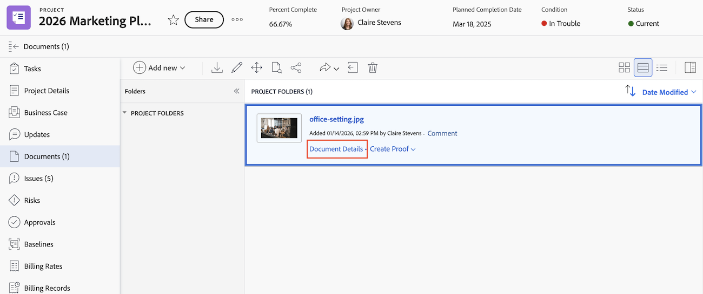

# Vue d’ensemble des détails du document

{{highlighted-preview}}

La page Détails du document vous permet d’afficher, de communiquer et de gérer les propriétés d’un document joint à un objet Adobe Workfront.

## Zone des documents hérités

Si votre organisation utilise un stockage Workfront hérité, la zone des documents hérités s’affiche lorsque vous accédez aux documents dans Workfront. Pour plus d’informations sur le stockage Workfront hérité, voir [Différences entre le stockage Workfront hérité et le stockage dans le cloud Adobe](/help/quicksilver/review-and-approve-work/esm-overview.md).

### Effectuer des actions de base pour les documents et les épreuves

Vous pouvez effectuer les actions suivantes pour les documents et les épreuves à partir de la page Détails du document :

* Créer une épreuve simple ou avancée
* Créer une version
* Prendre une décision d’approbation
* Prévisualiser un document
* Modifier la description du document
* Archiver ou extraire un document

En outre, vous pouvez utiliser l’icône Plus  en regard du nom du document pour effectuer les actions suivantes :

* Partager
* Déplacer
* Supprimer
* Téléchargement
* Envoyer

### Effectuer des actions spécifiques aux épreuves

Si vous vous trouvez sur le workflow du BAT, vous pouvez effectuer les actions suivantes à partir de la page Détails du document :

* Voir les détails de l’envoi, de l’ouverture, des commentaires et de la décision (SOCD)
* Ouvrir une épreuve
* Ouvrir le résumé de l’impression
* Verrouiller ou déverrouiller une épreuve
* Modifier les champs personnalisés de relecture

  Les champs personnalisés de relecture doivent être configurés dans Workfront Proof. Pour plus d’informations, voir [Créer et gérer des champs personnalisés dans Workfront Proof](../../workfront-proof/wp-acct-admin/account-settings/create-and-manage-custom-fields.md).

### Ouvrez la page Détails du document dans la zone des documents hérités

{{step1-to-documents}}

1. Pointez sur le document, puis cliquez sur **Détails du document**.

   

## Zone Nouveaux documents

Si votre entreprise utilise l’espace de stockage Adobe dans le cloud, la nouvelle zone Documents s’affiche lorsque vous accédez aux documents dans Workfront. Pour plus d’informations sur l’espace de stockage dans le cloud Adobe, consultez [Présentation de l’espace de stockage dans le cloud Adobe](/help/quicksilver/review-and-approve-work/esm-overview.md).

Vous pouvez effectuer les actions suivantes pour les documents à partir de la page Détails du document :

<table style="border: none; width: 80%; margin: 0 auto;">
<tr style="border: none;">
<td style="border: none; width: 50%; padding-right: 20px;">
<ul>
<li>Ouvrez dans Frame.io.  Vous devez disposer d'une licence d'entreprise Frame.io pour utiliser cette fonctionnalité.</li>
<li>Supprimer un document</li>
<li>Modification d’un document</li>
</ul>
</td>
<td style="border: none; width: 50%; padding-left: 20px;">
<ul>
<li>Déplacer un document</li>
<li>Envoyer un document à Experience Manager Access</li>
<li>Partager un document</li>
</ul>
</td>
</tr>
</table>

### Ouvrez le panneau Détails du document dans la nouvelle zone Documents

1. Accédez au projet, à la tâche ou à l’événement contenant le document, puis sélectionnez **Documents** dans le panneau de gauche.
1. Sélectionnez le document, puis cliquez sur **Afficher les détails** dans la barre latérale gauche.

   

### Afficher le résumé d’impression dans la zone des nouveaux Documents

Une fois qu’un document a été approuvé, vous pouvez ouvrir la page Imprimer les commentaires Frame.io pour afficher l’aperçu de la ressource, les commentaires et les décisions d’approbation dans un format imprimable.

1. Accédez au projet, à la tâche ou à l’événement contenant le document, puis sélectionnez **Documents** dans le panneau de gauche.
1. Sélectionnez le document, puis cliquez sur **Afficher les détails** dans la barre latérale gauche.

   

1. Dans la section **Aperçu**, cliquez sur **Ouvrir le résumé d’impression**.

>[!NOTE]
>
>Le lien Imprimer le résumé ne s’affiche qu’après l’ajout d’une approbation au document.

