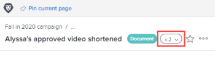
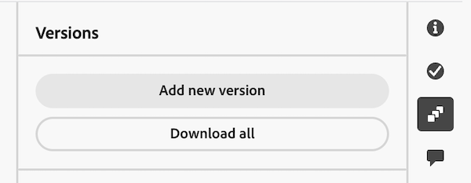

# Gérer les versions de documents

<!-- Audited: 5/2025 -->

{{highlighted-preview}}

Vous pouvez gérer plusieurs versions d’un document dans Workfront.

## Conditions d’accès

+++ Développez pour afficher les exigences d’accès aux fonctionnalités de cet article.

<table style="table-layout:auto"> 
 <col> 
 <col> 
 <tbody> 
  <tr> 
   <td role="rowheader">Package Adobe Workfront</td> 
   <td> 
Tout package Workfront pour gérer les documents à l’aide du stockage Workfront hérité

Tout package de workflow pour gérer les documents à l’aide de l’espace de stockage dans le cloud Adobe
</td> 
  </tr> 
  <tr> 
   <td role="rowheader">Licences Adobe Workfront</td> 
   <td> 
   
Contributeur ou supérieur

   
Requête ou supérieure 

   </td> 
  </tr> 
  <tr> 
   <td role="rowheader">Configurations des niveaux d’accès</td> 
   <td> 
Afficher l’accès aux documents
 </td> 
  </tr> 
  <tr> 
   <td role="rowheader">Autorisations d’objet</td> 
   <td> 
Accès en affichage au document
</td> 
  </tr> 
 </tbody> 
</table>

Pour plus de détails sur les informations contenues dans ce tableau, consultez [Conditions d’accès préalables dans la documentation Workfront](/help/quicksilver/administration-and-setup/add-users/access-levels-and-object-permissions/access-level-requirements-in-documentation.md).

+++

## Conditions préalables

* Cet article part du principe que le document a plusieurs versions.

  Si vous avez besoin d’informations sur le chargement de nouvelles versions d’un document dans Workfront, consultez la section [Charger une nouvelle version d’un document](../../documents/managing-documents/upload-new-document-version.md).

## Gestion des versions de document dans la zone des documents hérités

### Afficher une liste de toutes les versions d’un document

{{step1-to-documents}}

1. Sur la page **Documents**, sélectionnez un document dans la liste.

1. Dans le coin supérieur droit de la page, cliquez sur l’icône **Ouvrir le résumé** . Le panneau latéral **Résumé du document** s’ouvre.

1. Faites défiler l’écran jusqu’à la section **Versions** pour afficher toutes les versions du document.

### Afficher et gérer les détails d’une version antérieure d’un document

{{step1-to-documents}}

1. Pointez sur le document, puis cliquez sur **Détails du document**.

1. En haut de la page **Détails du document**, cliquez sur le menu déroulant en regard du nom, puis cliquez sur le nom de la version que vous souhaitez afficher et gérer.

   

   En plus d’afficher les détails de la version, vous pouvez y apporter des modifications, comme son nom, ses métadonnées et ses paramètres de relecture (s’il s’agit d’une épreuve de document).

### Télécharger une seule version du document

{{step1-to-documents}}

1. Sur la page **Documents**, sélectionnez un document dans la liste.

1. Dans le coin supérieur droit de la page, cliquez sur l’icône **Ouvrir le résumé** . Le panneau latéral **Résumé du document** s’ouvre.

1. Dans la section **Versions**, cliquez sur le menu **Plus**  à droite de la version, puis cliquez sur **Télécharger** dans la liste déroulante qui s’affiche.

   

### Télécharger toutes les versions d’un document

{{step1-to-documents}}

1. Sur la page **Documents**, sélectionnez un document dans la liste.

1. Dans le coin supérieur droit de la page, cliquez sur l’icône **Ouvrir le résumé** . Le panneau latéral **Résumé du document** s’ouvre.

1. Faites défiler l’écran jusqu’à la section **Versions**, puis cliquez sur **Tout télécharger**.

### Supprimer une version du document

Si vous chargez une version d’un document par erreur, ou si une version n’est plus nécessaire, vous pouvez supprimer la version et conserver le document original.

>[!IMPORTANT]
>
>Vous ne pouvez pas récupérer une version du document que vous avez supprimée séparément.

Gardez les points suivants à l’esprit lorsque vous envisagez de supprimer une version du document :

* Une seule version peut être supprimée à la fois. Si une version est supprimée, cette action apparaît dans la section Mises à jour du document.
* Si vous chargez une nouvelle version après en avoir supprimé une, la nouvelle version reçoit le numéro séquentiel suivant. Par exemple, s’il existe trois versions d’un document et que vous supprimez la troisième version, le prochain document chargé sera la version 4.
* Les mises à jour du système et les commentaires faits sur une version sont conservés dans Workfront après la suppression de la version.

  <!--
  <li data-mc-conditions="QuicksilverOrClassic.Draft mode">Deleting a document version in Workfront does not delete the Proof version.&nbsp;</li>
  -->

Pour supprimer une version du document, procédez comme suit :

{{step1-to-documents}}

1. Sur la page **Documents**, sélectionnez le document dans la liste.

1. Dans le coin supérieur droit de la page, cliquez sur l’icône **Ouvrir le résumé** . Le panneau latéral **Résumé du document** s’ouvre.

1. Faites défiler l’écran jusqu’à la section **Versions** pour afficher toutes les versions du document.
1. Dans la section **Versions**, cliquez sur le menu **Plus**  à droite de la version, puis cliquez sur **Supprimer** dans la liste déroulante qui s’affiche.

   >[!NOTE]
   >
   >* L’option **Supprimer** n’est visible que s’il existe au moins 2 versions.
   >* Si le document est lié à une source extérieure, ce lien est supprimé et le document n’est plus accessible via Workfront.

   

## Gérer les versions de documents dans la nouvelle zone Documents de l&#39;aperçu

Si votre entreprise utilise l’espace de stockage Adobe dans le cloud, la nouvelle zone Documents s’affiche lorsque vous accédez aux documents dans Workfront. Pour plus d’informations sur l’espace de stockage dans le cloud Adobe, consultez [Présentation de l’espace de stockage dans le cloud Adobe](/help/quicksilver/review-and-approve-work/esm-overview.md).

Workfront numérote chaque version dans l’ordre dans lequel vous la chargez (par exemple, V1, V2, V3) pour correspondre aux numéros de version dans Frame.io.

### Afficher une liste de toutes les versions d’un document

{{step1-to-documents}}

1. Sur la page **Documents**, sélectionnez un document dans la liste.

1. Cliquez sur l’icône **Versions**  sur le côté droit de la page. Le panneau Versions s’ouvre et répertorie chaque version du document sous Historique des versions.

   >[!NOTE]
   >
   >Si une version comporte un workflow d’approbation, son statut, tel que « Approuvé » ou « Retiré », s’affiche en regard de celle-ci. Les versions sans workflow d’approbation n’affichent pas de statut.

### Demander l’approbation d’une version

{{step1-to-documents}}

1. Sur la page **Documents**, sélectionnez un document dans la liste.
1. Cliquez sur l’icône **Versions**  sur le côté droit de la page.
1. Cliquez sur le menu **Plus** en regard de la version, puis cliquez sur **Demander l’approbation**.
1. Configurez le workflow de validation. Pour plus d’informations, voir [Créer un processus d’approbation de document](/help/quicksilver/review-and-approve-work/document-reviews-and-approvals/manage-document-approvals/create-a-document-approval.md).

   >[!NOTE]
   >
   >Si une version précédente possède déjà un workflow d’approbation ouvert, demander l’approbation de cette version la retire. La version précédente conserve son numéro de version et son historique d’approbation, mais son statut passe à « Retiré ».

### Afficher et gérer les détails d’une version antérieure d’un document

{{step1-to-documents}}

1. Sur la page **Documents**, sélectionnez un document dans la liste.
1. Cliquez sur l’icône **Versions**  sur le côté droit de la page.
1. Cliquez sur le menu **Plus** en regard de la version, puis cliquez sur **Afficher les détails**.

### Télécharger une seule version du document

{{step1-to-documents}}

1. Sur la page **Documents**, sélectionnez un document dans la liste.

1. Cliquez sur l’icône **Versions**  sur le côté droit de la page.

1. Cliquez sur le menu **Plus** en regard de la version, puis cliquez sur **Télécharger**.

### Télécharger toutes les versions d’un document

{{step1-to-documents}}

1. Sur la page **Documents**, sélectionnez un document dans la liste.

1. Cliquez sur l’icône **Versions**  sur le côté droit de la page.

1. Cliquez sur **Tout télécharger** en haut du panneau Versions.

   

### Supprimer une version du document

{{step1-to-documents}}

1. Sur la page **Documents**, sélectionnez un document dans la liste.

1. Cliquez sur l’icône **Versions**  sur le côté droit de la page.

1. Cliquez sur le menu **Plus** en regard de la version, puis cliquez sur **Supprimer**.

   >[!NOTE]
   >
   >La suppression d’une version ne modifie pas les numéros des autres versions. Par exemple, si vous supprimez la version V3 d&#39;un document contenant les versions V1 à V5, les versions restantes conservent leurs numéros d&#39;origine et il n&#39;y a pas de version V3 par la suite. La version suivante que vous chargez devient V6.

