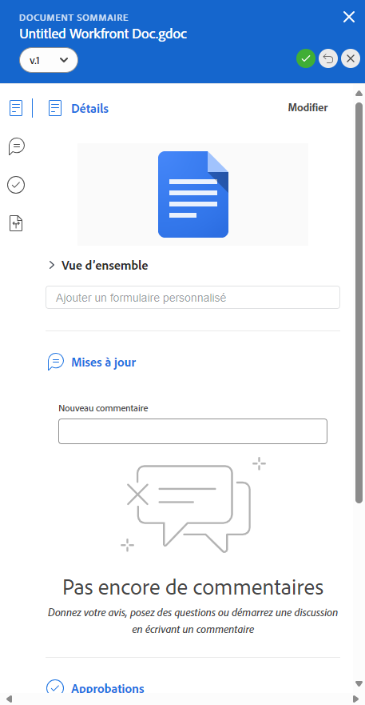
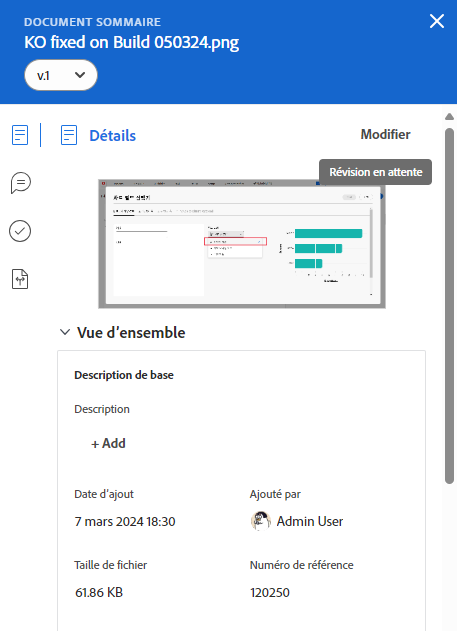
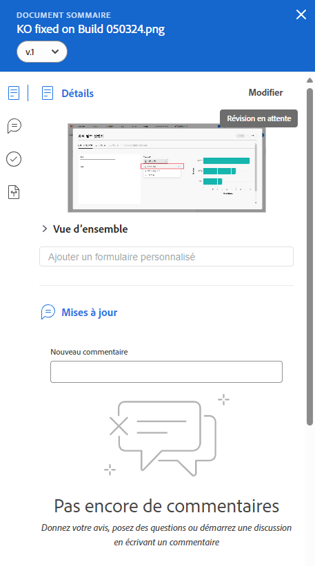
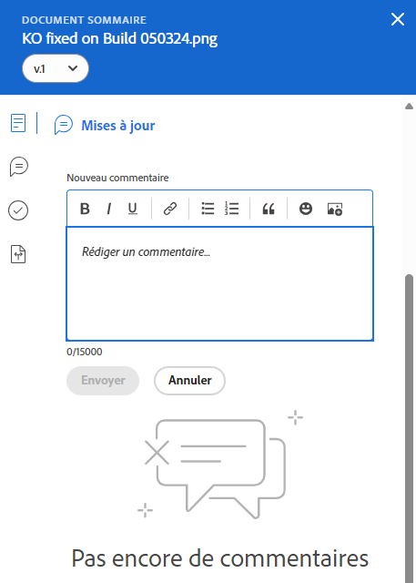
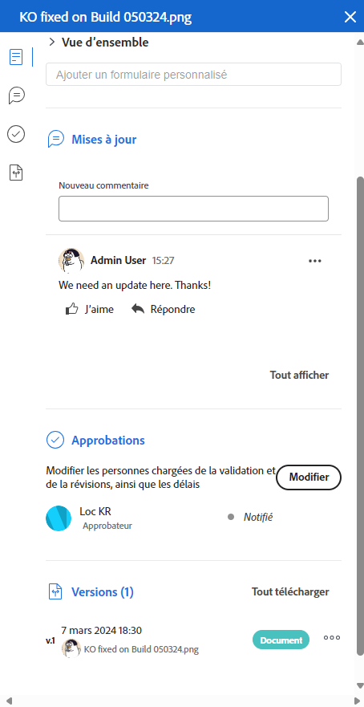

# Résumé de la vue d’ensemble des documents

<!--Audited: April, 2024-->

Vous pouvez utiliser le panneau Résumé pour accéder à des informations importantes et les mettre à jour directement à partir de la liste des documents.

## Conditions d’accès

Vous devez disposer des éléments suivants :

<table style="table-layout:auto"> 
 <col> 
 </col> 
 <col> 
 </col> 
 <tbody> 
  <tr> 
   <td role="rowheader">Formule Adobe Workfront</td> 
   <td> 
 Tous
 </td> 
  </tr> 
  <tr> 
   <td role="rowheader">Licences Adobe Workfront*</td> 
   <td> 
Nouvelle : contributeur ou contributrice ou supérieure
 
   
Actuelle : demande ou supérieure

   </td> 
  </tr> 
  <tr data-mc-conditions=""> 
   <td role="rowheader">Configurations des niveaux d’accès</td> 
   <td> 
Accès en modification aux documents
  </td> 
  </tr> 
  <tr data-mc-conditions=""> 
   <td role="rowheader">Autorisations d’objet</td> 
   <td> 
Accès d’affichage à l’objet associé au document
 </td> 
  </tr> 
 </tbody> 
</table>

* Pour connaître la formule, le type de licence ou l’accès dont vous disposez, contactez votre administrateur ou administratrice Workfront. Pour plus d’informations, voir [Conditions d’accès dans la documentation Workfront](/help/quicksilver/administration-and-setup/add-users/access-levels-and-object-permissions/access-level-requirements-in-documentation.md).

## Ouvrir la vue Résumé

1. Accédez à la zone **Documents** et sélectionnez un élément dans la liste.
1. Cliquez sur l’**icône Ouvrir le résumé** .

   Une fois le résumé ouvert, il reste ouvert lorsque vous cliquez sur d’autres documents, et ce jusqu’à sa fermeture manuelle.

   

## Détails

Utilisez la section Détails pour afficher des informations de vue d’ensemble générales et interagir avec des formulaires personnalisés. Cliquez sur **Détails** en haut de la section pour accéder à la page complète des Détails du document.

* [Vue d’ensemble](#overview)
* [Formulaires personnalisés](#custom-forms)

### Vue d’ensemble {#overview}

Développez la section Vue d’ensemble pour afficher ou télécharger une image miniature, ouvrir une épreuve, mettre à jour la description de base, vérifier le document, etc.

### Formulaires personnalisés {#custom-forms}

Utilisez la section Formulaires personnalisés pour ajouter, modifier ou afficher tout formulaire personnalisé associé au document. Commencez à saisir le nom du formulaire personnalisé pour l’ajouter au document. Pour plus d’informations, voir la section [Ajouter ou modifier un formulaire personnalisé à un document](../../documents/managing-documents/add-custom-form-documents.md).

## Mises à jour

Utilisez la section Mises à jour pour lire une mise à jour effectuée sur le document ou l’épreuve. Le résumé présente les 2 premiers commentaires. Pour plus d’informations sur les mises à jour, voir [Commentaire sur une épreuve](../../review-and-approve-work/proofing/reviewing-proofs-within-workfront/comment-on-a-proof/comment-on-proof.md).

## Approbations

Utilisez la section Approbations pour demander l’approbation d’un document. Vous pouvez également rappeler à une personne d’effectuer une approbation, soumettre l’approbation à nouveau et annuler la décision précédente, ou supprimer l’approbation. Les approbateurs et approbatrices de document peuvent utiliser le résumé pour prendre une décision.

Les approbations d’épreuves doivent être ajoutées dans le workflow des épreuves. Pour plus d’informations sur les approbations, voir

* [Approuver le travail](../../review-and-approve-work/manage-approvals/approving-work.md).
* [Demander l’approbation de documents](../../review-and-approve-work/manage-approvals/request-document-approvals.md)

## Versions

Utilisez la section Versions pour afficher le nombre de versions créées pour un document spécifique. Cliquez sur le **menu Plus** pour

* Ouvrir une épreuve
* Télécharger une épreuve ou un document
* Prévisualiser un document pris en charge par le navigateur
* Accéder aux Détails du document
* Supprimer une épreuve ou un document

