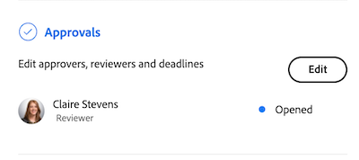

# Résumé de la vue d’ensemble des documents

<!--Audited: April, 2024-->

Vous pouvez utiliser le panneau Résumé pour accéder à des informations importantes et les mettre à jour directement à partir de la liste des documents.

+++ Développez pour afficher les exigences d’accès aux fonctionnalités de cet article.

## Conditions d’accès

Vous devez disposer des accès suivants pour effectuer les étapes décrites dans cet article :

<table style="table-layout:auto"> 
 <col> 
 </col> 
 <col> 
 </col> 
 <tbody> 
  <tr> 
   <td role="rowheader">Formule Adobe Workfront</td> 
   <td> 
 Tous
 </td> 
  </tr> 
  <tr> 
   <td role="rowheader">Licences Adobe Workfront</td> 
   <td> 
Nouvelle : contributeur ou supérieure
 
   
Actuelle : demande ou supérieure

   </td> 
  </tr> 
  <tr data-mc-conditions=""> 
   <td role="rowheader">Configurations des niveaux d’accès</td> 
   <td> 
Accès en modification aux documents
  </td> 
  </tr> 
  <tr data-mc-conditions=""> 
   <td role="rowheader">Autorisations d’objet</td> 
   <td> 
Afficher l’accès à l’objet associé au document
 </td> 
  </tr> 
 </tbody> 
</table>

Pour plus de détails sur les informations contenues dans ce tableau, consultez [Conditions d’accès préalables dans la documentation Workfront](/help/quicksilver/administration-and-setup/add-users/access-levels-and-object-permissions/access-level-requirements-in-documentation.md).

+++

## Ouvrir la vue Résumé

{{step1-to-documents}}

1. Sur la page **Documents**, sélectionnez un document dans la liste.

1. Dans le coin supérieur droit de la page, cliquez sur l’icône **Ouvrir le résumé** . Le panneau latéral **Résumé du document** s’ouvre.

   

   Après avoir ouvert le résumé, il reste ouvert sur cette page (même si vous cliquez sur d’autres documents) jusqu’à ce que vous le fermiez manuellement.

## Détails

Utilisez la section Détails pour afficher des informations de vue d’ensemble générales et interagir avec des formulaires personnalisés. Cliquez sur Détails en haut de la section pour accéder à la page complète des Détails du document.

* [Vue d’ensemble](#overview)
* [Formulaires personnalisés](#custom-forms)

### Vue d’ensemble {#overview}

Développez la section Présentation pour afficher ou télécharger une miniature d’image, ouvrir une épreuve, mettre à jour la description de base, extraire le document, etc.

### Formulaires personnalisés {#custom-forms}

Utilisez la section Formulaires personnalisés pour ajouter, modifier ou afficher tout formulaire personnalisé associé au document. Commencez à saisir le nom du formulaire personnalisé pour l’ajouter au document. Pour plus d’informations, voir la section [Ajouter ou modifier un formulaire personnalisé à un document](../../documents/managing-documents/add-custom-form-documents.md).

## Mises à jour

Utilisez la section Mises à jour pour afficher une mise à jour effectuée par une personne sur le document ou l’épreuve. Le résumé présente les 2 premiers commentaires. Pour plus d’informations sur les mises à jour, voir [Commentaire sur une épreuve](../../review-and-approve-work/proofing/reviewing-proofs-within-workfront/comment-on-a-proof/comment-on-proof.md).

## Approbations

Utilisez la section Approbations pour demander l’approbation d’un document. Vous pouvez également rappeler à une personne d’effectuer une approbation, soumettre l’approbation à nouveau et annuler la décision précédente, ou supprimer l’approbation. Les approbateurs et approbatrices de document peuvent utiliser le résumé pour prendre une décision.

Les approbations d’épreuves doivent être ajoutées dans le workflow des épreuves. Pour plus d’informations sur les approbations, voir

* [Approuver le travail](../../review-and-approve-work/manage-approvals/approving-work.md).
* [Demander l’approbation de documents](../../review-and-approve-work/manage-approvals/request-document-approvals.md)

## Versions

Utilisez la section Versions pour afficher le nombre de versions créées pour un document spécifique. Cliquez sur l’icône Plus  pour effectuer les opérations suivantes :

* Ouvrez un BAT.
* Téléchargez une épreuve ou un document.
* Prévisualisez un document pris en charge par le navigateur.
* Accédez aux Détails du document.
* Supprimer une épreuve ou un document.

