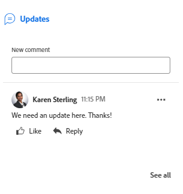
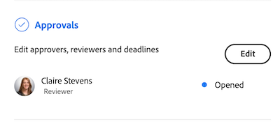
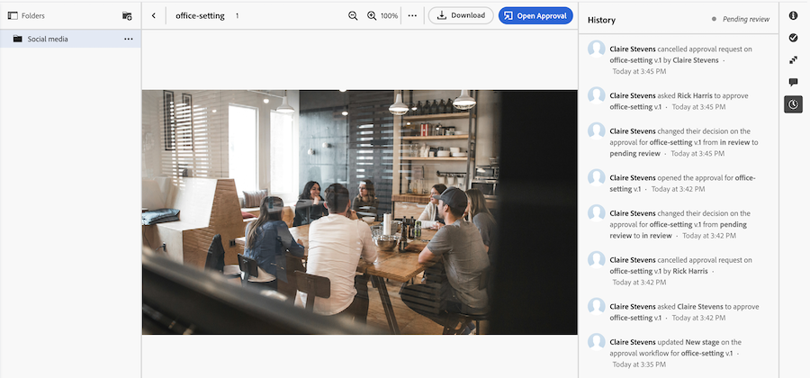

# Résumé de la vue d’ensemble des documents

{{highlighted-preview}}

<!--Audited: April, 2024-->

Vous pouvez utiliser le panneau Résumé pour accéder à des informations importantes et les mettre à jour directement à partir de la liste des documents.

+++ Développez pour afficher les exigences d’accès aux fonctionnalités de cet article.

## Conditions d’accès

Vous devez disposer des accès suivants pour effectuer les étapes de cet article :

<table style="table-layout:auto"> 
 <col> 
 </col> 
 <col> 
 </col> 
 <tbody> 
  <tr> 
   <td role="rowheader">Package Adobe Workfront</td> 
   <td> 
Tout package Workfront pour gérer les documents à l’aide du stockage Workfront hérité

Tout package de workflow pour gérer les documents à l’aide de l’espace de stockage dans le cloud Adobe
</td> 
  </tr> 
  <tr> 
   <td role="rowheader">Licences Adobe Workfront</td> 
   <td> 
Contributeur ou supérieur
 
   
Requête ou supérieure

   </td> 
  </tr> 
  <tr data-mc-conditions=""> 
   <td role="rowheader">Configurations des niveaux d’accès</td> 
   <td> 
Accès en modification aux documents
  </td> 
  </tr> 
  <tr data-mc-conditions=""> 
   <td role="rowheader">Autorisations d’objet</td> 
   <td> 
Afficher l’accès à l’objet associé au document
 </td> 
  </tr> 
 </tbody> 
</table>

Pour plus de détails sur les informations contenues dans ce tableau, consultez [Conditions d’accès préalables dans la documentation Workfront](/help/quicksilver/administration-and-setup/add-users/access-levels-and-object-permissions/access-level-requirements-in-documentation.md).

+++

## Résumé des documents dans l’expérience des documents hérités

Si votre organisation utilise un stockage Workfront hérité, la zone des documents hérités s’affiche lorsque vous accédez aux documents dans Workfront. Pour plus d’informations sur le stockage Workfront hérité, voir [Différences entre le stockage Workfront hérité et le stockage dans le cloud Adobe](/help/quicksilver/review-and-approve-work/esm-overview.md).

### Ouvrez la vue Résumé dans l’expérience des documents hérités

{{step1-to-documents}}

1. Sur la page **Documents**, sélectionnez un document dans la liste.

1. Dans le coin supérieur droit de la page, cliquez sur l’icône **Ouvrir le résumé** . Le panneau latéral **Résumé du document** s’ouvre.

   

   Après avoir ouvert le résumé, il reste ouvert sur cette page (même si vous cliquez sur d’autres documents) jusqu’à ce que vous le fermiez manuellement.

### Détails

Utilisez la section Détails pour afficher des informations de vue d’ensemble générales et interagir avec des formulaires personnalisés. Cliquez sur Détails en haut de la section pour accéder à la page complète des Détails du document.

* [Vue d’ensemble](#overview)
* [Formulaires personnalisés](#custom-forms)

#### Vue d’ensemble {#overview}

Développez la section Présentation pour afficher ou télécharger une miniature d’image, ouvrir une épreuve, mettre à jour la description de base, extraire le document, etc.

#### Formulaires personnalisés {#custom-forms}

Utilisez la section Formulaires personnalisés pour ajouter, modifier ou afficher tout formulaire personnalisé associé au document. Commencez à saisir le nom du formulaire personnalisé pour l’ajouter au document. Pour plus d’informations, voir la section [Ajouter ou modifier un formulaire personnalisé à un document](../../documents/managing-documents/add-custom-form-documents.md).

### Mises à jour

Utilisez la section Mises à jour pour afficher une mise à jour effectuée par une personne sur le document ou l’épreuve. Le résumé présente les 2 premiers commentaires. Pour plus d’informations sur les mises à jour, voir [Commentaire sur une épreuve](../../review-and-approve-work/proofing/reviewing-proofs-within-workfront/comment-on-a-proof/comment-on-proof.md).

### Approbations

Utilisez la section Approbations pour demander l’approbation d’un document. Vous pouvez également rappeler à une personne d’effectuer une approbation, soumettre l’approbation à nouveau et annuler la décision précédente, ou supprimer l’approbation. Les approbateurs et approbatrices de document peuvent utiliser le résumé pour prendre une décision.

Les approbations d’épreuves doivent être ajoutées dans le workflow des épreuves. Pour plus d’informations sur les approbations, voir

* [Approuver le travail](../../review-and-approve-work/manage-approvals/approving-work.md).
* [Demander l’approbation de documents](../../review-and-approve-work/manage-approvals/request-document-approvals.md)

### Versions

Utilisez la section Versions pour afficher le nombre de versions créées pour un document spécifique. Cliquez sur l’icône Plus  pour effectuer les opérations suivantes :

* Ouvrez un BAT.
* Téléchargez une épreuve ou un document.
* Prévisualisez un document pris en charge par le navigateur.
* Accédez aux Détails du document.
* Supprimer une épreuve ou un document.

## Résumé des documents dans la nouvelle expérience de documents

Si votre entreprise utilise l’espace de stockage Adobe dans le cloud, la nouvelle zone Documents s’affiche lorsque vous accédez aux documents dans Workfront. Pour plus d’informations sur l’espace de stockage dans le cloud Adobe, consultez [Présentation de l’espace de stockage dans le cloud Adobe](/help/quicksilver/review-and-approve-work/esm-overview.md).

### Détails

Utilisez la section Détails pour afficher des informations générales, interagir avec des formulaires personnalisés et ouvrir le résumé d’impression.

### Approbations

Utilisez la section Validations pour créer un workflow de validation. Vous pouvez également rappeler aux participants une approbation ou supprimer l&#39;approbation. Les approbateurs de documents peuvent accéder à la visionneuse Frame.io ou utiliser le résumé pour prendre une décision.

Pour plus d&#39;informations sur les validations et Frame.io, voir

* [Prise en main de la révision et de l’approbation unifiées](/help/quicksilver/review-and-approve-work/get-started-with-unified-approvals.md)
* [Créer une demande de révision ou d&#39;approbation de document](/help/quicksilver/review-and-approve-work/document-reviews-and-approvals/manage-document-approvals/create-a-document-approval.md).

<!-- resubmit the approval and cancel the previous decision, or delete the approval. Document approvers can use the Summary to make a decision.-->

### Versions

Utilisez la section Versions pour afficher le nombre de versions créées pour un document spécifique. Cliquez sur l’icône Plus pour effectuer les opérations suivantes :

* Renommer une version
* Afficher les détails du document
* Demander l’approbation sur une version spécifique
* Ouvrir dans Frame.io
* Télécharger la version
* Partager la version
* Supprimer la version

### Historique

Utilisez la section Historique pour afficher la liste de toutes les activités liées au document.

