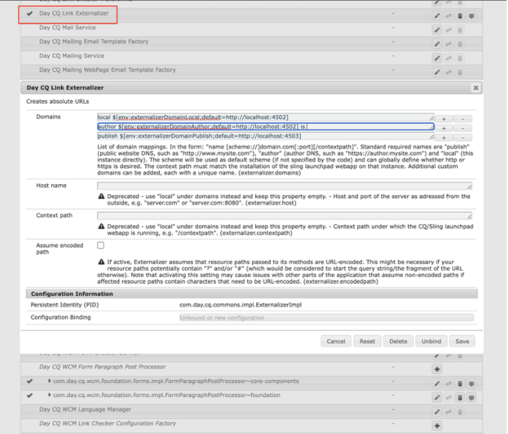

# Désinstaller Workfront avec le connecteur hérité Adobe Experience Manager

Vous devez désinstaller Workfront avec le connecteur hérité Adobe Experience Manager vers la dernière intégration native connectant Workfront et Adobe Experience Manager Assets as a Cloud Service.

## Se désabonner de Workfront

1. Ouvrez Adobe Experience Manager.
1. Dans Experience Manager, accédez à **Outils** > **Cloud Service** > **Configuration de l’intégration Workfront**.
1. Sélectionnez votre configuration (global-workfront par défaut), puis cliquez sur **Propriétés**.
   
1. Désactivez la synchronisation du document, des commentaires et des métadonnées. Le libellé doit dire Désactivé.
Cela supprime les abonnements dans Workfront et permet à l’utilisateur ou l’utilisatrice de créer un abonnement à l’aide de l’URL définie dans Day CQ Link Externalizer.

## Supprimer la configuration de l’intégration Workfront

Après la suppression de l’abonnement, il est alors possible de supprimer la configuration de l’intégration Workfront en toute sécurité.

1. Ouvrez la configuration, puis sélectionnez **Supprimer**.
   

## Supprimer le mappage

Ensuite, vous devez supprimer le mappage des propriétés Workfront.

1. Dans Experience Manager, accédez à **Outils** > **Ressources** > **Mappage des propriétés Workfront**.

1. Sélectionnez tous les mappages, puis cliquez sur **Supprimer**.

## Autorisations des utilisateurs et utilisatrices

Toutes les personnes qui ont accès à AEM DAM à partir de Workfront ont reçu des autorisations de lecture pour `/content/dam`. Si une personne n’en a plus besoin, vous pouvez supprimer ses autorisations.

Le connecteur fonctionne à l’aide du service front-service de l’utilisateur ou utilisatrice du système. Ceci est désinstallé lors de la désinstallation du connecteur.

>[!NOTE]
>
>Si vous utilisez la version 2.0.3 du connecteur et que vous avez ajouté le groupe `workfront-aem-connector-group`, il doit également être supprimé en accédant à **Outils** > **Sécurité** > **Groupes**.

## Day CQ Link Externalizer

Si vous n’avez pas besoin du Day CQ Link Externalizer, vous pouvez rétablir cette valeur sur `localhost:4502` en accédant à `/system/console/configMgr` et en recherchant « Day CQ Link Externalizer »

>[!NOTE]
>
>Si vous utilisez Adobe Experience Manager as a Cloud Service, vous pouvez modifier ce paramètre en accédant à votre projet et en localisant le fichier _com.day.cq.commons.impl.ExternalizerImpl.xml_ inside _ui.apps/src/main/content/jcr_root/apps/mysite/config_.

## Désinstaller le package du connecteur

Les étapes requises pour désinstaller le package du connecteur diffèrent selon la version d’Adobe Experience Manager dont vous disposez.

### Adobe Experience Manager On-Premise

Si vous utilisez Adobe Experience Manager On-Premise, accédez à _crx/packmgr/index.jsp_, puis recherchez le `workfront-aem-connector.all-<version>.zip`, cliquez sur **Plus**, puis sur **Désinstaller**.

Veuillez vérifier `/conf` pour vous assurer que tous les fichiers créés par Workfront ont été supprimés.

### Adobe Experience Manager as a Cloud Service

Pour Adobe Experience Manager as a Cloud Service, vous pouvez supprimer les dépendances du connecteur du fichier pom.files du projet.

## Pare-feu et Dispatcher

N’oubliez pas de supprimer vos URL Workfront autorisées si la communication n’est plus nécessaire. En outre, le connecteur utilise l’apiKey des en-têtes et le nom d’utilisateur ou d’utilisatrice qui ont été définis sur Dispatcher. Ils peuvent également être supprimés.
