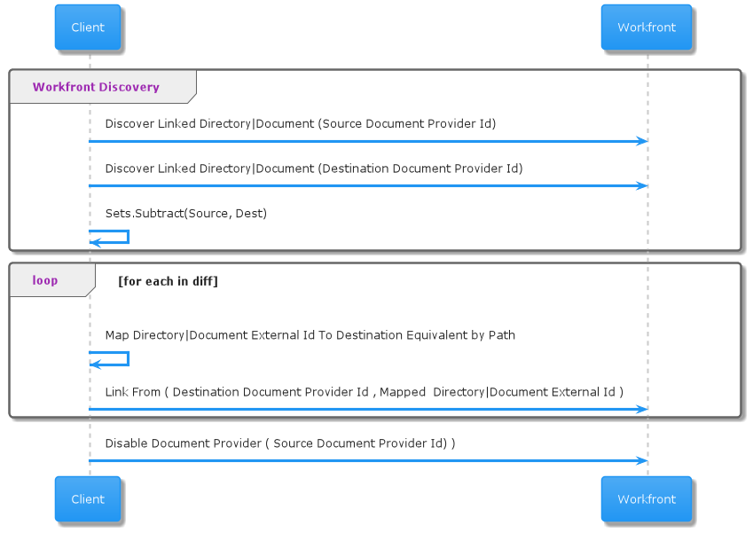

# Migration des dossiers et documents liés

Vous pouvez utiliser l’API pour migrer les dossiers et documents liés vers Adobe Experience Manager Assets.

## Procédure

1. Identifiez tous les documents et dossiers liés au fournisseur externe précédent de stockage de documents, en notant leurs identifiants de document ou de dossier internes Workfront ainsi que l’identifiant de dossier de tout dossier contenant.

   >[!NOTE]
   >
   > Vous devez rechercher tous les dossiers ou documents découverts pour vérifier qu’ils n’ont pas déjà créé de lien pour eux avec le nouveau fournisseur.

1. Recherchez les documents et les dossiers dans le nouveau référentiel par chemin d’accès, puis recherchez leur identité dans le système externe.

1. Créez un mappage de l’Workfront ID interne sur l’ID dans le nouveau magasin externe. Vous en avez besoin pour créer un lien à l’étape suivante.

1. Créez un lien vers un nouveau document ou dossier de document dans Workfront, en pointant vers la ressource à son nouvel emplacement via son nouvel ID externe.

   1. **Documents**: Ajoutez une nouvelle version du document existant avec le nouveau fournisseur de documents externe.
   1. **Dossiers**: Créez un nouveau filtre portant le même nom.

>[!CAUTION]
>
>   Ne supprimez pas les dossiers liés existants. Cela peut entraîner une perte de données. Pour supprimer les anciens liens de dossier de l’application Workfront, désactivez l’intégration de document personnalisé dans la zone Configuration .


## Exemple de processus de migration de liens



## Informations sur l’API

Pour plus d’informations sur les API Workfront de cette section, voir [Documentation destinée aux développeurs : documents](https://developer.workfront.com/documents.html).

### Recherche de tous les documents

Tout rechercher **Documents (DOCU)** Associé à **Fournisseur de documents** de **providerType** avec **documentProviderID**.

```
Http Method: GET
 
Http Endpoint: {host}/attask/api/v14.0/document/search?fields=currentVersion:*&currentVersion:externalIntegrationType={providerType}
```

[Référence des DOCS de l’API](https://developer.workfront.com/documents.html#get-/docu/search)

### Recherche de tous les dossiers

Tout rechercher **Dossiers de document (DOCFDR)** Lié au fournisseur de document de **providerType** avec **documentProviderID**.

```
Http Method: GET
 
Http Endpoint: {host}/attask/api/v14.0/documentFolder/search?fields=*,linkedFolder:*&linkedFolder:externalIntegrationType={providerType}
```

Documentation API : (Points de fin de dossier de document non actuellement couverts sur developer.workfront.com)

### Lier des documents

Lien **Documents (DOCU)** de **Fournisseur de documents externe** de **providerType** avec **documentProviderID**.

>[!IMPORTANT]
>
>Les documents sont temporairement stockés. En d’autres termes, vous avez accès à toutes les versions du document. Lorsque vous créez le lien, vous pouvez spécifier l’ID de document existant. Vous n’avez donc qu’à écrire une nouvelle version dans ce document, les données étant hébergées en externe dans le nouveau fournisseur. Cet ID de document est identique à l’ID de document figurant sur le lien de document que vous remplacez. C&#39;est le même document conceptuel. Vous indiquez simplement que les octets de cette nouvelle version sont stockés avec un fournisseur différent.

```
Http Method: POST
 
Endpoint: {host}/internal/documents/linkExternalObjects
 
Http Body:
refObjCode=DOCU&refObjID={documentId}&providerType={providerType}&documentProviderID={documentProviderID}
```

Documentation API : (Points de terminaison de lien interne non actuellement couverts sur developer.workfront.com)

### Lier des dossiers

Lien **Dossiers de document (DOCFDR)** de **Fournisseur de documents externe** de **providerType** avec **documentProviderID**.

>[!IMPORTANT]
>
>Pour les liens de dossier , contrairement aux liens de document, vous avez besoin de &quot;documentFolderId&quot; du dossier dans Workfront dans lequel vous souhaitez placer votre nouveau lien. Il s’agit du même dossier parent, probablement, que le dossier lié que nous copions.

>[!CAUTION]
>
>Les dossiers ne sont pas stockés temporairement. Ne supprimez pas les vieux dossiers. Désactivez l’intégration du document personnalisé dans la zone de configuration pour supprimer les anciens dossiers.


```
Http Method: POST
 
Endpoint: {host}/internal/document/version/linkExternal
 
Http Body:
providerType={providerType}&documentProviderID={documentProviderID}&breadcrumb=[]&linkAction=LINKEXTERNAL&refObjCode={USER|PROJECT_TASK|TEMPLATE_TASK|securityRootObjectCode}&refObjID={userID|taskID|templateTaskID|securityRootId}&destFolderID={parentFolderId}
```

Documentation API : (Points de terminaison de lien interne non actuellement couverts sur developer.workfront.com)

## Termes importants

* **Document**: Une ressource numérique dans Workfront

* **Document Folder**: Conteneur de ressources numériques dans Workfront

* **Document ID**: Identifiant interne Workfront pour une ressource numérique

* **Document Folder ID**: Identifiant interne Workfront pour un dossier de ressources numériques

* **ID de fournisseur de documents**: Identifiant associé à des fournisseurs de documents spécifiques

>[!IMPORTANT]
>
> Pour tout type de fournisseur de document donné, un client peut avoir plusieurs instances connectées. Par exemple, plusieurs référentiels d’AEM peuvent être liés. Ou plusieurs instances Google Drive liées. L’ID de fournisseur de document indique l’instance spécifique du type de connexion que nous voulons remplacer ou changer.

* **Type de fournisseur de stockage de documents (également &quot;Type d’intégration externe&quot;)**: Type d’intégration du fournisseur de stockage de documents prise en charge par Workfront. Soit par le biais d’une intégration dédiée, soit par une &quot;intégration personnalisée&quot;.

* **Types de fournisseurs de stockage de documents actuels (providerType)**:

   ```
   ATTASK
   BOX
   GOOGLE
   SHAREPOINT
   WEBDAM
   WORKFRONTDAM
   INFERNO
   WIDEN
   DROPBOX
   DROPBOX_BUSINESS
   ONEDRIVE
   QUIP
   WEBHOOKS
   AEM
   MOCK
   ```

* **Document lié**: Une ressource numérique hébergée dans un fournisseur de stockage de documents externe. Workfront aura son propre &quot;ID de document&quot; interne pour la ressource, mais les octets sont stockés en externe. Pour faciliter cette opération, Workfront stocke également un &quot;ID de document externe&quot; afin de faciliter la localisation de la ressource référencée en externe dans le référentiel ou le magasin distant.

* **Linked Document Folder**: Conteneur pour les ressources numériques hébergées dans un fournisseur externe de stockage de documents. Workfront aura son propre &quot;ID de dossier de document&quot; interne pour la ressource, mais les octets sont stockés en externe. Pour faciliter cette opération, Workfront stocke également un &quot;ID de document externe&quot; afin de faciliter la localisation de la ressource référencée en externe dans le référentiel ou le magasin distant.

* **ID de document externe**: Identifiant attribué lorsque les ressources sont stockées en dehors de workfront. Workfront mappe son identifiant interne à l&#39;identifiant utilisé pour localiser la ressource dans le système externe, via ce champ &quot;identifiant document externe&quot;. Par conséquent, lors de la liaison du document ou du dossier à partir d’un nouveau magasin externe, un nouvel identifiant de document externe doit être composé, dans le format approprié, pour que le fournisseur de documents externe identifie le document dans le nouveau référentiel ou magasin.

   >[!NOTE]
   >
   > Workfront ne dispose pas encore d’une norme pour les identifiants de document externe. Une nouvelle spécification est en cours d’utilisation pour les ID d’AEM, mais pour les autres ID, l’ID de document externe peut prendre différentes formes selon le type de fournisseur.


* **Type d’objet**: Il s’agit d’un terme d’API uniquement aux fins de ce document. Il s&#39;agit d&#39;un type d&#39;objet générique dans le plan de travail avec lequel vous souhaitez interagir. Dans ce cas, vous interagissez avec des documents et des dossiers de type &quot;DOCU&quot; et &quot;DOCFDR&quot; respectivement.

* **Identifiant d’objet**: Identifiant Workfront interne de l’objet générique avec lequel vous souhaitez interagir. Vous interagissez avec des documents et des dossiers, ce qui correspond respectivement à l’ID de document ou à l’ID de dossier de document.
