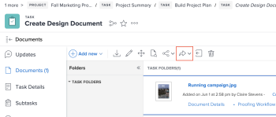

# Envoyer un document avec le connecteur amélioré

Vous pouvez envoyer des documents de Workfront vers Experience Manager Assets. Les documents chargés et envoyés de Workfront vers Experience Manager Assets sont toujours pris en compte dans le stockage global de documents. Les ressources liées à partir d’Experience Manager Assets ne sont pas prises en compte dans le stockage global.

## Conditions d’accès

+++ Développez pour afficher les exigences d’accès aux fonctionnalités de cet article.

<table style="table-layout:auto"> 
 <col> 
 <col> 
 <tbody> 
  <tr> 
   <td role="rowheader">Package Adobe Workfront</td> 
   <td> 
Tous
 </td> 
  </tr> 
  <tr> 
   <td role="rowheader">Licence Adobe Workfront</td> 
   <td> 
   
Contributeur ou supérieur

   
Requête ou supérieure
 </td> 
  </tr> 
  <tr> 
   <td role="rowheader">Produits supplémentaires</td> 
   <td>Experience Manager Assets </td> 
  </tr> 
  <tr> 
   <td role="rowheader">Configurations du niveau d’accès*</td> 
   <td> 
Modifier l’accès aux documents
 s=« MCXref xref »&gt;Créer ou modifier des niveaux d’accès personnalisés</a>.
 </td> 
  </tr> 
  <tr> 
   <td role="rowheader">Autorisations d’objet</td> 
   <td> 
Accès Affichage ou supérieur aux documents
</td> 
  </tr> 
 </tbody> 
</table>

Pour plus d’informations, voir [Conditions d’accès requises dans la documentation Workfront](/help/quicksilver/administration-and-setup/add-users/access-levels-and-object-permissions/access-level-requirements-in-documentation.md).
+++

## Conditions préalables

Avant de commencer, vous devez

* Installer le connecteur amélioré Workfront pour Experience Manager

## Envoyer un document à Experience Manager Assets

Lorsqu’un utilisateur ou une utilisatrice envoie un document de Workfront vers Experience Manager Assets, les métadonnées mappées sont transférées avec le document. Si cela a été configuré, les métadonnées sont synchronisées en continu chaque fois qu’une modification est apportée.

Pour envoyer un document, procédez comme suit :

1. Accédez à la zone **Documents** dans Workfront, puis sélectionnez le document à envoyer.
1. Cliquez sur **Envoyer à**, puis sélectionnez l’intégration Experience Manager Assets que votre équipe d’administration a configurée.

   >[!NOTE]
   >
   >N’importe quel nom peut être choisi pour cette intégration. Experience Manager Assets peut donc ne pas être mentionné.

   

1. Sélectionnez l’emplacement de la ressource, puis cliquez sur **Sélectionner un dossier**.
1. Lorsque vous avez trouvé la destination de votre choix, cliquez sur **Enregistrer**.

## Envoyer une nouvelle version à Experience Manager Assets

Vous pouvez ajouter une nouvelle version à un document que vous avez précédemment chargé vers Workfront. Pour plus d’informations, voir [Charger une nouvelle version d’un document](../../../documents/managing-documents/upload-new-document-version.md). Une fois la dernière version chargée, vous pouvez l’envoyer à Experience Manager Assets. Si un champ mappé dans Workfront a été modifié, la nouvelle version met à jour les métadonnées dans Experience Manager Assets lors de l’envoi.

Pour envoyer la version la plus récente, procédez comme suit :

1. Accédez à la zone **Documents** dans Workfront, puis recherchez le document.
1. Cliquez sur **Envoyer à**, puis sélectionnez l’intégration Experience Manager Assets que votre équipe d’administration a configurée.

   >[!NOTE]
   >
   >N’importe quel nom peut être choisi pour cette intégration. Experience Manager Assets peut donc ne pas être mentionné.

   

1. Cliquer sur **Enregistrer**. La nouvelle version enregistre au même emplacement que la version précédente.
