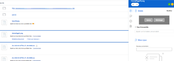

# Afficher ou télécharger une ressource liée avec le connecteur amélioré

Vous pouvez afficher ou télécharger dans Adobe Workfront une ressource liée à partir d’Experience Manager Assets.

## Conditions d’accès

+++ Développez pour afficher les exigences d’accès aux fonctionnalités de cet article.

<table style="table-layout:auto"> 
 <col> 
 <col> 
 <tbody> 
  <tr> 
   <td role="rowheader">Package Adobe Workfront</td> 
   <td> 
Tous
 </td> 
  </tr> 
  <tr> 
   <td role="rowheader">Licence Adobe Workfront</td> 
   <td> 
   
Contributeur ou version ultérieure

   
Requête ou supérieure
 </td> 
  </tr> 
  <tr> 
   <td role="rowheader">Produits supplémentaires</td> 
   <td>Experience Manager Assets </td> 
  </tr> 
  <tr> 
   <td role="rowheader">Configurations du niveau d’accès*</td> 
   <td> 
Modifier l’accès aux documents
 s=« MCXref xref »&gt;Créer ou modifier des niveaux d’accès personnalisés</a>.
 </td> 
  </tr> 
  <tr> 
   <td role="rowheader">Autorisations d’objet</td> 
   <td> 
Accès Affichage ou supérieur aux documents
</td> 
  </tr> 
 </tbody> 
</table>

Pour plus d’informations, voir [Conditions d’accès requises dans la documentation Workfront](/help/quicksilver/administration-and-setup/add-users/access-levels-and-object-permissions/access-level-requirements-in-documentation.md).

+++

## Conditions préalables

Avant de commencer, vous devez

* installer le connecteur amélioré Workfront pour Experience Manager.

## Afficher ou télécharger une ressource liée à partir d’Experience Manager Assets

1. Recherchez le document que vous souhaitez afficher ou télécharger.
1. Dans la liste des documents, sélectionnez le document.
1. Dans le résumé du document à droite, pointez sur la miniature en haut de l’écran et choisissez **Aperçu** ou **Télécharger**.

   
