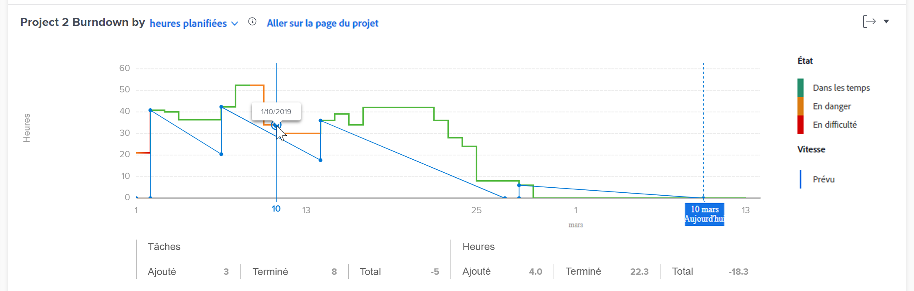
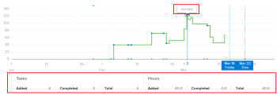

# Afficher la visualisation d’avancement dans Analytique améliorée

<!-- Audited: 12/2023 -->

La visualisation de ventilation présente la charge d’un projet spécifique au fil du temps et vous aide à comprendre la relation entre la condition du projet, la vitesse et les heures restantes (ou jours).

## Conditions d’accès

Vous devez disposer des accès suivants pour effectuer les étapes de cet article :

<table style="table-layout:auto"> 
 <col> 
 <col> 
 <tbody> 
  <tr> 
   <td role="rowheader">Forfait Adobe Workfront</td> 
   <td>
      
Nouveau : Tous

      
ou

      
Actuel : métier ou supérieur
</td>
  </tr> 
  <tr> 
   <td role="rowheader">Licence Adobe Workfront</td> 
   <td>
      
Nouveau : Léger ou supérieur

      
ou

      
Actuel : révision ou supérieur

   </td> 
  </tr> 
  <tr> 
   <td role="rowheader">Configurations du niveau d’accès</td> 
   <td> 
Affichage de l’accès aux projets
 </td> 
  </tr> 
  <tr> 
   <td role="rowheader">Autorisations d’objet</td> 
   <td> 
Afficher
 </td>
  </tr> 
 </tbody> 
</table>

Pour plus d’informations sur ce tableau, consultez [Conditions d’accès requises dans la documentation Workfront](/help/quicksilver/administration-and-setup/add-users/access-levels-and-object-permissions/access-level-requirements-in-documentation.md).

## Conditions préalables

Pour connaître les conditions préalables à l’utilisation d’Analytics amélioré, reportez-vous à la section &quot;Conditions préalables&quot; dans la [présentation des analyses améliorées](../enhanced-analytics/enhanced-analytics-overview.md).

## Présentation de la visualisation Burndown

La ligne bleue pleine indique la vitesse planifiée entre la date de début et la date d’achèvement prévue. Cette ligne s’ajuste au fur et à mesure que le travail est ajouté, supprimé ou mis à jour. Elle se transforme en ligne verticale en pointillés lorsque le projet atteint la date d’achèvement prévue.

La ligne réelle indique le nombre d’heures (ou de jours) passées sur le projet au fil du temps. La couleur de cette ligne indique la condition du projet chaque jour :

* **Vert** : le projet est sur la cible.

  

* **Orange** : le projet est en danger.

  

* **Red** : le projet est en difficulté.

  

Pour plus d’informations sur ces conditions de projet, voir [Présentation de la condition et du type de condition du projet](../manage-work/projects/manage-projects/project-condition-and-condition-type.md).

Lorsque la ligne active monte verticalement, du travail a été ajouté au projet. Lorsque la ligne descend verticalement, le travail a été supprimé ou terminé pour le projet.

Sous l’axe X de la visualisation, vous pouvez voir plus d’informations sur la façon dont les tâches et les heures (ou jours) ont changé un jour donné (la quantité ajoutée, la quantité terminée et la différence entre les deux).

L’affichage de toutes ces informations dans la visualisation de Burndown vous permet de déterminer :

* L’intégrité de chaque projet au fil du temps
* Comment les problèmes liés au travail (ou aux travaux non planifiés) ont-ils affecté le travail planifié ?
* Quels événements ont prolongé le projet au-delà de la date d’achèvement initiale ?

Pour savoir comment obtenir les meilleures données pour cette visualisation, consultez la [présentation des analyses améliorées](../enhanced-analytics/enhanced-analytics-overview.md).

## Affichage de la visualisation de Burndown

{{step1-to-analytics}}

1. (Facultatif) Pour utiliser une autre période, sélectionnez de nouvelles dates de début et de fin dans le filtre de période.

   

   Pour plus d’informations sur l’utilisation du filtre de période, voir [Application de filtres dans les analyses améliorées](../enhanced-analytics/use-enhanced-analytics-filters.md).

1. (Conditionnel) Si vous devez limiter l’ensemble de données du projet, sélectionnez les filtres à utiliser et appliquez-les.

   Pour plus d’informations sur l’ajout de filtres dans les analyses améliorées, voir [Application de filtres dans les analyses améliorées](../enhanced-analytics/use-enhanced-analytics-filters.md).

   Une fois que vous avez ajouté des filtres, les données de 50 projets au maximum s’affichent et les filtres restent actifs même après avoir quitté la page ou vous être déconnecté de Workfront.

1. (Facultatif) Pour effectuer un zoom avant sur une période, sélectionnez un point de la visualisation pour le début de la période, puis faites-le glisser jusqu’à la fin de la période.

   Toutes les autres visualisations se mettent à jour sur la même période et un filtre de période est automatiquement créé.

   

1. Sur la visualisation Plan de vol ou Plan Treemap du projet , cliquez sur un projet pour afficher plus d’informations.

   Les visualisations Burndown et Tasks in flight s’affichent.

   >[!NOTE]
   >
   >Pour en savoir plus sur ces autres visualisations, voir :
   >
   >   * [ Afficher la visualisation du plan de vol dans Enhanced Analytics](../enhanced-analytics/flight-plan-overview.md)
   >   * [Visualisation du graphique Treemap du projet dans l’analyse améliorée](../enhanced-analytics/project-treemap-overview.md)
   >   * [Afficher les tâches dans la visualisation en vol dans l’analyse améliorée](../enhanced-analytics/tasks-in-flight-overview.md)
   >

1. (Facultatif) Remplacez l’affichage des heures planifiées par **duration**.

   Les heures planifiées sont sélectionnées par défaut.

   >[!NOTE]
   >
   >Si vous sélectionnez **duration**, toutes les informations sur les heures sont remplacées par jours.\
   >\
   >Pour plus d’informations sur la durée dans la zone Analyses améliorées, voir la section &quot;Vue Durée&quot; dans la [présentation des analyses améliorées](../enhanced-analytics/enhanced-analytics-overview.md#duration-view).

1. Cliquez sur n’importe quel point du graphique linéaire.

   La date exacte s’affiche et des informations supplémentaires sur les tâches et les heures (ou jours) du jour sélectionné s’affichent sous le graphique.

   

   >[!NOTE]
   >
   >Si la vitesse réelle est une ligne plate qui s’exécute le long de l’axe des x (en ligne avec 0 heure ou 0 jour) de la visualisation, cela signifie qu’aucune heure (ou jour) planifiée n’a été ajoutée au projet.\
   >Si la vitesse réelle est une ligne plate au-dessus de l’axe X (en ligne avec un nombre d’heures ou de jours) qui ne diminue jamais, cela signifie qu’aucune tâche n’a été effectuée pendant la période filtrée.

1. (Facultatif) Pour exporter les données de visualisation, cliquez sur l’icône **Exporter**  dans le coin supérieur droit de la visualisation, puis sélectionnez le format d’exportation :

   * Graphique (PNG)
   * Tableau de données (XSLX)

1. (Facultatif) Pour afficher des détails sur la progression des tâches dans le projet sélectionné, consultez la visualisation Tâches en vol qui s’affiche sous la visualisation de Burndown . Pour plus d’informations, voir [Affichage des tâches dans la visualisation en vol dans Enhanced Analytics](/help/quicksilver/enhanced-analytics/tasks-in-flight-overview.md).
