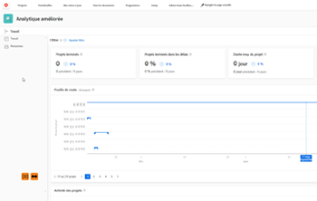

# Vue d’ensemble d’Analytique améliorée

>[!IMPORTANT]
>
>Enhanced Analytics a été supprimé de Workfront le 27 mai. Workfront Data Connect est une nouvelle solution alternative qui peut être utilisée pour répliquer toutes les visualisations Enhanced Analytics que vous utilisez actuellement. <br>Pour plus d’informations, consultez le guide [Obsolescence améliorée d’Analytics](/help/quicksilver/product-announcements/announcements/enhanced-analytics-deprecation.md) .


Analytique améliorée constitue un puissant outil d’Adobe Workfront avec des visualisations prédéfinies qui vous permettent d’examiner les données du projet et d’identifier les tendances en matière de planification et d’achèvement. Grâce à ces informations sur vos projets, vous pouvez gérer votre travail actuel et planifier plus précisément votre travail futur.

Analytique améliorée peut vous aider à identifier ce qui suit :

* La manière dont vous planifiez les projets.
* Lorsqu’un travail est ajouté aux projets.
* La quantité de travail effectuée pour différents projets.
* Le nombre d’heures ou de jours requis pour terminer un projet par rapport aux heures ou aux jours prévus d’une équipe interne.
* La fréquence à laquelle les personnes effectuent des actions spécifiques au cours d’un projet.
* La progression des projets, ainsi que les tâches individuelles au sein d’un projet.



Pour consulter des cas d’utilisation ou en savoir plus sur la gestion du travail actuel et la planification du travail futur à l’aide d’Analytique améliorée, voir [Parcours de formation Analytique améliorée](https://experienceleague.adobe.com/en/docs/workfront-learn/tutorials-workfront/home).

## Conditions préalables

Pour accéder à la zone Analytique améliorée, vous devez satisfaire les conditions suivantes :

* Disposer d’une formule Business ou Entreprise.

  Pour plus d’informations, voir [Formules Workfront](https://business.adobe.com/products/workfront/pricing.html).

* Demander à votre administrateur ou administratrice Workfront d’ajouter Analytique améliorée à votre modèle de mise en page.

  Pour plus d’informations, voir [Analytique améliorée : ajouter une analyse aux modèles de mise en page](https://experienceleague.adobe.com/en/docs/workfront/using/home).

Pour afficher les informations relatives aux projets et aux tâches, vous devez satisfaire les conditions suivantes :

* Disposer de l’autorisation Afficher dans les zones Projets et Tâches de votre niveau d’accès.

  Pour plus d’informations sur la façon dont l’administration Workfront peut modifier votre niveau d’accès, consultez la section [Créer ou modifier des niveaux d’accès personnalisés](../administration-and-setup/add-users/configure-and-grant-access/create-modify-access-levels.md).

* Disposer de l’autorisation Afficher pour des tâches ou des projets spécifiques.

  Pour plus d’informations sur la demande d’accès supplémentaire, voir [Demander l’accès aux objets](../workfront-basics/grant-and-request-access-to-objects/request-access.md).

## Bonnes pratiques relatives à Analytique améliorée

Afin d’obtenir les meilleures données pour vos projets, utilisez des modèles comportant un nombre d’heures prévues et une durée en jours prévue précis. Vous devez également vous assurer que les personnes saisissent et mettent à jour les champs ci-dessous aussi précisément que possible.

>[!NOTE]
>
>Certains des champs suivants sont des calculs que Workfront effectue en fonction des informations que les personnes saisissent. Vous ne pouvez pas mettre à jour ces champs manuellement.

* Heures prévues

  Il s’agit du champ le plus important à remplir.

  >[!NOTE]
  >
  >Si vos équipes n’utilisent pas le nombre d’heures prévues, vous pouvez tout de même voir certaines données en fonction de la durée du projet.\
  >Pour plus d’informations, voir la section [Vue Durée](#duration-view) dans cet article.

* Nom du projet

  Le nom doit être descriptif pour le projet.

* Statut du projet
* Statut de projet
* Date de début prévue du projet
* Date d&#39;achèvement prévue
* Date de début effective du projet
* Date de fin effective du projet
* Durée du projet en heures
* Heures effectives du projet
* Statut de la tâche (inclut le marquage des tâches comme étant terminées).
* Nom de la tâche
* Pourcentage de la tâche terminé
* Date de début prévue de la tâche
* Date d’achèvement prévue de tâche

>[!IMPORTANT]
>
>Les modifications apportées aux tâches et aux projets peuvent prendre jusqu’à 24 heures pour être répercutées dans l’analytique améliorée.

## Vue de Durée {#duration-view}

Par défaut, les visualisations de l’arborescence du projet et de l’avancement sont basées sur le nombre d’heures prévues. Si vos équipes n’utilisent pas les heures prévues, vous pouvez consulter certaines visualisations en fonction de la durée du projet.

Dans l’analytique améliorée, la durée d’un projet est calculée par les formules suivantes :

* Délai prévu

  ```
  Planned Completion Date of the project - Start Date of the project
  ```

* Jours travaillés :

  ```
  Planned Duration for tasks completed in the selected date range / Typical hours per work day
  ```

  >[!NOTE]
  >
  >8 heures est le nombre par défaut pour les **Heures types par jour de travail**. Un administrateur ou une administratrice Adobe Workfront peut mettre à jour le paramètre **Heures types par jour de travail** sous **Configuration** > **Préférences du projet** > **Projets** > **Chronologies**.\
  >Pour en savoir plus, voir [Configurer les préférences de projet à l’échelle du système](../administration-and-setup/set-up-workfront/configure-system-defaults/set-project-preferences.md).

Pour plus d’informations sur la durée prévue, voir [Vue d’ensemble de la durée du projet](../manage-work/projects/planning-a-project/project-duration.md).

## Raccourcis clavier

Vous pouvez utiliser les touches suivantes de votre clavier pour parcourir ou exécuter des actions spécifiques dans la zone Analytique améliorée :

| Clé | Action |
|---|---|
| **Onglet** | Accédez à chaque élément de la page, ainsi qu’à un tableau contenant des informations sur chaque visualisation qui ne s’affiche pas sur la page. |
| **Entrée** | Ouvrez le widget Calendrier, supprimez un filtre existant, ouvrez les options d’ajout de filtre, sélectionnez/désélectionnez les valeurs de filtre, appliquez un filtre que vous avez créé, ouvrez les options d’exportation sur chaque visualisation, ouvrez les menus déroulants pour les visualisations d&#39;arborescence de l’avancement, des tâches et du projet. |
| **Touches de flèches** | Accédez aux dates dans le widget Calendrier, par le biais des options de filtre lors de l’ajout d’un filtre, et des options de tous les menus déroulants des visualisations. |
| **Barre d’espace** | Sélectionnez des dates dans le widget Calendrier, sélectionnez un type de filtre lors de l’ajout d’un filtre, sélectionnez une option d’exportation dans le menu déroulant de chaque visualisation, puis sélectionnez des options dans les menus déroulants de la visualisation de l’arborescence de l’avancement, des tâches en cours et du projet. |

{style="table-layout:auto"}

Si vous utilisez un logiciel de lecture d’écran ou un plug-in, le lecteur d’écran lit les informations à l’écran à haute voix et décrit les actions que vous effectuez lorsque vous utilisez les clés répertoriées ci-dessus.

## Vues et fonctionnalités de l’analytique améliorée

Pour en savoir plus sur les détails d’une fonctionnalité spécifique dans l’analyque améliorée, les actions que vous pouvez effectuer pour obtenir des informations supplémentaires et ce que vous pouvez apprendre de ces données, consultez les articles suivants :

<table style="table-layout:auto"> 
 <col> 
 <col> 
 <thead> 
  <tr> 
   <th>Article</th> 
   <th>Explication</th> 
  </tr> 
 </thead> 
 <tbody> 
  <tr> 
   <td><a href="../enhanced-analytics/use-enhanced-analytics-filters.md" class="MCXref xref">Appliquer les filtres dans l’analytique améliorée</a> </td> 
   <td> <p>Vous pouvez appliquer des filtres personnalisés, des filtres de champ de projet ou des filtres d’équipe pour afficher uniquement les projets qui correspondent à des critères spécifiques. Lorsque vous ajoutez des filtres, le nombre de projets est mis à jour en conséquence.</p> </td> 
  </tr> 
  <tr> 
   <td><a href="../enhanced-analytics/understand-enhanced-analytics-kpis.md" class="MCXref xref">Présentation des indicateurs clés de performance de l’analytique améliorée</a> </td> 
   <td> <p>Les indicateurs clés de performances (KPI) de tous les projets au cours d’une période spécifique se trouvent en haut de l’écran.</p> </td> 
  </tr> 
  <tr> 
   <td> <p><a href="../enhanced-analytics/flight-plan-overview.md" class="MCXref xref">Afficher la visualisation du plan de vol dans l’analytique améliorée</a> </p> </td> 
   <td> <p>La visualisation <b>Plan de vol</b> vous montre que la condition a changé au cours de la vie d’un projet. L’interaction avec la visualisation vous donne plus de détails sur des dates spécifiques. La sélection d’un projet ouvre les visualisations de l’avancement et des tâches en cours.</p> </td> 
  </tr> 
  <tr> 
   <td><a href="../enhanced-analytics/burndown-overview.md" class="MCXref xref">Afficher la visualisation de l’avancement dans l’analytique améliorée</a> </td> 
   <td> <p>La visualisation d’<b>avancement</b> vous montre la vitesse prévue d’un projet par rapport au temps réel passé sur un projet. L’interaction avec la visualisation vous donne plus de détails sur la condition du projet à une date spécifique.</p> </td> 
  </tr> 
  <tr> 
   <td><a href="../enhanced-analytics/tasks-in-flight-overview.md" class="MCXref xref">Afficher la visualisation des tâches en cours dans l’analytique améliorée</a> </td> 
   <td> <p>La visualisation des <b>Tâches en cours</b> vous montre le statut de chaque tâche au sein d’un projet. L’interaction avec la visualisation vous permet d’apporter rapidement et facilement des modifications à une tâche.</p> </td> 
  </tr> 
  <tr> 
   <td><a href="../enhanced-analytics/project-activity-overview.md" class="MCXref xref">Afficher la visualisation de l’activité de projet dans l’analytique améliorée</a> </td> 
   <td> <p>La visualisation <b>Activité du projet</b> vous montre le moment où les personnes affectées à un projet se sont connectées à Workfront, ont modifié le statut de la tâche dans ce projet et ont terminé les tâches dans ce projet. L’interaction avec la visualisation vous permet d’afficher ces détails pour chaque personne. Vous pouvez également afficher des dates spécifiques pour ces actions, ainsi que le nombre de fois où chaque action a été effectuée.</p> </td> 
  </tr> 
  <tr> 
   <td><a href="../enhanced-analytics/project-treemap-overview.md" class="MCXref xref">Afficher la visualisation de l’arborescence du projet dans l’analytique améliorée</a> </td> 
   <td> <p>La visualisation <b>Arborescence de projet</b> vous montre le temps passé sur certains projets par rapport à d’autres. L’interaction avec la visualisation vous donne des détails sur le statut du projet, l’achèvement prévu du projet et l’achèvement réel du projet.</p> </td> 
  </tr> 
  <tr> 
   <td><a href="../enhanced-analytics/activity-by-team-overview.md" class="MCXref xref">Afficher la visualisation Activité par équipe dans Analytique améliorée</a> </td> 
   <td> <p>La visualisation <b>Activité par équipe</b> vous montre la carte thermique des personnes d’une équipe interne connectées à Workfront, ayant modifié le statut d’une tâche et terminé une tâche. L’interaction avec la visualisation vous permet d’afficher ces détails pour chaque personne. Vous pouvez également afficher des dates spécifiques pour ces actions, ainsi que le nombre de fois où chaque action a été effectuée.</p> </td> 
  </tr> 
  <!-- Features permanently removed from Workfront
  <tr> 
   <td><a href="../enhanced-analytics/resource-capacity-overview.md" class="MCXref xref">View the Resource capacity visualization in Enhanced analytics</a> </td> 
   <td> <p>The <b>Resource capacity</b> visualization shows you which home teams have the capacity to take on more work and which home teams have more work assigned to them than they can complete. Interacting with the visualization allows you to see more details about work completed and available hours for more work.&nbsp;Selecting a team opens the Team capacity visualization.</p> </td> 
  </tr> 
  <tr> 
   <td><a href="../enhanced-analytics/team-capacity-overview.md" class="MCXref xref">View the Team capacity visualization in Enhanced analytics</a> </td> 
   <td> <p>The <b>Team capacity</b> visualization shows you a percentage of the amount of work a home team has completed out of the amount of work assigned to them. Interacting with the visualization allows you to see scheduled hours and planned hours for a specific date, as well as the capacity percentage and whether the home team was over, under, or at capacity on that day.</p> </td> 
  </tr>--> 
 </tbody> 
</table>
