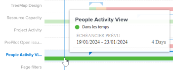

# Afficher la visualisation du plan de vol dans Analytique améliorée

La visualisation du plan de vol indique le nombre de projets en cours (selon les critères de filtrage appliqués), les changements de conditions survenus tout au long de la vie de ces projets et le degré de conformité de ces projets aux délais d’achèvement prévus.

## Conditions d’accès

Vous devez disposer des éléments suivants :

<table style="table-layout:auto"> 
 <col> 
 <col> 
 <tbody> 
  <tr> 
   <td role="rowheader"><a href="https://www.workfront.com/plans?lang=fr" target="_blank">Formule Adobe Workfront</a>*</td> 
   <td> 
Professionnel ou supérieur
 </td> 
  </tr> 
  <tr> 
   <td role="rowheader"><a href="../administration-and-setup/add-users/access-levels-and-object-permissions/wf-licenses.md" class="MCXref xref">Présentation des licences Adobe Workfront</a>*</td> 
   <td> 
Révision ou supérieur
 </td> 
  </tr> 
  <tr> 
   <td role="rowheader">Configurations des niveau d’accès*</td> 
   <td> 
Affichage de l’accès aux projets
 
Remarque : Si vous n’avez toujours pas accès à , demandez à votre administrateur Workfront s’il définit des restrictions supplémentaires à votre niveau d’accès. Pour plus d’informations sur la façon dont un administrateur Workfront peut modifier votre niveau d’accès, voir <a href="../administration-and-setup/add-users/configure-and-grant-access/create-modify-access-levels.md" class="MCXref xref">Création ou modification de niveaux d’accès personnalisés</a>.
 </td> 
  </tr> 
  <tr> 
   <td role="rowheader">Autorisations d’objet</td> 
   <td> 
Afficher l’accès au projet
 
Pour plus d’informations sur la demande d’accès supplémentaire, voir <a href="../workfront-basics/grant-and-request-access-to-objects/request-access.md" class="MCXref xref">Demander l’accès aux objets</a>.
 </td> 
  </tr> 
 </tbody> 
</table>

&#42;Pour connaître le forfait, le type de licence ou l’accès dont vous disposez, contactez votre administrateur ou administratrice Workfront.

## Conditions préalables

Pour connaître les conditions préalables à l’utilisation d’Analytics amélioré, reportez-vous à la section &quot;Conditions préalables&quot; dans la [présentation des analyses améliorées](../enhanced-analytics/enhanced-analytics-overview.md).

## Présentation de la visualisation du plan de vol

Dans la durée réelle d’un projet, vous ne pouvez afficher que les conditions suivantes :

* Dans les temps
* En danger
* En difficulté

Pour en savoir plus sur les conditions du projet, voir [Présentation de la condition et du type de condition du projet](../manage-work/projects/manage-projects/project-condition-and-condition-type.md).

La visualisation du plan de vol présente les détails suivants du projet :

* **Durée planifiée** : la ligne bleue horizontale représente la durée prévue du projet, les triangles situés à chaque fin de la ligne indiquant la date de début et la date de fin.

  

* **Durée réelle** : la ligne épaisse et colorée sous la durée prévue représente la durée réelle du projet. La couleur de la ligne change en fonction de l’état du projet à ce moment précis de la vie du projet.

  

* **Condition réelle** : la ligne épaisse et colorée affiche également la condition d’un projet à différents moments dans le temps. La couleur de la ligne change en fonction de la condition du projet :

   * **Vert** : Sur Target
   * **Orange** : à risque
   * **Rouge** : en problème

  

Pointez sur une ligne de projet dans la visualisation Plan de vol pour afficher des informations sur la période prévue du projet, la condition actuelle du projet et, le cas échéant, la condition personnalisée. Pour obtenir une vue plus détaillée de ce qui a pu affecter la durée ou la condition, vous pouvez consulter les autres visualisations dans la zone Analyses améliorées.

Ces informations vous aident à déterminer :

* Les événements étendent un projet au-delà de la date d’achèvement prévue d’origine.
* Lorsqu’un projet commence à rencontrer des problèmes.
* Le nombre de projets ouverts au cours de la même période.
* Le nombre de projets actifs.
* Les projets qui nécessitent une attention ou un soutien supplémentaire.

Pour plus d’informations sur la manière d’obtenir les meilleures données pour cette visualisation, consultez la [présentation des analyses améliorées](../enhanced-analytics/enhanced-analytics-overview.md).

## Visualisation du plan de vol

1. Cliquez sur l&#39;icône **Menu principal** , puis sélectionnez **Analytics**.
1. (Facultatif) Pour utiliser une autre période, sélectionnez de nouvelles dates de début et de fin dans le filtre de période.

   

   Pour plus d’informations sur l’utilisation du filtre de période, voir [Application de filtres dans les analyses améliorées](../enhanced-analytics/use-enhanced-analytics-filters.md).

1. (Conditionnel) Si vous devez limiter l’ensemble de données du projet, sélectionnez les filtres à utiliser et appliquez-les.

   Pour plus d’informations sur l’ajout de filtres dans les analyses améliorées, voir [Application de filtres dans les analyses améliorées](../enhanced-analytics/use-enhanced-analytics-filters.md).

   Une fois que vous avez ajouté des filtres, les données de 50 projets au maximum s’affichent et les filtres restent actifs même après avoir quitté la page ou vous être déconnecté de Workfront.

1. (Facultatif) Pour effectuer un zoom avant sur une période, sélectionnez un point de la visualisation pour le début de la période et faites glisser le curseur jusqu’à la fin de la période.

   Toutes les autres visualisations se mettent à jour sur la même période et un filtre de période est créé.

   

1. (Facultatif) Pour modifier le mode de tri des projets, cliquez sur le menu **Trier par** dans le coin supérieur droit de la visualisation du plan de vol, puis sélectionnez une nouvelle option de tri :

   * **A - Z**
   * **Z - A**
   * **Date d’achèvement prévue**
   * **Date de début planifiée**

   Toutes les autres visualisations de la page sont mises à jour pour correspondre à votre sélection de tri.

1. (Conditionnel) S’il existe plus de 50 projets dans votre jeu de données, utilisez les flèches situées dans le coin inférieur gauche de la visualisation pour passer d’un groupe de 50 projets à un autre.

   Toutes les autres visualisations de la page sont mises à jour pour correspondre à votre sélection de page.

   

1. Passez la souris sur le graphique à barres de projet pour afficher la ligne de date bleue, ainsi que les détails suivants :

   * Planning planifié
   * Condition actuelle
   * Condition personnalisée (le cas échéant)

   

1. (Facultatif) Pour exporter les données de visualisation, cliquez sur l’icône **Exporter**  dans le coin supérieur droit de la visualisation, puis sélectionnez le format d’exportation :

   * **Graphique (PNG)**
   * **Table de données (XSLX)**

1. Pour afficher plus d’informations sur le projet, cliquez sur un projet dans la visualisation pour ouvrir les visualisations de Burndown et de Tasks in flight.

   Ces visualisations peuvent vous aider à mieux comprendre ce qui a empêché le projet de démarrer. Ils facilitent également l’archivage sur un projet en cours.\
   Pour plus d’informations sur la visualisation de Burndown, voir [Affichage de la visualisation de Burndown dans les analyses améliorées](../enhanced-analytics/burndown-overview.md). Pour plus d’informations sur la visualisation Tâches en vol, voir [Affichage des tâches en visualisation en vol dans l’analyse améliorée](../enhanced-analytics/tasks-in-flight-overview.md).

