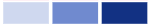
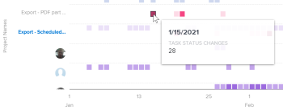

# Afficher la visualisation de l’activité de projet dans Analytique améliorée

<!-- Audited: 12/2023 -->

La visualisation de l’activité de projet présente une vue agrégée des activités au niveau du projet (les activités de chaque personne affectée au projet) qui se sont produites au cours d’une période spécifique. Vous pouvez vous concentrer sur les activités d’un projet ou comparer les activités d’un projet à d’autres projets dans Adobe Workfront.

>[!NOTE]
>
>La visualisation Activité par équipe se comporte de la même manière que cette visualisation, mais la visualisation Activité par équipe affiche l’activité de l’équipe interne pour tous les projets.\
>Pour plus d’informations sur la visualisation Activité par équipe, voir [Afficher la visualisation Activité par équipe dans Analytique améliorée](../enhanced-analytics/activity-by-team-overview.md).

## Conditions d’accès

Vous devez disposer des éléments suivants :

<table style="table-layout:auto"> 
 <col> 
 <col> 
 <tbody> 
  <tr> 
   <td role="rowheader"><a href="https://www.workfront.com/plans?lang=fr" target="_blank">Plan Workfront</a></td> 
   <td> 
Entreprises ou niveau supérieur
 </td> 
  </tr> 
  <tr> 
   <td role="rowheader"><a href="../administration-and-setup/add-users/access-levels-and-object-permissions/wf-licenses.md" class="MCXref xref">Vue d’ensemble des licences Adobe Workfront</a></td> 
   <td>   
Nouveau :
 
   <ul><li>Light ou supérieur</li></ul>
   
Actuel :

   <ul><li>Révision ou supérieur</li></ul>
 </td> 
  </tr> 
  <tr> 
   <td role="rowheader">Configurations des niveaux d’accès</td> 
   <td> 
Afficher l’accès aux projets
 <!--
Note: If you still don't have access, ask your Workfront administrator if they set additional restrictions in your access level. For information on how a Workfront administrator can change your access level, see <a href="../administration-and-setup/add-users/configure-and-grant-access/create-modify-access-levels.md" class="MCXref xref">Create or modify custom access levels</a>.
--> </td> 
  </tr> 
  <tr> 
   <td role="rowheader">Autorisations d’objet</td> 
   <td> 
Afficher
 <!--
For information on requesting additional access, see <a href="../workfront-basics/grant-and-request-access-to-objects/request-access.md" class="MCXref xref">Request access to objects </a>.
--> </td> 
  </tr> 
 </tbody> 
</table>

Pour plus d’informations sur le contenu de ce tableau, voir [Conditions d’accès requises dans la documentation Workfront](/help/quicksilver/administration-and-setup/add-users/access-levels-and-object-permissions/access-level-requirements-in-documentation.md).

## Conditions préalables

Pour connaître les conditions préalables à l’utilisation d’Analytique améliorée, reportez-vous à la section « Conditions préalables » de la section [Vue d’ensemble d’Analytique améliorée](../enhanced-analytics/enhanced-analytics-overview.md).

## Comprendre la visualisation Activité des projets

Les activités du projet s’affichent en différentes couleurs pour résumer les événements spécifiques d’un projet sur une période donnée :

* **Utilisateurs et utilisatrices connectés** : les cases violettes indiquent que les personnes affectées au projet se sont connectées ce jour-là. Une nuance plus sombre indique un nombre plus élevé de personnes se connectant.

  

* **Modification du statut de la tâche** : les cases roses montrent que des personnes ont modifié le statut d’une tâche pour le projet ce jour-là. Une nuance plus foncée indique un nombre plus élevé de changements de statut d’une tâche.

  

* **Tâches terminées** : les cases bleues indiquent que des personnes ont terminé une tâche pour le projet. Une nuance plus foncée indique un nombre plus élevé de tâches terminées.

  

En pointant sur une case, vous pouvez voir le nombre exact de fois où l’action a été effectuée au cours d’un jour donné. Vous pouvez sélectionner un projet pour afficher la ventilation de ces activités pour chaque personne individuelle contribuant au projet.

Ces informations vous aident à déterminer :

* L’activité sur un projet spécifique.
* L’activité d’un projet par rapport à d’autres projets.
* Quelles personnes travaillent sur un projet et à quelle fréquence.

Pour savoir comment obtenir les meilleures données pour cette visualisation, voir [Vue d’ensemble d’Analytique améliorée](../enhanced-analytics/enhanced-analytics-overview.md).

## Afficher la visualisation Activité des projets

1. Cliquez sur l’icône du menu principal , puis sélectionnez **Analytics**.
1. (Facultatif) Pour utiliser une autre période, sélectionnez de nouvelles dates de début et de fin dans le filtre des périodes.

   

   Pour plus d’informations sur l’utilisation du filtre de période, voir [Appliquer des filtres dans Analytique améliorée](../enhanced-analytics/use-enhanced-analytics-filters.md).

   >[!NOTE]
   >
   >Si vous sélectionnez une période supérieure à trois mois, la visualisation Activité des projets n’affiche aucune donnée.

1. Le cas échéant, si vous devez limiter l’ensemble de données du projet, sélectionnez les filtres à utiliser et appliquez-les.

   Pour plus d’informations sur l’ajout de filtres dans Analytique améliorée, voir [Appliquer des filtres dans Analytique améliorée](../enhanced-analytics/use-enhanced-analytics-filters.md).

   Une fois les filtres ajoutés, les données de 50 projets au maximum s’affichent et les filtres restent actifs même lorsque vous quittez la page ou en cas de déconnexion de Workfront.

1. (Facultatif) Pour effectuer un zoom avant sur une période, sélectionnez un point de la visualisation pour le début de la période, puis faites-le glisser jusqu’à la fin de la période.

   Toutes les autres visualisations sont mises à jour sur la même période et un filtre de délai est créé.

   

1. (Facultatif) Pour modifier le mode de tri des projets, cliquez sur le bouton **Tri par**, puis sélectionnez une nouvelle option de tri :

   * **A - Z**
   * **Z - A**
   * **Date d’achèvement prévue**
   * **Date de début prévue**

   Toutes les autres visualisations de la page sont mises à jour pour correspondre à votre sélection de classement.

1. (Le cas échéant) S’il existe plus de 50 projets dans votre jeu de données, utilisez les flèches situées dans le coin inférieur gauche de la visualisation pour passer d’un groupe de 50 projets à un autre.

   Toutes les autres visualisations de la page sont mises à jour pour correspondre à votre sélection de page.

   

1. Cliquez sur un projet dans la visualisation pour afficher plus de détails sur le projet.

   La liste se développe pour afficher les activités de chaque contributeur individuel et contributrice individuelle du projet.

1. Pointez sur une zone pour afficher la date à laquelle les personnes ont terminé une action, ainsi que le nombre de fois où l’action a été terminée pour cette journée.

   

1. (Facultatif) Pour exporter les données de visualisation, cliquez sur l’icône **Exporter**  dans le coin supérieur droit de la visualisation, puis sélectionnez le format d’exportation :

   * **Graphique (PNG)**
   * **Table de données (XSLX)**

