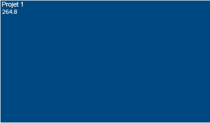
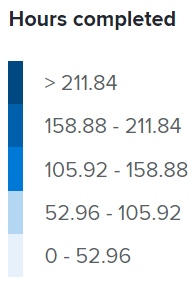

# Afficher la visualisation d’arborescence du projet dans Analytique améliorée

<!-- Audited: 12/2023 -->

La visualisation d’arborescence du projet est une vue des heures ou des jours travaillés au cours d’une période spécifique par rapport à d’autres volumes de tâches. Vous obtenez ainsi une meilleure compréhension du temps que les personnes ont consacré à un projet.

{width="700"}

## Conditions d’accès

Vous devez disposer des éléments suivants :

<table style="table-layout:auto"> 
 <col> 
 <col> 
 <tbody> 
  <tr> 
   <td role="rowheader"><a href="https://www.workfront.com/plans?lang=fr" target="_blank">Formule Adobe Workfront</a></td> 
   <td> 
Entreprises ou niveau supérieur
 </td> 
  </tr> 
  <tr> 
   <td role="rowheader"><a href="../administration-and-setup/add-users/access-levels-and-object-permissions/wf-licenses.md" class="MCXref xref">Vue d’ensemble des licences Adobe Workfront</a></td> 
   <td>   
Nouveau :
 
   <ul><li>Light ou supérieur</li></ul>
   
Actuel :

   <ul><li>Révision ou supérieur</li></ul>
 </td> 
  </tr> 
  <tr> 
   <td role="rowheader">Configurations des niveaux d’accès</td> 
   <td> 
Afficher l’accès aux projets
 <!--
Note: If you still don't have access, ask your Workfront administrator if they set additional restrictions in your access level. For information on how a Workfront administrator can change your access level, see <a href="../administration-and-setup/add-users/configure-and-grant-access/create-modify-access-levels.md" class="MCXref xref">Create or modify custom access levels</a>.
--> </td> 
  </tr> 
  <tr> 
   <td role="rowheader">Autorisations d’objet</td> 
   <td> 
Afficher
 <!--
For information on requesting additional access, see <a href="../workfront-basics/grant-and-request-access-to-objects/request-access.md" class="MCXref xref">Request access to objects </a>.
--> </td> 
  </tr> 
 </tbody> 
</table>

Pour plus d’informations sur le contenu de ce tableau, voir [Conditions d’accès requises dans la documentation Workfront](/help/quicksilver/administration-and-setup/add-users/access-levels-and-object-permissions/access-level-requirements-in-documentation.md).

## Conditions préalables

Pour connaître les conditions préalables à l’utilisation d’Analytique améliorée, consultez la section « Conditions préalables » dans la [Vue d’ensemble d’Analytique améliorée](../enhanced-analytics/enhanced-analytics-overview.md).

## Présentation de la visualisation d’arborescence du projet

Les zones de la visualisation d’arborescence du projet représentent les projets et la taille des zones montre une comparaison du temps passé sur différents projets. Plus la zone est grande, plus le temps passé sur le projet est élevé.

La visualisation d’arborescence du projet comprend les éléments suivants :

* **Zones plus petites, bleu clair** : les projets qui comportent moins d’heures (ou de jours) s’affichent sous forme de petites zones de couleur bleu clair.

  

* **Zones plus grandes, bleu foncé** : les projets qui comportent plus d’heures (ou de jours) s’affichent sous forme de zones plus grandes avec une couleur bleu foncé.

  

* **Zones de taille moyenne, bleu** : les projets intermédiaires s’affichent sous forme de zones de taille moyenne, avec une nuance de bleu se situant entre le bleu foncé et le bleu clair. Les zones de taille moyenne peuvent présenter 3 nuances de bleu.

La légende à droite indique la ventilation des heures terminées pour chaque nuance de bleu. Cette légende est dynamique et s’actualise en fonction des données.

>[!NOTE]
>
>Si vous observez la visualisation d’arborescence du projet par durée plutôt que par heures prévues, cette légende présente une ventilation des jours travaillés pour chaque nuance de bleu.\
>>

Ces informations vous aident à déterminer :

* La priorité des tâches en cours de traitement au cours de la période sélectionnée.
* Ce sur quoi les équipes passent du temps.
* Si les équipes travaillent sur les tâches pertinentes.
* Lorsqu’un utilisateur ou une utilisatrice clique sur un projet spécifique, la différence de portée d’un projet au cours de cette période.

Pour savoir comment obtenir les meilleures données pour cette visualisation, voir [Vue d’ensemble d’Analytique améliorée](../enhanced-analytics/enhanced-analytics-overview.md).

## Afficher la visualisation d’arborescence du projet

1. Cliquez sur l’icône Menu principal , puis sélectionnez **Analytics**.
1. (Facultatif) Pour utiliser une autre période, sélectionnez de nouvelles dates de début et de fin dans le filtre des périodes.

   

   Pour plus d’informations sur l’utilisation du filtre de période, voir [Appliquer des filtres dans Analytique améliorée](../enhanced-analytics/use-enhanced-analytics-filters.md).

1. Le cas échéant, si vous devez limiter l’ensemble de données du projet, sélectionnez les filtres à utiliser et appliquez-les.

   Pour plus d’informations sur l’ajout de filtres dans Analytique améliorée, voir [Appliquer des filtres dans Analytique améliorée](../enhanced-analytics/use-enhanced-analytics-filters.md).

   Une fois les filtres ajoutés, les données de 50 projets au maximum s’affichent et les filtres restent actifs même lorsque vous quittez la page ou en cas de déconnexion de Workfront.

1. (Facultatif) Pour modifier le mode de tri des projets, cliquez sur le bouton **Trier par** dans le coin supérieur droit de la visualisation d’arborescence du projet, puis sélectionnez une nouvelle option de tri :

   * **A - Z**
   * **Z - A**
   * **Date d’achèvement prévue**
   * **Date de début prévue**

   Toutes les autres visualisations de la page sont mises à jour pour correspondre à votre sélection de classement.

1. (Le cas échéant) S’il existe plus de 50 projets dans votre jeu de données, utilisez les flèches situées dans le coin inférieur gauche de la visualisation pour passer d’un groupe de 50 projets à un autre.

   Toutes les autres visualisations de la page sont mises à jour pour correspondre à votre sélection de page.

   

1. (Facultatif) Modifiez la vue du **nombre d’heures prévues** vers la **durée**.

   Le nombre d’heures prévues est sélectionné par défaut.

1. Pointez sur un projet pour afficher la condition du projet, ainsi que le nombre total d’heures prévues, le nombre total d’heures terminées et le nombre moyen d’heures passées sur le projet par jour.

   

   >[!NOTE]
   >
   >Si vous avez sélectionné la vue **durée**, vous verrez les détails de durée suivants :
   >
   >* **Échéancier prévu** : nombre de jours prévus pour terminer le projet.
   >* **Jours travaillés** : durée prévue de chaque tâche qui a été effectuée sur la période sélectionnée en haut, divisée par le nombre d’heures par jour.
   >   
   >
   >
   >Pour plus d’informations sur la durée, voir la section « Vue Durée » dans [Vue d’ensemble d’Analytique améliorée](../enhanced-analytics/enhanced-analytics-overview.md).

1. (Facultatif) Pour exporter les données de visualisation, cliquez sur l’**icône Exporter**  dans le coin supérieur droit de la visualisation, puis sélectionnez le format d’export :

   * **Graphique (PNG)**
   * **Tableau de données (XSLX)**

1. Cliquez sur un projet pour ouvrir les visualisations d’avancement et des tâches en cours afin de mieux comprendre comment les tâches et les heures (ou jours) ont contribué à la taille d’un projet.

Pour plus d’informations sur la visualisation d’avancement, voir [Afficher la visualisation d’avancement dans l’Analytique améliorée](../enhanced-analytics/burndown-overview.md). Pour plus d’informations sur la visualisation des tâches en cours, voir [Afficher la visualisation des tâches en cours dans l’Analytique améliorée](../enhanced-analytics/tasks-in-flight-overview.md).

