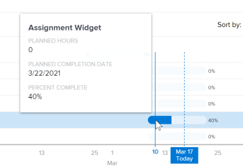

# Afficher la visualisation des tâches en cours dans Analytique améliorée

>[!IMPORTANT]
>
>Enhanced Analytics a été supprimé de Workfront le 27 mai. Workfront Data Connect est une nouvelle solution alternative qui peut être utilisée pour répliquer toutes les visualisations Enhanced Analytics que vous utilisez actuellement.  Pour plus d’informations, consultez le guide [Obsolescence améliorée d’Analytics](/help/quicksilver/product-announcements/announcements/enhanced-analytics-deprecation.md) .

La visualisation des tâches en cours indique le nombre de tâches (dans les critères de filtre appliqués) en cours pour un projet, le pourcentage de travail terminé pour chaque tâche et la planification des tâches.

## Conditions d’accès

Vous devez disposer des éléments suivants :

<table style="table-layout:auto"> 
 <col> 
 <col> 
 <tbody> 
  <tr> 
   <td role="rowheader"><a href="https://business.adobe.com/products/workfront/pricing.html" target="_blank">Plan Adobe Workfront</a>*</td> 
   <td> 
Entreprises ou niveau supérieur
 </td> 
  </tr> 
  <tr> 
   <td role="rowheader"><a href="../administration-and-setup/add-users/access-levels-and-object-permissions/wf-licenses.md" class="MCXref xref">Vue d’ensemble des licences Adobe Workfront</a>*</td> 
   <td> 
Révision ou supérieur
 </td> 
  </tr> 
  <tr> 
   <td role="rowheader">Configurations du niveau d’accès*</td> 
   <td> 
Afficher l’accès aux projets
 
Accès en affichage aux tâches (pour mettre à jour les tâches, vous devez disposer de l’accès en modification aux tâches).
 
Remarque : si vous n’avez toujours pas d’accès, demandez à votre équipe d’administration Workfront s’il existe des restrictions supplémentaires à votre niveau d’accès. Pour plus d’informations sur la façon dont un administrateur ou une administratrice Workfront peut modifier votre niveau d’accès, voir <a href="../administration-and-setup/add-users/configure-and-grant-access/create-modify-access-levels.md" class="MCXref xref">Créer ou modifier les niveaux d’accès personnalisés</a>.
 </td> 
  </tr> 
  <tr> 
   <td role="rowheader">Autorisations d’objet</td> 
   <td> 
Autorisation Affichage pour les objets de projet et de tâche.
 
Pour plus d’informations sur la demande d’accès supplémentaire, consultez <a href="../workfront-basics/grant-and-request-access-to-objects/request-access.md" class="MCXref xref">Demander l’accès à des objets</a>.
 </td> 
  </tr> 
 </tbody> 
</table>

&#42;Pour connaître le forfait, le type de licence ou l’accès dont vous disposez, contactez votre administrateur ou administratrice Workfront.

## Conditions préalables

Pour connaître les conditions préalables à l’utilisation d’Analytique améliorée, reportez-vous à la section « Conditions préalables » de la section [Vue d’ensemble d’Analytique améliorée](../enhanced-analytics/enhanced-analytics-overview.md).

## Comprendre la visualisation des tâches en cours

La visualisation de plan Tâches en cours affiche les détails de tâche suivants :

* **Durée prévue de la tâche** : la longueur d’une barre de tâche indique la durée prévue, basée sur la date de début et la date d’achèvement de la tâche.

  

* **Effort de travail effectué** : la couleur bleue foncée dans une barre de tâche indique la quantité de travail déjà terminée pour une tâche. Ce pourcentage d’achèvement s’affiche à droite de la barre de tâche.

  

* **Effort de travail restant** : la couleur bleue claire dans une barre de tâche indique la quantité de travail restante à effectuer pour une tâche.

  

Ces informations peuvent vous aider à déterminer :

* Là où l’effort de travail a été concentré.
* Les tâches qui pourraient mettre un projet en danger.
* À quel point une tâche est près d’être terminée.
* À qui vous devez parler d’une tâche spécifique.

Pour savoir comment obtenir les meilleures données pour cette visualisation, voir [Vue d’ensemble d’Analytique améliorée](../enhanced-analytics/enhanced-analytics-overview.md).

## Afficher la visualisation des tâches en cours

1. Cliquez sur l’icône du menu principal , puis sélectionnez **Analytics**.
1. (Facultatif) Pour utiliser une autre période, sélectionnez de nouvelles dates de début et de fin dans le filtre des périodes.

   

   Pour plus d’informations sur l’utilisation du filtre de période, voir [Appliquer des filtres dans Analytique améliorée](../enhanced-analytics/use-enhanced-analytics-filters.md).

1. Le cas échéant, si vous devez limiter l’ensemble de données du projet, sélectionnez les filtres à utiliser et appliquez-les.

   Pour plus d’informations sur l’ajout de filtres dans Analytique améliorée, voir [Appliquer des filtres dans Analytique améliorée](../enhanced-analytics/use-enhanced-analytics-filters.md).

   Une fois les filtres ajoutés, les données de 50 projets au maximum s’affichent et les filtres restent actifs même lorsque vous quittez la page ou en cas de déconnexion de Workfront.

1. Sur la visualisation de plan de vol ou d’arborescence du projet, cliquez sur un projet pour afficher plus d’informations.

   Les visualisations d’avancement et des tâches en cours s’affichent.

   >[!NOTE]
   >
   >Pour en savoir plus sur ces autres visualisations, consultez :
   >
   >   
   >   
   >   * [Afficher la visualisation de plan de vol dans Analytique améliorée](../enhanced-analytics/flight-plan-overview.md)
   >   * [Afficher la visualisation d’arborescence du projet dans Analytique améliorée](../enhanced-analytics/project-treemap-overview.md)
   >   * [Afficher la visualisation de l’avancement dans Analytique améliorée](../enhanced-analytics/burndown-overview.md)
   >   
   >

1. (Facultatif) Pour effectuer un zoom avant sur une période, sélectionnez un point de la visualisation pour le début de la période, puis faites-le glisser jusqu’à la fin de la période.

   Toutes les autres visualisations sont mises à jour sur la même période et un filtre de délai est créé.

   

1. (Facultatif) Pour modifier le classement des tâches, cliquez sur le menu **Classer par**, puis sélectionnez une nouvelle option de classement :

   * **Date d’achèvement**
   * **Ordre alphabétique A-Z**
   * **Structure de répartition du travail** (Cette option correspond à l’ordre dans lequel les tâches apparaissent dans le projet.)

   Toutes les autres visualisations de la page sont mises à jour pour correspondre à votre sélection de classement.

1. Passez en revue la progression des tâches dans le projet sélectionné, puis pointez sur une tâche spécifique pour afficher le nombre d’heures prévues, la date d’échéance prévue et le pourcentage d’achèvement.

   

1. Cliquez sur une tâche pour ouvrir les Détails de la tâche dans la partie droite de l’écran, où vous pouvez voir plus d’informations sur la tâche, afficher ou saisir des mises à jour, ou apporter des modifications à la tâche.

   

1. (Facultatif) Pour exporter les données de visualisation, cliquez sur l’icône **Exporter**  dans le coin supérieur droit de la visualisation, puis sélectionnez le format d’exportation :

   * **Graphique (PNG)**
   * **Table de données (XSLX)**

