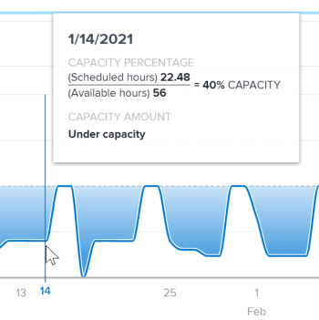

# Visualisation de la capacité de l’équipe dans Enhanced Analytics

<!-- Audited: 01/2024 -->

La visualisation de la capacité de l’équipe indique la capacité totale d’une équipe d’accueil, qu’elle soit surchargée ou sous-affectée, et la dynamique de la capacité au fil du temps.

## Exigences d’accès

Vous devez disposer des accès suivants pour effectuer les étapes de cet article :

<table style="table-layout:auto"> 
 <col> 
 <col> 
 <tbody> 
  <tr> 
   <td role="rowheader">Formule Adobe Workfront</td> 
   <td>
      
Nouveau : Quelconque

      
ou

      
Actuel : métier ou supérieur
</td>
  </tr> 
  <tr> 
   <td role="rowheader">Présentation des licences Adobe Workfront</td>
   <td>
      
Nouveau : clair ou supérieur

      
ou

      
Actuel : révision ou version ultérieure

   </td>
  </tr> 
  <tr> 
   <td role="rowheader">Paramétrages du niveau d'accès</td> 
   <td>Affichage de l’accès aux projets</td> 
  </tr> 
  <tr> 
   <td role="rowheader">Autorisations d’objet</td> 
   <td>Afficher </td> 
  </tr> 
 </tbody> 
</table>

Pour plus d’informations sur ce tableau, voir [Conditions d’accès requises dans la documentation Workfront](/help/quicksilver/administration-and-setup/add-users/access-levels-and-object-permissions/access-level-requirements-in-documentation.md).

## Conditions préalables

Pour connaître les conditions préalables à l’utilisation d’Analytics amélioré, reportez-vous à la section &quot;Conditions préalables&quot; de la section [Présentation des analyses améliorées](../enhanced-analytics/enhanced-analytics-overview.md).

## Présentation de la visualisation des capacités de l’équipe

La visualisation Capacité de l’équipe affiche le volume de travail attribué à l’équipe d’accueil un jour donné.

* **Burnout**: lorsque la couleur de fond bleue plus foncée est au-dessus de la ligne pointillée, l’équipe d’accueil dispose de plus d’heures de travail qu’elle ne peut en terminer avec le nombre d’heures pendant lesquelles l’équipe est disponible. Cela indique que l&#39;équipe est surchargée et pourrait s&#39;approcher d&#39;un épuisement.

  

* **Non contesté**: lorsque la couleur de fond bleue plus foncée est sous la ligne pointillée, l’équipe d’accueil dispose de plus d’heures de travail que la quantité de travail qui lui est affectée. Cela indique que l’équipe est sous-affectée et peut être incontestée.

  

* **Balance**: lorsque la couleur de fond bleue plus claire ou plus transparente est juste au-dessus, juste en dessous, ou sur la ligne pointillée, l’équipe d’accueil dispose d’une quantité d’heures de travail qui lui est affectée et qui doit pouvoir être accomplie pendant les heures de travail disponibles. Cela indique que la charge de travail de l’équipe est plus équilibrée.

  

Le survol d’un point de la visualisation affiche les détails suivants pour un jour donné :

* **Heures planifiées**: il s’agit du nombre d’heures de travail planifiées que l’équipe doit terminer.
* **Heures disponibles**: nombre d’heures de travail pendant lesquelles l’équipe est disponible.
* **Capacité**: outre un pourcentage de capacité, les désignations À la capacité, En sous-capacité ou En surcapacité s’affichent également.

L’affichage de ces informations vous permet de déterminer les éléments suivants :

* Lorsque l&#39;équipe d&#39;accueil a été surchargée ou sous-affectée.
* Si l&#39;équipe d&#39;accueil est surchargée ou sous-affectée quotidiennement.
* La cohérence de la charge de travail d’une équipe domestique au quotidien.
* Si vous créez des problèmes de capacité avec un nouveau travail.

Pour savoir comment obtenir les meilleures données pour cette visualisation, voir [Présentation des analyses améliorées](../enhanced-analytics/enhanced-analytics-overview.md).

## Visualisation de la capacité de l’équipe

{{step1-to-analytics}}

1. Dans le panneau de gauche, sélectionnez **Personnes**.

   

1. (Facultatif) Pour utiliser une autre période, sélectionnez de nouvelles dates de début et de fin dans le filtre de période.

   

   Pour plus d’informations sur l’utilisation du filtre de période, voir [Application de filtres dans les analyses améliorées](../enhanced-analytics/use-enhanced-analytics-filters.md).

1. (Conditionnel) Si vous n’avez pas défini le filtre Équipe, ajoutez le filtre Équipe et sélectionnez chaque équipe pour laquelle vous souhaitez afficher des données.

   Pour plus d’informations sur l’ajout de filtres dans les analyses améliorées, voir [Application de filtres dans les analyses améliorées](../enhanced-analytics/use-enhanced-analytics-filters.md).

   Une fois que vous avez ajouté des filtres, les données de 50 projets au maximum s’affichent et les filtres restent actifs même après avoir quitté la page ou vous être déconnecté de Workfront.

1. Dans la visualisation de la capacité des ressources, cliquez sur une équipe pour afficher plus d’informations.

   La visualisation Capacité de l’équipe s’affiche.

   Pour plus d’informations sur la visualisation de la capacité de ressource, voir [Visualisation de la capacité des ressources dans les analyses améliorées](../enhanced-analytics/resource-capacity-overview.md).

1. (Facultatif) Pour effectuer un zoom avant sur une période, sélectionnez un point de la visualisation pour le début de la période et faites glisser le curseur jusqu’à la fin de la période.

   Toutes les autres visualisations se mettent à jour sur la même période et un filtre de période est créé.

   

1. Passez la souris sur une ligne graphique pour afficher les heures planifiées et les heures planifiées planifiées pour la date donnée, ainsi que le pourcentage de capacité et si l’équipe d’accueil était terminée, sous ou à la capacité à l’époque.

   

1. (Facultatif) Pour exporter les données de visualisation, cliquez sur le bouton **Exporter** icon  dans le coin supérieur droit de la visualisation, sélectionnez le format d’exportation :

   * Graphique (PNG)
   * Tableau de données (XSLX)

