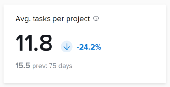

# Comprendre les KPI d’Analytique améliorée

>[!IMPORTANT]
>
>Enhanced Analytics sera supprimé de Workfront dans la semaine du 26 mai. Workfront Data Connect est une nouvelle solution alternative qui peut être utilisée pour répliquer toutes les visualisations Enhanced Analytics que vous utilisez actuellement.  Pour plus d’informations, consultez le guide [Obsolescence améliorée d’Analytics](/help/quicksilver/product-announcements/announcements/enhanced-analytics-deprecation.md) .

Une formule Entreprise ou supérieure est requise pour utiliser cette fonctionnalité.\
Pour plus d’informations sur les différents plans disponibles, voir [Plans Adobe Workfront](https://business.adobe.com/products/workfront/pricing.html).

Dans la partie supérieure de l’écran de la zone Analytique améliorée, quatre indicateurs de performances clés (KPI) s’affichent. Ces mesures vous permettent de déterminer rapidement le temps nécessaire à la réalisation des projets, leur taille et le nombre de projets terminés au cours d’une période donnée. Ces chiffres ne sont pas limités au maximum de 50 projets qui s’affichent pour les visualisations de cette page. Au lieu de cela, ces données sont basées sur tous les projets qui s’appliquent à des filtres définis. Ces chiffres s’ajustent si vous modifiez la période sélectionnée ou l’un des filtres.

Pour savoir comment ajouter des filtres, voir [Appliquer des filtres dans Analytique améliorée](../enhanced-analytics/use-enhanced-analytics-filters.md).

## Projets terminés

Le KPI « Projets terminés » indique le nombre de projets terminés sur une période filtrée, ainsi que l’augmentation ou la diminution du pourcentage depuis la période précédente. Vous trouverez ci-dessous le nombre de projets terminés au cours de la période précédente ainsi que le nombre de jours de la période précédente.

## Projets terminés dans les délais

Le KPI « Projets terminés dans les délais » indique le pourcentage de projets terminés dans les délais au cours de la période filtrée, ainsi que l’augmentation ou la diminution du pourcentage depuis la période précédente. Vous trouverez ci-dessous le pourcentage de projets terminés dans les délais au cours de la période précédente, ainsi que le nombre de jours de la période précédente.

## Durée moy. du projet

Le KPI « Durée moy.du projet » indique la durée moyenne d’achèvement des projets (en jours, semaines ou années) avec des dates de fin effectives au cours de la période filtrée, ainsi que l’augmentation ou la diminution du pourcentage depuis la période précédente. En dessous de ces chiffres, vous pouvez voir la durée moyenne d’achèvement des projets avec des dates de fin effectives dans la période précédente, ainsi que le nombre de jours dans la période précédente.

## Tâches moy. par projet

Le KPI « Tâches moy. par projet » indique le nombre moyen de tâches affectées aux projets au cours de la période filtrée, ainsi que l’augmentation ou la diminution du pourcentage depuis la période précédente. Vous trouverez ci-dessous le nombre moyen de tâches affectées aux projets au cours de la période précédente, ainsi que le nombre de jours de la période précédente.

