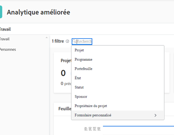
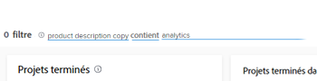

# Application de filtres dans les analyses améliorées

Les filtres de la zone Analyses améliorées vous aident à vous concentrer sur des projets spécifiques ou des types de données spécifiques. Les types de filtres que vous utilisez peuvent vous donner des informations sur les éléments suivants :

* Projets que vous possédez
* Vues de portefeuille ou de programme spécifiques
* Indicateurs de performance clés pour une période spécifique (semaine, trimestre, année fiscale)

Vous pouvez ajouter et supprimer des filtres selon vos besoins, et Adobe Workfront conserve les filtres que vous appliquez même si vous vous déconnectez.

## Exigences d’accès

Pour terminer cette tâche, vous devez disposer des éléments suivants :

<table style="table-layout:auto"> 
 <caption style="text-align: left;">
  *Pour connaître le plan, le type de licence ou l’accès dont vous disposez, contactez votre administrateur Workfront.
 </caption> 
 <col> 
 <col> 
 <tbody> 
  <tr> 
   <td> 
<a href="https://www.workfront.com/plans" target="_blank">Formule Workfront</a>*
 </td> 
   <td>Professionnel ou supérieur</td> 
  </tr> 
  <tr> 
   <td> 
<a href="../administration-and-setup/add-users/access-levels-and-object-permissions/wf-licenses.md" class="MCXref xref">Présentation des licences Adobe Workfront</a>*
 </td> 
   <td> 
Révision ou version ultérieure
 </td> 
  </tr> 
  <tr> 
   <td><b>Niveau d’accès*</b> </td> 
   <td> 
Affichage de l’accès aux projets
 
Vous devez également disposer d’un accès en mode Affichage aux tâches, aux Portfolios et aux utilisateurs pour afficher des options de filtrage de champ de projet spécifiques.
 
Remarque : Si des restrictions sont sélectionnées dans la section Définir des restrictions supplémentaires de la boîte de dialogue Modifier le niveau d’accès , il se peut que toutes les informations ne s’affichent pas dans les filtres ou sur la page Analyses améliorées après l’application du filtre. Pour plus d’informations sur la façon dont un administrateur Workfront peut modifier votre niveau d’accès, voir <a href="../administration-and-setup/add-users/configure-and-grant-access/create-modify-access-levels.md" class="MCXref xref">Création ou modification de niveaux d’accès personnalisés</a>.
 </td> 
  </tr> 
  <tr> 
   <td> 
<b>Autorisations d’objet</b> 
 </td> 
   <td> 
Afficher
 
Pour plus d’informations sur la demande d’accès supplémentaire, voir <a href="../workfront-basics/grant-and-request-access-to-objects/request-access.md" class="MCXref xref">Demande d’accès aux objets </a>.
 </td> 
  </tr> 
 </tbody> 
</table>

## Conditions préalables

Pour connaître les conditions préalables à l’utilisation d’Analytics amélioré, voir [Conditions préalables](../enhanced-analytics/enhanced-analytics-overview.md#prerequi) in [Présentation des analyses améliorées](../enhanced-analytics/enhanced-analytics-overview.md).

## Modification du filtre de période {#change-the-date-range-filter}

Par défaut, les visualisations de la zone Analyses améliorées affichent les données des 60 derniers jours et des 15 prochains jours. Vous pouvez sélectionner une nouvelle période et l’appliquer à toutes les visualisations de la zone d’analyse améliorée. Si vous quittez la page, la plage de dates par défaut est appliquée la prochaine fois que vous y reviendrez.

>[!TIP]
>
>Vous pouvez également utiliser les touches de votre clavier pour naviguer, ouvrir et sélectionner une plage de dates dans le widget Calendrier.\
>Pour plus d’informations, voir [Raccourcis clavier](../enhanced-analytics/enhanced-analytics-overview.md#keyboard) dans l’article [Présentation des analyses améliorées](../enhanced-analytics/enhanced-analytics-overview.md).

Pour sélectionner une nouvelle période :

1. Cliquez sur l’icône du menu principal , puis sélectionnez **Analytics**.
1. Dans le coin supérieur droit de l’écran, cliquez sur le champ Période pour ouvrir la vue Calendrier.
1. Utilisez les flèches situées au-dessus du calendrier pour localiser le mois de votre date de début, puis sélectionnez la date de début.

   

1. Utilisez les flèches situées au-dessus du calendrier pour localiser le mois de votre date de fin, puis sélectionnez la date de fin.
1. (Facultatif) Pour effectuer un zoom avant sur une plage de dates plus petite, faites glisser la souris d’une date spécifique à une autre sur l’une des visualisations.

   Toutes les visualisations de l’écran sont mises à jour pour correspondre à la période sélectionnée et un filtre de période s’affiche en regard de tout filtre existant. Ce filtre n’est pas conservé si vous vous déconnectez ou quittez la zone Analyses améliorées.

   

## Ajouter un filtre

Vous pouvez ajouter des filtres en fonction des champs de projet par défaut, des champs de formulaire personnalisé et des équipes d’accueil affectées aux projets.

>[!TIP]
>
>Vous pouvez également utiliser les touches de votre clavier pour accéder à et ajouter un nouveau filtre.\
>Pour plus d’informations, voir [Raccourcis clavier](../enhanced-analytics/enhanced-analytics-overview.md#keyboard) dans l’article [Présentation des analyses améliorées](../enhanced-analytics/enhanced-analytics-overview.md).

* [Ajout d’un filtre de champ de projet](#add-a-project-field-filter)
* [Ajout d’un filtre de champ de projet](#add-a-project-field-filter)
* [Ajout d’un filtre Équipe](#add-a-team-filter)

### Ajout d’un filtre de champ de projet {#add-a-project-field-filter}

Les filtres de champs de projet permettent de filtrer les données des projets et des tâches en fonction des valeurs saisies dans les champs inclus par défaut sur les projets.

Les types de filtre de champ de projet suivants sont disponibles :

| **Projet** | Affiche les données pour les projets sélectionnés uniquement. |
|---|---|
| **Programme** | Affiche les données uniquement pour les projets du ou des programmes sélectionnés. |
| **Portfolio** | Affiche les données uniquement pour les projets du ou des portefeuilles sélectionnés. |
| **Condition** | Affiche les données uniquement pour les projets dont la ou les conditions ont été sélectionnées le plus récemment (sur la cible, à risque ou en difficulté). |
| **Statut** | Affiche les données uniquement pour les projets dont le statut a été sélectionné le plus récemment (terminé, en cours, en attente, annulé, etc.) |
| **Sponsor** | Affiche les données uniquement pour les projets avec le ou les sponsors sélectionnés. |
| **Propriétaire du projet** | Affiche les données uniquement pour les projets avec le ou les propriétaires de projet sélectionnés. |

{style="table-layout:auto"}

Les filtres de formulaire personnalisés fonctionnent différemment. Pour plus d’informations, voir [Ajout d’un filtre de champ de projet](#add-a-project-field-filter).

Pour ajouter un filtre de champ de projet :

1. Cliquez sur l’icône du menu principal , puis sélectionnez **Analytics**.
1. Dans le coin supérieur gauche de l’écran, cliquez sur **Ajouter un filtre**, puis sélectionnez le type de filtre souhaité.

   >[!NOTE]
   >
   >Différents types de filtre affichent des données différentes. Vous ne pouvez utiliser qu’un seul type de filtre dans un filtre. Une fois sélectionné, un type de filtre ne peut pas être utilisé dans un autre filtre de champ de projet.

1. Localisez les valeurs pour lesquelles vous souhaitez afficher des données en saisissant au moins 3 caractères dans le champ **Rechercher** , puis sélectionnez chaque valeur à inclure dans le filtre.

   Pour sélectionner toutes les valeurs actives, cliquez sur **Tout sélectionner**.

   

1. Après avoir sélectionné toutes les valeurs souhaitées, cliquez sur **Appliquer un filtre**.\
   Le nombre de projets dans le coin supérieur droit de la page est mis à jour pour refléter les filtres appliqués.
1. Répétez ces étapes pour chaque filtre à ajouter.

   Lorsque vous ajoutez des filtres, les données s’affichent dans les visualisations ci-dessous pour 50 projets au maximum.

   >[!TIP]
   >
   >Pour afficher les données de plus de 50 projets qui s’affichent par défaut, vous pouvez :
   >
   >   
   >   
   >   * Utilisez les flèches situées dans le coin inférieur gauche pour afficher les 50 projets suivants dans cette visualisation.\
   >     
   >   
   >   * Utilisez le menu déroulant Trier par sur une visualisation pour afficher les projets dans un ordre différent.\
   >     
   >   
   >   
   >

   Pour régler la période, reportez-vous à la section [Modification du filtre de période](#change-the-date-range-filter).

### Ajout d’un filtre Formulaire personnalisé de projet

Le type de filtre Formulaire personnalisé permet de filtrer les données des projets et des tâches en fonction des valeurs saisies dans les champs Formulaire personnalisé des projets. Contrairement à d’autres types de filtres d’analyse améliorés, vous pouvez ajouter plusieurs filtres de formulaire personnalisé. Chaque filtre de formulaire personnalisé contient des valeurs saisies uniquement dans le champ sélectionné d’un formulaire personnalisé spécifique.

Pour ajouter un filtre Formulaire personnalisé :

1. Cliquez sur l’icône du menu principal , puis sélectionnez **Analytics**.
1. Dans le coin supérieur gauche de l’écran, cliquez sur **Ajouter un filtre**, puis sélectionnez **Formulaire personnalisé**.

   

1. Localisez le formulaire personnalisé que vous souhaitez en saisissant au moins 3 caractères dans le champ **Rechercher** , puis sélectionnez le formulaire personnalisé.
1. Sélectionnez le champ de votre choix, puis effectuez l’une des actions suivantes en fonction du type de champ que vous ajoutez au filtre :

   >[!NOTE]
   >
   >Il n’est pas possible d’ajouter tous les types de champ Formulaire personnalisé à un filtre. Actuellement, l’analyse avancée ne prend en charge que les types de champ répertoriés ci-dessus.

   * **Case à cocher**, **menu déroulant**, ou **bouton radio**: sélectionnez chaque valeur du champ sélectionné que vous souhaitez inclure dans votre filtre ou cliquez sur le bouton **Tout sélectionner** .\
     

   * **Date**: utilisez les flèches pour accéder à un mois spécifique, puis sélectionnez la date dans le champ sélectionné que vous souhaitez inclure dans votre filtre.\
     

   * **Texte**: saisissez le texte dans le champ sélectionné que vous souhaitez inclure dans votre filtre.\
     

   * **Nombre**: saisissez le nombre dans le champ sélectionné que vous souhaitez inclure dans votre filtre.\
     

1. Une fois que vous avez saisi ou sélectionné les valeurs pour lesquelles vous souhaitez filtrer, cliquez sur **Appliquer un filtre**.

   Le nombre de projets dans le coin supérieur droit de la page est mis à jour pour refléter les filtres appliqués.

1. Répétez ces étapes pour chaque filtre à ajouter.

   Lorsque vous ajoutez des filtres, les données s’affichent dans les visualisations ci-dessous pour 50 projets au maximum.

   >[!TIP]
   >
   >Pour afficher les données de plus de 50 projets qui s’affichent par défaut, vous pouvez :
   >
   >   
   >   
   >   * Utilisez les flèches situées dans le coin inférieur gauche pour afficher les 50 projets suivants dans cette visualisation.\
   >     
   >   
   >   * Utilisez le menu déroulant Trier par sur une visualisation pour afficher les projets dans un ordre différent.\
   >     
   >   
   >   
   >

   Pour régler la période, reportez-vous à la section [Modification du filtre de période](#change-the-date-range-filter).

### Ajout d’un filtre Équipe {#add-a-team-filter}

1. Cliquez sur l’icône du menu principal , puis sélectionnez **Analytics**.
1. Dans le panneau de gauche, cliquez sur **Personnes**.

   

1. Dans le coin supérieur gauche de l’écran, cliquez sur **Ajouter un filtre**, puis sélectionnez la variable **Équipe** filtre.
1. Localisez les équipes pour lesquelles vous souhaitez afficher des données en saisissant au moins 3 caractères dans la variable **Rechercher** , puis sélectionnez chaque équipe à inclure dans le filtre. Pour sélectionner toutes les équipes, cliquez sur **Tout sélectionner**.

   

   >[!NOTE]
   >
   >Toutes les équipes sont incluses en tant qu’options de filtre, quel que soit votre niveau d’accès.

1. Après avoir sélectionné toutes les équipes, cliquez sur **Appliquer un filtre**.

   Lorsque vous ajoutez des filtres, les données s’affichent dans les visualisations ci-dessous.

   Pour régler la période, reportez-vous à la section [Modification du filtre de période](#change-the-date-range-filter).

## Supprimer un filtre

Vous pouvez supprimer un filtre à tout moment. Si vous supprimez un filtre, il ne s’affiche pas la prochaine fois que vous visitez la zone Analyses améliorées.

>[!TIP]
>
>Vous pouvez également utiliser les touches de votre clavier pour accéder à un filtre existant et le supprimer.\
>Pour plus d’informations, voir [Raccourcis clavier](../enhanced-analytics/enhanced-analytics-overview.md#keyboard) dans l’article [Présentation des analyses améliorées](../enhanced-analytics/enhanced-analytics-overview.md).

Pour supprimer un filtre :

1. Cliquez sur l’icône du menu principal , puis sélectionnez **Analytics**.
1. Si vous souhaitez supprimer un filtre de travail, restez dans le **Travail** zone.

   Ou

   Si vous souhaitez supprimer un filtre Personnes, sélectionnez **Personnes** dans le panneau de gauche.

1. Recherchez le filtre souhaité, puis cliquez sur le bouton **X** pour le supprimer.

   

   Le filtre n’est plus actif et ne s’affiche plus tant que vous ne l’ajoutez pas à nouveau.
