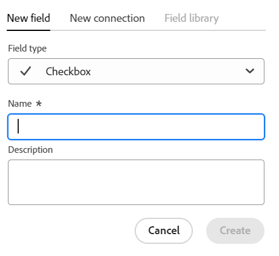

<!--udpate the metadata with real information when making this avilable in TOC and in the left nav-->

<!--Should the structure of this article be like this one: https://experienceleague.adobe.com/docs/workfront/using/administration-and-setup/customize/custom-forms/custom-form-builder/use-the-custom-form-builder/add-a-custom-field-to-a-custom-form.html?lang=en ??-->

<!--will they add a way to create fields elsewhere than in a table?! - how will that change the structure of this article? -->

# Créer des champs

>[!IMPORTANT]
>
>Les informations de cet article se rapportent à Adobe Maestro, une nouvelle offre d’Adobe.
>
>Actuellement, Adobe Maestro fait partie d’un programme bêta ouvert à un nombre limité de clients.
>
>Pour plus d’informations sur l’inscription au programme bêta de Maestro, contactez le représentant de votre compte.
>
>Pour plus d’informations, voir [Présentation d’Adobe Maestro](../maestro-overview.md).

Dans Adobe Maestro, vous pouvez créer des champs personnalisés pour les types d’enregistrements opérationnels ou les taxonomies. Vous pouvez ensuite associer les champs aux enregistrements Maestro pour améliorer les informations d’enregistrement.

Vous devez créer des types d’enregistrement avant de pouvoir créer des champs à associer. Pour plus d’informations, voir [Création de types d’enregistrement](../architecture-and-fields/create-record-types.md).

## Exigences d’accès

Vous devez disposer des accès suivants pour effectuer les étapes de cet article :

<table style="table-layout:auto">
 <col>
 <tbody>
<td>
   
 Adobe de produit
 </td>
   <td>
   
 Adobe Workfront
 </td>
  </tr>  
 <td role="rowheader">
Accord Adobe Workfront
</td>
   <td>

Votre entreprise doit être inscrite au programme bêta fermé Adobe Maestro. Contactez le représentant de votre compte pour en savoir plus sur cette nouvelle offre. 

   </td>
  </tr>
  <tr>
   <td role="rowheader">
Formule Adobe Workfront
</td>
   <td>

Tous

   </td>
  </tr>
  <tr>
   <td role="rowheader">
Licence Adobe Workfront
</td>
   <td>
   
Tous
 
  </td>
  </tr>

<tr>
   <td role="rowheader">Niveau d’accès</td>
   <td> 
Tous
  
</td>
  </tr>
<tr>
   <td role="rowheader">Modèle de mise en page</td>
   <td> 
L’administrateur système doit ajouter la zone Maestro à votre modèle de mise en page. Pour plus d’informations, voir <a href="../access/grant-access.md">Accorder l’accès à Adobe Maestro</a>. 
  
</td>
  </tr>
 </tbody>
</table>

<!--Maybe enable this at GA - but Maestro is not supposed to have Access controls in the Workfront Access Level: 
>[!NOTE]
>
>If you don't have access, ask your Workfront administrator if they set additional restrictions in your access level. For information on how a Workfront administrator can change your access level, see [Create or modify custom access levels](../administration-and-setup/add-users/configure-and-grant-access/create-modify-access-levels.md). -->

<!-- Notes to add for the table: for the "Workfront plans" row: the above is only for closed beta; when going to GA - activate the following plans:    

Current plan: Prime and Ultimate

Legacy plan: Enterprise
-->

<!-- Notes for the table: for the "Workfront access" row: 
For more information, see <a href="../../administration-and-setup/add-users/access-levels-and-object-permissions/wf-licenses.md" class="MCXref xref">Adobe Workfront licenses overview</a>.
-->

## Observations sur les champs Maestro

* Vous ne pouvez créer des champs qu’à partir de la vue de tableau d’une page de type enregistrement. Les champs s’affichent sous forme de colonnes dans la vue de tableau.

  Pour plus d’informations sur la gestion des colonnes de tableau (ou des champs d’enregistrement), voir [Gestion de la vue de tableau](../views/manage-the-table-view.md).

  Pour plus d’informations sur la gestion des champs, reportez-vous également aux articles suivants :

   * [Modifier les champs](../architecture-and-fields/edit-fields.md)
   * [Supprimer des champs](./delete-fields.md)

* Les champs associés à un type d&#39;enregistrement peuvent être associés à tous les enregistrements de ce type. <!--will this change and will the fields be available for other record types, too?! Also, the next bullet might need to change too if this one changes -->

* Les champs associés à un type d’enregistrement ne peuvent pas être ajoutés à un autre type d’enregistrement. <!-- this will change when they open the Field library tab when creating a field-->

* Vous pouvez créer des champs manuellement ou automatiquement de différentes manières :

   * Manuellement:

      * En ajoutant des colonnes dans la vue Tableau d’une page de type enregistrement. Les colonnes du tableau sont les champs associés au type d’enregistrement. Il s’agit des mêmes champs que ceux affichés sur la page Détails d’un enregistrement.

        Vous ne pouvez pas créer de champs à partir de la page Détails d’un enregistrement.

        Cet article décrit comment créer manuellement des champs.

      * En liant les types d’enregistrement. Vous pouvez créer des champs d’enregistrement liés lorsque vous ajoutez une nouvelle connexion entre deux types d’enregistrement Maestro ou un type d’enregistrement et un type d’objet à partir d’autres applications.

        <!--* Importing record types with fields using a CSV or an Excel file. - this is not available yet-->

        Pour plus d’informations sur la connexion des types d’enregistrement Maestro, voir [Connexion des types d’enregistrement](../architecture-and-fields/connect-record-types.md).

      * En important des types d’enregistrement à l’aide d’un fichier Excel ou CSV. Pour plus d’informations, voir [Création de types d’enregistrement](../architecture-and-fields/create-record-types.md).

   * Automatiquement:

      * Par défaut, chaque fois que vous créez un type d’enregistrement.

        Voici les champs standard créés par défaut pour chaque nouveau type d&#39;enregistrement opérationnel :

         * Nom
         * Description
         * Date de début
         * Date de fin
         * Statut. Les valeurs par défaut des états d’enregistrement sont les suivantes :
            * Développement
            * Prévu
            * Actif
            * Terminé
            * Suspendu

           Vous pouvez ajouter d’autres valeurs ou renommer les valeurs existantes.

        Voici les champs standard créés par défaut pour chaque nouveau type d’enregistrement de taxonomie :

         * Nom <!--will more be added? If not, consider rephrasing this bullet-->

      * Lorsque vous créez un espace de travail à partir d’un modèle. Maestro crée des champs pour les types d’enregistrements opérationnels et les taxonomies lorsque vous créez un espace de travail à partir d’un modèle. Pour plus d’informations, voir [Créer des espaces de travail](../architecture-and-fields/create-workspaces.md).

* Vous pouvez afficher et mettre à jour les paramètres des champs que vous ou tout autre utilisateur avez créés. <!--this will change with access/ permissions-->

* Vous pouvez avoir jusqu’à 500 champs pour un type d’enregistrement.

* Les noms de champ peuvent contenir jusqu’à 250 caractères.

* Lors de la suppression d&#39;un type d&#39;enregistrement opérationnel, d&#39;une taxonomie ou d&#39;un espace de travail, tous les champs qui y sont associés et les valeurs des champs sont également supprimés et ne peuvent pas être récupérés. <!-- this might change with a possible recycle bin solution?!-->

## Créer des champs à partir de zéro {#create-fields-from-scratch}

<!--in a table (not sure if this can be done elsewhere?!-->

1. Cliquez sur le bouton **Menu Principal** icon  dans le coin supérieur droit de Workfront, <!---or the **Main menu** icon   in the upper-left corner, if available--> puis cliquez sur **Maestro** .

   L’espace de travail du dernier accès doit s’ouvrir par défaut.

1. (Facultatif) Développez la flèche pointant vers le bas située à droite du nom d’un espace de travail existant, sélectionnez l’espace de travail dont vous souhaitez créer des champs, puis cliquez sur le type d’enregistrement.

   Tous les enregistrements existants associés au type d&#39;enregistrement s&#39;affichent dans les lignes du mode Tableau.

   >[!TIP]
   >
   >    Si aucun enregistrement ne s’affiche, il se peut que vous n’ayez encore aucun enregistrement ou qu’un filtre soit appliqué pour limiter ce que vous voyez à l’écran.

   Tous les champs existants associés au type d&#39;enregistrement s&#39;affichent dans les colonnes de la vue de tableau. <!--caveat this for when we can hide the fields; mention that they can be hidden if they are not visible by default-->

1. Cliquez sur le bouton **+** dans le coin supérieur droit de la vue de tableau pour ajouter de nouveaux champs.
1. Dans le **Nouveau champ** , sélectionnez parmi les types de champ suivants :

   * [Texte à une ligne](#single-line-text)
   * [Paragraphe](#paragraph)
   * [Sélection multiple](#multi-select)
   * [Sélection unique](#single-select)
   * [Date](#date)
   * [Nombre](#number)
   * [Pourcentage](#percentage)
   * [Devise](#currency)
   * [Case à cocher](#checkbox)
   * [Personnes](#people)

   >[!IMPORTANT]
   >
   >    Une fois enregistré, vous ne pouvez pas modifier le type de champ du champ.

1. Poursuivez en ajoutant chaque champ, comme décrit dans les sections ci-dessous.

### Texte à une ligne {#single-line-text}

Les champs de texte d’une seule ligne capturent des informations alphanumériques limitées. Vous pouvez, par exemple, capturer les informations du propriétaire, du partenaire, de l’équipe ou de l’entité organisationnelle dans un champ de texte d’une seule ligne. Le contenu d’un champ de texte d’une seule ligne peut contenir jusqu’à 250 caractères. <!-- asked Lilit if we can change this to "Single-line" since this can have numbers and text.-->

1. Commencez à créer un champ comme décrit dans la section [Créer des champs à partir de zéro](#create-fields-from-scratch) dans cet article, puis sélectionnez l’option **Texte sur une seule ligne** type de champ.

   

1. Ajoutez les informations suivantes dans la variable **Nouveau champ** tab :
   * **Nom**: nom du type de champ, tel qu’il apparaîtra dans un tableau ou dans la page Détails de l’enregistrement. <!--ensure they updated this; and update the screen shot: it used to be "Label"-->
   * **Description**: informations supplémentaires sur le champ. La description d’un champ s’affiche lorsque vous placez le pointeur de la souris sur l’en-tête de colonne d’un champ dans un tableau.
1. Cliquez sur **Créer**.

   Le nouveau champ d&#39;une seule ligne est ajouté en colonne au type d&#39;enregistrement et ses valeurs peuvent être associées à des enregistrements. Le champ s’affiche également sur la page Détails d’un enregistrement.

### Paragraphe {#paragraph}

Les champs de paragraphe capturent des informations alphanumériques supplémentaires sur un enregistrement, semblables au champ Description .

>[!TIP]
>
>* Le contenu d’un champ de paragraphe peut contenir jusqu’à 1 000 caractères.
>
>* Vous pouvez utiliser la mise en forme Texte enrichi pour améliorer le contenu des champs de paragraphe lorsqu’ils s’affichent dans la vue Tableau ou la page Détails d’un enregistrement.

1. Commencez à créer un champ comme décrit dans la section [Créer des champs à partir de zéro](#create-fields-from-scratch) dans cet article, puis sélectionnez l’option **Paragraphe** type de champ.

   

1. Ajoutez les informations suivantes dans la variable **Nouveau champ** tab :
   * **Nom**: nom du type de champ, tel qu’il apparaîtra dans un tableau ou dans la page Détails de l’enregistrement. <!--ensure they updated this; and update the screen shot: it used to be "Label"-->
   * **Description**: informations supplémentaires sur le champ. La description d’un champ s’affiche lorsque vous placez le pointeur de la souris sur la colonne du champ dans un tableau.
1. Cliquez sur **Créer**.

   Le nouveau champ de paragraphe est ajouté en tant que colonne au type d&#39;enregistrement et ses valeurs peuvent être associées à des enregistrements. Le champ s’affiche également sur la page Détails d’un enregistrement.

### Sélection multiple {#multi-select}

Vous pouvez utiliser un champ à sélection multiple pour capturer des informations supplémentaires dans n’importe quel format en sélectionnant plusieurs options dans un menu déroulant.

1. Commencez à créer un champ comme décrit dans la section [Créer des champs à partir de zéro](#create-fields-from-scratch) dans cet article, puis sélectionnez l’option **Sélection multiple** type de champ.

   

1. Ajoutez les informations suivantes dans la variable **Nouveau champ** tab :
   * **Nom**: nom du type de champ, tel qu’il apparaîtra dans un tableau ou dans la page Détails de l’enregistrement. <!--ensure they updated this; and update the screen shot: it used to be "Label"-->
   * **Description**: informations supplémentaires sur le champ. La description d’un champ s’affiche lorsque vous placez le pointeur de la souris sur la colonne du champ dans un tableau.
   * **Choix**: options disponibles pour la sélection dans le menu déroulant après l’enregistrement du champ. Vous pouvez avoir des nombres et des lettres pour le nom de chaque choix.
1. Cliquez sur **Ajouter un choix** pour ajouter autant de choix que nécessaire. Le nombre de choix que vous pouvez ajouter à un champ à sélection multiple est illimité.
1. (Facultatif) Faites glisser et déposez manuellement chaque choix dans l’ordre souhaité, ou sélectionnez l’option
   **Choix de tri A-Z** si vous souhaitez que les choix soient automatiquement répertoriés dans l’ordre alphabétique. <!--Add this if they added this functionality: You cannot edit this option after you save the field.-->
1. Cliquez sur le bouton **x** à droite d’un choix pour le supprimer.
1. Cliquez sur l’échantillon de couleur à gauche d’un choix pour développer le sélecteur de couleurs et personnaliser la couleur de chaque option.
1. Cliquez sur **Créer**.

   Le nouveau champ à sélection multiple est ajouté en tant que colonne au type d&#39;enregistrement et ses valeurs peuvent être associées à des enregistrements. Le champ s’affiche également sur la page Détails d’un enregistrement.

### Sélection unique {#single-select}

Les champs à sélection unique capturent des informations supplémentaires dans n’importe quel format en sélectionnant une option dans un menu déroulant.

1. Commencez à créer un champ comme décrit dans la section [Créer des champs à partir de zéro](#create-fields-from-scratch) dans cet article, puis sélectionnez l’option **Sélection simple** type de champ.

   

1. Ajoutez les informations suivantes dans la variable **Nouveau champ** tab :
   * **Nom**: nom du type de champ, tel qu’il apparaîtra dans un tableau ou dans la page Détails de l’enregistrement. <!--ensure they updated this; and update the screen shot: it used to be "Label"-->
   * **Description**: informations supplémentaires sur le champ. La description d’un champ s’affiche lorsque vous placez le pointeur de la souris sur la colonne du champ dans un tableau.
   * **Choix**: options disponibles pour la sélection dans le menu déroulant après l’enregistrement du champ. Vous pouvez avoir des nombres et des lettres pour le nom de chaque choix.

1. Cliquez sur **Ajouter un choix** pour ajouter autant de choix que nécessaire. Le nombre de choix que vous pouvez ajouter à un champ à sélection unique n’est pas limité.
1. (Facultatif) Faites glisser et déposez manuellement chaque choix dans l’ordre souhaité, ou sélectionnez l’option **Choix de tri A-Z** si vous souhaitez que les choix soient automatiquement répertoriés dans l’ordre alphabétique. <!--Add this if they added this functionality: You cannot edit this option after you save the field.-->
1. Cliquez sur le bouton **x** à droite d’un choix pour le supprimer.
1. Cliquez sur l’échantillon de couleur à gauche d’un choix pour développer le sélecteur de couleurs et personnaliser la couleur de chaque option.
1. Cliquez sur **Créer**.

   Le nouveau champ à sélection unique est ajouté en tant que colonne au type d&#39;enregistrement et ses valeurs peuvent être associées à des enregistrements. Le champ s’affiche également sur la page Détails d’un enregistrement.

### Date {#date}

Vous pouvez utiliser un champ date pour capturer des informations supplémentaires au format date et heure.

1. Commencez à créer un champ comme décrit dans la section [Créer des champs à partir de zéro](#create-fields-from-scratch) dans cet article, puis sélectionnez l’option **Date** type de champ.

   

1. Ajoutez les informations suivantes dans la variable **Nouveau champ** tab :
   * **Nom**: nom du type de champ, tel qu’il apparaîtra dans un tableau ou dans la page Détails de l’enregistrement. <!--ensure they updated this; and update the screen shot: it used to be "Label"-->
   * **Description**: informations supplémentaires sur le champ. La description d’un champ s’affiche lorsque vous placez le pointeur de la souris sur la colonne du champ dans un tableau.
   * **Format de date**: type de format de date à afficher dans ce champ.

     Sélectionnez l’un des formats suivants :
      * **Paramètres régionaux**: correspond aux paramètres régionaux de votre navigateur.
      * **Standard**: 05/16/2023
      * **Long**: 16 mai 2023
      * **Européen**: 16/05/2023
      * **ISO**: 2023-05-16
   * **Inclure un champ d’heure**: sélectionnez cette option si vous souhaitez inclure un horodatage. Cette option est désélectionnée par défaut.

     Sélectionnez l’une des options suivantes :

      * **24h**: par exemple : 18:00
      * **12h**: par exemple : 18 heures

1. Cliquez sur **Créer**.

   Le nouveau champ date est ajouté en tant que colonne au type d&#39;enregistrement et ses valeurs peuvent être associées à des enregistrements. Le champ s’affiche également sur la page Détails d’un enregistrement.

### Nombre {#number}

Les types de champ Nombre capturent les informations au format numérique.

1. Commencez à créer un champ comme décrit dans la section [Créer des champs à partir de zéro](#create-fields-from-scratch) dans cet article, puis sélectionnez l’option **Nombre** type de champ.

   
1. Ajoutez les informations suivantes dans la variable **Nouveau champ** tab :

   * **Nom**: nom du type de champ, tel qu’il apparaîtra dans un tableau ou dans la page Détails de l’enregistrement.
   * **Description**: informations supplémentaires sur le champ. La description d’un champ s’affiche lorsque vous placez le pointeur de la souris sur la colonne du champ dans un tableau.
   * **Précision**: nombre de décimales que vous souhaitez enregistrer pour le champ. Vous pouvez afficher jusqu’à 6 décimales.
   * **Autoriser les nombres négatifs**: sélectionnez cette option si vous souhaitez autoriser les nombres négatifs dans ce champ. Cette option n’est pas sélectionnée par défaut.

   >[!NOTE]
   >
   >    Si vous sélectionnez Autoriser les nombres négatifs et que les valeurs négatives sont stockées sur les enregistrements auxquels le champ est associé, vous ne pouvez plus désélectionner ce paramètre à l’avenir.

1. Cliquez sur **Créer**.

   Le nouveau champ numérique est ajouté en tant que colonne au type d&#39;enregistrement et ses valeurs peuvent être associées à des enregistrements. Le champ s’affiche également sur la page Détails d’un enregistrement.

### Pourcentage {#percentage}

Les types de champ en pourcentage capturent les informations au format numérique, suivis d’un signe de pourcentage.

1. Commencez à créer un champ comme décrit dans la section [Créer des champs à partir de zéro](#create-fields-from-scratch) dans cet article, puis sélectionnez l’option **Pourcentage** type de champ.

   

1. Ajoutez les informations suivantes dans la variable **Nouveau champ** tab :
   * **Nom**: nom du type de champ, tel qu’il apparaîtra dans un tableau ou dans la page Détails de l’enregistrement.
   * **Description**: informations supplémentaires sur le champ. La description d’un champ s’affiche lorsque vous placez le pointeur de la souris sur la colonne du champ dans un tableau.
   * **Précision**: nombre de décimales que vous souhaitez enregistrer pour le champ. Vous pouvez afficher jusqu’à 6 décimales.
   * **Autoriser les nombres négatifs**: sélectionnez cette option si vous souhaitez autoriser les valeurs en pourcentage négatif dans ce champ. Cette option n’est pas sélectionnée par défaut.

   >[!NOTE]
   >
   >    Si vous sélectionnez Autoriser les nombres négatifs et que les valeurs négatives sont stockées sur les enregistrements auxquels le champ est associé, vous ne pouvez plus désélectionner ce paramètre à l’avenir.

1. Cliquez sur **Créer**.

   Le nouveau champ de pourcentage est ajouté en colonne au type d&#39;enregistrement et ses valeurs peuvent être associées à des enregistrements. Le champ s’affiche également sur la page Détails d’un enregistrement.

### Devise {#currency}

Les types de champ de devise capturent les informations dans un format numérique précédé d’un symbole monétaire.

1. Commencez à créer un champ comme décrit dans la section [Créer des champs à partir de zéro](#create-fields-from-scratch) dans cet article, puis sélectionnez l’option **Devise** type de champ.

   

1. Ajoutez les informations suivantes dans la variable **Nouveau champ** tab :
   * **Nom**: nom du type de champ, tel qu’il apparaîtra dans un tableau ou dans la page Détails de l’enregistrement. <!--ensure they updated this; and update the screen shot: it used to be "Label"-->
   * **Description**: informations supplémentaires sur le champ. La description d’un champ s’affiche lorsque vous placez le pointeur de la souris sur la colonne du champ dans un tableau.
   * **Devise**: type de devise à afficher dans ce champ. Il s’agit d’une liste de devises selon l’Organisation internationale de normalisation (ISO).
   * **Précision**: nombre de décimales que vous souhaitez enregistrer pour le champ. Vous pouvez afficher jusqu’à 6 décimales.
   * **Autoriser les nombres négatifs**: sélectionnez cette option si vous souhaitez autoriser les valeurs de devise négatives dans ce champ. Cette option n’est pas sélectionnée par défaut.

   >[!NOTE]
   >
   >    Si vous sélectionnez Autoriser les nombres négatifs et que les valeurs négatives sont stockées sur les enregistrements auxquels le champ est associé, vous ne pouvez plus désélectionner ce paramètre à l’avenir.

1. Cliquez sur **Créer**.

   Le nouveau champ de devise est ajouté en tant que colonne au type d&#39;enregistrement et ses valeurs peuvent être associées à des enregistrements. Le champ s’affiche également sur la page Détails d’un enregistrement.

### Case à cocher

Vous pouvez utiliser le type de champ Case à cocher pour ajouter une seule option de case à cocher à un enregistrement. Vous pouvez utiliser ce champ pour indiquer un attribut ou un état spécifique pour cet enregistrement. Par exemple, vous pouvez l’utiliser comme indicateur pour le suivi de la fin, de l’approbation ou de tout autre attribut binaire pour chaque enregistrement.

1. Commencez à créer un champ comme décrit dans la section [Créer des champs à partir de zéro](#create-fields-from-scratch) dans cet article, puis sélectionnez l’option **Case à cocher** type de champ.

   

1. Ajoutez les informations suivantes dans la variable **Nouveau champ** tab :
   * **Nom**: nom du type de champ, tel qu’il apparaîtra dans un tableau ou dans la page Détails de l’enregistrement. <!--ensure they updated this; and update the screen shot: it used to be "Label"-->
   * **Description**: informations supplémentaires sur le champ. La description d’un champ s’affiche lorsque vous placez le pointeur de la souris sur la colonne du champ dans un tableau.
1. Cliquez sur **Créer**.

   Le nouveau champ de case à cocher est ajouté en tant que colonne au type d’enregistrement et ses valeurs peuvent être associées à des enregistrements. Le champ s’affiche également sur la page Détails d’un enregistrement.

### Personnes

Vous pouvez utiliser le type de champ Personnes pour ajouter un utilisateur. <!--, job role, or team--> à un enregistrement. Il s’agit d’un champ de type anticipé que vous pouvez ajouter uniquement aux utilisateurs.<!--, roles, or teams--> qui existent déjà dans Workfront.

1. Commencez à créer un champ comme décrit dans la section [Créer des champs à partir de zéro](#create-fields-from-scratch) dans cet article, puis sélectionnez l’option **Personnes** type de champ.

   

1. Ajoutez les informations suivantes dans la variable **Nouveau champ** tab :
   * **Nom**: nom du type de champ, tel qu’il apparaîtra dans un tableau ou dans la page Détails de l’enregistrement.
   * **Description**: informations supplémentaires sur le champ. La description d’un champ s’affiche lorsque vous placez le pointeur de la souris sur la colonne du champ dans un tableau.
   * **Autoriser plusieurs valeurs**: sélectionnez cette option si vous souhaitez permettre aux utilisateurs d’ajouter plusieurs utilisateurs dans ce champ. Cette option n’est pas sélectionnée par défaut.

   >[!NOTE]
   >
   >    Si vous sélectionnez Autoriser plusieurs valeurs et que plusieurs utilisateurs sont stockés dans les enregistrements auxquels le champ est associé, vous ne pouvez plus désélectionner le paramètre à l’avenir lors de la modification de ce champ.

1. Cliquez sur **Créer**.

   Le nouveau champ Type de personne est ajouté en tant que colonne au type d&#39;enregistrement et ses valeurs peuvent être associées à des enregistrements. Le champ s’affiche également sur la page Détails d’un enregistrement.

## Créer des champs en liant les types d’enregistrement

Vous pouvez créer des champs d’enregistrement liés lorsque vous ajoutez une nouvelle connexion entre deux types d’enregistrement Maestro ou un type d’enregistrement et un type d’objet à partir d’autres applications.

Pour plus d’informations sur la connexion des types d’enregistrement Maestro, voir [Connexion des types d’enregistrement](../architecture-and-fields/connect-record-types.md).

## Créer des champs en important des types d’enregistrement à l’aide d’un fichier Excel et CSV

Pour plus d’informations, voir [Création de types d’enregistrement](../architecture-and-fields/create-record-types.md).

## Créer des champs en créant un type d’enregistrement

Lorsque vous créez un type d&#39;enregistrement, plusieurs champs associés au nouveau type d&#39;enregistrement sont également créés par défaut. Pour plus d’informations, voir [Création de types d’enregistrement](../architecture-and-fields/create-record-types.md).

## Créer des champs en créant un espace de travail à partir d’un modèle

Maestro crée des champs pour les types d’enregistrements opérationnels et les taxonomies lorsque vous créez un espace de travail à partir d’un modèle.

Pour plus d’informations, voir [Créer des espaces de travail](../architecture-and-fields/create-workspaces.md).
