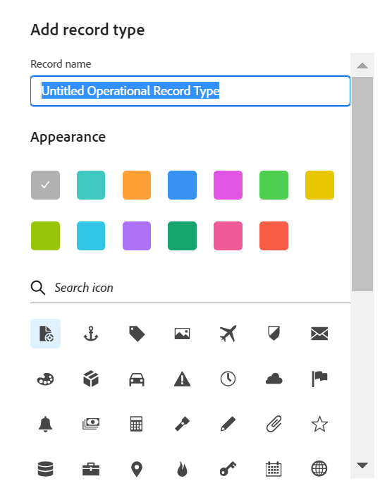

<!--udpate the metadata with real information when making this available in TOC and in the left nav-->

# Création de types d’enregistrements opérationnels

>[!IMPORTANT]
>
>Les informations de cet article se rapportent à Adobe Maestro, une nouvelle offre d’Adobe.
>
>Actuellement, Adobe Maestro fait partie d’un programme bêta ouvert à un nombre limité de clients.
>
>Pour plus d’informations sur l’inscription au programme bêta de Maestro, contactez le représentant de votre compte.
>
>Pour plus d’informations, voir [Présentation d’Adobe Maestro](../maestro-overview.md).

Les types d’enregistrement sont les types d’objets du Maestro d’Adobe. Dans Maestro, vous pouvez créer des types d’enregistrement personnalisés qui illustrent les éléments liés au travail nécessaires dans le cycle de vie de votre entreprise.

Les types d’enregistrement peuvent être parmi les suivants :

* **Types d’enregistrements opérationnels**
* **Taxonomies**

Pour plus d’informations sur les types d’enregistrement Maestro, voir [Présentation des types d’enregistrement et des taxonomies](../architecture-and-fields/overview-of-record-types-and-taxonomies.md).

La création de types d’enregistrements opérationnels est similaire à la création de types d’enregistrements de taxonomie. Cet article décrit comment créer des types d’enregistrements opérationnels.

Pour plus d’informations sur la création de taxonomies, voir [Création de types d’enregistrement de taxonomie](../architecture-and-fields/create-a-taxonomy.md).

## Exigences d’accès

Vous devez disposer des accès suivants pour effectuer les étapes de cet article :

<table style="table-layout:auto">
 <col>
 <tbody>
<td>
   
 Adobe de produit
 </td>
   <td>
   
 Adobe Workfront
 </td>
  </tr>  
 <td role="rowheader">
Accord Adobe Workfront
</td>
   <td>

Votre entreprise doit être inscrite au programme bêta fermé Adobe Maestro. Contactez le représentant de votre compte pour en savoir plus sur cette nouvelle offre. 

   </td>
  </tr>
  <tr>
   <td role="rowheader">
Formule Adobe Workfront
</td>
   <td>

Tous

   </td>
  </tr>
  <tr>
   <td role="rowheader">
Licence Adobe Workfront
</td>
   <td>
   
Tous
 
  </td>
  </tr>

<tr>
   <td role="rowheader">Niveau d’accès</td>
   <td> 
Tous
  
</td>
  </tr>
<tr>
   <td role="rowheader">Modèle de mise en page</td>
   <td> 
L’administrateur système doit ajouter la zone Maestro à votre modèle de mise en page. Pour plus d’informations, voir <a href="../access/grant-access.md">Accorder l’accès à Adobe Maestro</a>. 
  
</td>
  </tr>
 </tbody>
</table>

<!--Maybe enable this at GA - but Maestro is not supposed to have Access controls in the Workfront Access Level: 
>[!NOTE]
>
>If you don't have access, ask your Workfront administrator if they set additional restrictions in your access level. For information on how a Workfront administrator can change your access level, see [Create or modify custom access levels](../administration-and-setup/add-users/configure-and-grant-access/create-modify-access-levels.md). -->

<!-- Notes to add for the table: for the "Workfront plans" row: the above is only for closed beta; when going to GA - activate the following plans:    

Current plan: Prime and Ultimate

Legacy plan: Enterprise
-->

<!-- Notes for the table: for the "Workfront access" row: 
For more information, see <a href="../../administration-and-setup/add-users/access-levels-and-object-permissions/wf-licenses.md" class="MCXref xref">Adobe Workfront licenses overview</a>.
-->

## Remarques concernant la création de types d’enregistrement

* Vous pouvez créer des types d’enregistrement dans un espace de travail en effectuant l’une des opérations suivantes :

   * Automatiquement:
      * Lorsque vous créez un espace de travail à l’aide d’un modèle.

        Pour plus d’informations, voir [Créer des espaces de travail](../architecture-and-fields/create-workspaces.md).
      * Lorsque vous les importez à l’aide d’un fichier Excel ou CSV. Cette option n’est pas disponible pour les types d’enregistrement de taxonomie.
      * Lorsque vous créez une connexion à des types d’objets à partir d’une autre application, lors de l’ajout de champs à un type d’enregistrement. Cela crée un type d’enregistrement en lecture seule dans Maestro qui est connecté aux types d’objets de l’application d’origine.

     Pour plus d’informations sur la connexion des types d’objets aux enregistrements Maestro, voir [Connexion d’enregistrements](../records/connect-records.md).
   * Manuellement:

      * À partir de zéro.

## Création de types d’enregistrement à l’aide d’un modèle d’espace de travail

Vous pouvez créer automatiquement des types d’enregistrement lorsque vous créez un espace de travail à l’aide d’un modèle. Chaque modèle Maestro contient des exemples de types d’enregistrement opérationnels et de taxonomie.

Pour plus d’informations sur la création d’espaces de travail, voir [Créer des espaces de travail](../architecture-and-fields/create-workspaces.md).

Pour plus d’informations sur les types d’enregistrement inclus dans chaque modèle, voir [Liste des modèles d&#39;espace de travail](../architecture-and-fields/workspace-templates.md).

## Créer entièrement un type d’enregistrement

Cet article décrit comment créer de A à Z des types d’enregistrements opérationnels. La création de tous types d&#39;enregistrements opérationnels est similaire à la création de taxonomies.

Pour plus d’informations sur les taxonomies, voir [Création d’une taxonomie](../architecture-and-fields/create-a-taxonomy.md).

1. Cliquez sur le bouton **Menu Principal** icon  dans le coin supérieur droit de Workfront, <!---or the **Main menu** icon   in the upper-left corner, if available--> puis cliquez sur **Maestro** .

   L’espace de travail du dernier accès doit s’ouvrir par défaut.

1. (Facultatif) Développez la flèche pointant vers le bas située à droite du nom d’un espace de travail existant, puis sélectionnez l’espace de travail pour lequel vous souhaitez créer des types d’enregistrement.
1. Cliquez sur **Ajouter un type d’enregistrement**.
1. (Conditionnel) Si vous créez un type d’enregistrement opérationnel, cliquez sur **A partir de zéro**. Cette option n’est pas disponible lors de la création de taxonomies.

   La zone Ajouter un type d’enregistrement s’affiche.

   

1. Sélectionnez les informations suivantes :

   * **Nom de l’enregistrement**: remplacez &quot;Untitled Operational Record Type&quot; par le nom de votre type d’enregistrement futur. <!--correct this - I asked Garik to change this field to "Record type name"-->
   * **Apparence**: définissez la couleur et la forme de l’icône associée au type d’enregistrement. Procédez comme suit :
      * Sélectionnez une couleur pour identifier votre nouveau type d’enregistrement. Il s’agit de la couleur de l’icône de type d’enregistrement. L’option Gris est sélectionnée par défaut.
      * Sélectionnez une icône dans la liste ou commencez à saisir le nom d’une icône pour décrire ce qu’elle représente, puis sélectionnez-la lorsqu’elle s’affiche. Il s’agit de l’icône du type d’enregistrement. Une icône de fichier est sélectionnée par défaut.

1. Cliquez en dehors du **Ajouter un type d’enregistrement** pour enregistrer l’enregistrement.

   La carte de type enregistrement est ajoutée à l’espace de travail que vous avez sélectionné.
Le nombre de champs contenus dans le type d’enregistrement s’affiche sur la carte.
1. (Facultatif) Cliquez sur la carte de type enregistrement pour ouvrir la page de type enregistrement.

   

   La page de type enregistrement s’affiche par défaut dans la vue Tableau. Les colonnes du tableau sont des champs associés au nouveau type d’enregistrement. Chaque ligne est un enregistrement unique que vous devez ajouter.

   Par défaut, les champs suivants s&#39;affichent dans les colonnes de vue de tableau d&#39;un type d&#39;enregistrement opérationnel :

   * Nom

     Le champ Nom est le seul champ automatiquement créé pour les taxonomies.
   * Description
   * Date de début
   * Date de fin
   * Statut

1. (Facultatif) Mettez à jour le nom du type d’enregistrement dans l’en-tête de la page.

   Ou

   Cliquez sur le bouton **Plus** icon  à droite du nom du type d&#39;enregistrement et cliquez sur **Renommer** pour le renommer.

1. (Facultatif) Cliquez sur **+ Nouveau &lt; nom du type d’enregistrement >** pour ajouter des enregistrements du type d’enregistrement sélectionné. Pour plus d’informations, voir [Créer des enregistrements](../records/create-records.md).
1. (Facultatif) Cliquez sur le **+** dans le coin supérieur droit du tableau pour ajouter d’autres champs au type d’enregistrement. Pour plus d’informations, voir [Créer des champs](../architecture-and-fields/create-fields.md).
1. (Facultatif) Cliquez sur la flèche pointant vers la gauche du nom du type d’enregistrement pour revenir à l’espace de travail sélectionné.

   La carte de type enregistrement affiche le nombre de champs et de connexions contenus dans le type d’enregistrement.

   

   Pour plus d’informations sur l’ajout d’enregistrements, la suppression ou la modification de types d’enregistrements, ou la mise à jour de la vue dans la page de type d’enregistrement, voir les articles suivants :

   * [Créer des enregistrements](../records/create-records.md)
   * [Suppression des types d’enregistrement](../architecture-and-fields/delete-record-types.md)
   * [Modification des types d’enregistrement](../architecture-and-fields/edit-record-types.md)
   * [Gestion des vues d’enregistrement dans Adobe Maestro](../views/manage-record-views.md) <!--add information here about the sorting and grouping when available-->

## Création de types d’enregistrement à l’aide d’un import de fichier Excel ou CSV

Tenez compte des points suivants lors de l’importation de types d’enregistrement à l’aide d’un fichier Excel ou CSV :

* Chaque feuille du fichier Excel devient un type d’enregistrement dans Maestro.
* Les colonnes de chaque feuille deviennent les champs associés à chaque type d’enregistrement.
* Les champs sont uniques pour leurs types d’enregistrement respectifs.
* Chaque ligne de chaque feuille devient un enregistrement unique associé à son type d’enregistrement respectif.
* Chaque feuille du fichier Excel ne doit pas excéder les éléments suivants :
   * 10 000 lignes
   * 500 colonnes
* Le fichier Excel ne doit pas dépasser 5 Mo.
* Les feuilles vides ne sont pas prises en charge.

Pour importer des types d’enregistrement à l’aide d’un fichier Excel :

1. Cliquez sur le bouton **Menu Principal** icon  dans le coin supérieur droit de Workfront, <!---or the **Main menu** icon   in the upper-left corner, if available--> puis cliquez sur **Maestro** .

   L’espace de travail du dernier accès doit s’ouvrir par défaut.

1. (Facultatif) Développez la flèche pointant vers le bas située à droite du nom d’un espace de travail existant, puis sélectionnez l’espace de travail pour lequel vous souhaitez créer des types d’enregistrement.
1. Cliquez sur **Ajouter un type d’enregistrement**.
1. (Conditionnel) Si vous créez un type d’enregistrement opérationnel, cliquez sur **Excel/CSV**.

   >[!NOTE]
   >
   >    Cette option n’est pas disponible lors de la création de types d’enregistrement de taxonomie.

1. Faites glisser et déposez un fichier Excel ou CSV précédemment enregistré sur votre ordinateur, ou cliquez sur **Sélection d’un fichier CSV ou Excel** pour en rechercher une.
1. Cliquez sur **Vérification des données**.

   La zone Aperçu et modification s’affiche avec les informations suivantes :

   * Les noms des feuilles ou des types d’enregistrements futurs s’affichent dans le panneau de gauche. Par défaut, Maestro sélectionne une icône et une couleur pour chaque nouveau type d’enregistrement.
   * La première feuille ou le type d’enregistrement est sélectionné et les noms des champs qui lui sont associés s’affichent sous forme d’en-têtes de colonne. Le type de chaque champ est sélectionné par défaut.
   * Chaque ligne représente un nouvel enregistrement. Seuls les 10 premiers enregistrements s&#39;affichent dans la zone Prévisualisation et édition.

   

1. (Facultatif) Cliquez sur le nom de chaque feuille dans le panneau de gauche pour consulter les informations qu’elle contient.

   >[!NOTE]
   >
   >    Les feuilles vides ne sont pas prises en charge et sont grisées.

1. (Facultatif) Cliquez sur le **Sélectionner les feuilles à importer** et désélectionnez les feuilles que vous ne souhaitez pas importer.

   

   Cette option vous permet de désélectionner l’affichage avec un arrière-plan gris.

1. Cliquez sur **Importer** lorsque vous êtes prêt à importer votre fichier.

   Les informations suivantes sont importées dans Maestro :

   * Nouveaux types d’enregistrement
   * Nouveaux champs associés à chaque type d&#39;enregistrement
   * Nouveaux enregistrements associés à chaque type d&#39;enregistrement

   Vous pouvez commencer à gérer les champs et les enregistrements sur les pages de types d’enregistrement.

   Toute personne ayant accès à Maestro peut désormais afficher et modifier les types d’enregistrements importés et leurs informations. <!--this will change with permissions-->

## Connexion de types d’enregistrement à des types d’objets provenant d’une autre application

Vous pouvez importer des types d’enregistrement lorsque vous créez une connexion entre un type d’enregistrement Maestro et un type d’objet à partir d’une autre application. Cela crée un type d’enregistrement en lecture seule dans Maestro qui correspond au type d’objet dans l’application tierce.

Par exemple, vous pouvez créer des types d’enregistrement en connectant les types d’enregistrement Maestro aux projets Workfront. Par conséquent, le type d’objet de projet Workfront est importé dans Maestro en tant que type d’enregistrement en lecture seule. Par défaut, le type d’enregistrement est nommé &quot;Projet Workfront&quot;. <!--has this name changed? Lusine wanted to change it at some point-->

Vous pouvez importer les objets suivants à partir des applications suivantes :

* Depuis Workfront :

   * Projets
   * Portefeuilles
   * Programmes
   * Entreprise
   * Groupe

Pour plus d’informations, voir [Connexion des types d’enregistrement](../architecture-and-fields/connect-record-types.md).
