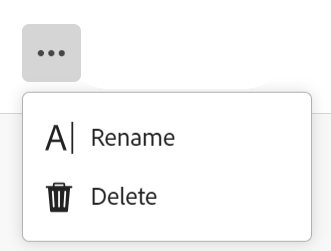

<!--update the metadata with real information when making this available in TOC and in the left nav
---
title: Edit record types
description: You can edit record types after they have been saved. Record types are the objec types of Adobe Maestro.
author: Alina
role: User
feature: Work Management 
topic: Architecture
hidefromtoc: yes
hide: yes
---

-->

# Modification des types d’enregistrement

>[!IMPORTANT]
>
>Actuellement, Adobe Maestro fait partie d’un programme bêta ouvert à un nombre limité de clients.
>
>Pour plus d’informations sur l’inscription au programme bêta de Maestro, contactez le représentant de votre compte.
>
>Pour plus d’informations, voir [Présentation d’Adobe Maestro](../maestro-overview.md).

Les types d’enregistrement sont les types d’objets du Maestro d’Adobe. Vous pouvez modifier l’aspect des types d’enregistrement que vous ou toute autre personne avez créés. Pour plus d’informations sur la création de types d’enregistrement Maestro, voir [Création de types d’enregistrement](../architecture-and-fields/create-record-types.md).

## Exigences d’accès

Vous devez disposer des accès suivants pour effectuer les étapes de cet article :

<table style="table-layout:auto">
 <col>
 <tbody>
<td>
   
 Adobe de produit
 </td>
   <td>
   
 Adobe Workfront
 </td>
  </tr>  
 <td role="rowheader">
Accord Adobe Workfront
</td>
   <td>

Votre entreprise doit être inscrite au programme bêta fermé Adobe Maestro. Contactez le représentant de votre compte pour en savoir plus sur cette nouvelle offre. 

   </td>
  </tr>
  <tr>
   <td role="rowheader">
Formule Adobe Workfront
</td>
   <td>

Tous

   </td>
  </tr>
  <tr>
   <td role="rowheader">
Licence Adobe Workfront
</td>
   <td>
   
Tous
 
  </td>
  </tr>

<tr>
   <td role="rowheader">Niveau d’accès</td>
   <td> 
Tous
  
</td>
  </tr>
<tr>
   <td role="rowheader">Modèle de mise en page</td>
   <td> 
L’administrateur système doit ajouter la zone Maestro à votre modèle de mise en page. Pour plus d’informations, voir <a href="../access/grant-access.md">Accorder l’accès à Adobe Maestro</a>. 
  
</td>
  </tr>
 </tbody>
</table>

<!--Maybe enable this at GA - but Maestro is not supposed to have Access controls in the Workfront Access Level: 
>[!NOTE]
>
>If you don't have access, ask your Workfront administrator if they set additional restrictions in your access level. For information on how a Workfront administrator can change your access level, see [Create or modify custom access levels](../administration-and-setup/add-users/configure-and-grant-access/create-modify-access-levels.md). -->

<!-- Notes to add for the table: for the "Workfront plans" row: the above is only for closed beta; when going to GA - activate the following plans:    

Current plan: Prime and Ultimate

Legacy plan: Enterprise
-->

<!-- Notes for the table: for the "Workfront access" row: 
For more information, see <a href="../../administration-and-setup/add-users/access-levels-and-object-permissions/wf-licenses.md" class="MCXref xref">Adobe Workfront licenses overview</a>.
-->

## Modification des types d’enregistrement

1. Cliquez sur le bouton **Menu Principal** icon  dans le coin supérieur droit de Workfront, <!---or the **Main menu** icon   in the upper-left corner, if available--> puis cliquez sur **Maestro** .

   L’espace de travail du dernier accès doit s’ouvrir par défaut.

1. (Facultatif) Développez la flèche pointant vers le bas située à droite du nom d’un espace de travail existant, puis sélectionnez l’espace de travail pour lequel vous souhaitez créer des types d’enregistrement.
1. Pointez sur la carte d’un type d’enregistrement, puis cliquez sur le **Plus** menu  dans le coin supérieur droit de la carte de type enregistrement, puis cliquez sur **Mettre à jour l&#39;aspect**.

   

1. Dans la zone Mettre à jour le type d&#39;enregistrement , mettez à jour les informations suivantes :

   * **Nom de l’enregistrement**: modifiez le nom du type d’enregistrement, si nécessaire. <!--correct this - I asked Garik to change this field to "Record type name"-->
   * **Apparence**: modifiez la couleur et la forme de l’icône associée au type d’enregistrement. Procédez comme suit :
      * Sélectionnez une couleur pour identifier le type d’enregistrement. Il s’agit de la couleur de l’icône de type d’enregistrement. L’option Gris est sélectionnée par défaut.
      * Sélectionnez une icône dans la liste ou commencez à saisir le nom d’une icône pour décrire ce qu’elle représente, puis sélectionnez-la lorsqu’elle s’affiche. Il s’agit de l’icône du type d’enregistrement. Une icône de fichier est sélectionnée par défaut.

     

1. Cliquez en dehors de la zone Mettre à jour le type d’enregistrement pour enregistrer vos modifications.
1. (Facultatif) Cliquez sur la carte de type d’enregistrement dans la zone de l’espace de travail pour ouvrir la page du type d’enregistrement.
1. Cliquez sur le bouton **Plus** à droite du nom du type d’enregistrement, puis cliquez sur **Renommer** pour renommer le type d’enregistrement

   Ou

   Renommez le type d’enregistrement dans l’en-tête .  <!--check to see if they renamed this to "Rename" - it kept going back and forth between Rename and Edit-->

    <!--check this screen shot - not sure this is valid ???-->

   Vous pouvez également renommer un type d’enregistrement dans l’en-tête de la page du type d’enregistrement.

