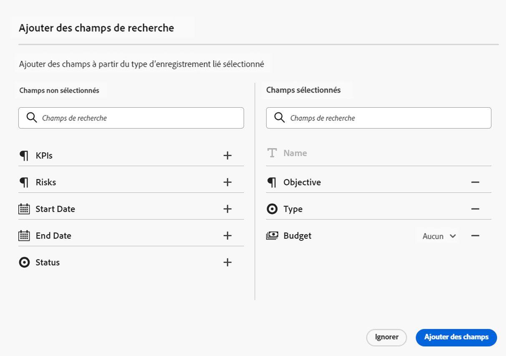
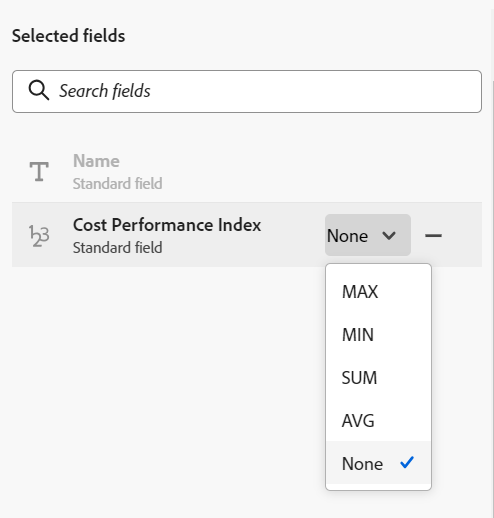
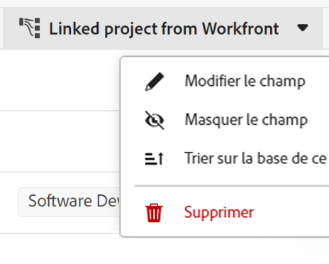

<!-----
title: Connect record types
description: A way to indicate how individual record types relate to one another is to connect them. Also, you can connect Maestro record types with object types from other applications to enhance your users' experience and keep their focus in one application.
hidefromtoc: yes
hide: yes
feature: Work management
role: User
author: Alina
--->

<!--update the metadata with real information when making this avilable in TOC and in the left nav-->
<!--************ THIS MIGHT NO LONGER BE A 'RELATIONSHIP' TYPE FIELD, BECAUSE THEY WILL SHOW IT IN THE CONNECTION TAB*****************************-->

# Connexion des types d’enregistrement

>[!IMPORTANT]
>
>Les informations de cet article se rapportent à Adobe Maestro, une nouvelle offre d’Adobe Workfront.
>
>Actuellement, Adobe Maestro fait partie d’un programme bêta ouvert à un nombre limité de clients. Vous devez être un client Workfront pour utiliser les fonctionnalités de Maestro.
>
>Pour plus d’informations sur l’inscription au programme bêta de Maestro, contactez le représentant de votre compte.
>
>Pour plus d’informations, voir [Présentation d’Adobe Maestro](../maestro-overview.md).

Vous pouvez utiliser Adobe Maestro pour concevoir des espaces de travail entièrement personnalisables contenant les types d’enregistrement nécessaires dans votre entreprise. Une façon d’indiquer comment les types d’enregistrement individuels sont associés les uns aux autres consiste à les connecter. En outre, vous pouvez connecter les types d’enregistrement Maestro aux types d’objets d’autres applications afin d’améliorer l’expérience de vos utilisateurs et de garder leur focus dans une seule application.

Vous pouvez connecter les éléments suivants :

* Types d’enregistrements opérationnels Maestro
* Types d’enregistrements opérationnels Maestro par rapport aux types d’enregistrements taxonomiques
* Types de taxonomie Maestro par rapport aux types d’enregistrements opérationnels
* Types d’enregistrements opérationnels Maestro et types d’objets provenant d’autres applications.

Vous pouvez ainsi afficher les champs de l’enregistrement ou du type d’objet lié sur un autre enregistrement Maestro.

Cet article explique comment connecter deux types d’enregistrement Maestro ou un type d’enregistrement Maestro à un objet d’une autre application.

Une fois la connexion entre les types d’enregistrement ou d’objet établie, vous pouvez connecter des enregistrements individuels les uns aux autres.

Pour plus d’informations sur la connexion d’un enregistrement Maestro à un objet à partir d’une autre application, voir [Connexion d’enregistrements](../records/connect-records.md).

Pour un exemple de connexion des types d’enregistrement, voir [Exemple de connexion de types d&#39;enregistrements et d&#39;enregistrements](../architecture/example-connect-record-types-and-records.md).

<!--ensure this last linked article is right; the title and the link should have changed-->

## Exigences d’accès

Vous devez disposer des accès suivants pour effectuer les étapes de cet article :

<table style="table-layout:auto">
 <col>
 </col>
 <col>
 </col>
 <tbody>
    <tr>
<tr>
<td>
   
 Adobe de produit
 </td>
   <td>
   
 Adobe Workfront
 </td>
  </tr>  
 <td role="rowheader">
Accord Adobe Workfront
</td>
   <td>

Votre entreprise doit être inscrite au programme bêta fermé Adobe Maestro. Contactez le représentant de votre compte pour en savoir plus sur cette nouvelle offre. 

   </td>
  </tr>
  <tr>
   <td role="rowheader">
Formule Adobe Workfront
</td>
   <td>

Quelconque

   </td>
  </tr>
  <tr>
   <td role="rowheader">
Licence Adobe Workfront
</td>
   <td>
   
Quelconque
 
  </td>
  </tr>

<tr>
   <td role="rowheader">Niveau d’accès</td>
   <td> 
Quelconque
  
</td>
  </tr>
<tr>
   <td role="rowheader">Modèle de mise en page</td>
   <td> 
L’administrateur système doit ajouter la zone Maestro à votre modèle de mise en page. Pour plus d’informations, voir <a href="../access/grant-access.md">Accorder l’accès à Adobe Maestro</a>. 
  
</td>
  </tr>
 </tbody>
</table>

<!--
After permssions - replace the table with: 

<table style="table-layout:auto">
 <col>
 </col>
 <col>
 </col>
 <tbody>
    <tr>
<tr>
<td>
   
 Adobe product
 </td>
   <td>
   
 Adobe Workfront
 </td>
  </tr>  
 <td role="rowheader">
Adobe Workfront agreement
</td>
   <td>

Your organization must be enrolled in the Adobe Maestro closed beta program. Contact your account representative to inquire about this new offering. 

   </td>
  </tr>
  <tr>
   <td role="rowheader">
Adobe Workfront plan
</td>
   <td>

Any

   </td>
  </tr>
  <tr>
   <td role="rowheader">
Adobe Workfront license
</td>
   <td>
   
Any
 
  </td>
  </tr>
  
  <tr>
   <td role="rowheader">
Access level
</td>
   <td> 
Any
  
</td>
  </tr>
<tr>
   <td role="rowheader">
Layout template
</td>
   <td> 
Your Workfront or group administrator must add the Maestro area in your layout template. For information, see <a href="../access/grant-access.md">Grant access to Adobe Maestro</a>. 
  
</td>
  </tr>
<tr>
   <td role="rowheader">
Permissions
</td>
   <td> 
Manage permissions to a workspace</a> 
  
   
System Administrators have permissions to all workspaces, including the ones they did not create
</td>
  </tr>
 </tbody>
</table>

-->

<!--Maybe enable this at GA - but Maestro is not supposed to have Access controls in the Workfront Access Level: 
>[!NOTE]
>
>If you don't have access, ask your Workfront administrator if they set additional restrictions in your access level. For information on how a Workfront administrator can change your access level, see [Create or modify custom access levels](../administration-and-setup/add-users/configure-and-grant-access/create-modify-access-levels.md). -->

<!-- Notes to add for the table: for the "Workfront plans" row: the above is only for closed beta; when going to GA - activate the following plans:    

Current plan: Prime and Ultimate

Legacy plan: Enterprise
-->

<!-- Notes for the table: for the "Workfront access" row: 
For more information, see <a href="../../administration-and-setup/add-users/access-levels-and-object-permissions/wf-licenses.md" class="MCXref xref">Adobe Workfront licenses overview</a>.
-->

## Considérations sur la connexion des types d’enregistrement

Tenez compte des points suivants :

* Vous pouvez connecter les entités suivantes dans Maestro :

   * Deux types d&#39;enregistrements opérationnels
   * Deux taxonomies
   * Un type d&#39;enregistrement opérationnel et une taxonomie
   * Un type d’enregistrement opérationnel et un type d’objet d’une autre application.

     >[!TIP]
     >
     >    Vous ne pouvez pas connecter un type d’enregistrement de taxonomie à un type d’enregistrement opérationnel ou à un type d’objet à partir d’une autre application.

* Vous pouvez connecter les objets suivants à partir des applications suivantes à l’aide des types d’enregistrement Maestro :

   * ADOBE WORKFRONT :

      * Projets
      * Portefeuilles
      * Programmes
      * Entreprises
      * Groupes

* Après avoir connecté un type d’enregistrement à un autre type d’enregistrement ou à un type d’objet d’une autre application, les scénarios suivants existent :

   * Lorsque vous connectez deux types d’enregistrement : un champ Enregistrement lié est créé sur le type d’enregistrement à partir duquel vous vous connectez. Un champ d’enregistrement lié similaire est créé dans le type d’enregistrement auquel vous vous connectez.

     Par exemple, si vous connectez le type d’enregistrement &quot;Campagne&quot; au type d’enregistrement &quot;Produit&quot;, un champ d’enregistrement lié que vous nommez &quot;Produit lié&quot; est créé sur le type d’enregistrement Campaign et un type d’enregistrement lié automatiquement nommé &quot;Campagne&quot; est créé sur le type d’enregistrement Produit .

   * Lorsque vous connectez un champ de type enregistrement à une taxonomie : un champ d&#39;enregistrement lié est créé sur le type d&#39;enregistrement à partir duquel vous vous connectez. Aucun champ d’enregistrement lié n’est créé sur la taxonomie à laquelle vous vous connectez.

     Par exemple, si vous connectez le type d’enregistrement &quot;Campaign&quot; au type d’enregistrement de taxonomie &quot;Audience&quot;, un champ d’enregistrement lié que vous nommez &quot;Audience liée&quot; est créé sur le type d’enregistrement Campaign. Aucun champ d’enregistrement lié nommé automatiquement &quot;Campaign&quot; n’est créé sur le type d’enregistrement de la taxonomie de l’audience. <!--this might be temporary-->

   * Lorsque vous connectez un champ de type enregistrement à un type d&#39;objet d&#39;une autre application : un champ d&#39;enregistrement lié est créé sur le type d&#39;enregistrement à partir duquel vous vous connectez. Aucun champ d’enregistrement lié n’est automatiquement créé sur le projet Workfront dans Workfront. Un champ d’enregistrement lié est créé sur le type d’enregistrement d’objet Workfront uniquement lorsque des objets réels sont connectés aux enregistrements Maestro.

     Pour plus d’informations, voir [Connexion d’enregistrements](../records/connect-records.md).

* Après avoir connecté les types d’enregistrement, vous pouvez connecter plusieurs champs d’un type d’enregistrement à un autre. Ces champs sont appelés &quot;champs liés&quot; ou &quot;champs de recherche&quot;.
* Les champs d’enregistrement liés sont précédés d’une icône de relation .
* Après avoir créé des enregistrements individuels pour un type d&#39;enregistrement, vous pouvez sélectionner les enregistrements auxquels vous vous connectez à partir du champ type d&#39;enregistrement associé. Pour plus d’informations, voir [Connexion d’enregistrements](../records/connect-records.md).
* Vous ne pouvez pas éditer les informations des champs liés à partir du type d&#39;enregistrement à partir duquel vous êtes lié, car ils sont automatiquement renseignés à partir du type d&#39;enregistrement d&#39;origine auquel ils appartiennent dès que vous sélectionnez les enregistrements liés.

## Connexion des types d’enregistrement

<!--when changes here, also update the article for "Connect records"-->

1. Cliquez sur le bouton **[!UICONTROL Menu Principal]** icon  dans le coin supérieur droit d’Adobe Workfront, ou (le cas échéant), cliquez sur le bouton **[!UICONTROL Menu Principal]** icon  dans le coin supérieur gauche, puis cliquez sur **[!UICONTROL Maestro]**.

   L’espace de travail du dernier accès doit s’ouvrir par défaut.

1. (Facultatif) Développez la flèche pointant vers le bas située à droite du nom d’un espace de travail existant, puis sélectionnez l’espace de travail duquel vous souhaitez connecter les types d’enregistrement.
1. Cliquez sur la carte d’un type d’enregistrement pour ouvrir la page de type d’enregistrement.
1. Cliquez sur le bouton **+** dans le coin supérieur droit du tableau, puis cliquez sur l’icône **Nouvelle connexion** .

   
1. Dans le **Type d’enregistrement** , sélectionnez l’une des options suivantes : <!--is the field name spelled right? lowercase "t"?-->

   * Autre type d&#39;enregistrement opérationnel
   * Une taxonomie
   * Un projet, un Portfolio, un programme, une entreprise ou un groupe Workfront.

   

   >[!TIP]
   >
   > Seuls les types d’enregistrement et les taxonomies de l’espace de travail sélectionné peuvent être sélectionnés.

1. Mettez à jour les informations suivantes :

   * **Nom**: nom du champ connecté, tel qu’il apparaîtra dans la vue de tableau ou dans la page Détails du type d’enregistrement d’origine. Cela crée la colonne des enregistrements liés dans la vue table du type d&#39;enregistrement d&#39;origine ou du champ d&#39;enregistrement lié pour les enregistrements d&#39;origine. <!--ensure they updated this; and update the screen shot: it used to be "Label"-->

   >[!TIP]
   >
   >Nous vous recommandons d’inclure le nom de l’enregistrement auquel vous êtes lié dans le nom du champ d’enregistrement connecté afin de capturer le type d’enregistrement du nouveau champ. Le nom de l&#39;enregistrement lié n&#39;est pas visible dans le nouveau champ d&#39;enregistrement lié ou ses champs liés.

   * **Description**: informations supplémentaires sur le champ d’enregistrement connecté. La description d’un champ s’affiche lorsque vous placez le pointeur de la souris sur la colonne du champ dans un tableau.
   * **Autoriser plusieurs enregistrements**: sélectionnez cette option pour indiquer que vous autorisez les utilisateurs à ajouter plusieurs enregistrements lorsque le champ de type d’enregistrement associé s’affiche sur les enregistrements originaux. Cette option est sélectionnée par défaut.
   * **Sélectionner les champs de recherche**: sélectionnez cette option pour ajouter des champs à partir du type d’enregistrement sélectionné. Cette option est sélectionnée par défaut.

1. Cliquez sur **Créer**.

1. (Conditionnel) Si vous avez sélectionné le paramètre Sélectionner un champ de recherche à l’étape précédente, la variable **Ajouter des champs de recherche** s’ouvre.

   Cliquez sur le bouton **+** pour ajouter des champs à partir de la fonction **Champs non sélectionnés** zone.

   Ou

   Cliquez sur le bouton **-** pour supprimer des champs de la fonction **Champs sélectionnés** area

   

   >[!NOTE]
   >
   >Si vous ne sélectionnez aucun des champs, la variable **Nom** de l’enregistrement lié est le seul champ visible dans la vue de table de l’enregistrement d’origine. La variable **Nom** ne peut pas être supprimé.

1. (Facultatif et conditionnel) Si vous choisissez de lier un champ de type nombre, devise, pourcentage ou date, sélectionnez également une valeur d’agrégateur. Les valeurs des champs liés s&#39;affichent soit séparés par des virgules, soit sous la forme d&#39;une valeur agrégée selon l&#39;agrégateur que vous choisissez, lorsque les utilisateurs sélectionnent plusieurs enregistrements liés dans le champ d&#39;enregistrement lié.

   

   Sélectionnez l’une des options suivantes :

   * **Aucun**: affiche les valeurs provenant de plusieurs enregistrements séparés par des virgules. Il s’agit de la sélection par défaut.
   * **MAX**: affiche la valeur la plus élevée parmi toutes les valeurs issues de plusieurs enregistrements sélectionnés dans le champ d’enregistrement lié.
   * **MIN**: affiche la valeur la plus basse de toutes les valeurs provenant de plusieurs enregistrements sélectionnés dans le champ d’enregistrement lié.
   * **SUM**: affiche le total de toutes les valeurs provenant de plusieurs enregistrements sélectionnés dans le champ d’enregistrement lié.
   * **AVG**: affiche la moyenne de toutes les valeurs provenant de plusieurs enregistrements sélectionnés dans le champ d’enregistrement lié.

   >[!NOTE]
   >
   >Vous pouvez, par exemple, lier l’enregistrement de produit (enregistrement lié) de l’enregistrement Campaign (enregistrement d’origine) et le nommer &quot;champ de produit&quot;. Vous pouvez également choisir de lier le champ Budget de l’enregistrement de produit à partir de l’enregistrement de campagne et de l’appeler &quot;Budget produit&quot;. Si vous avez le droit de sélectionner plusieurs enregistrements dans le &quot;champ Produit&quot;, vous pouvez sélectionner le Produit 1 dont le budget est de 120 000 € et le Produit 2 dont le budget est de 100 000 €. Vous pouvez afficher les informations budgétaires suivantes dans le champ lié à partir de l’enregistrement d’origine, en fonction de l’agrégateur choisi :
   >
   >* **Aucun**: 120 000 $, 100 000 $
   >* **MAX**: 120 000 $
   >* **MIN**: 100 000 $
   >* **SUM**: 220 000 $
   >* **AVG**: 110 000 $
   >

1. (Facultatif) Utilisez la variable **search** icon  pour rechercher un champ.

1. (Facultatif) Cliquez sur **Ignorer** si vous ne souhaitez ajouter aucun champ du type d’enregistrement connecté.

1. Cliquez sur **Ajouter des champs** pour enregistrer vos modifications.

   Les éléments suivants sont ajoutés :

   * Champ d’enregistrement lié qui affiche les enregistrements du type d’enregistrement lié, une fois que vous les avez ajoutés manuellement. Le nom du champ d’enregistrement lié est le nom que vous avez sélectionné à l’étape 6. <!-- ensure this is still accurate-->

   * Champ(s) lié(s) qui affiche les informations des champs du type d’enregistrement lié après l’ajout manuel des enregistrements dans le champ d’enregistrement lié. Les champs liés ne sont créés que lorsque la variable **Sélectionner les champs de recherche** est sélectionné lors de la création de la connexion. Les champs liés sont nommés selon ce modèle :

     `<Name of the original field on the linked record> (from <Name of your linked field>)`

   * Champ d’enregistrement lié sur le type d’enregistrement auquel vous êtes lié. Le nom du champ d’enregistrement lié sur le type d’enregistrement lié est le nom du type d’enregistrement à partir duquel vous créez un lien.

     Par exemple, si vous associez le type d’enregistrement &quot;Produit&quot; du type d’enregistrement &quot;Campagne&quot; et que vous nommez le champ connecté de la campagne &quot;Produit lié&quot;, un champ d’enregistrement lié &quot;Campagne&quot; est créé pour le type d’enregistrement Produit .

1. (Facultatif) Dans la vue du tableau du type d’enregistrement d’origine ou du type d’enregistrement lié, cliquez sur la flèche pointant vers le bas dans l’en-tête des champs d’enregistrement liés, puis cliquez sur l’une des options suivantes :

   * **Champ Modifier**: vous pouvez uniquement mettre à jour la variable **Nom** et la variable **Description** informations du champ.
   * **Modifier les champs de recherche**: ajoutez ou supprimez l’un des champs de l’enregistrement lié.

   

   Pour ajouter ou supprimer des champs de recherche, suivez les instructions des étapes 7 à 12 ci-dessus. <!--ensure these step numbers stay accurate-->

1. (Facultatif) Cliquez sur la flèche pointant vers le bas dans l’en-tête du champ d’enregistrement lié à partir du type d’enregistrement à partir duquel vous liez, puis cliquez sur . **Supprimer**.

   Le champ d&#39;enregistrement et les autres champs de recherche liés sont supprimés et les champs et leurs informations ne peuvent pas être récupérés.

   >[!TIP]
   >
   >    Le champ d’enregistrement lié sur le type d’enregistrement auquel vous êtes lié n’est pas supprimé. <!-- is this still accurate?! -->
