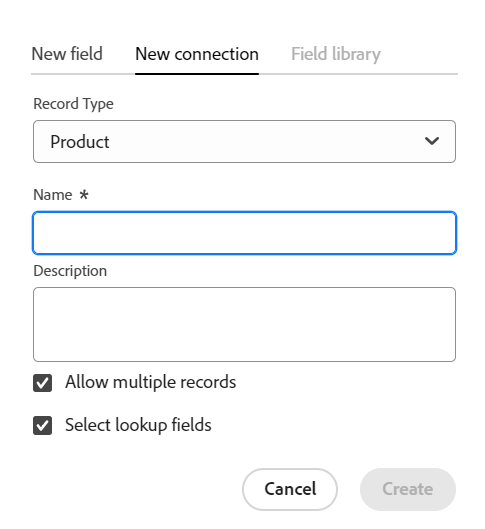

# Exemple de connexion de types d&#39;enregistrements et d&#39;enregistrements

{{maestro-important-intro}}

Cet article décrit un exemple des éléments suivants :

* Comment créer une connexion entre deux types d’enregistrements Maestro et deux enregistrements Maestro.

* Comment créer une connexion entre un type d’enregistrement Adobe Maestro et un type d’objet de projet Workfront, ainsi qu’une connexion entre un enregistrement Maestro et un projet.

Pour plus d’informations, reportez-vous également aux articles suivants :

* [Connexion des types d’enregistrement](../architecture/connect-record-types.md)
* [Connexion d’enregistrements](../records/connect-records.md)

## Connexion de deux types d’enregistrements et d’enregistrements Maestro (exemple)

Par exemple, vous avez un type d’enregistrement nommé Campaign comme type d’enregistrement d’origine.

Vous disposez également d’un autre type d’enregistrement appelé Produit, qui comporte un champ de devise appelé Budget.

Vous souhaitez créer un champ sur le type d&#39;enregistrement de la campagne, dans lequel vous pouvez afficher les valeurs du champ Budget sur le type d&#39;enregistrement Produit.

Pour ce faire :

1. Ouvrez le tableau pour le type d’enregistrement Campaign dans un espace de travail.
1. Cliquez sur le bouton **+** dans le coin supérieur droit de la vue de tableau pour ajouter un nouveau champ, puis cliquez sur **Nouvelle connexion**, puis cliquez sur **Produit** dans la section espace de travail sélectionné.
1. Ajoutez les informations suivantes, par exemple :

   * **Type d’enregistrement**: produit <!--did they change the casing here?-->
   * **Nom**: informations sur le produit. Il s’agit du nom du champ d’enregistrement lié.
   * **Description**: il s’agit des produits auxquels mes campagnes doivent être associées.
   * **Autoriser plusieurs enregistrements**: si vous laissez cette option sélectionnée, les utilisateurs pourront ainsi sélectionner plusieurs enregistrements lorsque le champ de type d’enregistrement associé (Informations sur les produits) s’affichera sur les enregistrements d’origine (Campagnes). Dans notre cas, ils pourront sélectionner plusieurs produits à connecter à une seule campagne.
   * **Sélectionner les champs de recherche**: si vous laissez cette option sélectionnée, la variable **Ajouter des champs de recherche** s’ouvre ensuite pour vous permettre de lier les champs Produit au type d’enregistrement Campaign. Cliquez sur **Ignorer** pour ignorer cette étape et ajouter des champs de produit ultérieurement.

   

1. (Conditionnel) Si vous avez sélectionné l’option **Sélectionner l’option des champs de recherche** à l’étape précédente, dans la liste des champs associés à la variable **Produit** type d’enregistrement, cliquez sur **+** pour la variable **Budget** , puis cliquez sur **Ajouter des champs**. Cela crée un champ appelé **Budget (à partir des informations sur le produit)**, qui est le nom du champ lié. Toutes les informations relatives au budget du produit s’affichent dans ce champ pour les enregistrements de campagne.

   

   >[!TIP]
   >
   >    Si vous souhaitez afficher le budget de tous les produits sélectionnés sous la forme d’un nombre total, sélectionnez **SUM** dans le menu déroulant situé à droite du nom du champ. Lorsque les utilisateurs sélectionnent plusieurs produits dans la variable **Informations sur les produits** champ enregistrement lié, le champ **Budget (à partir des informations sur le produit)** ajoute toutes leurs valeurs Budget et affiche le total. <!-- check the shot below - added a bug with a couple of UI changes here-->
   >
   > Si vous sélectionnez **Aucun**, au lieu de **SUM**, les budgets individuels s’affichent séparés par des virgules.

   Cela génère les champs suivants :

   * Dans la vue Tableau des enregistrements de campagne et dans la page Détails d&#39;une campagne :

      * **Informations sur les produits** (le champ enregistrement associé) : affiche le ou les noms des Produits.
      * **Budget (à partir des informations sur le produit)** (le champ associé) : affiche les budgets des produits sélectionnés dans le champ Informations sur les produits .

   * Dans la vue Tableau des enregistrements de produit et dans la page Détails d’un produit :

      * **Campagne**: indique que le type d’enregistrement Produit est lié au type d’enregistrement Campaign.

     

   >[!TIP]
   >
   >    Les champs d’enregistrement liés sont précédés de l’icône de relation .

1. Dans la **Campagne** table de type enregistrement, créez une campagne en ajoutant une nouvelle ligne au tableau de la page de type enregistrement Campaign.

1. Double-cliquez dans le  **Informations sur les produits** de la nouvelle campagne.

   

1. Utilisez l’une des méthodes suivantes :

   * Cliquez sur le nom d’un produit connecté dans la liste pour l’ajouter à l’enregistrement sélectionné. Le produit est ajouté automatiquement.
   * Commencez à saisir le nom d’un produit et cliquez dessus lorsqu’il s’affiche dans la liste. Le produit est ajouté automatiquement.
   * Cliquez sur **Afficher tout** pour afficher tous les produits.

1. (Conditionnel) Si vous avez cliqué sur **Tout sélectionner** à l’étape précédente, la variable **Connexion d’objets** s’affiche.

   

1. Commencez à saisir le nom d’un produit dans la zone de recherche, puis sélectionnez-le à son affichage dans la liste.

   Ou

   Sélectionnez les enregistrements de produit que vous souhaitez connecter aux enregistrements Campaign, puis cliquez sur **Connexion d’objets**.

   >[!TIP]
   >
   >    Vous pouvez ouvrir la page Détails d’une campagne, rechercher le champ d’enregistrement associé et cliquer sur le bouton **+** dans le champ pour ajouter des produits du type d’enregistrement de produit connecté.

   Les colonnes suivantes sont renseignées dans le tableau Type d’enregistrement de campagne :
   * La variable **Informations sur les produits** renseigne pour l’enregistrement Campaign avec les produits sélectionnés.
   * **Le budget (à partir des informations sur les produits)** renseigne avec la valeur Budget pour chaque produit sélectionné ou avec un total de tous les budgets des produits sélectionnés (si vous avez sélectionné SUM pour votre agrégateur).

   

   >[!TIP]
   >
   >Lorsque vous ne sélectionnez pas d’agrégateur pour les valeurs multiples, toutes les valeurs s’affichent séparées par des virgules.

1. Pour renseigner la variable **Campagne** du champ **Produit** table, répétez les étapes 5 à 7 à partir de la vue table de type enregistrement de produit et en sélectionnant les informations de campagne. Le champ Informations sur les produits sera également mis à jour dans la table de la page Type d’enregistrement Campaign . <!--ensure the step numbers remain correct-->

## Connectez un type d’enregistrement Maestro à un type d’objet de projet Workfront et un enregistrement à des projets individuels.

Par exemple, vous avez un type d’enregistrement nommé Campaign comme type d’enregistrement d’origine.

Vous avez également des projets dans Workfront avec un champ appelé &quot;Recettes planifiées&quot;.

Vous souhaitez créer un champ de connexion sur le type d’enregistrement de la campagne, dans lequel vous pouvez afficher les valeurs du champ Recettes planifiées des projets dans Workfront qui sont connectés aux campagnes dans Maestro.

Pour ce faire :

1. Accédez à un espace de travail dans lequel vous souhaitez connecter le type d’enregistrement Campaign aux projets Workfront.
1. Ouvrez la vue de tableau pour le type d’enregistrement Campaign dans l’espace de travail sélectionné.
1. Cliquez sur le bouton **+** dans le coin supérieur droit de la vue de tableau pour ajouter un nouveau champ, puis cliquez sur **Nouvelle connexion**, puis cliquez sur **Projet** dans le **Types d’objet Workfront** .
1. Ajoutez les informations suivantes, par exemple :

   * **Type d’enregistrement**: projet Workfront (à partir de la sous-section Workfront)
   * **Nom**: informations sur le projet. Il s’agit d’un exemple de ce que vous pouvez appeler le champ d’objet lié.
   * **Description**: il s’agit des projets auxquels mes campagnes doivent être associées. Il s’agit d’un exemple de description du champ d’enregistrement associé.
   * 
      * **Autoriser plusieurs enregistrements**: si vous laissez cette option sélectionnée, les utilisateurs peuvent sélectionner plusieurs projets lorsque le champ de type de projet lié (informations sur le projet) s’affiche sur les enregistrements d’origine (campagnes).
   * **Sélectionner les champs de recherche**: si vous laissez cette option sélectionnée, la variable **Ajouter des champs de recherche** s’ouvre ensuite pour vous permettre de lier les champs du projet au type d’enregistrement Campaign. Cliquez sur **Ignorer** pour ignorer cette étape et ajouter des champs Projet ultérieurement.

   

1. (Conditionnel) Si vous avez sélectionné l’option **Sélectionner l’option des champs de recherche** à l’étape précédente, dans la liste des champs associés à la variable **Projet** , cliquez sur le type d’objet **+** pour la variable **Recettes prévues** , puis cliquez sur **Ajouter des champs**. Cela crée un champ appelé **Recettes prévues (à partir des informations sur le projet)**, qui est le nom du champ lié. Toutes les informations du champ Recettes prévues du projet s’afficheront automatiquement dans ce champ pour les enregistrements de campagne.

   >[!TIP]
   >
   >    Si vous souhaitez afficher les recettes planifiées de tous les projets sélectionnés sous la forme d’un nombre total, sélectionnez **SUM** dans le menu déroulant situé à droite du nom du champ. Lorsque les utilisateurs sélectionnent plusieurs projets dans la variable **Informations sur le projet** le champ d’objet lié, **Recettes prévues (à partir des informations sur les produits)** ajoute toutes leurs valeurs et affiche le total. <!-- check the shot below - added a bug with a couple of UI changes here-->
   >
   > Si vous sélectionnez **Aucun**, au lieu de **SUM**, les recettes planifiées individuelles s’affichent séparées par des virgules.

   

   Cela génère les champs suivants :

   * Dans la vue Tableau des enregistrements de campagne et dans la page Détails d&#39;une campagne :

      * **Informations sur le projet** (le champ d’objet lié) : affiche le ou les noms des projets.
      * **Recettes prévues (à partir des informations sur le projet)** (le champ correspondant) : affiche les Recettes prévues des projets sélectionnés dans le champ Informations sur le projet .

   >[!TIP]
   >
   >    Les champs d’objet liés sont précédés de l’icône de relation .

1. Dans la **Campagne** table de type enregistrement, créez une campagne en ajoutant une nouvelle ligne dans le tableau.

1. Double-cliquez dans le  **Informations sur le projet** de la nouvelle campagne.

   

1. Utilisez l’une des méthodes suivantes :

   * Cliquez sur le nom d’un projet dans la liste pour l’ajouter à l’enregistrement sélectionné. Le projet est ajouté automatiquement.
   * Commencez à saisir le nom d’un projet et cliquez dessus lorsqu’il s’affiche dans la liste. Le projet est ajouté automatiquement.
   * Cliquez sur **Afficher tout** pour afficher tous les projets.

1. (Conditionnel) Si vous avez cliqué sur **Tout sélectionner** à l’étape précédente, la variable **Connexion d’objets** s’affiche.

   

1. Commencez à saisir le nom d’un projet dans la zone de recherche, puis sélectionnez-le lorsqu’il s’affiche dans la liste.

   Ou

   Sélectionnez les enregistrements de projet que vous souhaitez connecter aux enregistrements Campaign, puis cliquez sur **Connexion d’objets**.

   >[!TIP]
   >
   >    Vous pouvez ouvrir la page Détails d’une campagne, rechercher le champ de projet lié et cliquer sur le bouton **+** dans le champ pour ajouter des projets à partir du type d’enregistrement de produit connecté.

   Les éléments suivants sont alors ajoutés à l’espace de travail sélectionné :

   * Dans la table des types d&#39;enregistrements Campaign :
      * La variable **Informations sur le projet** renseigne pour l’enregistrement Campaign avec les projets sélectionnés.
      * La variable **Recettes prévues (à partir des informations sur les produits)** renseigne la valeur Budget pour chaque produit sélectionné. Il s’agit d’un champ en lecture seule.

   

   >[!TIP]
   >
   >Lorsque vous ne sélectionnez pas d’agrégateur pour les valeurs multiples et que vous sélectionnez plusieurs objets dans le champ lié à l’objet, toutes les valeurs s’affichent séparées par des virgules.

1. Cliquez sur le nom d’un projet dans le champ d’enregistrement connecté.

   Cela ouvre le projet Maestro en lecture seule. **Détails** page.
Consultez les informations sur le projet. Seuls les champs de projet sélectionnés s’affichent dans la page Détails.

1. Cliquez sur **Accéder à la source** dans le coin supérieur droit de l’écran pour ouvrir le projet dans Workfront, si vous disposez au moins des autorisations d’affichage sur le projet.
1. (Facultatif) Mettez à jour les informations sur le projet dans Workfront, si vous êtes autorisé à le faire.

1. Dans la vue du tableau Campagne , passez la souris sur le **Informations sur le projet** en-tête de champ, puis cliquez sur la flèche pointant vers le bas, puis sur **Modifier les champs de recherche.**
1. Cliquez sur le bouton **+** de tous les champs de projet que vous souhaitez ajouter à l’enregistrement Workfront Project Manager dans la variable **Champs non sélectionnés** .
1. Cliquez sur le bouton **-** pour tous les champs de projet que vous souhaitez supprimer de l’enregistrement Workfront Project Manager dans la variable **Champs sélectionnés** .
1. Cliquer sur **Enregistrer**.

   Des champs liés supplémentaires sont ajoutés au type d’enregistrement Campaign.
