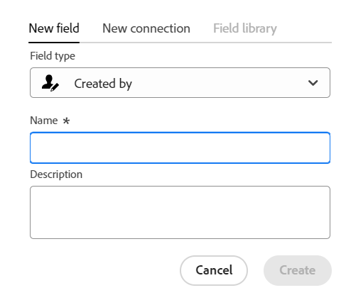

<!--udpate the metadata with real information when making this avilable in TOC and in the left nav-->

<!---
title: Create fields
description: In Adobe Maestro, you can create custom fields for each kind of operational record type or taxonomy. You can then associate the field with Maestro records.
hidefromtoc: yes
hide: yes
author: Alina
feature: (*******************WE NEED A NEW ONE*******************)
role: User, Administrator (************is this right???************)
recommendations: noDisplay, noCatalog
--->

<!--Should the structure of this article be like this one: https://experienceleague.adobe.com/docs/workfront/using/administration-and-setup/customize/custom-forms/custom-form-builder/use-the-custom-form-builder/add-a-custom-field-to-a-custom-form.html?lang=en ??-->

<!--will they add a way to create fields elsewhere than in a table?! - how will that change the structure of this article? -->

<!--Do we need this for FORMULAS: when we release permissions to RECORDS and we release referring lookup fields in a formula field, update considerations to say that lookup fields from linked records depends on the permissions to the record; if they have no permissions to view a linked record, they won't be able to use that records's lookup fields in a formula - not sure is needed??-->

# Créer des champs

{{planning-important-intro}}

Dans Adobe Workfront Planning, vous pouvez créer des champs personnalisés pour les types d’enregistrement. Vous pouvez ensuite associer les champs aux enregistrements de planification Workfront afin d’améliorer les informations d’enregistrement.

Vous devez créer des types d’enregistrement avant de pouvoir créer des champs à associer. Pour plus d’informations, voir [Création de types d’enregistrement](../architecture/create-record-types.md).

Vous pouvez créer des champs de la manière suivante dans Maestro :

* À partir de zéro
* Connexion des types d’enregistrement
* En important des types d’enregistrement à l’aide d’un fichier Excel ou CSV
* En créant un type d&#39;enregistrement
* En créant un espace de travail à partir d’un modèle

Pour plus d’informations sur les champs Maestro, voir [Présentation des champs](/help/quicksilver/maestro/fields/fields-overview.md).

## Conditions d’accès

Vous devez disposer des accès suivants pour effectuer les étapes de cet article :

<table style="table-layout:auto">
 <col>
 </col>
 <col>
 </col>
 <tbody>
    <tr>
<tr>
<td>
   
 Produit
 </td>
   <td>
   
 Adobe Workfront
 </td>
  </tr>  
 <td role="rowheader">
Accord Adobe Workfront
</td>
   <td>

Votre entreprise doit être inscrite à l’étape d’accès anticipé pour la planification Workfront 

   </td>
  </tr>
  <tr>
   <td role="rowheader">
Forfait Adobe Workfront
</td>
   <td>

N’importe quelle

   </td>
  </tr>
  <tr>
   <td role="rowheader">
Licence Adobe Workfront
</td>
   <td>
   
N’importe quelle
 
  </td>
  </tr>

<tr>
   <td role="rowheader">
Configurations du niveau d’accès
</td>
   <td> 
Il n’existe aucun contrôle de niveau d’accès pour Workfront Planning
  
</td>
  </tr>

<tr>
   <td role="rowheader">
Autorisations
</td>
   <td> 
Gestion des autorisations d’un espace de travail</a> 
  
   
Les administrateurs système disposent d’autorisations pour tous les espaces de travail, y compris ceux qu’ils n’ont pas créés.

</td>
  </tr>
<tr>
   <td role="rowheader">
Modèle de mise en page
</td>
   <td> 
L’administrateur de Workfront ou de groupe doit ajouter la zone Planning dans votre modèle de mise en page. Pour plus d’informations, voir <a href="../access/access-overview.md">Présentation de l’accès</a>. 
  
</td>
  </tr>

</tbody>
</table>

<!--Maybe enable this at GA - but Maestro is not supposed to have Access controls in the Workfront Access Level: 
>[!NOTE]
>
>If you don't have access, ask your Workfront administrator if they set additional restrictions in your access level. For information on how a Workfront administrator can change your access level, see [Create or modify custom access levels](../administration-and-setup/add-users/configure-and-grant-access/create-modify-access-levels.md). -->

## Créer des champs à partir de zéro {#create-fields-from-scratch}

<!--in a table (not sure if this can be done elsewhere?!-->

{{step1-to-maestro}}

L’espace de travail du dernier accès doit s’ouvrir par défaut.

1. (Facultatif) Développez la flèche pointant vers le bas située à droite du nom d’un espace de travail existant, sélectionnez l’espace de travail dont vous souhaitez créer des champs, puis cliquez sur le type d’enregistrement.

   Tous les enregistrements existants associés au type d&#39;enregistrement s&#39;affichent dans les lignes du mode Tableau.

   >[!TIP]
   >
   >    Si aucun enregistrement ne s’affiche, il se peut que vous n’ayez encore aucun enregistrement ou qu’un filtre soit appliqué pour limiter ce que vous voyez à l’écran.

   Tous les champs existants associés au type d&#39;enregistrement s&#39;affichent dans les colonnes de la vue de tableau. <!--caveat this for when we can hide the fields; mention that they can be hidden if they are not visible by default-->

1. Cliquez sur le bouton **+** dans le coin supérieur droit de la vue de tableau pour ajouter de nouveaux champs.
1. Dans le **Nouveau champ** , recherchez un type de champ dans la variable **Type de champ** ou effectuez une sélection parmi les types de champ suivants :

   * [Texte à une ligne](#single-line-text)
   * [Paragraphe](#paragraph)
   * [Sélection multiple](#multi-select)
   * [Sélection unique](#single-select)
   * [Date](#date)
   * [Nombre](#number)
   * [Pourcentage](#percentage)
   * [Devise](#currency)
   * [Case à cocher](#checkbox)
   * [Formule](#formula)
   * [Personnes](#people)
   * [Créé par](#created-by)
   * [Date de création](#created-date)
   * [Dernière modification par](#last-modified-by)
   * [Date de dernière modification](#last-modified-date)

   >[!IMPORTANT]
   >
   >    Une fois enregistré, vous ne pouvez pas modifier le type de champ du champ.

1. Poursuivez en ajoutant chaque champ, comme décrit dans les sections ci-dessous.

### Texte à une ligne {#single-line-text}

Les champs de texte d’une seule ligne capturent des informations alphanumériques limitées. Vous pouvez, par exemple, capturer les informations du propriétaire, du partenaire, de l’équipe ou de l’entité organisationnelle dans un champ de texte d’une seule ligne. Le contenu d’un champ de texte d’une seule ligne peut contenir jusqu’à 250 caractères. <!-- asked Lilit if we can change this to "Single-line" since this can have numbers and text.-->

1. Commencez à créer un champ comme décrit dans la section [Créer des champs à partir de zéro](#create-fields-from-scratch) dans cet article, puis sélectionnez l’option **Texte sur une seule ligne** type de champ.

   

1. Ajoutez les informations suivantes dans la variable **Nouveau champ** tab :
   * **Nom**: nom du type de champ, tel qu’il apparaîtra dans un tableau ou dans la page Détails de l’enregistrement. <!--ensure they updated this; and update the screen shot: it used to be "Label"-->
   * **Description**: informations supplémentaires sur le champ. La description d’un champ s’affiche lorsque vous placez le pointeur de la souris sur l’en-tête de colonne d’un champ dans un tableau.
1. Cliquez sur **Créer**.

   Le nouveau champ d&#39;une seule ligne est ajouté en colonne au type d&#39;enregistrement et ses valeurs peuvent être associées à des enregistrements.

### Paragraphe {#paragraph}

Les champs de paragraphe capturent des informations alphanumériques supplémentaires sur un enregistrement, semblables au champ Description .

>[!TIP]
>
>* Le contenu d’un champ de paragraphe peut contenir jusqu’à 1 000 caractères.
>
>* Vous pouvez utiliser la mise en forme Texte enrichi pour améliorer le contenu des champs de paragraphe lorsqu’ils s’affichent dans la vue Tableau ou la page Détails d’un enregistrement. Pour plus d’informations, voir [Modifier des enregistrements](/help/quicksilver/maestro/records/edit-records.md).

1. Commencez à créer un champ comme décrit dans la section [Créer des champs à partir de zéro](#create-fields-from-scratch) dans cet article, puis sélectionnez l’option **Paragraphe** type de champ.

   

1. Ajoutez les informations suivantes dans la variable **Nouveau champ** tab :
   * **Nom**: nom du type de champ, tel qu’il apparaîtra dans un tableau ou dans la page Détails de l’enregistrement. <!--ensure they updated this; and update the screen shot: it used to be "Label"-->
   * **Description**: informations supplémentaires sur le champ. La description d’un champ s’affiche lorsque vous placez le pointeur de la souris sur la colonne du champ dans un tableau.
1. Cliquez sur **Créer**.

   Le nouveau champ de paragraphe est ajouté en tant que colonne au type d’enregistrement et ses valeurs peuvent être associées à des enregistrements.

### Sélection multiple {#multi-select}

Vous pouvez utiliser un champ à sélection multiple pour capturer des informations supplémentaires dans n’importe quel format en sélectionnant plusieurs options dans un menu déroulant.

1. Commencez à créer un champ comme décrit dans la section [Créer des champs à partir de zéro](#create-fields-from-scratch) dans cet article, puis sélectionnez l’option **Sélection multiple** type de champ.

   

1. Ajoutez les informations suivantes dans la variable **Nouveau champ** tab :
   * **Nom**: nom du type de champ, tel qu’il apparaîtra dans un tableau ou dans la page Détails de l’enregistrement. <!--ensure they updated this; and update the screen shot: it used to be "Label"-->
   * **Description**: informations supplémentaires sur le champ. La description d’un champ s’affiche lorsque vous placez le pointeur de la souris sur la colonne du champ dans un tableau.
   * **Choix**: options disponibles pour la sélection dans le menu déroulant après l’enregistrement du champ. Vous pouvez avoir des nombres et des lettres pour le nom de chaque choix.
1. Cliquez sur **Ajouter un choix** pour ajouter autant de choix que nécessaire. Le nombre de choix que vous pouvez ajouter à un champ à sélection multiple est illimité.
1. (Facultatif) Faites glisser et déposez manuellement chaque choix dans l’ordre souhaité, ou sélectionnez l’option
   **Choix de tri A-Z** si vous souhaitez que les choix soient automatiquement répertoriés dans l’ordre alphabétique. <!--Add this if they added this functionality: You cannot edit this option after you save the field.-->
1. (Facultatif) Pour supprimer un choix, cliquez sur le bouton **x** à droite de celle-ci.
1. Cliquez sur l’échantillon de couleur à gauche d’un choix pour développer le sélecteur de couleurs et personnaliser la couleur de chaque option.
1. Cliquez sur **Créer**.

   Le nouveau champ à sélection multiple est ajouté en tant que colonne au type d&#39;enregistrement et ses valeurs peuvent être associées à des enregistrements.

### Sélection unique {#single-select}

Les champs à sélection unique capturent des informations supplémentaires dans n’importe quel format en sélectionnant une option dans un menu déroulant.

1. Commencez à créer un champ comme décrit dans la section [Créer des champs à partir de zéro](#create-fields-from-scratch) dans cet article, puis sélectionnez l’option **Sélection simple** type de champ.

   

1. Ajoutez les informations suivantes dans la variable **Nouveau champ** tab :
   * **Nom**: nom du type de champ, tel qu’il apparaîtra dans un tableau ou dans la page Détails de l’enregistrement. <!--ensure they updated this; and update the screen shot: it used to be "Label"-->
   * **Description**: informations supplémentaires sur le champ. La description d’un champ s’affiche lorsque vous placez le pointeur de la souris sur la colonne du champ dans un tableau.
   * **Choix**: options disponibles pour la sélection dans le menu déroulant après l’enregistrement du champ. Vous pouvez avoir des nombres et des lettres pour le nom de chaque choix.

1. Cliquez sur **Ajouter un choix** pour ajouter autant de choix que nécessaire. Le nombre de choix que vous pouvez ajouter à un champ à sélection unique n’est pas limité.
1. (Facultatif) Faites glisser et déposez manuellement chaque choix dans l’ordre souhaité, ou sélectionnez l’option **Choix de tri A-Z** si vous souhaitez que les choix soient automatiquement répertoriés dans l’ordre alphabétique. <!--Add this if they added this functionality: You cannot edit this option after you save the field.-->
1. (Facultatif) Pour supprimer un choix, cliquez sur le bouton **x** à droite de celle-ci.
1. Cliquez sur l’échantillon de couleur à gauche d’un choix pour développer le sélecteur de couleurs et personnaliser la couleur de chaque option.
1. Cliquez sur **Créer**.

   Le nouveau champ à sélection unique est ajouté en tant que colonne au type d&#39;enregistrement et ses valeurs peuvent être associées à des enregistrements.

### Date {#date}

Vous pouvez utiliser un champ date pour capturer des informations supplémentaires au format date et heure.

1. Commencez à créer un champ comme décrit dans la section [Créer des champs à partir de zéro](#create-fields-from-scratch) dans cet article, puis sélectionnez l’option **Date** type de champ.

   

1. Ajoutez les informations suivantes dans la variable **Nouveau champ** tab :
   * **Nom**: nom du type de champ, tel qu’il apparaîtra dans une table ou dans la page d’enregistrement. <!--ensure they updated this; and update the screen shot: it used to be "Label"-->
   * **Description**: informations supplémentaires sur le champ. La description d’un champ s’affiche lorsque vous placez le pointeur de la souris sur la colonne du champ dans un tableau.
   * **Format de date**: type de format de date à afficher dans ce champ. <!--update this casing - submitted bug for it-->

     Sélectionnez l’un des formats suivants :
      * **Paramètres régionaux**: correspond aux paramètres régionaux de votre navigateur.
      * **Standard**: 05/16/2023
      * **Long**: 16 mai 2023
      * **Européen**: 16/05/2023
      * **ISO**: 2023-05-16
   * **Inclure un champ d’heure**: sélectionnez cette option si vous souhaitez inclure un horodatage. Cette option est désélectionnée par défaut. <!--update this setting name - submitted bug for it to be changed-->

     Sélectionnez l’une des options suivantes :

      * **24h**: par exemple : 18:00
      * **12h**: par exemple : 18 heures

1. Cliquez sur **Créer**.

   Le nouveau champ date est ajouté en tant que colonne au type d&#39;enregistrement et ses valeurs peuvent être associées à des enregistrements.

### Nombre {#number}

Les types de champ Nombre capturent les informations au format numérique.

1. Commencez à créer un champ comme décrit dans la section [Créer des champs à partir de zéro](#create-fields-from-scratch) dans cet article, puis sélectionnez l’option **Nombre** type de champ.

   
1. Ajoutez les informations suivantes dans la variable **Nouveau champ** tab :

   * **Nom**: nom du type de champ, tel qu’il apparaîtra dans une table ou dans la page d’enregistrement.
   * **Description**: informations supplémentaires sur le champ. La description d’un champ s’affiche lorsque vous placez le pointeur de la souris sur la colonne du champ dans un tableau.
   * **Précision**: nombre de décimales que vous souhaitez enregistrer pour le champ. Vous pouvez afficher jusqu’à 6 décimales.
   * **Autoriser les nombres négatifs**: sélectionnez cette option si vous souhaitez autoriser les nombres négatifs dans ce champ. Cette option n’est pas sélectionnée par défaut.

   >[!NOTE]
   >
   >    Si vous sélectionnez Autoriser les nombres négatifs et que les valeurs négatives sont stockées sur les enregistrements auxquels le champ est associé, vous ne pouvez plus désélectionner ce paramètre à l’avenir.

1. Cliquez sur **Créer**.

   Le nouveau champ numérique est ajouté en tant que colonne au type d&#39;enregistrement et ses valeurs peuvent être associées à des enregistrements.

### Pourcentage {#percentage}

Les types de champ en pourcentage capturent les informations au format numérique, suivis d’un signe de pourcentage.

1. Commencez à créer un champ comme décrit dans la section [Créer des champs à partir de zéro](#create-fields-from-scratch) dans cet article, puis sélectionnez l’option **Pourcentage** type de champ.

   

1. Ajoutez les informations suivantes dans la variable **Nouveau champ** tab :
   * **Nom**: nom du type de champ, tel qu’il apparaîtra dans une table ou dans la page d’enregistrement.
   * **Description**: informations supplémentaires sur le champ. La description d’un champ s’affiche lorsque vous placez le pointeur de la souris sur la colonne du champ dans un tableau.
   * **Précision**: nombre de décimales que vous souhaitez enregistrer pour le champ. Vous pouvez afficher jusqu’à 6 décimales.
   * **Autoriser les nombres négatifs**: sélectionnez cette option si vous souhaitez autoriser les valeurs en pourcentage négatif dans ce champ. Cette option n’est pas sélectionnée par défaut.

   >[!NOTE]
   >
   >    Si vous sélectionnez Autoriser les nombres négatifs et que les valeurs négatives sont stockées sur les enregistrements auxquels le champ est associé, vous ne pouvez plus désélectionner ce paramètre à l’avenir.

1. Cliquez sur **Créer**.

   Le nouveau champ de pourcentage est ajouté en tant que colonne au type d&#39;enregistrement et ses valeurs peuvent être associées à des enregistrements.

### Devise {#currency}

Les types de champ de devise capturent les informations dans un format numérique précédé d’un symbole monétaire.

1. Commencez à créer un champ comme décrit dans la section [Créer des champs à partir de zéro](#create-fields-from-scratch) dans cet article, puis sélectionnez l’option **Devise** type de champ.

   

1. Ajoutez les informations suivantes dans la variable **Nouveau champ** tab :
   * **Nom**: nom du type de champ, tel qu’il apparaîtra dans une table ou dans la page d’enregistrement. <!--ensure they updated this; and update the screen shot: it used to be "Label"-->
   * **Description**: informations supplémentaires sur le champ. La description d’un champ s’affiche lorsque vous placez le pointeur de la souris sur la colonne du champ dans un tableau.
   * **Devise**: type de devise à afficher dans ce champ. Il s’agit d’une liste de devises selon l’Organisation internationale de normalisation (ISO).
   * **Précision**: nombre de décimales que vous souhaitez enregistrer pour le champ. Vous pouvez afficher jusqu’à 6 décimales.
   * **Autoriser les nombres négatifs**: sélectionnez cette option si vous souhaitez autoriser les valeurs de devise négatives dans ce champ. Cette option n’est pas sélectionnée par défaut.

   >[!NOTE]
   >
   >    Si vous sélectionnez Autoriser les nombres négatifs et que les valeurs négatives sont stockées sur les enregistrements auxquels le champ est associé, vous ne pouvez plus désélectionner ce paramètre à l’avenir.

1. Cliquez sur **Créer**.

   Le nouveau champ de devise est ajouté en tant que colonne au type d’enregistrement et ses valeurs peuvent être associées à des enregistrements.

### Case à cocher

Vous pouvez utiliser le type de champ Case à cocher pour ajouter une seule option de case à cocher à un enregistrement. Vous pouvez utiliser ce champ pour indiquer un attribut ou un état spécifique pour cet enregistrement. Par exemple, vous pouvez l’utiliser comme indicateur pour le suivi de la fin, de l’approbation ou de tout autre attribut binaire pour chaque enregistrement.

1. Commencez à créer un champ comme décrit dans la section [Créer des champs à partir de zéro](#create-fields-from-scratch) dans cet article, puis sélectionnez l’option **Case à cocher** type de champ.

   

1. Ajoutez les informations suivantes dans la variable **Nouveau champ** tab :
   * **Nom**: nom du type de champ, tel qu’il apparaîtra dans une table ou dans la page d’enregistrement. <!--ensure they updated this; and update the screen shot: it used to be "Label"-->
   * **Description**: informations supplémentaires sur le champ. La description d’un champ s’affiche lorsque vous placez le pointeur de la souris sur la colonne du champ dans un tableau.
1. Cliquez sur **Créer**.

   Le nouveau champ de case à cocher est ajouté en tant que colonne au type d’enregistrement et ses valeurs peuvent être associées à des enregistrements.

### Formule

Les champs de formule génèrent une nouvelle valeur en utilisant les valeurs existantes d&#39;autres champs d&#39;un type d&#39;enregistrement et une fonction qui indique comment les valeurs existantes doivent être calculées.

Pour plus d’informations, voir [Champs de formule - Aperçu](/help/quicksilver/maestro/fields/formula-fields.md).

1. Commencez à créer un champ comme décrit dans la section [Créer des champs à partir de zéro](#create-fields-from-scratch) dans cet article, puis sélectionnez l’option **Formule** type de champ.

   

1. Ajoutez les informations suivantes dans la variable **Nouveau champ** tab :

   * **Nom**: saisissez le nom du nouveau champ.
   * **Description**: ajoutez des informations sur le nouveau champ.
   * **Formule**: commencez à saisir au moins un caractère pour accéder à une expression, puis sélectionnez-le lorsqu’il s’affiche dans la liste.

1. Cliquez sur l’expression sélectionnée pour afficher la définition et afficher sa mise en forme.

   

   Pour plus d’informations sur les expressions prises en charge, voir [Champs de formule - Aperçu](/help/quicksilver/maestro/fields/formula-fields.md)

1. Ajoutez les noms des champs tels qu’ils s’affichent dans la Planification Workfront pour les référencer dans une formule.

   >[!NOTE]
   >
   > Vous ne pouvez pas ajouter de champs de type Sélection multiple dans une formule.

1. Cliquez sur **Créer**.

   Le nouveau champ de formule est ajouté en tant que colonne au type d&#39;enregistrement et ses valeurs peuvent être associées à des enregistrements.

### Personnes

Vous pouvez utiliser le type de champ Personnes pour ajouter un utilisateur. <!--, job role, or team--> à un enregistrement. Il s’agit d’un champ de type anticipé que vous pouvez ajouter uniquement aux utilisateurs.<!--, roles, or teams--> qui existent déjà dans votre instance Workfront.

1. Commencez à créer un champ comme décrit dans la section [Créer des champs à partir de zéro](#create-fields-from-scratch) dans cet article, puis sélectionnez l’option **Personnes** type de champ.

   

1. Ajoutez les informations suivantes dans la variable **Nouveau champ** tab :
   * **Nom**: nom du type de champ, tel qu’il apparaîtra dans une table ou dans la page d’enregistrement.
   * **Description**: informations supplémentaires sur le champ. La description d’un champ s’affiche lorsque vous placez le pointeur de la souris sur la colonne du champ dans un tableau.
   * **Autoriser plusieurs valeurs**: sélectionnez cette option si vous souhaitez permettre aux utilisateurs d’ajouter plusieurs utilisateurs dans ce champ. Cette option n’est pas sélectionnée par défaut.

   >[!NOTE]
   >
   >    Si vous sélectionnez Autoriser plusieurs valeurs et que plusieurs utilisateurs sont stockés dans les enregistrements auxquels le champ est associé, vous ne pouvez plus désélectionner le paramètre à l’avenir lors de la modification de ce champ.

1. Cliquez sur **Créer**.

   Le nouveau champ Type de personne est ajouté en tant que colonne au type d’enregistrement et ses valeurs peuvent être associées à des enregistrements.

### Créé par

Vous pouvez utiliser le type de champ Créé par pour ajouter à un enregistrement l’utilisateur qui a créé l’enregistrement. Il s’agit d’un champ en lecture seule qui s’affiche automatiquement avec le nom de l’utilisateur connecté lors de la création de l’enregistrement.

1. Commencez à créer un champ comme décrit dans la section [Créer des champs à partir de zéro](#create-fields-from-scratch) dans cet article, puis sélectionnez l’option **Créé par** type de champ.

   

1. Ajoutez les informations suivantes dans la variable **Nouveau champ** tab :

   * **Nom**: nom du type de champ, tel qu’il apparaîtra dans une table ou dans la page d’enregistrement. <!--this might change and they might prepopulate it with "Created by"-->
   * **Description**: informations supplémentaires sur le champ. La description d’un champ s’affiche lorsque vous placez le pointeur de la souris sur la colonne du champ dans un tableau.

1. Cliquez sur **Créer**.

   Le nouveau champ Créé par type est ajouté en colonne au type d&#39;enregistrement et ses valeurs sont préremplies avec le nom de l&#39;utilisateur qui a créé chaque enregistrement.

### Date de création

Vous pouvez utiliser le type de champ Date de création pour ajouter à un enregistrement la date à laquelle l’enregistrement a été créé. Il s’agit d’un champ en lecture seule qui est automatiquement renseigné avec la date (et éventuellement avec l’heure) de création de l’enregistrement.

1. Commencez à créer un champ comme décrit dans la section [Créer des champs à partir de zéro](#create-fields-from-scratch) dans cet article, puis sélectionnez l’option **Date de création** type de champ.

   

   <!--check the image above - added bug fix for UI text changes-->

1. Ajoutez les informations suivantes dans la variable **Nouveau champ** tab :

   * **Nom**: nom du type de champ, tel qu’il apparaîtra dans une table ou dans la page d’enregistrement. <!--this might change and they might prepopulate it with "Created date"-->
   * **Description**: informations supplémentaires sur le champ. La description d’un champ s’affiche lorsque vous placez le pointeur de la souris sur la colonne du champ dans un tableau.
   * **Format de date**: sélectionnez l’un des formats suivants :

      * **Paramètres régionaux**: correspond aux paramètres régionaux de votre navigateur.
      * **Standard**: 05/16/2023
      * **Long**: 16 mai 2023
      * **Européen**: 16/05/2023
      * **ISO**: 2023-05-16
   * **Inclure un champ d’heure**: sélectionnez cette option si vous souhaitez inclure un horodatage. Cette option est désélectionnée par défaut. <!--submitted a UI text change for this - check the UI-->

     Sélectionnez l’une des options suivantes :

      * **24h**: par exemple : 18:00
      * **12h**: par exemple : 18 heures

1. Cliquez sur **Créer**.

   Le nouveau champ de type Date de création est ajouté en colonne au type d’enregistrement et ses valeurs sont préremplies avec la date (ou la date et l’heure) de création de l’enregistrement.

### Dernière modification par

Vous pouvez utiliser le champ Dernière modification par type pour ajouter à un enregistrement l&#39;utilisateur qui a modifié l&#39;enregistrement pour la dernière fois. Il s’agit d’un champ en lecture seule qui s’affiche automatiquement avec le nom de l’utilisateur connecté lors de la dernière mise à jour de l’enregistrement.

1. Commencez à créer un champ comme décrit dans la section [Créer des champs à partir de zéro](#create-fields-from-scratch) dans cet article, puis sélectionnez l’option **Dernière modification par** type de champ.

   

1. Ajoutez les informations suivantes dans la variable **Nouveau champ** tab :

   * **Nom**: nom du type de champ, tel qu’il apparaîtra dans une table ou dans la page d’enregistrement. <!--this might change and they might prepopulate it with "Created by"-->
   * **Description**: informations supplémentaires sur le champ. La description d’un champ s’affiche lorsque vous placez le pointeur de la souris sur la colonne du champ dans un tableau.

1. Cliquez sur **Créer**.

   Le nouveau champ Par type Dernière modification est ajouté en colonne au type d&#39;enregistrement et ses valeurs sont préremplies avec le nom de l&#39;utilisateur qui a modifié chaque enregistrement pour la dernière fois.

### Date de dernière modification

Vous pouvez utiliser le type de champ Date de dernière modification pour ajouter à un enregistrement la date de dernière modification d’un enregistrement. Il s’agit d’un champ en lecture seule qui s’affiche automatiquement avec la date (et éventuellement avec l’heure) de la dernière modification de l’enregistrement.

1. Commencez à créer un champ comme décrit dans la section [Créer des champs à partir de zéro](#create-fields-from-scratch) dans cet article, puis sélectionnez l’option **Date de création** type de champ.

   

   <!--check the image above - added bug fix for UI text changes-->

1. Ajoutez les informations suivantes dans la variable **Nouveau champ** tab :

   * **Nom**: nom du type de champ, tel qu’il apparaîtra dans une table ou dans la page d’enregistrement. <!--this might change and they might prepopulate it with "Created date"-->
   * **Description**: informations supplémentaires sur le champ. La description d’un champ s’affiche lorsque vous placez le pointeur de la souris sur la colonne du champ dans un tableau.
   * **Format de date**: sélectionnez l’un des formats suivants :

      * **Paramètres régionaux**: correspond aux paramètres régionaux de votre navigateur.
      * **Standard**: 05/16/2023
      * **Long**: 16 mai 2023
      * **Européen**: 16/05/2023
      * **ISO**: 2023-05-16
   * **Inclure un champ d’heure**: sélectionnez cette option si vous souhaitez inclure un horodatage. Cette option est désélectionnée par défaut. <!--submitted a UI text change for this - check the UI-->

     Sélectionnez l’une des options suivantes :

      * **24h**: par exemple : 18:00
      * **12h**: par exemple : 18 heures

1. Cliquez sur **Créer**.

   Le nouveau champ Type de date de dernière modification est ajouté en colonne au type d’enregistrement et ses valeurs sont préremplies avec la date (ou la date et l’heure) de la dernière modification de l’enregistrement.

## Créer des champs en connectant des types d’enregistrement

Vous pouvez créer des champs d’enregistrement liés lorsque vous ajoutez une nouvelle connexion entre deux types d’enregistrement Maestro ou un type d’enregistrement et un type d’objet à partir d’autres applications.

Pour plus d’informations sur la connexion des types d’enregistrement Workfront Planning, voir [Connexion des types d’enregistrement](../architecture/connect-record-types.md)

## Créer des champs en important des types d’enregistrement à l’aide d’un fichier Excel ou CSV

Pour plus d’informations, voir [Création de types d’enregistrement](../architecture/create-record-types.md).

## Créer des champs en créant un type d’enregistrement

Lorsque vous créez un type d&#39;enregistrement, plusieurs champs associés au nouveau type d&#39;enregistrement sont également créés par défaut. Pour plus d’informations, voir [Création de types d’enregistrement](../architecture/create-record-types.md).

## Créer des champs en créant un espace de travail à partir d’un modèle

Adobe Workfront Planning crée des champs pour les types d’enregistrement lorsque vous créez un espace de travail à partir d’un modèle.

Pour plus d’informations, voir [Créer des espaces de travail](/help/quicksilver/maestro/architecture/create-workspaces.md).