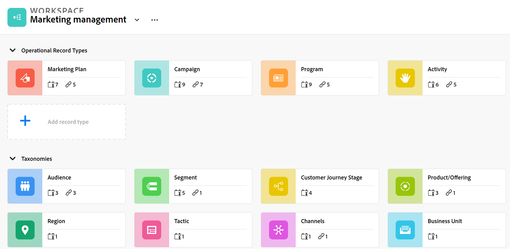
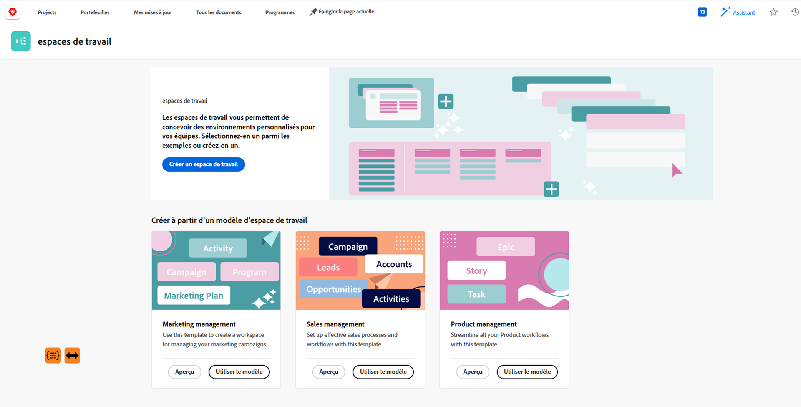

# Présentation de la planification Adobe Workfront

<!--this article is linked to the WF Planning landing page - do not change URL or move it-->

<!--update the metadata with real information when making this available in TOC and in the left nav-->

<!-- remove the references to closed beta from the entire article-->

<!--update the video in the IMPORTANT below, when we have something better, especially after Open Beta - remove it-->

>[!IMPORTANT]
>
>Les informations de cet article se rapportent à Adobe Workfront Planning, une nouvelle offre d’Adobe Workfront.
>
>Actuellement, Adobe Workfront Planning fait partie d’un programme bêta qui est ouvert à un nombre limité de clients. Vous devez être un client Workfront pour utiliser ces fonctionnalités.
>
>Pour plus d’informations sur l’inscription au programme bêta de la planification Workfront, contactez le représentant du compte.
>
>Pour obtenir la liste complète de toutes les sections et articles qui documentent la planification Workfront, voir [Planification Adobe Workfront : index des articles](/help/quicksilver/maestro/maestro-information.md).

<!--[View a video demonstration of Adobe Workfront Planning capabilities.](https://video.tv.adobe.com/v/3424253/){target=_blank}-->

## Présentation de la planification Adobe Workfront

Adobe Workfront Planning est une nouvelle offre d’Adobe Workfront. L’objectif de la planification Workfront est de déverrouiller une visibilité complète sur les détails opérationnels d’une organisation et de répondre aux questions commerciales essentielles à chaque étape du cycle de vie de la gestion du travail.

Les équipes et le leadership doivent avoir des réponses claires aux questions suivantes :

* Combien de campagnes sommes-nous en cours d&#39;exécution dans la zone EMEA pour le quatrième trimestre ?
* Existe-t-il des chevauchements d’audience entre des campagnes simultanées ?
* Dans quelle mesure les programmes de sensibilisation fonctionnent-ils en ce moment ?
* À quoi ressemblent les ressources pour une campagne spécifique ? Lequel d&#39;entre eux doit encore être approuvé ?

Pour répondre à ces questions, le leadership a besoin d&#39;une solution qui puisse fournir une vision holistique de chaque étape du travail, de la planification à l&#39;exécution, de la livraison à la mesure des résultats. Actuellement, les entreprises disposent d’outils qui peuvent couvrir certaines parties du processus, mais beaucoup n’ont pas de bonnes connexions avec toutes les phases du travail et ne peuvent pas fournir de résultats fiables.

Voici quelques-unes des principales fonctionnalités :

* Résolvez le problème de la gestion du travail à toutes les étapes et pour toutes les parties prenantes qui participent au processus de travail.
* Personnalisez entièrement vos workflows, depuis le choix des types d’objets (ou des types d’enregistrement) utilisés par votre entreprise jusqu’à la configuration de la liaison entre ces objets.
* Liez-les aux types d’objets d’autres systèmes, créant ainsi une structure cohérente pour tous vos processus.

## Fonctionnalités de planification Adobe Workfront actuellement disponibles

Le tableau suivant illustre les principales fonctionnalités qui seront disponibles dans la planification Workfront, ainsi qu’une chronologie de leur disponibilité. La liste ne contient pas toutes les fonctionnalités.

Pour plus d’informations sur les nouvelles fonctionnalités et leur date de publication, voir [Activité de mise à jour de la planification Adobe Workfront](/help/quicksilver/maestro/release-activity.md).

| Fonctionnalité | Disponible maintenant | Disponible bientôt | En recherche |
|----------------------------------------------------|:-----------------------------:|:--------------------------------:|:----------------:|
| Créer des espaces de travail | ✓ |                                  |                  |
| Création de types d’enregistrement | ✓ |                                  |                  |
| Créer des champs personnalisés d’enregistrement | ✓ |                                  |                  |
| Importation de types d’enregistrement et de champs à l’aide d’un fichier Excel ou CSV* | ✓ |                                  |                  |
| Enregistrement de lien | ✓ |                                  |                  |
| Affichage des enregistrements dans une table | ✓ |                                  |                  |
| Affichage des enregistrements dans une chronologie | ✓ |                                  |                  |
| Affichage des enregistrements dans un calendrier | ✓ |                                  |                  |
| Filtrage des enregistrements | ✓ |                                  |                  |
| Regroupement des enregistrements dans la vue de chronologie | ✓ |                                  |                  |
| Regroupement des enregistrements dans la vue de tableau | ✓ |                                 |                  |
| Tri des enregistrements dans la vue de tableau | ✓ |                                 |                  |
| Tri des enregistrements en mode Chronologie |                               | ✓ |                  |
| Trier les groupements dans la vue Tableau |                               | ✓ |                  |
| Tri des regroupements dans la vue de chronologie |                               | ✓ |                  |
| Connexion des espaces de travail |                               | ✓ |                  |
| Recherche d’enregistrements dans la vue de tableau | ✓ |   |
| Recherche d’enregistrements dans la vue de chronologie | ✓ |   |
| Connexion des enregistrements de planification Workfront aux projets, programmes, portefeuilles, entreprises et groupes Workfront | ✓ |                                 |                  |
| Connexion des enregistrements de planification Workfront aux ressources Adobe Experience Manager | ✓ |                                  |                 |
| Enregistrer la page avec des informations détaillées | ✓ |                                  |                  |
| Mettre à jour la mise en page de la page de l’enregistrement | ✓ |                                 |                  |
| Partager des espaces de travail | ✓ | |  |
| Partager des vues | ✓ | |  |
| Duplication de vues | ✓ | |  |
| Soumettre des demandes |                               |                                  | ✓ |
| Brève présentation créative |                               |                                  | ✓ |
| Personnalisation de la couleur et de l’icône d’un enregistrement | ✓ |                                  |                 |
| Ajout de commentaires aux enregistrements | ✓ |                                  |                 |
| Réception de notifications in-app | ✓ |                                  |                 |
| Recevoir des notifications par e-mail | ✓ |                                  |                 |
| Ajouter des miniatures aux enregistrements | ✓ |                                  |                 |
| Afficher l’historique des modifications sur un enregistrement | ✓ |                                  |                 |
| Formatage de texte enrichi pour les champs de paragraphe | ✓ |                                  |                 |
| Modules de planification Adobe Workfront pour Adobe Workfront Fusion | ✓ |                                  |                 |
| Copier et coller des informations d’un champ vers un autre | ✓ |                                  |                 |
| Accès aux enregistrements de planification à partir d’objets Workfront | ✓ |                                  |                 |

## Activation de la planification Adobe Workfront pour les utilisateurs de votre instance Workfront

Votre entreprise doit s’inscrire au programme bêta fermé d’Adobe Workfront Planning avant d’accéder aux fonctionnalités de planification. Contactez votre gestionnaire de compte pour en savoir plus sur l’inscription au programme bêta.

Pour plus d’informations sur l’octroi de l’accès à et l’autorisation d’autres utilisateurs à l’aide de Workfront Planning, voir [Présentation de l’accès](/help/quicksilver/maestro/access/access-overview.md).

## Terminologie de la planification Adobe Workfront

Bien que Workfront Planning fasse partie de Workfront, il s’accompagne de concepts et de terminologie propriétaires. Assurez-vous de connaître les nouveaux concepts avant de commencer à configurer Workfront Planning pour votre entreprise.

La structure de la planification Workfront est entièrement personnalisable. Vous pouvez créer tous les types d’enregistrement, leurs attributs et tous les champs qui leur sont associés en fonction des besoins exacts de votre entreprise.

Vous trouverez ci-dessous les principaux objets et concepts de la planification Workfront :

* **Workspace**: collection de types d’enregistrement qui définissent le cycle de vie opérationnel d’une certaine organisation. Un espace de travail est la structure de travail d’une entité organisationnelle.

  Une instance Workfront peut contenir, au maximum, 1 000 espaces de travail.

  

  Pour plus d’informations, voir [Créer des espaces de travail](../maestro/architecture/create-workspaces.md).

* **Type d’enregistrement**: type d’objet ou planification Workfront.

  Contrairement à Workfront, où les types d’objets sont prédéfinis, dans Workfront Planning, vous pouvez créer vos propres types d’objets.

  Par exemple, dans Workfront, les types d’objets Programme, Portfolio, Projet, Tâche ou Problème sont déjà créés.

  Dans la planification Workfront, vous pouvez créer tous les types d’enregistrement qui correspondent aux workflows de votre entreprise. Vous pouvez ensuite définir la manière dont les types d’enregistrement sont associés les uns aux autres ou les dépendances des formulaires.

  Pour plus d’informations, voir [Présentation des types d’enregistrement](../maestro/architecture/overview-of-record-types-and-taxonomies.md).

* **Enregistrement**: instance d’un type d’enregistrement.

  

  Après avoir ajouté un type d’enregistrement à un espace de travail, vous pouvez commencer à ajouter des enregistrements de ce type sur la page du type d’enregistrement.

  Par exemple, &quot;Campagne&quot; peut être un type d’enregistrement et &quot;Campagne d’été pour la région EMEA&quot; un enregistrement du type d’enregistrement Campaign.

  Pour plus d’informations, voir [Créer des enregistrements](../maestro/records/create-records.md).

* **Modèle Workspace**: vous pouvez créer un espace de travail à l’aide de modèles prédéfinis. Vous pouvez utiliser les types d’enregistrement et les champs prédéfinis qui se trouvent dans un modèle, ou vous pouvez ajouter les vôtres.

  

  Adobe Workfront Planning est fourni avec un modèle d’espace de travail de vente, de marketing et de gestion des produits.

  Pour plus d’informations, voir [Créer des espaces de travail](../maestro/architecture/create-workspaces.md).

* **Champs**: les champs sont des attributs que vous pouvez ajouter aux types d’enregistrement. Les champs contiennent des informations sur le type d’enregistrement. <!--check the shot below, "Connection" needs to be in lowercase-->

  

  Considérations relatives aux champs d’enregistrement :

   * Les champs que vous ajoutez pour un type d’enregistrement deviennent automatiquement associés à tous les enregistrements de ce type et peuvent être utilisés pour capturer des données sur ces enregistrements.

   * Les champs s’affichent sous forme de colonnes dans la vue Tableau appliquée à une page de type enregistrement. Elles s’affichent également dans la page de l’enregistrement.

   * Les champs sont propres à un type d’enregistrement et ne sont pas transférés d’un type d’enregistrement à un autre.

   * Les champs sont entièrement personnalisables et ne sont accessibles que dans la planification Workfront. Vous ne pouvez pas accéder aux champs de planification Workfront à partir de Workfront.

  Pour plus d’informations, voir [Créer des champs](../maestro/fields/create-fields.md).

  Par défaut, un nouveau type d&#39;enregistrement est associé aux champs prédéfinis suivants :

   * Nom
   * Description
   * Date de début
   * Date de fin
   * Statut

  Vous pouvez créer des champs personnalisés des types suivants :

   * Texte à une ligne
   * Paragraphe
   * Sélection multiple
   * Sélection unique
   * Date
   * Nombre
   * Pourcentage
   * Devise
   * Case à cocher
   * Formule
   * Personnes
   * Créé par
   * Date de création
   * Dernière modification par
   * Date de dernière modification

* **Types d’enregistrement liés**, **Enregistrements liés**, et **Champs d’enregistrement liés** ou **Types d’enregistrement connectés**, **Enregistrements connectés**, et **Champs connectés**: vous pouvez créer une connexion entre les entités suivantes dans Workfront Planning :

   * Deux types d’enregistrement.
   * Un type d’enregistrement et un type d’objet de projet, de programme, de portefeuille, d’entreprise ou de groupe Workfront.
   * Un type d’enregistrement et une ressource ou un dossier Adobe Experience Manager.

     Vous devez disposer d’une licence Adobe Experience Manager pour lier les types d’enregistrement aux objets Experience Manager.

     

  Après avoir établi une connexion entre les types d’enregistrements, vous pouvez connecter les enregistrements individuels de ces types les uns aux autres. La connexion entre les enregistrements s&#39;affiche sous la forme d&#39;un champ d&#39;enregistrement lié.

* **Champs liés** (ou champs de recherche) : après avoir établi la connexion entre deux types d’enregistrements et lier des enregistrements individuels, vous pouvez référencer les champs des enregistrements liés sur l’enregistrement à partir duquel vous vous connectez.

  Par exemple, si vous connectez un type d’enregistrement Campaign à un type d’objet Projet Workfront , vous pouvez afficher le champ Propriétaire du projet des projets connectés dans les enregistrements de campagne.

  

  Pour plus d’informations sur la liaison de types d’enregistrements, d’enregistrements et la création de champs liés, consultez les articles suivants :

   * [Connecter des types d’enregistrements](../maestro/architecture/connect-record-types.md)
   * [Connecter des enregistrements](../maestro/records/connect-records.md)

<!--not yet:* Fields are reusable across Record Types.  -->

* **Vues**: les enregistrements s’affichent sous leur page de type d’enregistrement respectif dans différents types de vues.

  

  Les vues contiennent des paramètres personnalisés d&#39;un type de vue spécifique, tels que la liste des champs (colonnes), une liste d&#39;enregistrements (lignes), leur ordre (tri), un filtre appliqué ou applicable et un regroupement.

  Voici les types de vue que vous pouvez appliquer à la page de type enregistrement :

   * **Vue Tableau**: affiche les enregistrements et leurs champs au format d’un tableau. Les lignes du tableau sont les enregistrements individuels et les colonnes sont les champs d’enregistrement. Il s’agit de la vue par défaut.

     

   * **Mode Chronologie**: affiche les enregistrements comportant au moins deux champs de type Date dans une chronologie chronologique.

     

   * **Vue Calendrier**: affiche les enregistrements comportant au moins deux champs de type Date au format Calendrier.
     

Pour plus d’informations, voir [Gestion des vues d’enregistrement](../maestro/views/manage-record-views.md).

## Limites des objets de la planification Adobe Workfront

Le tableau suivant indique les limites du nombre d’objets que vous pouvez créer dans la planification Workfront. Les limites peuvent changer au fur et à mesure que nous entrons dans les phases suivantes de développement.

<!--consider making the table view a stand-alone article when we go to GA-->

| Objet de planification Adobe Workfront | Limite |
|-------------------------------------------------------------------------------|:---------------------------------------------------------------------------------------------------------------:|
| Nombre d’espaces de travail pour une instance Workfront | 1 000 |
| Nombre de sections pour un espace de travail | 50 |
| Nombre de types d’enregistrement pour un espace de travail | 1 000 (y compris les types d’enregistrement de toutes les sections et ceux créés lors de l’utilisation d’un modèle d’espace de travail) |
| Nombre d&#39;enregistrements pour un type d&#39;enregistrement | 50 000 |
| Nombre de champs pour un type d’enregistrement ou une taxonomie | 500 |
| Nombre de caractères d’un champ de texte | 1 000 caractères |
| Taille de fichier que vous pouvez coller dans un tableau de type enregistrement | 1 Mo |
| Taille de fichier que vous pouvez importer via l’API pour un tableau de type enregistrement | 1,5 Mo |
| Taux auquel les demandes d’API peuvent être effectuées | 200 demandes par minute |
| Taille du fichier CSV d’Excel que vous pouvez importer* | 5 Mo |
| Nombre de vues qu’un utilisateur peut créer pour un type d’enregistrement | 100 |

<!--add to the table above: Maximum number of views created by one use 100 -->

>[!IMPORTANT]
>
>*Cette fonctionnalité a été temporairement désactivée et sera disponible ultérieurement.

## Localisation de la planification Adobe Workfront

Assurez-vous que votre entreprise a accès à Workfront Planning et que l’administrateur du système ou du groupe a ajouté la zone Planning à votre menu principal. Pour plus d’informations, voir [Présentation de l’accès](/help/quicksilver/maestro/access/access-overview.md).

Pour localiser Workfront Planning :

1. Connectez-vous à Adobe Workfront.

1. Cliquez sur le bouton **Menu Principal**  dans le coin supérieur droit, ou cliquez sur l’icône **Menu Principal**  dans le coin supérieur gauche, s’il est disponible.

1. Cliquez sur **Planification** .

   La zone Espaces de travail s’ouvre.

1. (Facultatif et recommandé) Passez à certaines des actions suivantes pour créer votre structure de travail :

   1. Créez un espace de travail entièrement ou à l’aide d’un modèle.

   1. Ajoutez des sections au nouvel espace de travail.
   1. Renommez les sections existantes dans le nouvel espace de travail.
   1. Ajoutez des types d’enregistrement au nouvel espace de travail.

   1. Cliquez sur le nom d’un type d’enregistrement pour ouvrir la page du type d’enregistrement. Par défaut, la page de type enregistrement s’ouvre dans la vue Tableau.

      Vous pouvez également créer une vue Chronologie ou Calendrier.

   1. En mode Tableau, commencez à ajouter des enregistrements en ajoutant des lignes.

      Ou

      Commencez à ajouter des champs d’enregistrement en ajoutant des colonnes.

## Activité de mise à jour de la planification Adobe Workfront

Nous publions régulièrement de nouvelles fonctionnalités dans Workfront Planning.

Pour obtenir une liste à jour des fonctionnalités publiées, voir [Activité de mise à jour de la planification Adobe Workfront](../maestro/release-activity.md).

