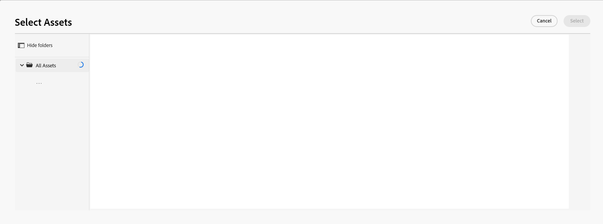

<!--when you make this live, update the metadata above to this: 
---
title: Connect records and objects
description: In addition to connecting Maestro records to one another, you can also connect Maestro records to objects from other applications.  
topic: Architecture
role: User
hidefromtoc: yes
hide: yes
---
-->
<!--udpate the metadata with real information when making this available in TOC and in the left nav-->

<!--if you change steps here, also update steps in the "Connect records" article-->

# Connexion d’enregistrements

>[!IMPORTANT]
>
>Les informations de cet article se rapportent à Adobe Maestro, une nouvelle offre d’Adobe Workfront.
>
>Actuellement, Adobe Maestro fait partie d’un programme bêta ouvert à un nombre limité de clients. Vous devez être un client Workfront pour utiliser les fonctionnalités de Maestro.
>
>Pour plus d’informations sur l’inscription au programme bêta de Maestro, contactez le représentant de votre compte.
>
>Pour plus d’informations, voir [Présentation d’Adobe Maestro](../maestro-overview.md).

Vous pouvez connecter des enregistrements Adobe Maestro les uns aux autres ou aux objets d’autres applications.

Vous devez d’abord associer deux types d’enregistrement ou un type d’enregistrement à un type d’objet à partir d’une autre application, puis vous pouvez utiliser la vue Tableau du type d’enregistrement pour connecter des enregistrements les uns aux autres ou des enregistrements à d’autres objets.

Pour plus d’informations sur la connexion des types d’enregistrement les uns aux autres ou sur les types d’objets d’autres applications, voir [Connexion des types d’enregistrement](../architecture/connect-record-types.md).

Pour un exemple de connexion des types d’enregistrement, voir [Exemple de connexion de types d&#39;enregistrements et d&#39;enregistrements](../architecture/example-connect-record-types-and-records.md).

Vous pouvez connecter les éléments suivants :

* Enregistrements opérationnels du maître
* Enregistrements opérationnels Maestro et enregistrements de taxonomie
* Enregistrements opérationnels Maestro et objets provenant d&#39;autres applications.

  Vous pouvez connecter des enregistrements Maestro à des objets des types répertoriés ci-dessous à partir des applications suivantes :

   * Adobe Workfront

      * Projets
      * Portefeuilles
      * Programmes
      * Entreprise
      * Groupe

   * Adobe Experience Manager Assets

      * Fichiers image
      * Dossiers

  <!--when you add more objects, fix the Access Requirements below which right now refer only to projects-->

## Exigences d’accès

Vous devez disposer des accès suivants pour effectuer les étapes de cet article :

<table style="table-layout:auto">
 <col>
<tbody>
<td>
   
 Adobe de produit
 
   </td>
   <td>
   
 Adobe Workfront
 
Pour connecter les enregistrements Maestro à Experience Manager Assets, vous devez disposer d’une licence Adobe Experience Manager Assets et l’instance de Workfront de votre entreprise doit être intégrée à Adobe Business Platform ou à Adobe Admin Console.
</td>
  </tr>  
 <td role="rowheader">
Accord Adobe Workfront
</td>
   <td>

Votre entreprise doit être inscrite au programme bêta fermé Adobe Maestro. Contactez le représentant de votre compte pour en savoir plus sur cette nouvelle offre. 

   </td>
  </tr>
  <tr>
   <td role="rowheader">
Formule Adobe Workfront
</td>
   <td>

Quelconque

   </td>
  </tr>
  <tr>
   <td role="rowheader">
Licence Adobe Workfront
</td>
   <td>
Tout, pour créer des enregistrements Maestro
 

Utilisation ou version ultérieure pour afficher les projets dans Workfront

  
Pour plus d’informations, voir <a href="../../administration-and-setup/add-users/access-levels-and-object-permissions/wf-licenses.md">Présentation des licences Adobe Workfront</a>.
 
  </td>
  </tr>
  <tr>
   <td role="rowheader">Niveau d’accès</td>
   <td> 
Tout, pour créer des enregistrements Maestro

Affichage ou accès supérieur à Projets, Portfolios, programmes
 

Accès supplémentaire aux groupes et aux entreprises, lorsque vous affichez des groupes ou des entreprises, les utilisateurs n’appartenant pas à
   
</td>
  </tr>
<tr>
   <td role="rowheader">
Autorisations d’objet
</td>
   <td> 
Affichage ou autorisations supérieures des objets que vous souhaitez lier aux enregistrements Maestro  
</td>
  </tr>
<tr>
   <td role="rowheader">
Modèle de mise en page
</td>
   <td> 
L’administrateur système doit ajouter la zone Maestro à votre modèle de mise en page. Pour plus d’informations, voir <a href="../access/access-overview.md">Présentation de l’accès</a>. 
</td>
  </tr>
 </tbody>
</table>

<!--
After permssions - replace the table with: 

<table style="table-layout:auto">
 <col>
 </col>
 <col>
 </col>
 <tbody>
    <tr>
<tr>
<td>
   
 Adobe product
 </td>
   <td>
   
 Adobe Workfront
 </td>
  </tr>  
 <td role="rowheader">
Adobe Workfront agreement
</td>
   <td>

Your organization must be enrolled in the Adobe Maestro closed beta program. Contact your account representative to inquire about this new offering. 

   </td>
  </tr>
  <tr>
   <td role="rowheader">
Adobe Workfront plan
</td>
   <td>

Any

   </td>
  </tr>
  <tr>
   <td role="rowheader">
Adobe Workfront license
</td>
   <td>
   
Any
 
  </td>
  </tr>
  
  <tr>
   <td role="rowheader">
Access level
</td>
   <td> 
Any
  
</td>
  </tr>
<tr>
   <td role="rowheader">
Layout template
</td>
   <td> 
Your Workfront or group administrator must add the Maestro area in your layout template. For information, see <a href="../access/access-overview.md">Access overview</a>. 
  
</td>
  </tr>
<tr>
   <td role="rowheader">
Permissions
</td>
   <td> 
Manage permissions to a workspace</a> 
  
   
System Administrators have permissions to all workspaces, including the ones they did not create

</td>
  </tr>
 </tbody>
</table>

-->

<!--Maybe enable this at GA - but Maestro is not supposed to have Access controls in the Workfront Access Level: 
>[!NOTE]
>
>If you don't have access, ask your Workfront administrator if they set additional restrictions in your access level. For information on how a Workfront administrator can change your access level, see [Create or modify custom access levels](../administration-and-setup/add-users/configure-and-grant-access/create-modify-access-levels.md). -->

<!-- Notes to add for the table: for the "Workfront plans" row: the above is only for closed beta; when going to GA - activate the following plans:    

Current plan: Prime and Ultimate

Legacy plan: Enterprise
-->

<!-- Notes for the table: for the "Workfront access" row: 
For more information, see <a href="../../administration-and-setup/add-users/access-levels-and-object-permissions/wf-licenses.md" class="MCXref xref">Adobe Workfront licenses overview</a>.
-->

## Connexion d’enregistrements

### Considérations relatives à la connexion des enregistrements

* Une fois que vous avez connecté les types d’enregistrement, les types d’enregistrement connectés s’affichent sous forme de champs d’enregistrement liés dans la table des types d’enregistrement à partir desquels ils sont liés.
* Vous pouvez parcourir et ajouter des enregistrements et des objets de l’enregistrement et des types d’objets liés à partir des champs d’enregistrement liés.
* Vous pouvez ajouter des champs provenant des types d’enregistrement liés à la table du type d’enregistrement à partir duquel vous liez.
* Vous ne pouvez pas mettre à jour manuellement les valeurs des champs liés sur les enregistrements à partir desquels vous effectuez la liaison.

  Les valeurs des champs liés des enregistrements liés renseignent l’enregistrement Maestro à partir duquel vous créez une liaison automatique à partir de l’espace de travail Maestro que vous configurez ou à partir de l’application tierce.

* Toute personne ayant accès à Maestro peut voir les connexions que vous faites entre les enregistrements Maestro ou entre les enregistrements Maestro et les objets d’autres applications. Ils peuvent afficher les enregistrements et les objets connectés, quelles que soient leurs autorisations sur les applications tierces auxquelles vous vous connectez.
* Vous pouvez afficher et modifier les connexions de tous les autres utilisateurs. <!--add that this is based on your permissions in both Maestro and Workfront (or, later, any other application)-->
* Vous pouvez connecter un enregistrement Maestro à un ou plusieurs objets d’une autre application.
* Pour lier des enregistrements Maestro à d’autres enregistrements ou objets, vous devez disposer des éléments suivants :

   * Au moins un espace de travail Maestro, un type d’enregistrement et un enregistrement.

     Pour plus d’informations, voir les articles suivants :

      * [Créer des espaces de travail](../architecture/create-workspaces.md)
      * [Création de types d’enregistrement](../architecture/create-record-types.md)
      * [Créer des enregistrements](../records/create-records.md)

   * Connexions entre types d’enregistrement ou entre types d’enregistrement et objets d’autres applications. Pour plus d’informations, voir [Connexion des types d’enregistrement](../architecture/connect-record-types.md)

### Connexion des enregistrements Maestro

{{step1-to-maestro}}

L’espace de travail du dernier accès doit s’ouvrir par défaut.

1. (Facultatif) Développez la flèche pointant vers le bas située à droite du nom d’un espace de travail existant, puis sélectionnez l’espace de travail à partir duquel vous souhaitez connecter des enregistrements.
1. Cliquez sur la carte d’un type d’enregistrement pour ouvrir la page de type d’enregistrement.
1. Sélectionnez une **Tableau** de la vue **Affichage** menu déroulant dans le coin supérieur droit de la page de type enregistrement.
1. (Facultatif) Ajoutez des enregistrements au type d’enregistrement que vous avez sélectionné en ajoutant une nouvelle ligne au tableau. Pour plus d’informations, voir [Créer des enregistrements](../../maestro/records/create-records.md).
1. Depuis un enregistrement répertorié dans la vue de tableau, accédez à la colonne d’enregistrement lié et survolez la cellule correspondant à l’enregistrement que vous souhaitez lier à d’autres enregistrements, puis cliquez sur le bouton **+** Icône

   La variable **Connexion d’objets** s’affiche.

   

1. Commencez à saisir le nom d’un enregistrement dans la zone de recherche, puis sélectionnez-le à son affichage dans la liste.

   Ou

   Sélectionnez le nom d’un ou de plusieurs enregistrements dans la zone, puis cliquez sur **Connexion d’objets** dans le coin supérieur droit de la zone Connexion aux objets .

   Les éléments suivants sont ajoutés :

   * Les enregistrements liés s&#39;affichent dans le champ enregistrement lié de l&#39;enregistrement que vous avez sélectionné à l&#39;étape 5. <!--accurate?--> La mise à jour des enregistrements liés met automatiquement à jour les champs liés pour les enregistrements à partir desquels vous effectuez la liaison. Vous ne pouvez pas modifier manuellement les champs liés.

     >[!TIP]
     >
     >* Nous utilisons de manière interchangeable les &quot;champs liés&quot; et &quot;champs de recherche&quot;.
     >
     >* Si vous avez activé la variable **Autoriser plusieurs enregistrements** lorsque vous connectez les types d&#39;enregistrements, les valeurs des champs des multiples objets sélectionnés sont affichées séparées par des virgules ou sont agrégées selon l&#39;agrégateur que vous avez choisi.

1. (Facultatif) Fermez la page de type Enregistrement Maestro et accédez à l’espace de travail que vous avez sélectionné.
1. Cliquez sur la carte correspondant au type d’enregistrement auquel vous avez lié.

   Par exemple, si vous avez connecté la variable **Campagne** Enregistrez avec l’enregistrement de produit, cliquez sur le bouton **Produit** carte.

   La carte de type d’enregistrement doit s’ouvrir dans la vue Tableau. Dans le cas contraire, sélectionnez une vue de tableau.

   Notez que la variable **Campagne** le champ enregistrement lié affiche les noms des campagnes auxquelles vous avez lié des produits dans la page Type d’enregistrement de produit . La mise à jour des informations de Campaign met automatiquement à jour le champ d’enregistrement lié à Campaign pour le type d’enregistrement Produit .

### Connexion des enregistrements Maestro aux objets Workfront

<!--when we will have more applications to link to from Maestro, change the title to soemthing like: Connect Maestro records to objects from other applications-->

Après avoir créé une connexion entre un type d’enregistrement Maestro et un type d’objet Workfront, vous pouvez connecter des enregistrements Maestro individuels à des objets dans Workfront. Les champs Workfront que vous avez connectés sont automatiquement renseignés sur les enregistrements Maestro à partir desquels vous liez les objets.

{{step1-to-maestro}}

L’espace de travail du dernier accès doit s’ouvrir par défaut.

1. (Facultatif) Développez la flèche pointant vers le bas située à droite du nom d’un espace de travail existant, puis sélectionnez l’espace de travail à partir duquel vous souhaitez connecter des enregistrements.
1. Cliquez sur la carte d’un type d’enregistrement pour ouvrir la page de type d’enregistrement.
1. Sélectionnez une **Tableau** de la vue **Affichage** menu déroulant dans le coin supérieur droit de la page de type enregistrement.

1. (Facultatif) Ajoutez des enregistrements individuels au type d’enregistrement que vous avez sélectionné en ajoutant une nouvelle ligne au tableau. Pour plus d’informations, voir [Créer des enregistrements](../../maestro/records/create-records.md).
1. (Conditionnel) Si vous avez connecté le type d’enregistrement sélectionné à un objet Workfront, passez dans la colonne d’objet lié et survolez la cellule correspondant à l’enregistrement à lier aux objets de Workfront, puis cliquez sur le bouton **+** Icône

   La variable **Connexion d’objets** s’affiche.

   

   Pour plus d’informations sur la connexion des types d’enregistrement aux objets d’une application tierce, voir [Connexion des types d’enregistrement](../architecture/connect-record-types.md).

1. Commencez à saisir le nom d’un objet Workfront dans la zone de recherche, puis sélectionnez-le lorsqu’il s’affiche dans la liste.

   Ou

   Sélectionnez le nom d’un ou de plusieurs objets dans la zone, puis cliquez sur **Connexion d’objets** dans le coin supérieur droit de la zone Connexion aux objets .

   Les éléments suivants sont ajoutés :

   * Les objets Workfront sélectionnés sont ajoutés au champ d’enregistrement associé.
   * Si vous les avez ajoutés lorsque vous avez connecté le type d’enregistrement à Workfront, les champs liés (ou les champs de recherche) sont automatiquement renseignés avec les informations de Workfront.
   * Un nouveau type d’enregistrement appelé &quot;&lt; Nom du type d’objet Workfront >&quot; est créé dans le même espace de travail que l’enregistrement Maestro à partir duquel vous liez. Le nom de l’objet fait partie du nom de ce type d’enregistrement. Par exemple, la liaison à des projets Workfront crée la variable **Projet** type d’enregistrement dans Maestro.

     Il s’agit d’un type d’enregistrement en lecture seule qui affiche les objets Workfront sélectionnés dans le nouveau champ d’objet lié que vous avez créé à partir de l’enregistrement Maestro. Les champs liés de l&#39;objet lié s&#39;affichent également sur les enregistrements Workfront liés en lecture seule.

     >[!IMPORTANT]
     >
     > Le type d’enregistrement d’objet Workfront en lecture seule est créé uniquement lorsque des projets individuels sont ajoutés aux enregistrements Maestro. La simple création d’une connexion entre un type d’enregistrement Maestro et un type d’objet Workfront ne crée pas le type d’enregistrement Workfront.

     Toutes les informations existantes des champs des objets Workfront s’affichent dans les champs liés ou de recherche.

     >[!TIP]
     >
     >
     >* Si vous avez activé le paramètre Autoriser plusieurs enregistrements , les valeurs de plusieurs objets sont affichées séparées par des virgules ou sont agrégées selon l’agrégateur que vous avez choisi.
     >
     >* Un champ d’enregistrement lié aux enregistrements liés à Maestro n’est pas créé pour les objets Workfront liés dans Workfront.

1. (Facultatif) Fermez la page de type Enregistrement Maestro et accédez à l’espace de travail que vous avez sélectionné.
1. (Facultatif) Cliquez sur la carte correspondant au type d’enregistrement de l’objet Workfront. Par exemple, cliquez sur le bouton **Projet** si vous avez lié à des projets Workfront. La carte de type d’enregistrement Workfront en lecture seule doit s’ouvrir dans la vue de tableau.

   Les enregistrements répertoriés dans la page de type Enregistrement Workfront sont des objets Workfront en lecture seule qui ont été liés à partir d’enregistrements Maestro. Les champs liés à partir du type d’enregistrement Workfront s’affichent également sous forme de colonnes en lecture seule et sont renseignés automatiquement lorsqu’ils sont renseignés dans Workfront.

1. (Facultatif) Pour ouvrir la page Détails de l’enregistrement d’objet Workfront dans Maestro, effectuez l’une des opérations suivantes :

   * Depuis le type d’enregistrement à partir duquel vous avez lié, accédez au champ d’enregistrement lié à l’objet Workfront et cliquez sur le nom de l’objet Workfront.
   * Dans la **Tableau** vue de la page de type enregistrement Workfront, cliquez sur le nom de l’objet Workfront

     Ou

     Cliquez sur le bouton **Plus** à droite du nom de l’objet Workfront, puis cliquez sur **Affichage**.

     

   Cette opération ouvre la page Détails du maître de l’objet Workfront lié. Il s’agit d’une page en lecture seule.

1. (Facultatif) Pour ouvrir l’objet Workfront lié dans Workfront, effectuez l’une des opérations suivantes :

   * Dans la **Tableau** Dans la page de type d’enregistrement Workfront, cliquez sur le nom de l’objet Workfront pour ouvrir l’enregistrement Projet dans Maestro.

   Ou

   Cliquez sur le bouton **Plus** à droite du nom de l’objet Workfront, puis cliquez sur **Accéder à la source**.

   

   Cette opération ouvre la page d’objet Workfront. Si vous êtes autorisé à le faire, vous pouvez modifier les informations relatives à l’objet Workfront.

1. (Facultatif) Sur la page d’enregistrement d’objet Workfront en lecture seule dans Maestro, cliquez sur le bouton **Ajouter des champs** icon  dans le coin supérieur droit de la vue de tableau, pour ajouter ou supprimer des champs Workfront du type d’enregistrement Workfront.

   >[!NOTE]
   >
   >  Les champs que vous ajoutez ou supprimez dans la page Type d’enregistrement d’objet Workfront ne sont pas ajoutés ni supprimés du type d’enregistrement Maestro lié au type d’objet Workfront. Les champs ne sont visibles que sur la page de type d’enregistrement Workfront en lecture seule. Vous pouvez donc les consulter dans Maestro.

1. (Facultatif et conditionnel) Si vous avez ajouté au moins deux champs de date à l’objet Workfront, cliquez sur le bouton **Affichage** menu déroulant dans la page de type d’enregistrement d’objet Workfront et sélectionnez l’option **Chronologie** afficher ou **Créer une vue** pour créer une vue chronologique.  Pour plus d’informations, voir [Gestion du mode Chronologie](/help/quicksilver/maestro/views/manage-the-timeline-view.md).

   Les objets liés Workfront s’affichent dans la vue de chronologie.

### Connexion des enregistrements Maestro aux objets Adobe Experience Manager

<!--when we will have more applications to link to from Maestro, change the title to soemthing like: Connect Maestro records to objects from other applications-->

>[!IMPORTANT]
>
>Vous devez disposer d’une licence Adobe Experience Manager Assets et l’instance de Workfront de votre entreprise doit être intégrée à Adobe Business Platform ou à Adobe Admin Console pour pouvoir connecter les enregistrements Maestro à Adobe Experience Manager Assets.
>
>Si vous avez des questions sur l’intégration à Adobe Admin Console, reportez-vous à la section [FAQ sur l’expérience unifiée Adobe](/help/quicksilver/workfront-basics/navigate-workfront/workfront-navigation/unified-experience-faq.md).

Après avoir créé une connexion entre un type d’enregistrement Maestro et Adobe Experience Manager Assets, vous pouvez connecter des enregistrements Maestro individuels à des ressources Experience Manager. Les champs de ressource que vous avez connectés à partir de Experience Manager Assets lors de la création de la connexion sont automatiquement renseignés sur le type d’enregistrement Maestro à partir duquel vous avez créé un lien.

{{step1-to-maestro}}

L’espace de travail du dernier accès doit s’ouvrir par défaut.

1. (Facultatif) Développez la flèche pointant vers le bas située à droite du nom d’un espace de travail existant, puis sélectionnez l’espace de travail à partir duquel vous souhaitez connecter des enregistrements.
1. Cliquez sur la carte d’un type d’enregistrement pour ouvrir la page de type d’enregistrement.
1. Sélectionnez une **Tableau** de la vue **Affichage** menu déroulant dans le coin supérieur droit de la page de type enregistrement.

1. (Facultatif) Ajoutez des enregistrements individuels au type d’enregistrement que vous avez sélectionné en ajoutant une nouvelle ligne au tableau. Pour plus d’informations, voir [Créer des enregistrements](../../maestro/records/create-records.md).
1. (Conditionnel) Si vous avez connecté le type d’enregistrement sélectionné à Experience Manager Assets, passez dans la colonne d’objet lié et survolez la cellule correspondant à l’enregistrement à lier à d’autres objets de Experience Manager, puis cliquez sur le bouton **+** Icône

   La variable **Sélectionner les ressources** s’affiche. <!--update screen shot with actual assets-->

   

   Pour plus d’informations sur la connexion des types d’enregistrement aux objets d’une application tierce, voir [Connexion des types d’enregistrement](../architecture/connect-record-types.md).

1. Cliquez sur pour sélectionner certains des types de ressources suivants :

   * Images
   * Dossiers

   Vous pouvez sélectionner plusieurs ressources.

   >[!IMPORTANT]
   >
   > Vous pouvez connecter uniquement les ressources que vous avez accès à afficher dans Experience Manager. Une fois connecté, tous les utilisateurs de Maestro peuvent afficher les ressources dans Maestro, quel que soit leur accès dans Experience Manager Assets.

1. Cliquez sur **Sélectionner**.

   Les éléments suivants sont ajoutés :

   * Les ressources de Experience Manager sélectionnées sont ajoutées au champ d’enregistrement lié.
   * Les champs liés (ou champs de recherche) sont renseignés avec les informations des ressources connectées au Experience Manager.
   * Un nouveau type d’enregistrement appelé &quot;Experience Manager Assets&quot; est créé dans le même espace de travail que l’enregistrement Maestro à partir duquel vous liez. <!--is this still added?-->

     Il s’agit d’un type d’enregistrement en lecture seule qui affiche les ressources du Experience Manager sélectionnées dans le nouveau champ d’objet lié que vous avez créé à partir de l’enregistrement Maestro. Les champs liés de l&#39;objet lié s&#39;affichent également sur les enregistrements de Experience Manager liés en lecture seule.

     >[!IMPORTANT]
     >
     > Le type d’enregistrement Experience Manager Assets en lecture seule est créé uniquement lorsque des ressources individuelles sont ajoutées aux enregistrements Maestro. La simple création d’une connexion entre un type d’enregistrement Maestro et Experience Manager Assets ne crée pas le type d’enregistrement Experience Manager Assets.

     Toutes les informations existantes des champs des ressources du Experience Manager s’affichent dans les champs liés ou de recherche.

     >[!TIP]
     >
     >
     >* Si vous avez activé le paramètre Autoriser plusieurs enregistrements , les valeurs de plusieurs objets s’affichent séparées par des virgules.
     >
     >* Un champ d’enregistrement lié aux enregistrements liés à Maestro n’est pas créé pour les ressources de Experience Manager liées dans l’application Experience Manager Assets.

1. (Facultatif) Fermez la page de type Enregistrement Maestro et accédez à l’espace de travail que vous avez sélectionné.
1. Cliquez sur la carte correspondant au type d’enregistrement Experience Manager Assets. La carte de type d’enregistrement Experience Manager Assets en lecture seule doit s’ouvrir dans la vue Tableau.

   Les enregistrements répertoriés dans la page de type Enregistrement Experience Manager Assets sont des ressources en lecture seule. Les champs liés à partir du type d’enregistrement Experience Manager Assets s’affichent également sous forme de colonnes en lecture seule. Ils sont renseignés automatiquement lorsqu’ils sont renseignés dans Experience Manager.

1. (Facultatif) Accédez au type d’enregistrement à partir duquel vous avez lié Experience Manager Assets et cliquez sur le nom d’une ressource dans le champ d’enregistrement lié. Les détails du Experience Manager de la ressource s’affichent dans une fenêtre contextuelle. <!--update screen shot with hi-rez picture-->

   

   Les champs suivants s’affichent pour un fichier image :

   * Une miniature de l’image
   * Nom du fichier image
   * Dimensions
   * Taille
   * Description
   * Chemin d’accès au fichier en Experience Manager
   * Type de ressource
   * Date de création
   * Date de modification

1. (Facultatif) Pour ouvrir la page Détails de l’enregistrement Experience Manager Assets dans Maestro, procédez comme suit :

   1. Accédez au **Experience Manager Assets** Carte de type d’enregistrement Maestro dans l’espace de travail que vous avez initialement sélectionné, puis cliquez pour ouvrir la page de type d’enregistrement.
La page de type Enregistrement Experience Manager Assets Maestro est en lecture seule.
   1. Dans la vue Tableau, cliquez sur le nom d’une ressource.

      Ou

      Passez la souris sur le nom d’une ressource, puis cliquez sur l’icône **Plus** menu  à droite du nom de la ressource, puis cliquez sur **Affichage**.\
      Cela ouvre le Maestro de la ressource. **Détails** page. Il s’agit d’une page en lecture seule.
1. (Facultatif) Pour ouvrir la page Détails de l’enregistrement des ressources du Experience Manager dans Experience Manager, effectuez l’une des opérations suivantes :

   * Accédez à la page de type Enregistrement Maestro de l’enregistrement à partir duquel vous liez, cliquez sur le nom d’une ressource dans le champ d’enregistrement lié pour ouvrir la fenêtre contextuelle, puis cliquez sur le bouton **Ouvrir** icon  pour ouvrir la ressource.
   * Accédez au **Experience Manager Assets** Carte de type d’enregistrement Maestro dans l’espace de travail que vous avez initialement sélectionné, puis cliquez pour ouvrir la page de type d’enregistrement, cliquez sur le nom d’une ressource pour ouvrir le Maestro **Détails** page, puis cliquez sur **Accéder à la source** dans le coin supérieur droit de l’écran.

     
   * Accédez au **Experience Manager Assets** Carte de type d’enregistrement Maestro dans l’espace de travail que vous avez initialement sélectionné, puis cliquez sur la carte pour ouvrir la page de type d’enregistrement Experience Manager Assets, survolez le nom d’une ressource avec la souris et cliquez sur le bouton **Plus** , puis cliquez sur **Accéder à la source**.

     

   La ressource s’ouvre dans Experience Manager Assets.

1. (Facultatif) Cliquez sur le **Ajouter des champs** icon  dans le coin supérieur droit de la vue de tableau de la page de type d’enregistrement Experience Manager Assets, pour ajouter ou supprimer des champs de Experience Manager.

   >[!NOTE]
   >
   >  Les champs que vous ajoutez ou supprimez dans la page Type d’enregistrement Experience Manager Assets ne sont pas ajoutés ni supprimés du type d’enregistrement Maestro lié à la ressource Experience Manager. Les champs ne sont visibles que sur la page de type d’enregistrement Experience Manager Assets en lecture seule. Vous pouvez donc les consulter dans Maestro.

1. (Facultatif et conditionnel) Si vous avez ajouté au moins deux champs de date à la ressource liée au Experience Manager, cliquez sur le bouton **Affichage** menu déroulant dans la page de type enregistrement Experience Manager Assets et sélectionnez l’option **Chronologie** afficher ou **Créer une vue** pour créer une vue chronologique.  Pour plus d’informations, voir [Gestion du mode Chronologie](/help/quicksilver/maestro/views/manage-the-timeline-view.md).
Les ressources liées à Experience Manager Assets s’affichent dans la vue de chronologie.