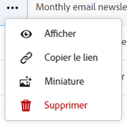
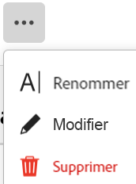

<!--udpate the metadata with real information when making this available in TOC and in the left nav-->

# Suppression d’enregistrements

>[!IMPORTANT]
>
>Les informations de cet article se rapportent à Adobe Maestro, une nouvelle offre d’Adobe Workfront.
>
>Actuellement, Adobe Maestro fait partie d’un programme bêta ouvert à un nombre limité de clients. Vous devez être un client Workfront pour utiliser les fonctionnalités de Maestro.
>
>Pour plus d’informations sur l’inscription au programme bêta de Maestro, contactez le représentant de votre compte.
>
>Pour plus d’informations, voir [Présentation d’Adobe Maestro](../maestro-overview.md).

Vous pouvez supprimer les enregistrements qui ne sont plus pertinents dans Adobe Manager.

## Exigences d’accès

Vous devez disposer des accès suivants pour effectuer les étapes de cet article :

<table style="table-layout:auto">
 <col>
 <tbody>
<td>
   
 Adobe de produit
 </td>
   <td>
   
 Adobe Workfront
 </td>
  </tr>  
 <td role="rowheader">
Accord Adobe Workfront
</td>
   <td>

Votre entreprise doit être inscrite au programme bêta fermé Adobe Maestro. Contactez le représentant de votre compte pour en savoir plus sur cette nouvelle offre. 

   </td>
  </tr>
  <tr>
   <td role="rowheader">
Formule Adobe Workfront
</td>
   <td>

Quelconque

   </td>
  </tr>
  <tr>
   <td role="rowheader">
Licence Adobe Workfront
</td>
   <td>
   
Quelconque
 
  </td>
  </tr>

<tr>
   <td role="rowheader">Niveau d’accès</td>
   <td> 
Quelconque
  
</td>
  </tr>
<tr>
   <td role="rowheader">Modèle de mise en page</td>
   <td> 
L’administrateur système doit ajouter la zone Maestro à votre modèle de mise en page. Pour plus d’informations, voir <a href="../access/access-overview.md">Présentation de l’accès</a>. 
  
</td>
  </tr>
 </tbody>
</table>

<!--
After permssions - replace the table with: 

<table style="table-layout:auto">
 <col>
 </col>
 <col>
 </col>
 <tbody>
    <tr>
<tr>
<td>
   
 Adobe product
 </td>
   <td>
   
 Adobe Workfront
 </td>
  </tr>  
 <td role="rowheader">
Adobe Workfront agreement
</td>
   <td>

Your organization must be enrolled in the Adobe Maestro closed beta program. Contact your account representative to inquire about this new offering. 

   </td>
  </tr>
  <tr>
   <td role="rowheader">
Adobe Workfront plan
</td>
   <td>

Any

   </td>
  </tr>
  <tr>
   <td role="rowheader">
Adobe Workfront license
</td>
   <td>
   
Any
 
  </td>
  </tr>
  
  <tr>
   <td role="rowheader">
Access level
</td>
   <td> 
Any
  
</td>
  </tr>
<tr>
   <td role="rowheader">
Layout template
</td>
   <td> 
Your Workfront or group administrator must add the Maestro area in your layout template. For information, see <a href="../access/access-overview.md">Access overview</a>. 
  
</td>
  </tr>
<tr>
   <td role="rowheader">
Permissions
</td>
   <td> 
Contribute or higher permissions to a workspace</a> 
  
   
System Administrators have permissions to all workspaces, including the ones they did not create

</td>
  </tr>
 </tbody>
</table>

-->

<!--Maybe enable this at GA - but Maestro is not supposed to have Access controls in the Workfront Access Level: 
>[!NOTE]
>
>If you don't have access, ask your Workfront administrator if they set additional restrictions in your access level. For information on how a Workfront administrator can change your access level, see [Create or modify custom access levels](../administration-and-setup/add-users/configure-and-grant-access/create-modify-access-levels.md). -->

<!-- Notes to add for the table: for the "Workfront plans" row: the above is only for closed beta; when going to GA - activate the following plans:    

Current plan: Prime and Ultimate

Legacy plan: Enterprise
-->

<!-- Notes for the table: for the "Workfront access" row: 
For more information, see <a href="../../administration-and-setup/add-users/access-levels-and-object-permissions/wf-licenses.md" class="MCXref xref">Adobe Workfront licenses overview</a>.
-->

## Considérations relatives à la suppression d’enregistrements

* Vous pouvez supprimer les enregistrements que vous ou un autre utilisateur avez créés.
* Vous ne pouvez pas récupérer les enregistrements supprimés. <!--the above statements (and in the metadata description) will change with access levels and recycle bin??-->
* Si les enregistrements supprimés sont liés à d&#39;autres enregistrements, les enregistrements liés ne sont pas supprimés, mais les informations de l&#39;enregistrement supprimé sont également supprimées.
* Vous ne pouvez pas supprimer des enregistrements en bloc. <!--this will probably change-->
* Vous ne pouvez pas supprimer d’enregistrements de la vue de chronologie.
* Vous ne pouvez pas supprimer un type d’enregistrement lié à une autre application. Par exemple, si vous liez un enregistrement Maestro à un objet Workfront, vous ne pouvez pas supprimer l’objet Workfront de la page d’enregistrement de l’objet Workfront.

## Suppression d’enregistrements

Vous pouvez supprimer un enregistrement des zones suivantes :

* [Sur la page Détails d’un enregistrement](#delete-a-record-from-the-records-details-page)
* [En mode Tableau d’un type d’enregistrement](#delete-a-record-from-the-record-type-table-view)

### Supprimer un enregistrement de la page Détails de l’enregistrement

1. Cliquez sur le bouton **Menu Principal**  dans le coin supérieur droit, ou le **Menu Principal**  dans le coin supérieur gauche, s’il est disponible, cliquez sur Maestro.

   L’espace de travail auquel vous accédez en dernier s’ouvre.
1. Cliquez sur un type d’enregistrement.

   La page de type enregistrement s’ouvre.
1. Utilisez l’une des méthodes suivantes :

   * Dans une vue Tableau, cliquez sur le nom d’un enregistrement.
   * Dans la vue Tableau, passez la souris sur le nom d’un enregistrement, puis cliquez sur le bouton **Plus** menu , puis cliquez sur **Affichage**

     
   * Dans la vue Chronologie, cliquez sur une barre d’enregistrement.

   L&#39;enregistrement **Détails** s’ouvre.

1. Cliquez sur le bouton **Plus** menu  à droite du nom de l’enregistrement, puis cliquez sur **Supprimer**, puis **Supprimer** pour confirmer.

    <!--ensure the options have not changed or been renamed-->
L’enregistrement est supprimé et ne peut pas être récupéré.

### Supprimer un enregistrement de la vue de table de type enregistrement

1. Cliquez sur le bouton **Menu Principal**  dans le coin supérieur droit, ou le **Menu Principal**  dans le coin supérieur gauche, le cas échéant, cliquez sur **Maestro**.

   L’espace de travail auquel vous avez accédé la dernière fois s’ouvre.
1. Cliquez sur un type d’enregistrement.

   La page de type enregistrement s’ouvre.
1. (Conditionnel) Dans la variable **Affichage** Sélectionnez une vue Tableau dans le menu déroulant situé dans le coin supérieur droit du tableau. Il doit s’agir de la vue par défaut, sauf si vous avez visualisé le type d’enregistrement dans la vue chronologique lors de votre dernier accès.

   Les enregistrements associés au type d&#39;enregistrement sélectionné s&#39;affichent dans la vue Tableau.
1. Cliquez avec le bouton droit de la souris sur une ligne d’enregistrement, puis cliquez sur **Supprimer**.

   

   L’enregistrement est supprimé et ne peut pas être récupéré.
