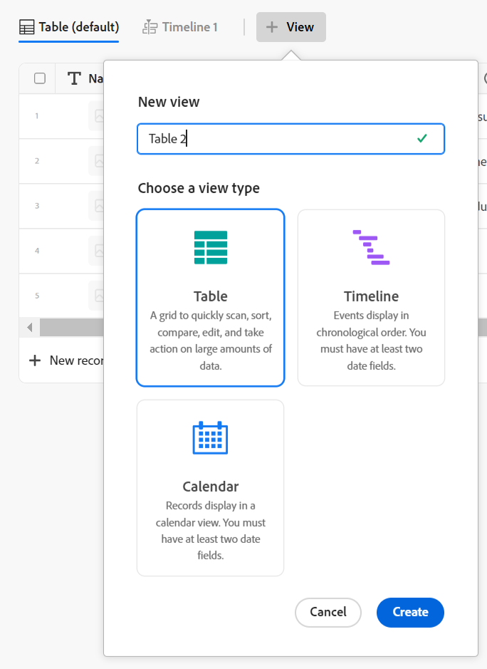

# Gestion des vues d’enregistrement

<!--update the metadata with real information when making this available in TOC and in the left nav-->

{{maestro-important-intro}}

Après avoir sélectionné un type d’enregistrement dans Adobe Manager, vous pouvez afficher tous les enregistrements de ce type dans les vues suivantes :

* Tableau

  Pour plus d’informations, voir [Gestion de la vue de tableau](../views/manage-the-table-view.md).
* Journal

  Pour plus d’informations, voir [Gestion du mode Chronologie](../views/manage-the-timeline-view.md).

## Exigences d’accès

Vous devez disposer des accès suivants pour effectuer les étapes de cet article :

<table style="table-layout:auto">
 <col>
 </col>
 <col>
 </col>
 <tbody>
    <tr>
<tr>
<td>
   
 Produit
 </td>
   <td>
   
 Adobe Workfront
 </td>
  </tr>  
 <td role="rowheader">
Accord Adobe Workfront
</td>
   <td>

Votre entreprise doit être inscrite au programme bêta fermé Adobe Maestro. Contactez le représentant de votre compte pour en savoir plus sur cette nouvelle offre. 

   </td>
  </tr>
  <tr>
   <td role="rowheader">
Formule Adobe Workfront
</td>
   <td>

Quelconque

   </td>
  </tr>
  <tr>
   <td role="rowheader">
Licence Adobe Workfront
</td>
   <td>
   
Quelconque
 
  </td>
  </tr>

<tr>
   <td role="rowheader">Configuration du niveau d’accès</td>
   <td> 
Il n’existe pas de contrôle de niveau d’accès pour Maestro
  
</td>
  </tr>

<tr>
   <td role="rowheader">
Autorisations
</td>
   <td> 
Gestion des autorisations pour l’affichage
  
</td>
  </tr>

<tr>
   <td role="rowheader">Modèle de mise en page</td>
   <td> 
L’administrateur système doit ajouter la zone Maestro à votre modèle de mise en page. Pour plus d’informations, voir <a href="../access/access-overview.md">Présentation de l’accès</a>. 
  
</td>
  </tr>
 </tbody>
</table>

## Remarques concernant l’utilisation des vues Maestro

* Les vues dans Maestro sont spécifiques au type d’enregistrement. Vous ne pouvez pas appliquer la même vue à deux types d’enregistrements différents.
* Les vues que vous créez sont visibles uniquement pour vous et les utilisateurs avec lesquels vous partagez les vues.
* La création de vues pour les types d’enregistrements opérationnels est identique à la création de vues pour les types d’enregistrements de taxonomie.
* Lorsque vous modifiez ou supprimez une vue, elle est modifiée et supprimée pour tous les utilisateurs disposant d’autorisations sur la vue.
* Les éléments suivants sont propres à chaque vue dans Maestro :

   * Filtre
   * Regroupement 
   * Trier

  <!-- some of these are not available in all of the views - edit above-->

  Par exemple, lors de la création d’un filtre dans une vue de tableau, les résultats du filtre ne sont visibles que dans la vue sélectionnée et non dans toutes les vues répertoriées dans le menu déroulant Affichage .

  >[!NOTE]
  >
  > Comme Maestro est actuellement en version bêta, certains éléments de vue peuvent ne pas être disponibles pour les deux vues.

Cet article décrit les informations suivantes sur les vues Maestro :

* [Création et modification d’une vue](#create-or-edit-record-views)
* [Suppression d’une vue](#delete-views)
  <!--* [Duplicate a view](#duplicate-views)-->
  <!--* [Add a view as a favorite](#add-a-view-as-a-favorite) - not possible yet-->
* [Partage d’une vue](#share-a-view)

## Similarités et différences entre les vues de tableau et de chronologie

Le tableau suivant montre les similitudes et les différences entre les vues du tableau et de la chronologie dans Maestro :

<!--some of these are NOT available right now; if you make this public, comment out the ones not there-->

| Fonctionnalité | Vue Tableau | Mode Chronologie |
|-----------------------------------------------------------------------|------------|---------------|
| Afficher des enregistrements dans une liste ou une table | ✓ |              |
| Afficher tous les champs sous forme de colonnes dans le tableau, par défaut | ✓ |              |
| Masquer ou afficher des champs (ou des colonnes) | ✓ |               |
| Modifier les valeurs de champ de chaque enregistrement | ✓ |               |
| Ajouter des enregistrements en tant que nouvelles lignes dans la vue | ✓ |               |
| Ajouter des champs en tant que nouvelles colonnes dans la vue | ✓ |               |
| Copier des lignes d’une liste externe et les coller dans un tableau | ✓ |               |
| Afficher des enregistrements dans une chronologie |            | ✓ |
| Filtrage des enregistrements | ✓ | ✓ |
| Enregistrements de groupe | ✓ | ✓ |
| Tri des enregistrements | ✓ |              |
| Enregistrements de code couleur |           | ✓ |
| Regroupements de codes couleur |           | ✓ |
| Recherche d’enregistrements spécifiques | ✓ | ✓ |
| Partager la vue | ✓ | ✓ |
| Ouvrez la page Détails de l’enregistrement à partir de la vue . | ✓ | ✓ |

## Créer ou modifier des vues {#create-or-edit-views}

{{step1-to-maestro}}

L’espace de travail que vous avez consulté pour la dernière fois s’ouvre par défaut. Pour plus d’informations sur la création d’espaces de travail, voir [Créer des espaces de travail](../architecture/create-workspaces.md).

1. Cliquez sur une carte de type enregistrement. Pour plus d’informations sur la création d’un type d’enregistrement, voir [Création de types d’enregistrement](../architecture/create-record-types.md).

   Par défaut, tous les enregistrements du type sélectionné s&#39;affichent en mode Tableau.

<!--
    1. Click **+ View** to add a new view. 

    1. Select from the following types of views: 

        * Table
        * Timeline
        * Calendar

        >[!TIP]
        >
        >When you create a record type, the table view is also created by default. 
        >
        >To create a timeline or a calendar view, the record type you build the view for must have at least two date fields. Otherwise, the Timeline and the Calendar options are dimmed.
        >
        >(*********remove all of the below steps and replace the screen shot when calendar view releases*********)
    -->

1. Cliquez sur le bouton **Affichage** , puis sélectionnez une **Vue Tableau**  ou cliquez sur **Créer une vue > Tableau** pour créer un tableau

   Ou

   Sélectionner un **Mode Chronologie**  afficher ou cliquer sur **Créer une vue > Chronologie** pour créer une vue chronologique.

   

   >[!NOTE]
   >
   >    Pour créer une vue de chronologie, le type d’enregistrement pour lequel vous créez la vue doit comporter au moins deux champs de date. Dans le cas contraire, l’option Chronologie est grisée.

1. (Facultatif) Mettez à jour le nom de la vue, puis cliquez sur **Créer** pour enregistrer une vue de tableau

   Ou cliquez sur **Suivant**, lors de la création d’une chronologie <!--or calendar--> vue.

   Par défaut, Maestro nomme la vue &quot;Tableau &lt; nombre >&quot; ou &quot;Chronologie &lt; nombre >&quot;. Le nombre est un incrément généré automatiquement.

1. (Conditionnel) Sélectionnez les dates de début et de fin pour les enregistrements qui s’afficheront dans la chronologie. <!--or calendar--> afficher, puis cliquez sur **Créer**.
1. (Facultatif) Pour renommer une vue après sa création, cliquez sur le menu déroulant Affichage , puis sur la variable **Plus** menu  > **Renommer** pour mettre à jour le nom de la vue. <!--ensure there is not another saving step here?!-->
   <!--1. (Optional) To rename a view after it is created, double-click the view name and start typing the new name, or click the **More** menu  to the right of the view name, then click **Rename**.-->
1. (Facultatif) Pour gérer un type de vue spécifique, consultez les articles suivants :

   * [Gestion de la vue de tableau](../views/manage-the-table-view.md)
   * [Gestion du mode Chronologie](../views/manage-the-timeline-view.md)
     <!--* [Manage the calendar view](/help/quicksilver/maestro/views/manage-the-calendar-view.md)-->

## Suppression de vues

{{step1-to-maestro}}

L’espace de travail que vous avez consulté pour la dernière fois s’ouvre par défaut. Pour plus d’informations sur la création d’espaces de travail, voir [Créer des espaces de travail](../architecture/create-workspaces.md).

1. Cliquez sur une carte de type enregistrement.

   Pour plus d’informations sur la création d’un type d’enregistrement, voir [Création de types d’enregistrement](../architecture/create-record-types.md).

   Par défaut, tous les enregistrements du type sélectionné s&#39;affichent en mode Tableau.

<!--1. Hover over on the of the view's names in the view tab, then click **More**  > **Delete**. (********delete the instructions below but keep the last step***********)-->
1. Cliquez sur le menu déroulant d’affichage, survolez l’un des affichages de la liste avec la souris, puis cliquez sur l’icône **Plus** menu  > **Supprimer**.
1. Cliquez sur **Supprimer** pour confirmer. <!--ensure there is not another saving step here?!-->

   La vue est supprimée pour tous les utilisateurs qui peuvent accéder à la zone Maestro et elle ne peut pas être récupérée.

## Partage d’une vue

Pour plus d’informations sur le partage des vues, voir [Partage de vues](/help/quicksilver/maestro/access/share-views.md).

<!--## Add a view as a favorite - this is not possible yet-->

<!--not possible yet - August 30, 2023: 

## Duplicate views

If you want to keep multiple versions of a view and make slight changes between the version, you can duplicate a view. Duplicating a view creates identical copies of an existing view. 

1. From the **Main Menu**, click **Maestro**. 
    The workspace you last accessed opens by default. For information about creating workspaces, see [Create workspaces](../architecture/create-workspaces.md).
1. Click a record type. For information about creating a record type, see [Create record types](../architecture/create-record-types.md). 

    By default, all the records of the type selected display in the table view. 

1. Click the view drop-down menu, then click the **More** menu  to the right of the view name > **Duplicate**. (**********ensure there is not another saving step here?! also, add how this view is named; the button to duplicate was there but not the functionality yet************)
    
    The view is duplicated and visible to all users who can access the Maestro area. 

-->
