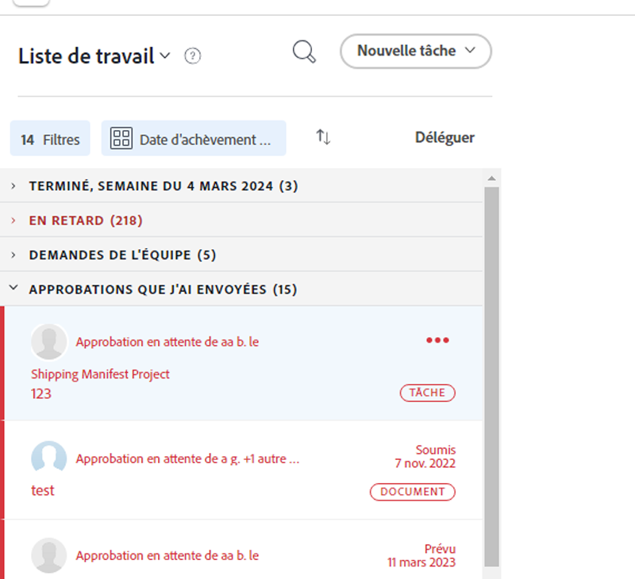

# Gérer la délégation des tâches et des problèmes

<!-- Audited: 1/2024 -->

<!--
<NOTE: 
<you might need to change the tile to Delegate PTI, etc, when that functionality is added. Named it this so it will not conflict with the TOC article for Delegate section which was also "Delegate work"
I wrote this as a "Manage..." article and I did not add three separate articles, to match what we have for delegating approval requests)
-->

Vous pouvez déléguer temporairement la tâche à laquelle vous êtes affecté lorsque vous êtes absent du bureau.

Vous pouvez déléguer des tâches et des affectations d’émission, ou déléguer des approbations. Cet article décrit comment déléguer des tâches et des affectations de problèmes.

Pour obtenir des informations générales sur la délégation de travail, consultez la [présentation de la délégation de travail](../../manage-work/delegate-work/delegate-work-overview.md).

## Conditions d’accès

+++ Développez pour afficher les exigences d’accès aux fonctionnalités de cet article.

>[!IMPORTANT]
>
>* Les utilisateurs que vous sélectionnez comme délégués reçoivent les mêmes autorisations que vos autorisations sur les tâches et problèmes que vous leur déléguez.
>* Les autorisations doivent fonctionner dans leurs niveaux d’accès, et leurs niveaux d’accès peuvent parfois être inférieurs aux vôtres.
>
>   
>   Par exemple, si un utilisateur dispose uniquement de l’accès Afficher aux tâches de son niveau d’accès et que vous disposez de l’option Gérer les autorisations sur les tâches que vous lui déléguez, il reçoit l’autorisation Gérer les autorisations pour les tâches que vous lui déléguez. Cependant, ils ne pourront pas effectuer les mêmes actions que vous sur les tâches déléguées. Pour pouvoir mettre à jour les tâches en votre absence, ils doivent demander à l’administrateur système l’accès Modifier aux tâches.
>
>   
>   Pour plus d&#39;informations sur la façon dont un administrateur système peut modifier votre niveau d&#39;accès, voir [Création ou modification de niveaux d&#39;accès personnalisés](../../administration-and-setup/add-users/configure-and-grant-access/create-modify-access-levels.md).
>
>* Pour les éléments affectés après le démarrage de la délégation, il peut s’écouler jusqu’à une heure après l’attribution de l’élément à [!DNL Workfront] pour partager les éléments nouvellement affectés avec le délégué.

Vous devez disposer des accès suivants pour effectuer les étapes de cet article :

<table style="table-layout:auto"> 
 <col> 
 <col> 
 <tbody> 
  <tr> 
   <td role="rowheader">[!DNL Adobe Workfront] plan</td> 
   <td> 
N’importe quelle
 </td> 
  </tr> 
  <tr> 
   <td role="rowheader">[!DNL Adobe Workfront] licence</td> 
   <td> 
Nouvelle : contributeur ou contributrice ou supérieure

Ou

Actuel : révision ou supérieur

>[!NOTE]
>
>Bien que vous puissiez être affecté à un travail lorsque vous disposez d’une licence de demande, vous ne pouvez pas déléguer votre travail à d’autres personnes. [!DNL Workfront] ne recommande pas d’affecter du travail aux utilisateurs des révisions, des demandes ou des contributeurs.

</tr> 
  <tr> 
   <td role="rowheader">Configurations du niveau d’accès</td> 
   <td> 
Accès en modification aux tâches et problèmes 
     
 </td> 
  </tr> 
  <tr> 
   <td role="rowheader">Autorisations d’objet</td> 
   <td> 
Afficher ou des autorisations supérieures aux tâches ou aux problèmes auxquels vous êtes affecté
 
    </td> 
  </tr> 
 </tbody> 
</table>

Pour plus d’informations sur ce tableau, consultez [Conditions d’accès requises dans la documentation Workfront](/help/quicksilver/administration-and-setup/add-users/access-levels-and-object-permissions/access-level-requirements-in-documentation.md).

+++

<!--note from the table for Object permissions:
     
Contribute or higher permissions to the projects where you are designated as the Project&nbsp;Owner (NOTE:&nbsp;you cannot delegate projects yet)

    -->

## Conditions préalables

Avant de pouvoir exécuter les activités décrites dans cet article, vous devez vous assurer que :

* Votre administrateur [!DNL Workfront] ou de groupe a activé le paramètre [!UICONTROL Autoriser les utilisateurs à supprimer les tâches et problèmes avec les heures consignées] dans la zone [!UICONTROL Setup] de votre instance [!DNL Workfront].

  Pour plus d’informations, voir [Configuration de la tâche à l’échelle du système et des préférences de problème](../../administration-and-setup/set-up-workfront/configure-system-defaults/set-task-issue-preferences.md).

## Délégation de tâches et de problèmes à un autre utilisateur

Avant de déléguer le travail à d’autres, nous vous recommandons de vous adresser à eux et de les informer qu’ils seront désignés comme délégués sur vos tâches. Demandez leur approbation verbale avant de déléguer le travail afin de vous assurer qu’ils disposent du temps nécessaire pour terminer le travail pendant que vous êtes absent du bureau.

Pour des informations générales sur la délégation des tâches et des problèmes, voir [Présentation des tâches et des problèmes de délégation](/help/quicksilver/manage-work/delegate-work/delegate-work-overview.md).

Pour déléguer vos tâches et problèmes à d’autres personnes :

1. Accédez à la zone [!UICONTROL **Accueil**], puis cliquez sur [!UICONTROL **Déléguer**] en haut de la [!UICONTROL **Liste de travail**].

   

1. Dans l&#39;onglet [!UICONTROL **Déléguer les tâches et les problèmes**], mettez à jour les éléments suivants :

   * [!UICONTROL **Déléguez vos tâches et problèmes à**] : commencez à saisir le nom d’un utilisateur auquel vous souhaitez déléguer vos tâches et problèmes, puis sélectionnez-le lorsqu’il s’affiche dans la liste. Vous ne pouvez sélectionner qu’un seul utilisateur.

     L’utilisateur que vous sélectionnez en tant que délégué reçoit les mêmes autorisations que vos autorisations sur les tâches et problèmes que vous lui déléguez.

   * [!UICONTROL **Date de début**] : sélectionnez une date du calendrier à laquelle doit commencer la délégation de vos tâches.

     >[!TIP]
     >
     >La date de début ne peut pas se trouver dans le passé.

   * [!UICONTROL **Aucune date de fin**] : sélectionnez cette option si vous ne souhaitez pas spécifier la date de fin pour votre délégation.

   * [!UICONTROL **Date de fin**] : sélectionnez une date dans le calendrier à laquelle la délégation doit s’arrêter.

     >[!TIP]
     >
     >Si vous laissez le champ Date de fin vide et que l’option Aucune date de fin n’est pas sélectionnée, la délégation n’est définie que pour le jour en cours.

     

1. Cliquer sur [!UICONTROL **Enregistrer**].

   Les événements suivants se produisent :

   * Votre travail est délégué à l’utilisateur spécifié. Les tâches incomplètes ou les problèmes dont les dates sont comprises dans la période que vous avez sélectionnée (y compris les tâches nouvellement attribuées, une fois la délégation activée) sont délégués.

     >[!TIP]
     >
     >   Les tâches terminées qui comportent des dates dans la période de la délégation ne sont pas déléguées.

   * Vous recevez un message dans le coin supérieur droit de l’écran pour confirmer que vous avez activé la délégation de votre travail à un autre utilisateur. Le nom de l’utilisateur délégué s’affiche dans le message de confirmation.

   * Une indication indiquant que vos tâches et problèmes sont délégués à d’autres utilisateurs s’affiche dans la plupart des zones où vous pouvez voir des affectations dans [!DNL Workfront]. Pour plus d’informations sur les zones qui n’incluent pas le nom des délégués, voir [Déléguer la présentation du travail](delegate-work-overview.md).

   * Le bouton [!UICONTROL **Déléguer**] de la zone [!UICONTROL Accueil] se transforme en [!UICONTROL **Modifier la délégation**] pour indiquer qu’une délégation est en place.
   <!--
   <MadCap:conditionalText data-mc-conditions="QuicksilverOrClassic.Draft mode">
   (NOTE: is this shot correct?&nbsp;See UI - this is a mock)
   </MadCap:conditionalText>
   -->

   

   * Si vos notifications d’événement et vos notifications personnelles sont activées, vous recevez également une confirmation par email de votre délégation.

   * L’utilisateur que vous avez sélectionné en tant que délégué reçoit un e-mail sur la délégation, si ses notifications d’événement sont activées.

     Pour plus d’informations sur l’activation des notifications par e-mail personnelles, voir [Modification de vos propres notifications par e-mail](../../workfront-basics/using-notifications/activate-or-deactivate-your-own-event-notifications.md).

## Modifier ou arrêter la délégation

Vous pouvez laisser une délégation expirer si vous avez sélectionné une Date de fin ou vous pouvez l’arrêter manuellement. Vous pouvez également modifier la période de la délégation, si les dates de celle-ci ont changé.

1. Accédez à la zone [!UICONTROL Accueil], puis cliquez sur [!UICONTROL Modifier la délégation] dans le coin supérieur droit de la liste de travail.
1. Dans l&#39;onglet [!UICONTROL Déléguer les tâches et les problèmes], effectuez l&#39;une des opérations suivantes :
   * Modifiez la [!UICONTROL **date de début**] ou la [!UICONTROL **date de fin**]
   * Cliquez sur [!UICONTROL **Arrêter la délégation**]

   >[!TIP]
   >
   >    Vous ne pouvez modifier que la Date de fin d&#39;une délégation si la délégation a déjà commencé.

   

1. (Conditionnel) Cliquez sur [!UICONTROL **Enregistrer**] pour enregistrer les nouvelles dates de délégation.

   Ou

   Cliquez sur [!UICONTROL **Arrêter la délégation**] dans la boîte de confirmation pour confirmer l’arrêt de la délégation.

   La délégation a mis à jour les dates ou elle s’est arrêtée et les utilisateurs délégués ont été supprimés de vos tâches et problèmes. Leurs autorisations pour les tâches et les problèmes restent en place.

## Recherche des informations sur les tâches déléguées et les délégués

<!--(if this was released, make sure that viewing delegated approvals has not changed, as documented here: /Content/Review and approve work/Manage Approvals/delegate-approval-requests.html) 
-->

Lorsque des tâches et des problèmes sont délégués, il existe plusieurs zones dans [!DNL Workfront] où vous pouvez voir le travail délégué ou qui sont les délégués.

* [Localisation des délégués dans la zone Affectations](#locate-delegates-in-the-assignments-box)
* [Localisation du travail délégué dans [!UICONTROL Home]](#locate-delegated-work-in-home)

### Localisez les délégués dans la zone [!UICONTROL Affectations]

Lorsque votre administrateur système ou groupe active la délégation de travail dans votre système, la zone [!UICONTROL Affectations] affiche les onglets suivants partout où vous pouvez y accéder :

* [!UICONTROL **Affectations**] : les utilisateurs affectés à la tâche ou au problème s’affichent ici.
* [!UICONTROL **Délégations**] : les utilisateurs désignés comme délégués par les personnes désignées pour la tâche ou le problème s’affichent ici.

Vous pouvez accéder à la zone [!UICONTROL Affectations] dans les zones suivantes :

* En-tête de tâche ou de problème

  Le champ [!UICONTROL Affectations] de l’en-tête de tâche ou de problème se transforme en [!UICONTROL Affectations et délégations].

  

* L’ [!UICONTROL équilibreur de charge de travail] lors de l’affectation manuelle de tâches ou de problèmes

  

>[!NOTE]
>
> Vous ne pouvez pas afficher les délégués dans la section [!UICONTROL Affectations] d’une tâche ou d’un problème dans la boîte de dialogue Modifier.

Si une tâche ou un problème est délégué et que le sous-onglet [!UICONTROL Délégations] est vide, l’un des scénarios suivants peut exister :

* Vous n’êtes pas affecté à la tâche ou au problème.
* Les dates de la tâche ou du problème se situent en dehors de la période de délégation.

>[!TIP]
>
>Les heures prévues ou réelles pour les tâches et problèmes délégués ne sont pas prises en compte dans les outils de gestion des ressources, comme l’ [!UICONTROL équilibreur de charge de travail] ou l’ [!DNL Resource Planner] pour les utilisateurs délégués. Les heures restent associées uniquement à l’utilisateur affecté.

### Localisation du travail délégué dans [!UICONTROL Home]

1. Accédez à la zone [!UICONTROL **Accueil**], puis cliquez sur le menu déroulant de filtre et sélectionnez une ou plusieurs des options suivantes :
   * [!UICONTROL **Délégué**] : pour afficher les tâches et les problèmes vous ayant été délégués ou par vous.
   * [!UICONTROL **Délégué à moi**] : pour afficher les tâches et les problèmes vous ayant été délégués par un autre utilisateur.
   * [!UICONTROL **Délégué par moi**] : pour afficher les tâches et les problèmes que vous avez délégués à d’autres utilisateurs.

   

1. Cliquez sur le menu déroulant [!UICONTROL tri] pour trier la liste selon les critères suivants :
   * [!UICONTROL Achèvement planifié]. Il s’agit de l’option de tri par défaut.
   * [!UICONTROL Début planifié]
   * [!UICONTROL Date de validation]
   * [!UICONTROL Projet]
   * [!UICONTROL Ma priorité]
1. Développez les regroupements dans la [!UICONTROL **liste de travail**] pour afficher les tâches déléguées. Les scénarios suivants sont possibles :
   * Pour les éléments que vous avez délégués à d’autres, le nom du délégué s’affiche dans la [!UICONTROL **liste de travail**] ainsi que dans le champ [!UICONTROL **Affectations et délégations**] à droite.

   * Pour les éléments qui vous sont délégués, le nom de la personne désignée s’affiche dans la [!UICONTROL **liste de travail**] ainsi que dans le champ **[!UICONTROL Affectations et délégations]** à droite.

   >[!TIP]
   >
   >    Si la délégation est définie pour commencer à une date postérieure à la date d’aujourd’hui, la date de début de la délégation s’affiche également dans la [!UICONTROL liste de travail]. Les éléments délégués s’affichent dans le regroupement que vous sélectionnez pour la [!UICONTROL liste de travail], en fonction du type de regroupement. Par exemple, si vous effectuez un groupe par [!UICONTROL Date d’achèvement prévue], les éléments délégués s’affichent dans le regroupement correspondant à leur date d’achèvement prévue.
