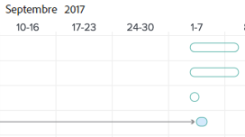
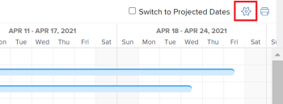

# Configurer l’affichage des informations sur le [!UICONTROL diagramme de Gantt]

Vous pouvez configurer les informations qui s’affichent à la fois dans le [!UICONTROL diagramme de Gantt] et dans le [!UICONTROL diagramme de Gantt] de la liste des projets.

## Conditions d’accès

Pour suivre les étapes de cet article, vous devez disposer des éléments suivants :

<table style="table-layout:auto"> 
 <col> 
 <col> 
 <tbody> 
  <tr> 
   <td role="rowheader">[!DNL Adobe Workfront] forfait*</td> 
   <td> 
N’importe quelle 
 </td> 
  </tr> 
  <tr> 
   <td role="rowheader">[!DNL Adobe Workfront] licence*</td> 
   <td> 
[!UICONTROL Review] ou niveau supérieur
 </td> 
  </tr> 
  <tr> 
   <td role="rowheader">Configurations des niveau d’accès*</td> 
   <td> 
Accès à [!UICONTROL View] ou supérieur à Projects and Tasks
 
Remarque : Si vous n’avez toujours pas accès à , demandez à votre administrateur [!DNL Workfront] s’il définit des restrictions supplémentaires à votre niveau d’accès. Pour plus d’informations sur la manière dont un administrateur ou une administratrice [!DNL Workfront] peut modifier votre niveau d’accès, voir <a href="../../../administration-and-setup/add-users/configure-and-grant-access/create-modify-access-levels.md" class="MCXref xref">Créer ou modifier des niveaux d’accès personnalisés</a>.
 </td> 
  </tr> 
  <tr> 
   <td role="rowheader">Autorisations d’objet</td> 
   <td> 
[!UICONTROL Affichage] ou accès supérieur au projet
 
Pour plus d’informations sur la demande d’accès supplémentaire, voir <a href="../../../workfront-basics/grant-and-request-access-to-objects/request-access.md" class="MCXref xref">Demander l’accès aux objets</a>.
 </td> 
  </tr> 
 </tbody> 
</table>

&#42;Pour connaître le plan, le type de licence ou l’accès dont vous disposez, contactez votre administrateur ou administratrice [!DNL Workfront].

## Présentation des options d’affichage

Le tableau suivant présente les options d’affichage du [!UICONTROL diagramme de Gantt] :

<table style="table-layout:auto"> 
 <col> 
 <col> 
 <col> 
 <tbody> 
  <tr> 
   <td role="rowheader">[!UICONTROL Dates réelles]</td> 
   <td>  </td> 
   <td> 
[!UICONTROL Date de début réelle] et [!UICONTROL Date d’achèvement réelle] s’affichent avec une icône en forme de triangle. Si la valeur [!UICONTROL Date d’achèvement réelle] est nulle, seule la valeur [!UICONTROL Date de début réelle] s’affiche.
 
Pour plus d’informations sur les dates de début et de fin, voir <a href="../../../manage-work/projects/planning-a-project/project-actual-completion-date.md" class="MCXref xref">Présentation du projet [!UICONTROL Date de fin réelle] </a> et <a href="../../../manage-work/projects/planning-a-project/project-actual-start-date.md" class="MCXref xref">Présentation du projet [!UICONTROL Date de début réelle] </a>.
 </td> 
  </tr> 
  <tr> 
   <td role="rowheader">[!UICONTROL Assignments]</td> 
   <td>  </td> 
   <td> 
Affiche les personnes désignées pour les tâches. Pointez sur le lien <strong>[!UICONTROL Details]</strong> en regard du nom d’une personne désignée pour afficher des informations plus détaillées à son sujet, y compris le pourcentage de son allocation à la tâche.
 
Les personnes désignées ne s’affichent pas sur le [!UICONTROL Gantt chart] lorsque le [!UICONTROL Gantt chart] est exporté vers PDF. Lorsque le [!UICONTROL Gantt] est exporté vers PDF, les personnes désignées ne s’affichent que dans la liste des tâches.
 </td> 
  </tr> 
  <tr> 
   <td role="rowheader">[!UICONTROL Baseline]</td> 
   <td>  </td> 
   <td> 
Un instantané de projet qui représente les éléments clés du projet inclus dans le plan de projet initial. Des lignes de base peuvent être utilisées tout au long de la durée du projet. Lorsque vous activez l’affichage des lignes de base dans le [!UICONTROL Graphique de Gantt], sélectionnez la ligne de base à afficher. Vous ne pouvez afficher qu’une seule ligne de base à la fois sur le [!UICONTROL Graphique de Gantt], et elle s’affichera sous la forme d’une barre grise.
 
Pour plus d’informations sur les lignes de base, voir <a href="../../../manage-work/projects/create-projects/create-baselines.md" class="MCXref xref">Création de lignes de base de projet</a>.
 </td> 
  </tr> 
  <tr> 
   <td role="rowheader">[!UICONTROL Date de validation]</td> 
   <td>  </td> 
   <td> 
La date donnée par une personne désignée comme engagement du moment où la tâche sera terminée est affichée avec un marqueur dans le [!UICONTROL Graphique de Gantt]. 
 
Pour plus d’informations sur les dates de validation, voir <a href="../../../manage-work/projects/updating-work-in-a-project/overview-of-commit-dates.md" class="MCXref xref">[!UICONTROL Validation Date] overview</a>.
 </td> 
  </tr> 
  <tr> 
   <td role="rowheader">[!UICONTROL % terminé]</td> 
   <td>  </td> 
   <td>  Le pourcentage de la tâche qui est terminée s’affiche dans la ligne de la tâche.  </td> 
  </tr> 
  <tr> 
   <td role="rowheader">[!UICONTROL Critical Path]</td> 
   <td>  </td> 
   <td>Les tâches susceptibles d’affecter la chronologie du projet sont considérées comme faisant partie de la trajectoire critique et sont clairement indiquées en rouge. </td> 
  </tr> 
  <tr> 
   <td role="rowheader">Diamants [!UICONTROL Milestone]</td> 
   <td>  </td> 
   <td> 
Une icône représentant un diamant s’affiche après la tâche associée à un jalon. Placez le pointeur de la souris sur un jalon pour afficher le nom et la date du jalon. L’administrateur [!DNL Workfront] détermine la couleur de chaque losange de jalon.
 
Pour plus d’informations sur les jalons, voir <a href="../../../administration-and-setup/customize-workfront/configure-approval-milestone-processes/create-milestone-path.md" class="MCXref xref">Création d’un chemin de jalon</a>.
 </td> 
  </tr> 
  <tr> 
   <td role="rowheader">Lignes [!UICONTROL Milestone]</td> 
   <td>  </td> 
   <td> 
Une ligne s’affiche après la tâche associée à un jalon. Placez le pointeur de la souris sur un jalon pour afficher le nom et la date du jalon. L’administrateur [!DNL Workfront] détermine la couleur de chaque ligne de jalon.
 
 Pour plus d’informations sur les jalons, voir  <a href="../../../administration-and-setup/customize-workfront/configure-approval-milestone-processes/create-milestone-path.md" class="MCXref xref"> Créez un chemin de jalon </a>
 </td> 
  </tr> 
  <tr> 
   <td role="rowheader">[!UICONTROL Predecessors]</td> 
   <td>  </td> 
   <td> 
Ligne d’une tâche à l’autre qui montre la relation de prédécesseur entre les deux tâches. Pour mettre en surbrillance une ligne de prédécesseur, placez-la avec la souris. Cliquez dessus pour le mettre en surbrillance. Vous ne pouvez mettre en surbrillance qu’un seul prédécesseur à la fois.
 
Une icône <strong>[!UICONTROL Predecessor]</strong> s’affiche en regard d’une tâche dont la relation de prédécesseur s’étend sur plusieurs pages du diagramme de Gantt ou de toute tâche dont le prédécesseur comprend plusieurs projets.
 
Cliquez sur l’icône <strong>[!UICONTROL Predecessor]</strong> pour afficher toutes les tâches du prédécesseur et du successeur, ainsi que des détails sur chaque tâche, tels que le nom de la tâche, le type de relation du prédécesseur et les dates clés.
 
Remarque : Le [!UICONTROL Graphique de Gantt] d’une liste de projets affiche des informations sur les prédécesseurs sur plusieurs projets. Pour plus d’informations sur la création de relations de prédécesseur entre différents projets, voir <a href="../../../manage-work/tasks/use-prdcssrs/cross-project-predecessors.md" class="MCXref xref">Création de prédécesseurs sur plusieurs projets</a>
 
Pour plus d’informations sur les prédécesseurs, voir <a href="../../../manage-work/tasks/use-prdcssrs/enforced-predecessors.md" class="MCXref xref">Application des prédécesseurs</a>.
 </td> 
  </tr> 
  <tr> 
   <td role="rowheader">[!UICONTROL État de progression]</td> 
   <td> 
[!UICONTROL Heure d’activation] 
 
[!UICONTROL Derrière]    
 
[!UICONTROL À Risque]    
 
Tard        
 </td> 
   <td> 
 
 
État de la progression actuelle sur une tâche donnée. 
 
Pour plus d’informations sur chaque type de type [!UICONTROL Progress Status], voir <a href="../../../manage-work/tasks/task-information/task-progress-status.md" class="MCXref xref">Présentation de la tâche [!UICONTROL Progress Status]</a>.
 </td> 
  </tr> 
  <tr> 
   <td role="rowheader">[!UICONTROL Dates prévues]</td> 
   <td>  </td> 
   <td> 
La chronologie attendue qui marque le [!UICONTROL Début prévu] et les [!UICONTROL Dates d’achèvement] en fonction du travail terminé en cours, plus le travail restant. 
 
Pour plus d’informations sur les dates d’achèvement prévues, voir <a href="../../../manage-work/projects/planning-a-project/project-projected-completion-date.md" class="MCXref xref">Présentation de la [!UICONTROL Date d’achèvement prévue] pour les projets, les tâches et les problèmes</a>.
 </td> 
  </tr> 
 </tbody> 
</table>

## Configuration des options d’affichage

1. Accédez à la liste des tâches [!UICONTROL Gantt Chart] ou à la liste des projets [!UICONTROL Gantt Chart].\
   Pour plus d’informations sur l’emplacement du [!UICONTROL diagramme de Gantt], voir [Prise en main du [!UICONTROL diagramme de Gantt]](../../../manage-work/gantt-chart/use-the-gantt-chart/get-started-with-gantt.md).

1. (Facultatif) Sélectionnez le paramètre **[!UICONTROL Passer aux dates projetées]** pour afficher les tâches selon leurs [!UICONTROL dates projetées]. Par défaut, les tâches sont affichées par leurs [!UICONTROL Dates planifiées] dans le [!UICONTROL diagramme de Gantt].
1. Cliquez sur l’icône des options pour afficher la boîte de dialogue **[!UICONTROL Options]**.\
   

1. Sélectionnez les options de configuration à afficher dans le [!UICONTROL diagramme de Gantt].

   >[!NOTE]
   > Toutes les options de configuration ne sont pas disponibles dans la liste de projets [!UICONTROL Graphique de Gantt].

1. Cliquez n’importe où dans le [!UICONTROL diagramme de Gantt] pour fermer la boîte de dialogue **[!UICONTROL Options]**.
